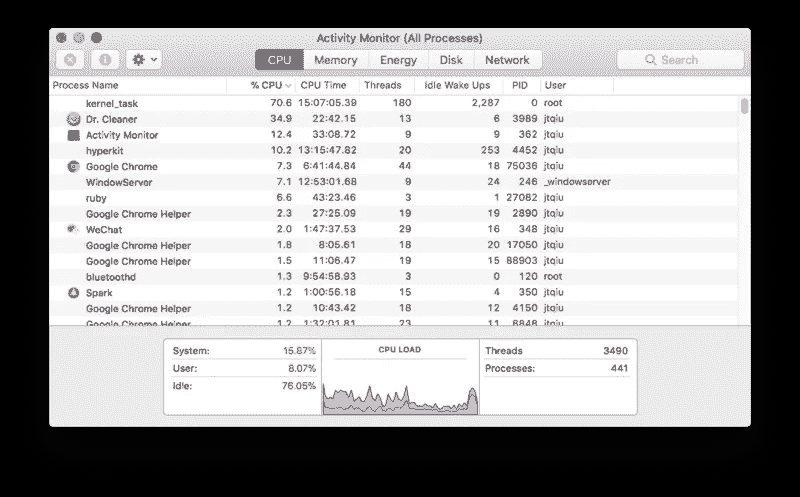
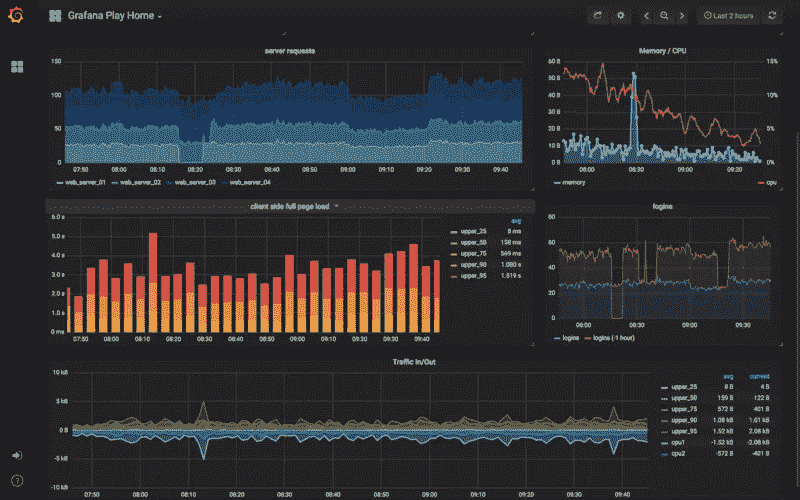
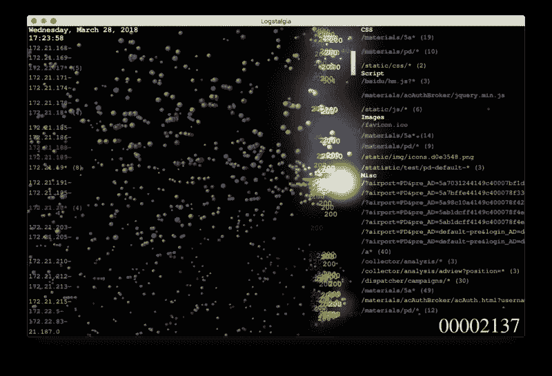
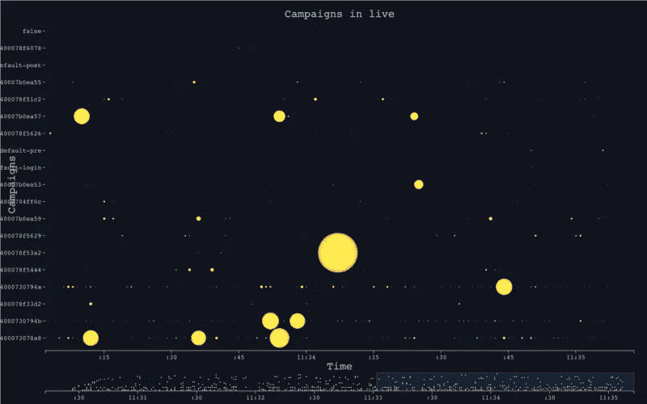
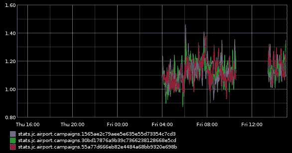
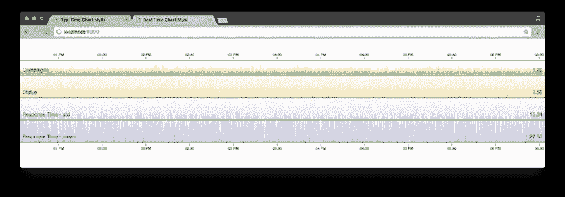

# 可视化您的实时数据

> 原文：<https://itnext.io/visualize-your-real-time-data-c8f17fe65dde?source=collection_archive---------2----------------------->

# 实时数据的特征

一般来说，数据的可视化可以传递比数据背后更多的信息。通过一个简单的`BarChart`，我们可以了解到哪种特定的产品在 Q2 卖得最好，或者可以很明显地看出员工在特定月份的工作时间是如何分配的。那些图表都或多或少与时间有关——当时间流逝时，一些数字在不断变化。

但是，在其他一些特定领域，需要一些更具时效性的图表。例如，在任何给定的时间，了解当前有多少用户登录到系统中，主站点的流量如何，或者最重要的是，有多少事务正在进行，这是非常重要的。此外，几乎所有的维护工作都需要实时分析，比如服务器集群负载在过去 5 分钟内的情况，或者当前的内存使用情况。

这些图表具有以下特征:

*   高度时间敏感
*   粒度越小，可能需要的数据存储量就越多
*   一段时间后，数据的价值急剧下降



上图显示了我的 Mac Book 上的实时 CPU 负载，它说明了花费在系统、用户空间和空闲上的时间。数据是连续产生的，然后在数值显示在图表上后立即删除。实际上没有人关心一小时前的 CPU 使用率如何，最近几分钟生成的数据就足够了。

基于这些因素，如何存储和访问数据、如何分析测量结果、如何旋转海量数据等问题都不同于其他类型的图表。此外，由于实时数据可视化与时间高度耦合，因此本质上它必须是动态的，并且应该实时生动地变化。

在这篇文章中，我想谈谈这些问题，以及一些相应的解决办法。

# 实时可视化中的主题

对于实时生成的数据，我们关心的是某些特定事件发生的频率、持续时间等。首先，让我们定义一些要观察的对象:

*   计数器
*   计时器
*   测量

## 计数器

当然，计数器是数字，它们记录一些特定事情发生的时间(通常我们需要在事件发生时增加或减少总数)，变化的速度通常保持稳定，或者至少是可预测的。例如:

*   代码为 200 的响应
*   来自特定会话的请求

一旦这种事件发生，我们可以通过增加相关的计数器来记录。

## 计时器

计时器负责记录某个事件需要多长时间，通常我们可以引入一个`interval`来计算一些统计信息:平均值、标准差、最小值、最大值等。计时器是这样的东西:

*   特定资源的响应时间
*   每个用户在特定页面的停留时间

## 测量

有时，当我们只是想记录一些(随机)数字时，这很有用，标尺就是为此而生的。与计数器相比，它没有稳定的变化速度，因此它们根本不可预测。我们通常不关心它如何变化，相反，我们只关心某一时刻的数字/状态。

*   该节点是否处于活动状态
*   有多少个过程
*   给定时间的内存使用情况

# 实时数据可视化的典型工作流程

在许多生产环境中，实时数据是通过日志文件收集的，而在其他系统中，它可能来自事件存储(通常是数据库)。日志文件是最常用的手段，几乎每个系统都会一直生成不同类型的日志，其中大多数都有轮换机制:日志被记录在固定大小的文本文件中，较旧的记录被自动刷新到另一个文件中(有时，会有一些相关的 cron-jobs 负责清理较旧的文件)。另一方面，在一些基于事件的系统中，事件会被记录在专门设计的数据库中，这些数据可以作为实时数据可视化的来源。

然而，原始日志文件很少适合可视化。通常，需要进行一些清理和处理，例如:

*   获取原始数据
*   标记化并使其结构化
*   简单聚集
*   更深层的聚合

## 标记化并使其结构化

有各种各样的工具可以帮助我们做这项工作。通过一些基本的配置，我们可以通过使用 [logstash](https://www.elastic.co/products/logstash) 从生产日志文件向 [statsd](https://github.com/etsy/statsd) 馈送数据(并且数据最终被馈送到 [graphite](https://graphiteapp.org/) )来使其工作。

```
input {
  stdin {}
}filter {
  grok {
    match => {
      "message" => "%{DATA:time} %{DATA:status} %{NUMBER:request_time} %{DATA:campaign} %{DATA:mac} %{DATA:ap_mac} %{GREEDYDATA:session}"
    }
  }
}output {
  stdout { codec => rubydebug } statsd {
    host => 'localhost'
    increment => "airport.%{session}"
  } statsd {
    host => 'localhost'
    increment => "airport.%{status}"
  }
}
```

`logstash`实际上是一个非常灵活的、可定制的工具，它允许我们定义数据源、匹配规则和输出:给定一个`data source`，一旦其中的记录匹配了一个特定的`rule`，然后将其格式化并输出到`output`。听起来像是 IFTTT (If This Then That)做的事情，对吗？

```
tail -f /var/logs/nginx/access.log | logstash -f log.conf
```

在上面的例子中，我们使用 stdin 作为输入，当它包含`time status request_time campaign mac ap_mac session`时，它就是一个匹配。对于那些匹配的线，我们将它们放入本地运行的`statsd`实例中。指令`increment`可以为每个匹配增加相应的计数器。

比方说，我们在日志文件中得到一行:

```
1529242838 403 0.02 f3715a7f52d8cef53fef1f73134e487a 00:61:71:53:ff:b0 T2-CL*-49-D* 2293c8e9-8801-485b-9f1d-9e5a7f5a8965
```

那么匹配结果应该是:

```
{
        "campaign" => "f3715a7f52d8cef53fef1f73134e487a",
    "request_time" => "0.02",
          "status" => "403",
         "session" => "2293c8e9-8801-485b-9f1d-9e5a7f5a8965",
         "message" => "1529242838 403 0.02 f3715a7f52d8cef53fef1f73134e487a 00:61:71:53:f4:0b T2-CL13-49-D87 2293c8e9-8801-485b-9f1d-9e5a7f5a8965",
        "@version" => "1",
            "host" => "juntao-qiu.local",
          "ap_mac" => "T2-CL*-49-D*",
            "time" => "1529242838",
             "mac" => "00:61:71:53:ff:b0",
      "@timestamp" => 2018-06-17T13:40:39.023Z
}
```

然后，`logstash`将递增计数器`airport.2293c8e9-8801-485b-9f1d-9e5a7f5a8965`:

```
counter["airport.2293c8e9-8801-485b-9f1d-9e5a7f5a8965"] += 1
```

## 统计的

对于结构化数据，我们可以定期进行一些基本的统计。对于计时器，我们可以计算平均值，std，medium。`statsd`可以帮我们完成所有这些任务。

基本上，`StatsD`是一个非常简单的`UDP`服务。使用`UDP`可以避免`TCP`花费大量时间来建立可靠的连接。`StatsD`维护一些本地计数器和状态，默认情况下每 10 秒与`graphite`同步一次。

# 显现

为了可视化实时数据，您必须考虑很多问题，就像您通常在其他可视化项目中所做的那样。桌面、网络甚至移动设备上？如果你必须在 Web 上呈现，页面是否应该适应不同的屏幕尺寸？可视化是一个动态的交互式图表还是仅仅是一个静态的表示？

再者，精度要求是什么？我们应该每分钟还是每 15 分钟计算一次统计数据？对于不同的精度，在存储方面的要求完全不同。一种常用的策略是降低过期数据的准确性，并以更高的分辨率呈现最新的数据。



上面展示了一个典型的基于 Web 的实时仪表盘，使用的是`grafana`。

# 工具

我们需要各种各样的工具来实现实时数据可视化。简而言之，我们需要工具来存储实际数据，需要 API 来访问这些数据，最后是表示库或框架。

# 时间序列数据库

在这个特别狭窄的领域，实际上有一种特定的数据库，时间序列数据库管理系统。它本质上是一个`Key-Value`数据库，通常维护时间戳、键和值。此外，一些实现提供了一个`Query Language`来方便灵活地查询存储的值。

以下是一些著名的临时数据库列表:

*   [石墨](https://graphiteapp.org/)
*   [Influxdb](https://www.influxdata.com/)
*   [Promethous](https://prometheus.io/)

# Feeder / API

尽管大多数 TSDB 都提供了本地 API 来存储和访问数据，但是大多数人更喜欢使用简单的 HTTP APIs。`StatsD`是一个非常简单的`Node.js`服务，通过使用 API(已经绑定了很多编程语言)，你可以很容易地创建`counter`和`timer`。

*   [StatsD](https://github.com/etsy/statsd)
*   [石墨](https://graphiteapp.org/)

# 可视化库

`Grafana`是一个强大且广泛使用的客户端框架。您可以轻松地集成来自各种后端数据源。这可以呈现来自`graphite`的数据和在线用户状态可能来自`influxdb`或`promethous`的 CPU/内存负载。

如果你想在某些特定情况下有更多的控制权。你可能想使用`d3.js` + `cubism`组合。您可以编写一些 JavaScript 来定期从后端服务获取数据。最后，在`svg`画布上渲染它们。

*   [格拉夫纳](https://grafana.com/)
*   [立体派](http://square.github.io/cubism/)

# 渲染时间

# 凉廊

`Logstalgia`是一个非常有趣的工具，可以读取某种格式的日志，然后以非常花哨的方式渲染它们，就像玩经典游戏`Brick Breaker`一样。



下列字段是必需的:

*   UNIX 时间戳
*   请求主机名
*   请求路径
*   响应代码
*   响应大小

所有字段都应该这样放置:

```
1529206121|12.21.18.246|/dispatcher/campaigns/2de808e08dccec2c7e55e41ecbd5a421|200|20
```

通常，你的日志可能比这个复杂得多，你可以写一个小的适配器来转换。这里有一个例子:

```
const source = '[$time_local] "$remote_addr - $remote_user" "$request" $status $body_bytes_sent "$http_referer" $request_time "$http_user_agent"'; const NginxParser = require('nginxparser');
const parser = new NginxParser(source);const moment = require('moment');parser.read('-', (row) => {
    const ts = moment(row.time_local, "DD/MMM/YYYY:HH:mm:ss Z").unix();
    const parsed = row.request.split(/\s+/)
    console.log(`${ts}|${row.ip_str}|${parsed[1]}|${row.status}|${row.body_bytes_sent}`);
}, (err) => {
    throw err;
});
```

注意，这个脚本的输入和输出是 stdin 和 stdout，所以您可以很容易地将它放到命令行中，并使它与其他与 pipeline `|`连接的工具一起工作。

```
tail -f /var/log/nginx/access.log | node adaptor.js | logstalgia
```

不过`logstalgia`有一点限制就是只能在桌面上运行，没有办法自定义观感。有时，我们只需要转移到 Web 上，使可视化更加可定制。

# 在网页上呈现时间

为了实现实时渲染，可以直接读取日志文件，通过 WebSocket 将事件发送到客户端。这种方法的优点是及时性，一个`500`错误或失败的交易可以直接在用户界面上显示。另一方面，缺点也很明显:如果日志文件增加的速度太快，那么前端可能会不堪重负。此外，平面事件消息太粗糙，难以分析。

## WebScoket + D3.js

```
const _ = require('lodash');
const { spawn } = require('child_process');
const generator = spawn('./generator.sh');const WebSocket = require('ws');const wss = new WebSocket.Server({ port: 8080 });function parse(data) {
    //...
}wss.on('connection', (ws) => { const output = (data) => {
    ws.send(JSON.stringify(parse(data)));
  } generator.stdout.on('data', output); ws.on('close', () => {
    generator.stdout.removeListener('data', output);
  });
});
```

在上面的脚本中，我们`spawn`了一个运行 shell 脚本的进程，它将从远程服务器获取日志，并在控制台上打印出来。当客户端通过 WebSocket 连接时，我们可以将来自`generator`的数据附加到套接字上。在以 JSON 格式发送到客户端之前，我们必须确保数据是精心组织的。

最后，一旦客户端关闭了连接，我们需要确保事件侦听器被删除。

`generator.sh`的实现可以是任何可以连续输出一些日志消息的东西，一个简单的实现可以是这样的:

```
tail -f /var/logs/nginx/access.log
```

如果您在本地根本没有访问日志，您可以指向测试环境:

```
ssh qa-env tail -f /var/logs/wifi-portal/wifi-portal-2018-06-13-access.log
```

对于客户端，您唯一需要做的就是建立一个 WebSocket 连接，并监听数据的到来。这里有一个用 D3.js 写的脚本，它使用了一个来自[实时插件](https://bl.ocks.org/boeric/6a83de20f780b42fadb9)的插件。

```
var ws = new WebSocket("ws://localhost:8080");ws.onopen = function() {
  console.log('connected');
};ws.onmessage = function (evt) { 
  const event = JSON.parse(evt.data);
  categroies.push(_.truncate(event.campaign, { 'length': 8 }));
  const campaigns = _.uniq(categroies); chart.yDomain(campaigns);
  chart.yDomain().forEach(function(cat, i) {
    var now = new Date(event.date); var mills = event.mills * 200; const obj = {
      time: now,
      color: color(mills),
      opacity: 1,
      category: _.truncate(event.campaign, { 'length': 8}),
      type: "circle",
      size: mills,
    } chart.datum(obj);
  });};
```



图表的图例是:

*   x 轴代表时间
*   y 轴代表已被访问的特定资源
*   每个请求都将被绘制为一个点
*   斑点的大小代表以毫秒为单位的响应时间

# 将统计数据可视化

# 使用石墨

`graphite`有一个内置的仪表盘系统，你可以选择在单个图表上演示多个仪表盘:



除此之外，`graphite`提供了一个更加强大的`render` API。你可以得到各种格式，比如`csv`、`json`或者二进制图像格式。另外，您可以通过`target`参数获得更复杂的计算结果。

例如:

```
[http://localhost/render/?format=json&target=stats.jc.airport.campaigns.1565ae2c79aee5e635e55d73354c7cd3](http://localhost/render/?format=json&target=stats.jc.airport.campaigns.1565ae2c79aee5e635e55d73354c7cd3)[http://localhost/render?format=raw&target=alias(sumSeries(stats.jc.airport.campaigns.*)%2C%27%27)&from=1529245830&until=1529245929](http://localhost/render?format=raw&target=alias(sumSeries(stats.jc.airport.campaigns.*)%2C%27%27)&from=1529245830&until=1529245929)
```

这里`target`的值是`alias(sumSeries(stats.jc.airport.campaigns.*), '')`，表示从`stats.jc.airport.campaigns`开始计算所有计数器的总和。您可以指定`from`和`until`来获取一段时间内的数据。

`graphite`提供了大量的聚集函数，如平均值、最小值/最大值等。这里完全是[参考](http://graphite.readthedocs.io/en/latest/render_api.html#id3)。

# 使用地平线图表

[立体派](http://square.github.io/cubism/)是 D3.js 的一个非常著名的插件，专门用来表现实时图表。实际上，有许多研究和论文支持表示时间序列数据的图的形状非常重要。图表以一定的速度定期刷新，整个图形逐渐从右向左移动，最左侧的数据被涂上清漆，因为更多新的数据流从最右侧流入。

您可以为地平线图指定不同的数据源，以`graphite`为例:

```
var graphite = context.graphite("http://localhost");var api_metrics = [
  graphite.metric("sumSeries(stats.jc.airport.campaigns.*)").alias("Campaigns Freq")
];
```

`cubims`然后每隔 10 秒向`graphite`发送这样的请求:

```
[http://localhost/render?format=raw&target=alias(sumSeries(stats.jc.airport.campaigns.*)%2C%27%27)&from=1529245830&until=1529245929](http://localhost/render?format=raw&target=alias(sumSeries(stats.jc.airport.campaigns.*)%2C%27%27)&from=1529245830&until=1529245929)
```

它根据接收到的数据刷新绘图:

```
d3.select("body").selectAll(".horizon")
    .data(api_metrics)
  .enter().insert("div", ".bottom")
    .attr("class", "horizon").call(horizon.extent([0, 50]));
```



实际上，`horizon chart`在垂直方向上只占用很少的空间，所以你可以像上面一样轻松地将几个图表组合在一起。

# 摘要

我介绍了实时数据可视化领域的一些典型场景，以及我们如何准备数据并呈现它们的方法。通过一些现有的工具和简单的脚本，我们可以很容易地将连续生成的生产数据输入到一些时间序列数据库中，并为不同的目的将它们可视化。

通常，基于固定时间间隔的统计数据可以提供更多的价值和洞察力，比如，任何给定时间间隔内的请求数量，或者平均响应时间。另一方面，在某些情况下，通过显示有多少人在线，发生了多少故障，或者超过 90%负载的节点数量，这可能是有用的。

# 参考

*   [地平线图](http://vis.berkeley.edu/papers/horizon/2009-TimeSeries-CHI.pdf)
*   [可视化试卷](http://vis.berkeley.edu/papers/)
*   [立体派](https://github.com/square/cubism/wiki)

# 其他有用的链接

*   [在 Docker](https://github.com/graphite-project/docker-graphite-statsd) 中设置石墨
*   [使用石墨立体主义的具体例子](https://github.com/phobos182/cubism-graphite/blob/master/cubism/index.html)