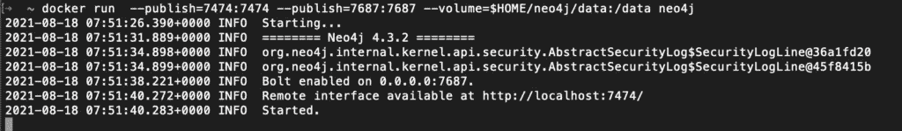
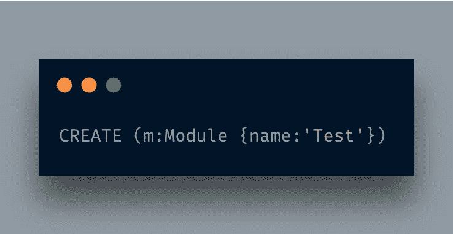
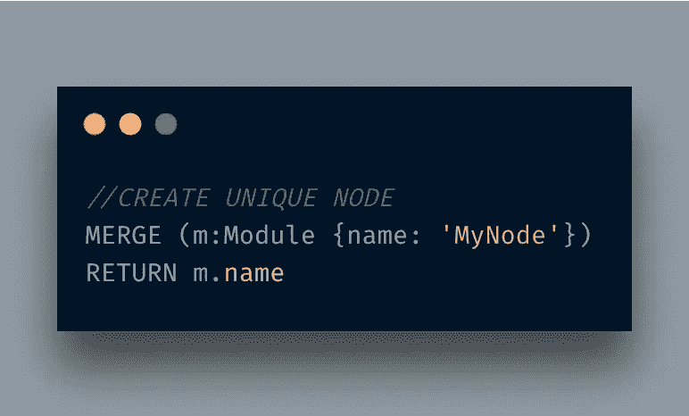
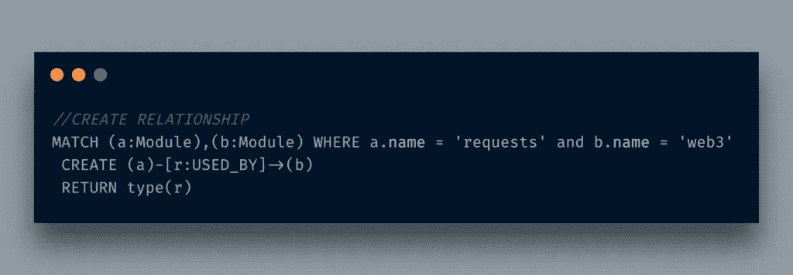
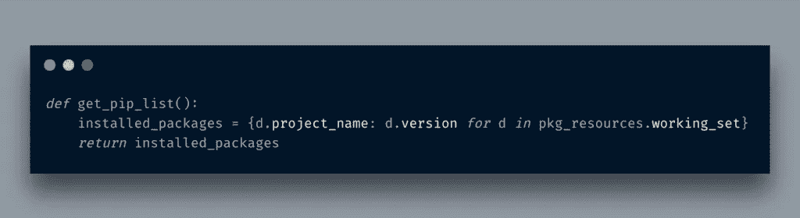
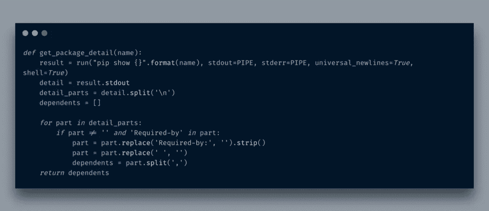

# 用 Neo4j 可视化 Python 模块和依赖关系

> 原文：<https://itnext.io/visualizing-python-modules-and-dependencies-with-neo4j-d90cd86c1f3f?source=collection_archive---------3----------------------->

我从[区块链编程](http://blog.adnansiddiqi.me/tag/blockchain-programming/)系列中抽出一点时间写这篇文章，因为我发现它非常有趣。

前几天，我发现了一条关于在 Neo4J 中可视化 python 模块的推文(*，不幸的是，我忘了加书签，再也找不到了*)。Python 开发者 Guido 回复了这条微博。那条推文留在了我的脑海里，我认为这是一个探索 Neo4j 的绝佳借口。除了 Neo4j，我一直在考虑探索一些图形数据库。出于一些奇怪的原因，我已经忽略 Neo4j 很长一段时间了，很可能是因为我根本不喜欢的 *Java* 这个东西。我试过 Arangodb，但它是 GUI，但不知何故，它的 GUI 不够流畅。无论如何，在我继续之前，这是它看起来的样子:

你可以说这个演示是`pip show`命令的剥离版。

在开始实际工作之前，让我们简单讨论一下 Neo4j 和图形数据库。

# 什么是图形数据库

根据[维基百科](https://en.wikipedia.org/wiki/Graph_database):

> ..图形数据库(GDB)是一种使用图形结构进行语义查询的数据库，具有节点、边和属性来表示和存储数据。[1]该系统的一个关键概念是图(或边或关系)。该图将存储中的数据项关联到节点和边的集合，边表示节点之间的关系。

[Neo4j](https://neo4j.com/developer/graph-database/) 将其定义为:

> 简单地说，图数据库是一种被设计成将数据之间的关系视为与数据本身同等重要的数据库。它旨在保存数据，而不是将其限制在预定义的模型中。相反，数据的存储就像我们第一次提取数据一样——显示每个单独的实体如何与其他实体连接或相关。

基本上，图形数据库是关于数据及其关系的。图形数据库基于[图形算法](https://en.wikipedia.org/wiki/Category:Graph_algorithms)，图形算法本身基于[图论](https://en.wikipedia.org/wiki/Graph_theory)。

# 为什么选择图形数据库

可能有几个原因，但其中一些是:

*   **连通性:-** 在 RDBMS 中，通常将数据存储在表中。通常情况下，您不需要关系，数据存储为单个实体。例如国家列表等。如果你的项目不需要太多的关系，那么图形数据库是没有用的。在我的例子中，同样的事情也可以在 RDBMS 中完成，但在图形数据库中效率更高，因为所有需要的信息都可以在节点级获得，只需要获取节点之间的关系。
*   **更改频率:-** 在 RDBMS 世界中，如果您想添加一条新信息，您必须更改表以添加一列。在图形数据库中情况并非如此，因为信息是以属性的形式添加的。

你可以在网上进一步了解它。让我们继续前进，设置我们的开发环境。我用的是 docker 版本。

# 开发设置

启动 Docker，执行命令`docker pull neo4j`拉 Neo4j docker 镜像。

要运行它，请执行以下命令:

`docker run --publish=7474:7474 --publish=7687:7687 --volume=$HOME/neo4j/data:/data neo4j`

您将看到类似下面的内容:

当你访问`d`时，它显示如下:

Neo4j 使用[密码查询语言](https://neo4j.com/developer/cypher/) e 进行不同的操作。让我们讨论几个密码查询

# 创建节点

为了创建某种类型的节点，您将执行以下命令:

这里创建了一个类型为`Module`的节点，其属性为`name`。我最初使用这个查询，但是我想确保所有的节点都是惟一的，如果存在就不要创建，所以我使用了这个查询

# 创建节点之间的关系

创建节点之间的关系也不难。

该查询基于`name`属性匹配几个节点，如果找到，它将创建一个带有标签`USED_BY`的方向关系。`->`用于告知关系从`a`到`b`开始。

# Neo4j Python 集成

好了，我们知道创建节点和关系需要哪些查询。我们的目的是通过 Python 与 neo4j 进行通信。为此，我使用 neo4j [Python 驱动程序](https://github.com/neo4j/neo4j-python-driver)。

首先，我们需要我的机器上安装的所有模块的列表

我导入了`pkg_resources`来获取所有安装的模块。接下来，我需要获取单个已安装模块的信息。为此，我将使用`pip show <module_name>`命令。

`__main__`函数现在看起来如下:

现在是可视化节点的时候了。

在这里，我将著名的*请求*库进行 HTTP。看起来很美，不是吗？

# 结论

在本文中，您了解了在 neo4j 图形数据库中获取数据并可视化实体之间的关系是多么容易。我已经介绍了 neo4j 的要点。您应该进一步探索优化的搜索查询，并在您的应用程序中使用返回的结果。像往常一样，代码可以在 [Github](https://github.com/kadnan/Neo4jPythonModulesVisualization) 上获得。

*原载于 2021 年 8 月 18 日*[*http://blog . adnansiddiqi . me*](http://blog.adnansiddiqi.me/visualizing-python-modules-and-dependencies-with-neo4j/)*。*