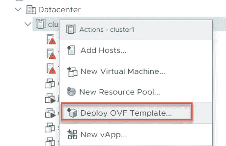
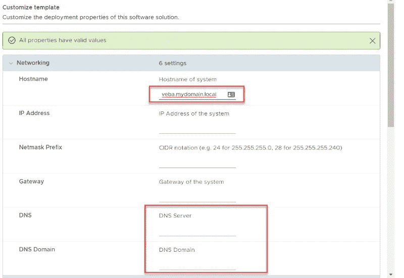
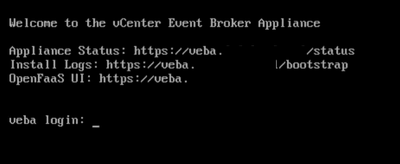
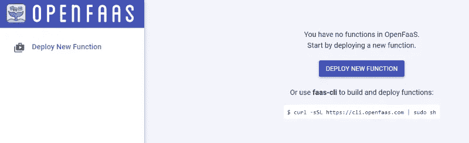
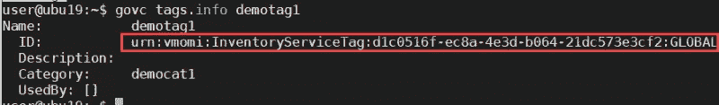
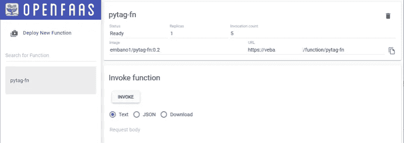
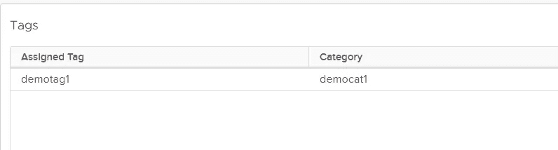

# VMware Fling: vCenter 事件代理设备

> 原文：<https://itnext.io/vmware-fling-vcenter-event-broker-appliance-c97514c9e902?source=collection_archive---------6----------------------->

有一个新的 VMware 产品上市了，它非常强大。每当您想到根据 VMware vSphere 事件做出反应时，vCenter Event Broker 应用装置(vEBA)可能是您的选择。迈克尔·加施和 T2·林柏希的优秀团队创造了这个精巧的装置。

对于没有耐心的人，你可以在这里下载设备和文档，跳过这篇博文:

[https://flings . VMware . com/vcenter-event-broker-appliance #摘要](https://flings.vmware.com/vcenter-event-broker-appliance#summary)

如果您想获得一些真实的生活体验，我们开始吧，基本上是相同的示例，每当虚拟机启动时添加一个标记:

将虚拟设备作为 ova 文件下载后，只需按常规方式部署即可:



为了避免以后令人讨厌的故障排除，请确保正确设置设备的主机名，以便可以对其进行解析。输入 vCenter 地址时，请确保 vEBA 可以解析它。



我真的建议确保名称解析设置正确，因为 web 应用程序可能不会出现。

**不要只是尝试 ip 地址或不同于部署期间使用的名称。**

因此，要么设置 DNS，要么在客户端和您用来部署 FaaS 的系统上使用您的本地主机文件(以防不是同一个系统)。

那么它就会像预期的那样工作。

# 第一次开始

启动虚拟机后，系统将在内部设置一个整洁的 Kubernetes 集群。



要检查 OpenFaaS，只需访问 https:// <the fqdn="" you="" choose="">并使用 **admin** 和您在部署期间配置的密码登录。</the>

您应该会看到一个空的 OpenFaaS 门户，没有任何功能。我们现在要改变这种情况。



# 安装所需的工具

下一步是安装配置 vCenter 事件代理所需的工具。

# govc

当然，你也可以自己创建我们将在演示中使用的标签，并弄清楚它是什么 URN，但是 govc 让它变得非常简单。

[https://github.com/vmware/govmomi/releases](https://github.com/vmware/govmomi/releases)

```
# Download govc
wget [https://github.com/vmware/govmomi/releases/download/v0.21.0/govc_linux_amd64.gz](https://github.com/vmware/govmomi/releases/download/v0.21.0/govc_linux_amd64.gz)# extract
gunzip govc_linux_amd64.gz# make executable
chmod +x govc_linux_amd64.gz# move into a path
sudo mv govc_linux_amd64 /usr/local/bin/govc
```

您已经可以设置 govc 所需的环境变量:

```
# only required if you have a self-signed certificate
export GOVC_INSECURE=true# set the password
GOVC_URL="administrator@vsphere.local:whatastrongpassword@vcsa.mydomain.local"
```

# 饭桶

反正大部分人大概都安装了。以防万一，如果你用的是 Ubuntu 或者 Debian:**sudo apt-get install git**

# OpenFaaS CLI

这种情况很少安装，但是很容易得到:

[https://github.com/openfaas/faas-cli](https://github.com/openfaas/faas-cli)

```
# install OpenFaaS cli 
curl -sSL [https://cli.openfaas.com](https://cli.openfaas.com) | sudo sh# let's set the environment variable for the server connection as well 
export OPENFAAS_URL=https://veba.mydomain.local
```

# 创建要使用的标签

因为我们已经设置了 govc 环境变量，所以让我们首先检查现有的标签: **govc tags.ls**

如果有一个你想使用的标记，获取 urn 路径: **govc tags.info <标记名>**



记住骨灰盒！

如果没有您想要使用的标签，您可以简单地创建一个:

```
# first create the category 
govc tags.category.create democat1# then create the tag using that category 
govc tags.create -c democat1 demotag1
```

**当创建标签时，结果显示的是骨灰盒。收到了。**

# 配置 OpenFaaS

接下来要做的是，当 vCenter 事件发生时，告诉 OpenFaaS 该做什么。Fling 的创建者迈克尔·加施和林柏希非常好，也创建了一个演示库。

从克隆存储库开始:

**git 克隆**[**https://github.com/embano1/pytagfn**](https://github.com/embano1/pytagfn)

# 第一步:更改密码

输入 **vCSA URL** 、您的**用户帐户**和**密码**以及您在创建标签时记住的 urn。

```
cd pytagfncat vcconfig.toml
[vcenter]
server = "vcsa.mydomain.local"
user = "administrator@vsphere.local"
password = "whatastrongpassword"[tag]
urn = "urn:vmomi:InventoryServiceTag:d1c0516f-ec8a-4e3d-b064-21dc573e3cf2:GLOBAL"
action = "attach" # or detach
```

将秘密部署到 OpenFaaS

**faas-cli 登录-p < vEBA 密码> -tls-no-verify**

FAAS-CLI secret create VC config-from-file = VC config . toml-TLS-no-verify

如果返回代码是 success，就可以删除 vcconfig.toml。

# 步骤 2:配置和部署功能

只需更改 git 项目 stack.yml 中的函数文件，以反映您的环境:

```
cat stack.ymlprovider:
  name: faas
  gateway: [https://veba.dzlabs.local](https://veba.dzlabs.local)
functions:
  pytag-fn:
    lang: python3
    handler: ./pytag-fn
    image: embano1/pytag-fn:0.2
    environment:
      write_debug: true
      read_debuge: true
    secrets:
      - vcconfig
    annotations:
      topic: drs.vm.powered.on
```

值得注意的是，网关需要设置为您的 vEBA FQDN，注释需要包含您想要做出反应的事件。

**vm.powered.on** =虚拟机在没有 DRS 的情况下启动

**drs.vm.powered.on** =虚拟机由 drs 启动

```
# required if you never used faas-cli before to deploy something faas-cli template pull# deploy the function faas deploy -f stack.yml --tls-no-verify
```

您也应该能够在 OpenFaaS 门户中看到该功能:



# 结果

启动虚拟机时，vCenter 事件代理会自动添加一个标记。



这是一个好的开始，但是使用事件驱动的方法还可以做很多其他的事情。很好奇社区要在上面建什么。

# 解决纷争

这部分可能会很难。首先要确保你仔细地遵循了所有的步骤，尤其是 DNS 部分。然后确保根据手动或 DRS 选择正确的事件。

您也可以使用 root 帐户和配置的密码并运行以下命令，通过 ssh 登录设备:

**kubectl -n openfaas 日志部署/vcenter-connector -f**

这样，您就可以获得有关 vCenter connector 从 vCenter 接收的事件的信息。这有助于检查连接是否工作良好，以及您是否对正确的事件做出反应。

*原载于 2019 年 11 月 13 日*[*【https://www.opvizor.com】*](https://www.opvizor.com/vmware-fling-vcenter-event-broker-appliance)*。*