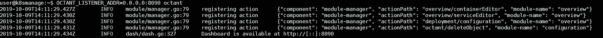

# VMware Tanzu 项目:Octant Kubernetes 运行时概述

> 原文：<https://itnext.io/vmware-tanzu-projects-octant-kubernetes-runtime-overview-3ff392ecf956?source=collection_archive---------5----------------------->

# VMware Tanzu 项目:Octant — Kubernetes 运行时概述

Heptio 启动了一系列开源项目，旨在帮助 Kubernetes 开发者和运营商以最佳方式运行和维护他们的 Kubernetes 集群。 [VMware](https://www.vmware.com) 去年年底收购了 [Heptio](https://heptio.cloud.vmware.com/) ，并在新的 VMware Tanzu 旗下发布了许多 Heption 项目。

已经有几个项目来帮助容器备份等等。但是这篇文章涵盖了一个非常酷的项目，叫做 [Octant](https://github.com/vmware-tanzu/octant) ，给你一个 Kubernetes 运行时概述。

您可以过滤名称空间、搜索某些标签或者浏览 K8s 运行时。

Octant 的描述显示:一个基于 web 的、高度可扩展的平台，供开发人员更好地理解 Kubernetes 集群的复杂性。我将它描述为 Kubernetes 运行时概述，它也支持第三方插件。这只是一个时间问题，在社区创建第一个插件之前。

项目页面:[https://github.com/vmware-tanzu/octant](https://github.com/vmware-tanzu/octant)

Octant 是开发人员了解应用程序如何在 Kubernetes 集群上运行的工具。它旨在成为开发人员获得洞察力和处理 Kubernetes 中的复杂性的工具包的一部分。

Octant 提供了自省工具、集群导航和对象管理的组合，以及一个插件系统来进一步扩展其功能。

# 特征

*   **资源查看器**

以图形方式可视化 Kubernetes 集群中对象之间的关系。各个对象的状态用颜色表示，以显示工作负载性能。

*   **汇总视图**

在单个页面中整合状态和配置信息，这些信息是从通常使用多个 kubectl 命令找到的输出中汇总的。

*   **端口转发**

将本地端口转发到正在运行的 pod，只需一个按钮即可调试应用程序，甚至可以跨名称空间转发多个 pod。

*   **日志流**

查看 pod 和容器活动的日志流，以便在不打开多个终端的情况下进行故障排除或监控。

*   **标签过滤器**

使用标签过滤来组织工作负载，以便检查命名空间中具有大量对象的集群。

*   **集群导航**

跨不同集群在名称空间或上下文之间轻松切换。还支持多个 kubeconfig 文件。

*   **外挂系统**

高度可扩展的插件系统，通过 gRPC 为用户提供额外的功能。插件作者可以在现有视图上添加组件。

# 部署

Octant 的部署相当酷，有点令人惊讶，因为它不是要部署的 kubernetes 服务或舵图。它是一个可执行文件，利用 Kubernetes API，使用您的 kubectl 配置。

只需下载或安装该版本。

```
wget [https://github.com/vmware-tanzu/octant/releases/download/v0.7.0/octant_0.7.0_Linux-64bit.deb](https://github.com/vmware-tanzu/octant/releases/download/v0.7.0/octant_0.7.0_Linux-64bit.deb) sudo dpkg -i octant_0.7.0_Linux-64bit.deb
```

在启动 Octant 之前，请确保您可以访问您的 kubernetes 集群。最好是使用 [kubectl](https://kubernetes.io/docs/tasks/tools/install-kubectl/) cluster-info 命令进行测试。

启动 Octant web 服务器:

**八分音符**

Octant 尝试在 127.0.0.1:7777 上启动默认的 web 浏览器。当我连接到一个远程控制台时，我在所有接口和一个可用端口上启动 Octant。

要配置 Octant、设置开发环境或运行测试，请参考文档[这里的](https://github.com/vmware-tanzu/octant/blob/master/docs/getting-started.md)。

```
kubectl cluster-info #continue if succeed OCTANT_LISTENER_ADDR=0.0.0.0:8090 octant #any interface, Port 8090
```



还有 MacOS 和 Windows 的部署选项，以防您运行不同的操作系统。主要的设置和配置是一样的。

# 仪表盘

只需使用您的浏览器和配置的网络地址和端口(在本例中为 [http://ipaddress:8090)访问 octant 仪表板。如果你想永久运行它并有一些保护(例如基本认证)，你可以在你的 Octant 前放置一个反向代理。](http://ipaddress:8090).)


仪表板向您显示当前工作负载、配置文件、RBAC 安全设置或 Kubernetes 名称空间中发生的事件的概述。您可以使用顶部的下拉菜单随时更改名称空间。

最后但同样重要的是，你可以编写和集成你自己的插件。我真的很好奇，也很兴奋会有什么解决方案出现，会被整合到这里。

*原载于 2019 年 10 月 15 日*[*https://www.opvizor.com*](https://www.opvizor.com/vmware-tanzu-projects-octant-kubernetes-runtime-overview)*。*