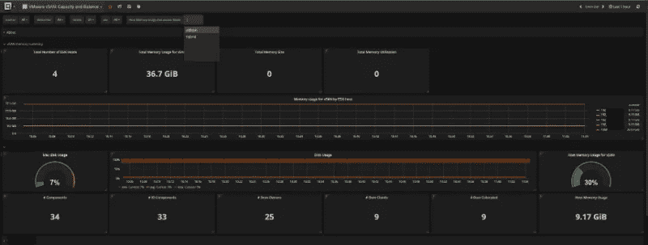
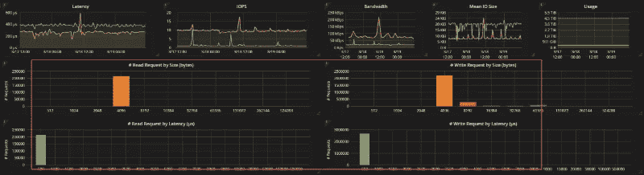
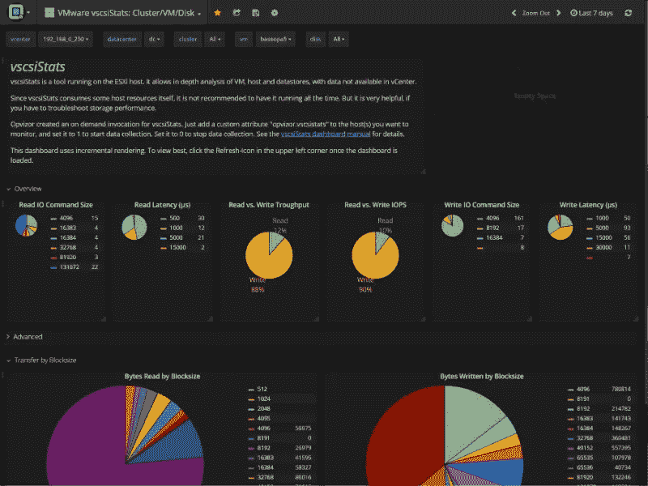
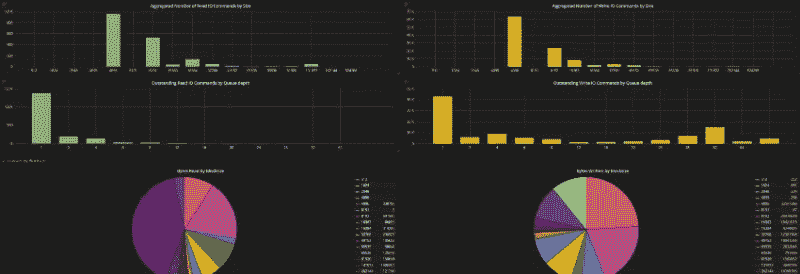

# VMware vSAN 内存消耗和 vSCSIstats 控制面板— Opvizor

> 原文：<https://itnext.io/vmware-vsan-memory-consumption-and-vscsistats-dashboards-opvizor-59725cbb0eed?source=collection_archive---------5----------------------->

VMware vSAN 社区发展迅速，我们看到越来越多的客户将我们的 vSAN 插件集成到 Performance Analyzer 中。

根据大量反馈和一些有趣的发现，我们更新并添加了一些控制面板，以显示每个虚拟机的存储直方图，并计算当前和未来的 vSAN 内存消耗。尤其是内存消耗并不是每个客户都清楚的，我们希望显示真实的数字。

让我们从 VMware vSAN 内存消耗开始，它是什么，它是如何计算的，为什么它是一个话题。

所需的内存量是强制性的，无法避免，也不应该减少以保持优化的性能。内存开销对于任何虚拟存储系统都是已知的，只是数量有所不同。谈到 vSAN，最大的区别是，您不会将内存消耗视为任务、进程或虚拟机。当虚拟存储解决方案运行虚拟机时，可以在虚拟机级别简单地检查内存使用情况，这是最大的区别。

在设计 VMware vSAN 环境时，牢记内存消耗非常重要。当运行一个家庭实验室时，这个数量可能是令人痛苦的。

有一篇关于它的非常好的 VMware 知识库文章:[https://kb.vmware.com/s/article/2113954](https://kb.vmware.com/s/article/2113954)

在使用 https://kb.vmware.com/s/article/2071753 的虚拟存储区域网[时，你肯定想避免缺点](https://kb.vmware.com/s/article/2071753)

知识库文章描述了计算以适当的方式运行 vSAN 的内存消耗的公式，作为所涉及的组件

要计算这些版本中的 vSAN 内存消耗，请使用以下公式:

**base consumption+(NumDiskGroups *(diskgroupbasecoumption+(SSDMemOverheadPerGB * SSDSize))+(NumCapacityDisks * capacitydiskbasecoumption)**

其中:

*   BaseConsumption:是每个 ESXi 主机的 vSAN 消耗的固定内存量。
*   NumDiskGroups:是主机中磁盘组的数量，该值的范围应为 1 到 5。
*   DiskGroupBaseConsumption:是分配给主机中每个磁盘组的固定内存量。这主要用于在每个磁盘组级别上分配用于支持动态操作的资源。
*   SSDMemOverheadPerGB:是每 GB SSD 分配的内存量。
*   SSDSize:是 SSD 磁盘的大小，以 GB 为单位。
*   NumCapacityDisks:是主机中容量磁盘的数量(跨所有磁盘组)。
*   CapacityDiskBaseConsumption:是每个容量磁盘分配的内存量。

注意:所有闪存的 SSD 大小上限为 600GB，因此使用大于 600 GB 的 SSD 不会消耗额外的内存。常数

*   基本消耗= 5426 MB
*   磁盘组基础消耗= 636 MB
*   SSDMemOverheadPerGB(hydrid)= 8 MB
*   SSDMemOverheadPerGB(全闪存)= 14 MB
*   CapacityDiskBaseConsumption = 70 MB

注意:在这些版本中，加密和重复数据删除功能对内存消耗没有影响。

坏事——谁愿意坐下来计算数字。因此，我们创建了一个仪表板来为您进行计算，并以一种很好的方式将其可视化。此外，您可以在混合计算和全闪存计算之间切换，控制面板名为“VMware vSAN:容量和平衡”。它显示了所有 vSAN 节点的分布。

我们花时间开发的另一个重要主题是存储配置文件直方图。它允许您检查系统的存储配置文件。更多读取，更多写入，什么块大小。这有助于规划存储升级。

独立如果您正在使用 VMware vSAN 或任何其他存储系统，并且需要获得数据存储区、单个虚拟机或整个群集的存储配置文件，请务必查看我们将 vSCSIstats 引入 Performance Analyzer 的最新集成。

这是一台虚拟机:

下面是数据存储视图:

请务必遵循我们的指南如何激活我们的 vSCSIstats 收集器。

[https://opvizor . atlassian . net/wiki/spaces/op VPA/pages/860160001/vscsiStats](https://opvizor.atlassian.net/wiki/spaces/OPVPA/pages/860160001/vscsiStats)

由于 vscsiStats 本身会消耗一些主机资源，因此不建议让它一直运行。但是，如果您必须对存储性能进行故障排除，它会非常有帮助。

要启用性能分析器 vSCSIstats 收集器，只需向要监视的主机添加一个自定义属性“opvizor.vscsistats ”,并将其设置为 1 以开始数据收集。将其设置为 0 以停止数据收集。

如果您想了解有关 vSCSIstats 的更多信息，请查看博客文章:[http://buildvirtual . net/using-vSCSIstats-to-gather-storage-performance-data/](http://buildvirtual.net/using-vscsistats-to-gather-storage-performance-data/)

【www.opvizor.com】最初发表于**。**