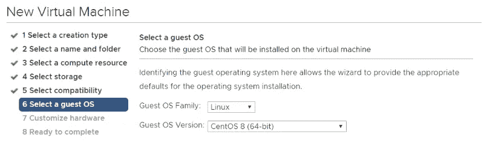
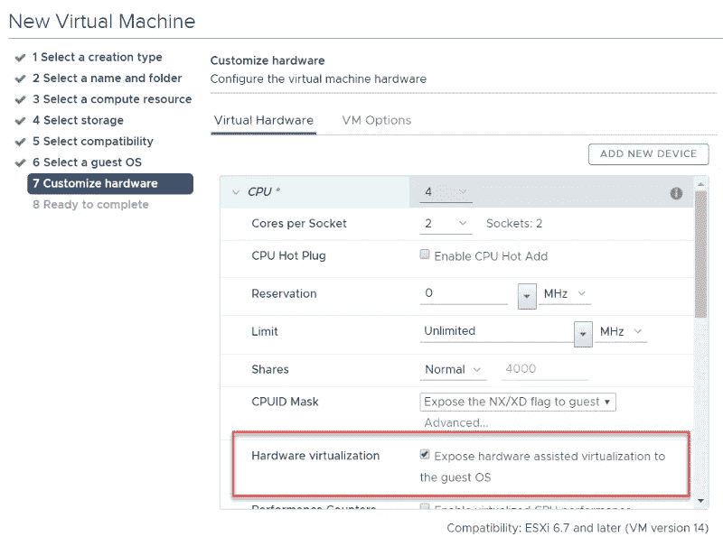
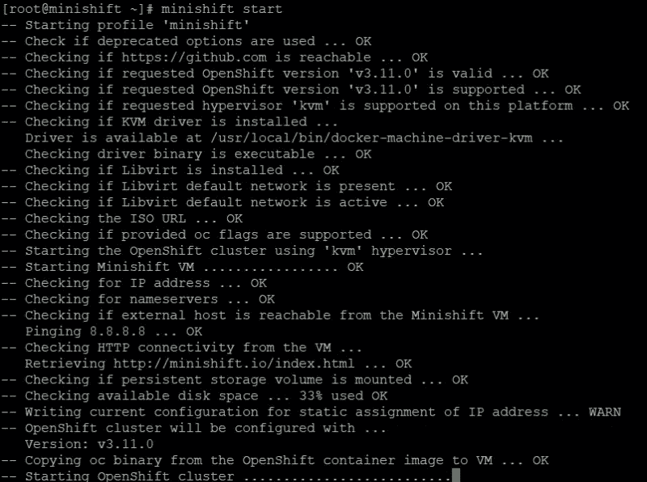

# VMware vSphere —安装 Centos 8 并运行 minishift

> 原文：<https://itnext.io/vmware-vsphere-install-centos-8-and-run-minishift-d40c56848f5c?source=collection_archive---------2----------------------->

许多公司都在 VMware vSphere 之上运行 OpenShift 来部署、运行和管理其容器生命周期。OpenShift 使用容器编排平台 Kubernetes 来完成这项工作。

尤其是在为 OpenShift 开发应用程序时，或者如果您只是想运行一个本地测试环境来玩玩，您绝对应该查看一下 [minishift](https://github.com/minishift/minishift) 。

这篇博客文章介绍了虚拟机的创建和 Centos 8 操作系统的安装，以及安装 minishift 的第一步。

# 虚拟机的创建

您几乎可以创建一个完全标准化的虚拟机，并选择 Centos 8 (x64)作为操作系统。因为我们希望在该虚拟机中基于 KVM 运行它，所以您需要导出硬件虚拟化特性。



# Centos 8 的安装

我们不深入研究 Centos 8 的安装本身，因为它非常简单。您可以在此下载 dvd 映像，连接并运行安装程序:

[http://iso redirect . CentOS . org/CentOS/8/isos/x86 _ 64/CentOS-8-x86 _ 64-1905-DVD 1 . iso](http://isoredirect.centos.org/centos/8/isos/x86_64/CentOS-8-x86_64-1905-dvd1.iso)

# 第一次开始 Centos 8

真正有趣的部分是从你新安装的操作系统的第一个配置步骤开始的。尤其是如果你不习惯 RedHat OS 或者不习惯老版本的话，命令行会有一些变化。

**设置您的网络**

```
# set your hostname 
nmtui-hostname# configure your network 
nmtui-edit# connect your network 
nmtui-connect
```

**更新软件包**

```
dnf check-update 
dnf update 
dnf clean all# install some basic tools 
dnf install nano vim wget curl net-tools lsof bash-completion
```

**创建一个拥有 sudo 权限的新用户帐户**

```
useradd user 
passwd user 
usermod -aG wheel user
```

# 安装 kvm

从配置桥接网络开始

```
# create and edit the following file 
vi /etc/sysconfig/network-scripts/ifcfg-br0# file content 
DEVICE=br0 
TYPE=Bridge 
IPADDR=192.168.10.100 
NETMASK=255.255.255.0 
GATEWAY=192.168.10.1 
DNS=192.168.10.1 
ONBOOT=yes 
BOOTPROTO=static 
DELAY=0
```

和默认网络适配器

```
# create or change the interface config (check the interface name, i. e. ens192) 
vi /etc/sysconfig/network-scripts/ifcfg-ens192# file content 
DEVICE=eth0 
TYPE=Ethernet 
BOOTPROTO=none 
BRIDGE=br0 
NAME=ens192 
DEVICE=ens192 ONBOOT=yes
```

重新启动系统，它应该出现一个桥接网络和配置的 ip 地址。

```
# install required packages 
dnf install qemu-kvm qemu-img libvirt virt-install libvirt-client# check the kvm module 
lsmod | grep kvm# start and enable the libvirtd 
systemctl start libvirtd 
systemctl enable libvirtd
```

就这样，KVM 安装完毕，应该可以运行了。

# 准备

由于默认使用 virtualbox，我们需要首先安装 minishift KVM 驱动程序:

```
sudo usermod -a -G libvirtd $(whoami)
newgrp libvirt
curl -L https://github.com/dhiltgen/docker-machine-kvm/releases/download/v0.10.0/docker-machine-driver-kvm-centos7 -o docker-machine-driver-kvm
sudo mv docker-machine-driver-kvm /usr/local/bin/docker-machine-driver-kvm
sudo chmod +x /usr/local/bin/docker-machine-driver-kvm
```

然后启动默认网络

```
sudo virsh net-start default 
sudo virsh net-autostart default
```

# 装置

检查最新版本，并相应地更改版本号:

[https://github.com/minishift/minishift/releases/latest](https://github.com/minishift/minishift/releases/latest)

```
export VER="1.34.1"
curl -L https://github.com/minishift/minishift/releases/download/v$VER/minishift-$VER-linux-amd64.tgz -o minishift-$VER-linux-amd64.tgz
tar xvf minishift-$VER-linux-amd64.tgz# copy the executable to /usr/local/bin
sudo mv minishift-$VER-linux-amd64/minishift /usr/local/bin # check the version
minishift version
```

# 第一次开始

```
# start minishift
minishift start# get minishift console url
minishift console --url# stop minishift
minishift stop
```



最后一条消息应该显示可以使用浏览器打开的控制台 url

```
Server Information ...
OpenShift server started.The server is accessible via web console at:
    https://192.168.42.144:8443/console
```

# 安装命令行界面(oc)

要使用命令行控制和管理 Openshift，还应该安装 oc 命令。oc 命令已经集成，您可以简单地将它复制到您的默认路径中，比如/usr/local/bin

```
sudo cp ~/.minishift/cache/oc/v3.11.0/linux/oc /usr/local/bin
```

# oc 命令

检查 oc 是否工作:

```
***oc version***
```

以管理员身份登录:

```
***oc login -u system:admin***
```

检查您的运行配置:

```
***oc config view***
```

# 后续步骤

您现在应该有一个正在运行的安装，oc 命令应该会给您有意义的响应。

在下一篇博文中，我们将介绍 kubectl 安装、插件安装和运行您的第一个应用程序等步骤。

*原载于 2019 年 10 月 29 日*[*【https://www.opvizor.com】*](https://www.opvizor.com/vmware-vsphere-install-centos-8-and-run-minishift)*。*