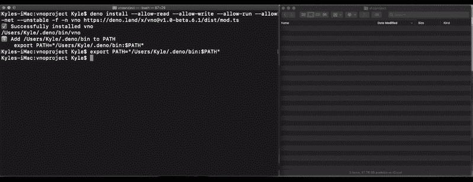
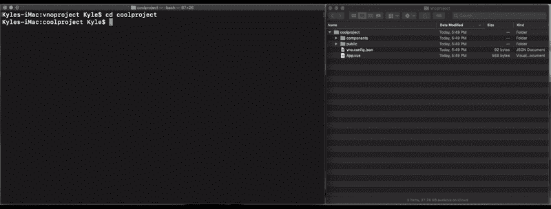
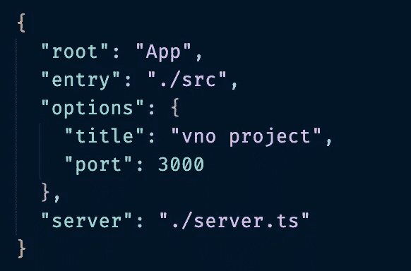
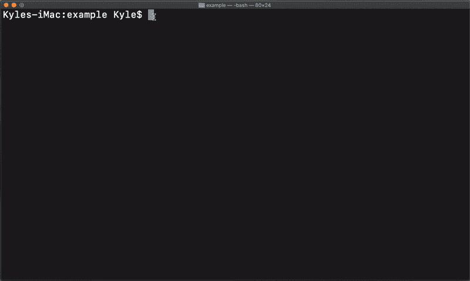

# vno:一个 vue / deno 爱情故事

> 原文：<https://itnext.io/vno-a-vue-deno-love-story-a9dd4d130ac7?source=collection_archive---------2----------------------->

## 第一个本地构建工具，用于在 Deno 运行时编译和捆绑 Vue 单文件组件

# vno 是什么？

Vno 是一个解析器、编译器和捆绑器，可以通过一个集成的 CLI 工具轻松访问，该工具可以从头开始创建一个完整的项目，包括一个示例文件结构和组件，也可以通过几个简单的命令优化现有的 Vue 项目。

最近，Deno 的产品级版本作为 Node.js 的替代版本出现在开发领域，并从那时起逐渐流行起来。Deno 是一个默认安全的运行时环境，旨在简化许多以前外包给节点模块的操作。同样，Vue 自 2014 年发布以来，在 React 和 Angular 上都取得了进展，许多开发人员对其灵活性和易用性感到兴奋。

然而，对于那些对 Deno 和 Vue 同样感兴趣的开发人员来说，以前还没有一种方法可以在 Deno 运行时使用 Vue。直到现在。

________________________________

# 输入 vno

作为 Deno 运行时中第一个用于编译和捆绑 Vue 单文件组件的构建工具，vno 允许用户使用 Vue 开发所提供的优雅和功能，同时提供 Deno 的安全性和简单性。

# vno 是如何工作的？

vno 的核心是一个适配器，它将解析一个 Vue 组件文件(或多个文件),并编译和捆绑成一个 Javascript 文件，供浏览器读取和呈现。 [*在 vno 文档中可以找到该流程的详细说明。*](https://github.com/oslabs-beta/vno)

vno 模块通过使用几个简单的 CLI 命令提供了相当于 create-vue 应用程序的功能。虽然 vno 在没有这种功能的情况下也可以轻松使用，但对于那些希望在 Deno 环境中使用 Vue，但之前由于这两种技术的新颖性及其不兼容性而受阻的人来说，`vno create`降低了他们的准入门槛。

当给定根组件的相对路径时，vno 将递归地遍历文件结构，找到全部。vue 文件，并开始解析过程。在解析操作期间，每个组件的单独标签被隔离和存储，并且文件之间的所有必要连接被考虑，以便构建以正确的顺序发生。

在成功完成`vno build`后，用户将看到一个`vno-build`文件夹被创建，并填充了一个`build.js`文件和一个`style.css`文件。值得注意的是，在撰写本文时，作用域 css 样式仍在开发中，目前还不受支持。为了获得最佳效果，建议为可能需要单独样式的组件的每个方面指定一个唯一的标识符标记。

一旦构建完成，`build.js`和`style.css`将需要链接到服务器，并在 index.html 文件中引用。在初始化服务器时，很清楚 vno 如何调整 Vue 文件以通过 Deno 提供给浏览器，这在引入 vno 之前是不可能的。

# 利用 CLI

CLI 及其相关文档都可以在 github 上的 [vno 存储库中找到。为了运行 vno，需要在本地安装链接的`mod.ts`文件。在终端`deno install`中的`mod.ts`，确保使用-n 标志对其进行命名(强烈建议使用 vno)。](https://github.com/oslabs-beta/vno/tree/main/src/command-line)

在本地安装 vno，并链接到托管的`mod.ts`

成功完成安装后，需要运行可执行文件，以便为终端提供路径。完成后，vno 将被安装到本地目录中，并可通过 vno 关键字进行访问。

> `vno create`初始化一个新的 vno 项目

导出路径并运行 vno create

为了建立一个项目并充实一个文件树，运行`vno create <project-name>`。如果需要，终端将提示进行定制，如果不需要定制，将使用默认值自动填充。选择默认选项将会产生一个包含名为`App.vue`的根 Vue 组件的文件树，一个名为“components”的包含子组件`HelloVno.vue`的组件目录，一个包含`index.html`的公共文件夹。

> `vno build`创建捆绑的 Javascript 文件

既然已经创建了一个基本模板，就可以实例化构建了。在终端中输入`vno build`将读取`vno.config.json`文件，并开始解析所有组件(在本例中，是 *App* 和 *HelloVno* )，链接它们，并将信息写入两个文件，这两个文件将出现在 vno-build 目录中。打开生成的`build.js`文件将显示所有组件的模板和样式标签，它们被转换成一个字符串，并被正确格式化以供浏览器处理。在`style.css`内部将是所有组件的样式。

`vno build`流程将遍历和链接所有的`.vue`组件，这样当它们被捆绑和交付时，它们将按照正确的顺序编写，以确保任何依赖于另一个组件的组件在运行时可用。

> `vno run dev`利用开发服务器

在中，为了在运行 Deno 时促进开发，`vno run dev`命令将通过将组件连接到基本的预建服务器来加快加载时间并防止多步手动重建，从而允许对组件所做的更改更快地反映在浏览器中。

# 使用 vno 作为独立模块

拥有预构建的 vue 应用程序或不喜欢使用 CLI 的 create-vue 功能的用户可以简单地按照上面的安装说明在本地安装 vno，然后创建一个`vno.config.json`文件来指定根目录中的根 Vue 组件的名称和相对路径，然后从根目录运行`vno build`。这将在`vno-build`文件夹中创建一个捆绑的`build.js`和`style.css`。只需确保这些在服务器和`index.html`中的适当位置被引用。

通过将服务器属性与从根到服务器的路径值一起放入`vno.config.json`，可以访问和启动服务器，而不必使用`vno run server`进行手动重建。

vno.config

> `vno run server`运行服务器

vno 运行服务器

vno 可以选择将 vno 功能作为独立模块使用，也可以利用其内置的 CLI 功能，这为各种能力的开发人员打开了探索 Deno 功能和潜力的大门。vno 提供的一体化解析、编译和捆绑不仅使 Deno 运行时中的 Vue 前端成为可能，而且使之变得容易。

**想了解更多关于 vno 的信息，请点击下面的链接:**

[vno.land](https://vno.land)

[deno.land/x/vno](https://deno.land/x/vno)

[oslabs-beta/vno](https://github.com/oslabs-beta/vno)

[@vno.land](https://twitter.com/vno_land)

> vno 模块的作者是:

⟹·米奇·高尔|[*github*](https://github.com/mggower)|[*LinkedIn*](https://www.linkedin.com/in/mikeygower/)

⟹乔丹格拉布|[*github*](https://github.com/jgrubb16)|[*LinkedIn*](https://www.linkedin.com/in/j-grubb/)

⟹凯尔侏罗纪|[*github*](https://github.com/kjurassic)|[*LinkedIn*](http://www.linkedin.com/in/kylejurassic)

⟹·安德鲁·雷里格|[*github*](https://github.com/andrew-rehrig)|[*LinkedIn*](https://www.linkedin.com/in/andrew-rehrig/)