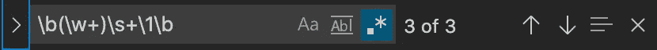
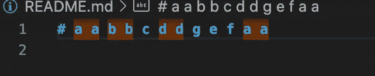
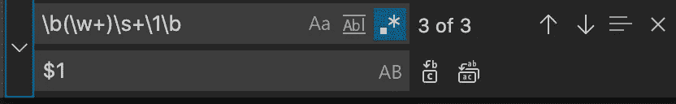

# VSCode 查找和替换使用 regex 超级功能删除重复项

> 原文：<https://itnext.io/vscode-find-and-replace-regex-super-powers-c7f8be0fa80f?source=collection_archive---------0----------------------->


马库斯·斯皮斯克在 [Unsplash](https://unsplash.com?utm_source=medium&utm_medium=referral) 上的照片

有时，主要是在文档或注释中，一个单词会出现两次错误。这不是世界末日，但如果有一个简单快捷的解决方案，为什么不纠正错误呢？

**让我们把“一个单词”改成“一个单词”，甚至不知道有问题**

嗯，第一个问题是识别这样的情况。在一个长文档中发现两个连续的单词重复并不容易(你看到 a a 了吗？)

然后，如果它发生一次，它会再次发生。该问题的其他发生情况如何？或者类似的？使用复制粘贴的黑魔法可能会发生很多。

## 关于正则表达式的一些背景知识

Regex 有点强大(至少在 spec 中)。如果你从未听说过，有一个分组和捕获的概念。每次在()中包装表达式的一部分时，它都会被捕获，这意味着以递增的顺序进行分组和编号，因此您可以稍后在表达式中使用它(无需事先知道值)。

因此，定义我们的问题，我们寻找完整的单词(至少一个字母)，单词应该是有界的(所以 ab 不会算作重复的 a)，单词之间应该至少有一个空格(否则它仍然是同一个单词)

```
\b(\w+)\s+\1\b
```

这个正则表达式正是我们想要的:

1.  \b —带边界的单词
2.  \w+ —给我们一个词，
3.  \s+ —捕捉至少一个空格。
4.  \1 —但是什么是\1 呢？还有为什么\w+要用括号括起来？这就是我们之前讨论过的精确的**捕获组**。(\w+) —匹配第一个出现的单词并将其捕获为组 1，\1 匹配第一个捕获的组，在我们的例子中，是完全相同的单词！

## VSCode 用法

使用搜索工具时，Vscode 有一个很好的特性，它可以使用正则表达式进行搜索。您可以单击 cmd+f(在 Mac 上，或在 windows 上 ctrl+f)来打开搜索工具，然后单击 cmd+option+r 来启用正则表达式搜索。



VSCode 查找工具，激活了正则表达式搜索，插入了重复的正则表达式

使用它，您可以在任何文档中轻松找到重复的连续单词。您还可以一次搜索所有文档。



轻松匹配所有重复的连续单词

现在，我们只需要用单词的一个实例替换重复的单词。为此，切换替换模式(单击右箭头)并键入$1。$1 引用与之前相同的捕获组。



VSCode 查找和替换扩展模式

现在点击替换，看看神奇的事情发生了！


为了简洁，当然没有重复。

## 奖金部分-针对 python 用户

如果您从 python2 迁移到 python3，突然之间，每个 print 语句都要求您添加括号，您可以使用类似的方法

```
print (.*) - will find every print statment and capture the statment
print($1) - will replace it with the same line wrapped with paranthesis 
```