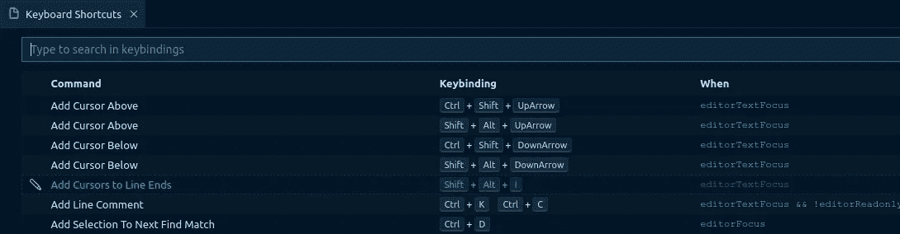
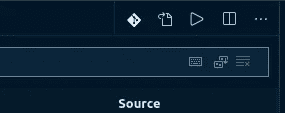

# 给新人的 VSCode 提示

> 原文：<https://itnext.io/vscode-tips-for-the-newcomers-b55fd143cd21?source=collection_archive---------2----------------------->


一个独角兽图片，这样我的女儿也可以享受这篇文章

在过去的三年里，由于 Jetbrain 令人敬畏的开源程序，我有机会获得免费的 IntelliJ 许可:[https://www.jetbrains.com/community/opensource/](https://www.jetbrains.com/community/opensource/)

不幸的是，我的许可证现在已经过期了，我的开源贡献不再符合我获得续订的资格。我当然有点失望，但我只是感谢有机会免费使用这个伟大的 IDE 这么久。

在多年使用 Eclipse 之后，我花了很长时间才习惯 IntelliJ。从一个 IDE 切换到另一个 IDE 从来都不是一件容易的事情(除非你坚持使用鼠标并使用基本功能)。

我通常更倾向于高级用户，尝试许多扩展，调整内存设置和所有我能找到的配置文件，所以切换只会很痛苦:)

我关注 VSCode 已经有一段时间了，并且已经在一些场合尝试过，并取得了积极的结果，这就是为什么我选择它作为我潜在的新 IDE。很抱歉 Eclipse 的人，但我还没准备好回到 eclipse.ini、工作区、插件、迁移噩梦和所有这些

在这篇文章中，我不想比较 IntelliJ/WebStorm 和 VSCode，因为这是不公平的，也不是特别有用。相反，我想分享我发现的事情，以及迄今为止我是如何配置/调整 VSCode 的。

稍后我可能会写一些后续文章…

所以我们走吧！

## 在不同的机器上安装扩展和同步设置

在我的两台机器(Windows 桌面和 Ubuntu 笔记本)上都安装了 VSCode 之后，我做的第一件事就是尝试找出一种方法来同步我的设置。

于是我开始寻找，很快就找到了设置同步(【https://marketplace.visualstudio.com/items? itemName = shan . code-settings-sync，一个我需要的扩展。

> 为 VSCode 安装扩展非常简单:要么去 VSCode Marketplace(【https://marketplace.visualstudio.com/vscode】)并从那里开始，要么使用 vs code 中的 market place 浏览器，你可以使用 CTRL + Shift + X(或者你的操作系统上的其他任何东西)来显示。或者，您可以从 Marketplace 复制扩展安装命令，并通过快速打开面板(CTRL + P)在 VSCode 中执行它。例如，要安装设置同步，您可以点击快捷方式，粘贴“外部安装山。代码-设置-同步”到弹出窗口，并点击输入触发安装。整洁！

一旦安装和配置完成，这个扩展就可以从 Github gist 推送/获取扩展列表、设置、自定义绑定、主题等。

这太棒了，因为我现在可以在我的桌面上安装一个扩展，将我的设置推送到 Github，在我的笔记本电脑上打开 VSCode，并自动为我安装相同的安装。

> 要触发设置的推送，可以使用 Shift + Alt + U。

第一个问题解决！

## 基本 VSCode 快捷键

接下来，我想知道更多关于 VSCode 的键映射，所以我花了一些时间阅读和测试这里列出的各种快捷键:[https://code.visualstudio.com/docs/getstarted/keybindings](https://code.visualstudio.com/docs/getstarted/keybindings)

通过 VSCode，我也了解到了这个很酷的 cheat sheet:[https://code . visual studio . com/shortcut s/keyboard-shortcut s-Linux . pdf](https://code.visualstudio.com/shortcuts/keyboard-shortcuts-linux.pdf)

我将在这里或那里提到一些捷径，但我不打算给你一个冗长、无聊和很快过时的清单；去看看这些文档，学习一些很酷的技巧！

> 对任何一个低年级学生说:忘记鼠标，让它去学习你该死的快捷键吧！:)

目前，我最喜欢的是:

*   CTRL + P(快速打开):快速查找/打开文件并在我的项目中导航
*   CTRL + SHIFT + P(命令面板):每分钟触发无数次动作
*   CTRL + B:切换侧边栏
*   F5:你好，亲爱的调试器！

## 通过 settings.json 进行定制

我需要的第二件事是找回我心爱的 FiraCode 字体:【https://github.com/tonsky/FiraCode

所以我想办法自定义字体设置。我快速浏览了设置文档([https://code.visualstudio.com/docs/getstarted/settings](https://code.visualstudio.com/docs/getstarted/settings))，发现比我希望的更多。

> 提示:要打开设置，只需按 CTRL +，

编辑 VSCode 设置的 UI 感觉很熟悉，因为它像 IntelliJ 一样提供了一个有用的搜索字段(我多么希望所有的应用程序都提供这样的功能！).

因此，通过用户界面，我很快找到了“文本编辑器>字体”设置，并启用了 FiraCode，字体连字，适应字体大小等。

然后，我发现了 VSCode 的圣杯:settings.json，主配置文件。在这个可以通过快速打开窗口快速打开的文件中，我发现我的设置更改被保存在那里。

太好了，现在我知道去哪里摆弄一切了。

因此，我可以启用我的 VSCode 设置的自动推/拉功能:

```
*// Settings sync* "sync.autoUpload": true,
"sync.autoDownload": true,
```

我的字体设置如下:

```
"editor.fontFamily": "Fira Code Retina, Hack",
"editor.fontLigatures": true,
"editor.fontSize": 16,
"editor.letterSpacing": 0.2,
"editor.lineHeight": 22,
```

唷，我直接感觉好多了！

## 禁用遥测技术(不要在家里尝试)

由于来自欧洲，我倾向于查看组织收集的关于我的数据(听起来像是老生常谈)。说实话，我并不反对所有的数据收集，就 VSCode 而言，我很确定微软使用遥测技术是为了更大的利益。

尽管如此，我还是选择通过 VSCode 设置禁用遥测(不要问我为什么):

```
"telemetry.enableCrashReporter": false,
"telemetry.enableTelemetry": false,
```

你们中最关心隐私的人可能会很高兴听到有一个替代的开源版本叫做 VSCodium，它没有所有这些东西:[https://vscodium.com/](https://vscodium.com/)。我还没有亲自测试过，所以我不能对此发表意见。

## 用鼠标滚轮放大和缩小

接下来，我尝试放大/缩小，但很沮丧，它不能立即与鼠标滚轮一起工作…

> 我很困惑为什么 VSCode 和 IntelliJ 都没有默认启用这个。我是唯一一个喜欢这么做的人吗？？

幸运的是，通过设置很容易修复:

```
"editor.mouseWheelZoom": true,
```

整洁！

## 须藤给我做些图标！

我还发现周围缺少图标，这就是为什么我安装了

幸运的是，有一个很好的扩展:【https://marketplace.visualstudio.com/items? itemName = pkief . material-icon-theme

另一个也是:【https://marketplace.visualstudio.com/items? itemName = vs code-icons-team . vs code-icons

> 要切换图标集，你可以再次使用 awesome 命令面板:按 CTRL + P，然后输入“文件图标主题”

## 一个统治他们的主题

接下来是主题。我使用材质主题已经有一段时间了，所以我第一次尝试这个:[https://marketplace.visualstudio.com/items?itemName = equinuscio . VSC-material-theme](https://marketplace.visualstudio.com/items?itemName=Equinusocio.vsc-material-theme)

但是我愿意尝试一些新的东西，因此我现在正在测试这个:[https://marketplace.visualstudio.com/items?itemName = John papa . winter iscoming](https://marketplace.visualstudio.com/items?itemName=johnpapa.winteriscoming)

无论如何，不值得讨论，因为你们可能有不同的口味；挑选你自己的:[https://marketplace.visualstudio.com/search?target=VSCode&类别=主题&排序比=安装](https://marketplace.visualstudio.com/search?target=VSCode&category=Themes&sortBy=Installs)

## 自定义代码的显示方式

虽然我们仍在进行可视化定制，但我也让函数以粗体显示:

```
"editor.tokenColorCustomizations": {
  "textMateRules": [{
    "scope": [
      "entity.name.function",
      "support.function"
    ],
    "settings": {
      "fontStyle": "bold"
    }
  }
]},
```

这显示了 VSCode 的延展性；这挺酷的！

在这一点上，你可能会认为我只关心视觉效果，但事实是，如果我每天要花几个小时看一样东西，我需要它看起来不错！:)

## 酷炫的设置带来更好的开发者体验

然后，我阅读了一些关于 VSCode 定制的有趣文章/网站，如下所示:

*   [https://vscodecandothat.com/](https://vscodecandothat.com/)
*   [https://dev . to/selrond/tips-to-use-vs code-more-efficient-3h6p](https://dev.to/selrond/tips-to-use-vscode-more-efficiently-3h6p)
*   [https://dev . to/the Geoff Stevens/vs-code-settings-you-should-customize-5e 75](https://dev.to/thegeoffstevens/vs-code-settings-you-should-customize-5e75)
*   [https://github.com/microsoft/vscode-tips-and-tricks](https://github.com/microsoft/vscode-tips-and-tricks)

由于这些，我继续调整我的设置。以下是我定制的一些东西:

```
*// Let the editor take care of indentation automatically* "editor.autoIndent": true,*// No automatic imports organization* "editor.codeActionsOnSave": { "source.organizeImports": false },*// Cursor blinking smoothy feels good* "editor.cursorBlinking": "smooth",
"editor.cursorSmoothCaretAnimation": true,
"editor.cursorStyle": "line",// Wrap it up
"editor.wordWrap": "on",// Don't display the whitespace (I avoid those issues through auto formatting)
"editor.renderWhitespace": "none",*// Make the minimap more awesome* "editor.minimap.renderCharacters": false,
"editor.minimap.maxColumn": 200,
"editor.minimap.showSlider": "always",// Scroll smoothly
"editor.smoothScrolling": true,// Enable tab completion
"editor.tabCompletion": "on",*// Hide the open editors list* "explorer.openEditors.visible": 0,*// Files handling: auto save and exclusions* "files.autoSave": "afterDelay",
"files.autoSaveDelay": 1000,
"files.exclude": {
  "**/.git": true,
  "**/.svn": true,
  "**/.DS_Store": true,
  "**/*.js": {
    "when": "$(basename).ts"
  },
  "**/*.js.map": {
    "when": "$(basename)"
    }
},
// Typescripttttttttttttttt
"files.defaultLanguage": "typescript",*// Customize the window title* "window.title": "${dirty} ${activeEditorMedium}${separator}${rootName}",*// Show npm scripts on the sidebar* "npm.enableScriptExplorer": true,// Use Prettier by default for TypeScript code
"[typescript]": {
  "editor.defaultFormatter": "esbenp.prettier-vscode"
},
```

> 对了，你注意到评论了吗？这不是 JSON，而是 VSCode 支持的替代模式，JSON with comments:[https://code . visual studio . com/docs/languages/JSON # _ JSON-with-comments](https://code.visualstudio.com/docs/languages/json#_json-with-comments)
> 
> 这种感觉很好。因为不可能在所有那些该死的 JSON 配置文件中使用注释，我不知道用了多少次被诅咒的词；-)

我还研究了如何自动格式化，因为我讨厌浪费时间手工格式化:

```
*// Formatting: let me forget about it* "editor.formatOnPaste": true,
"editor.formatOnType": false,
"editor.formatOnSave": true,// Add the new line at the end
"files.insertFinalNewline": true,// Get rid of the useless whitespace
"files.trimTrailingWhitespace": true,
```

我做的另一个重要改变是禁用文件的默认“预览”模式。我没有读过太多关于它的东西，但它对我来说真的感觉很陌生，因为我打开文件，然后希望当我打开其他文件时那些文件会留在那里，但它们直接被替换了。

我肯定这背后有好的想法，但这对我来说太烦人了:

```
*// Disable file preview!* "workbench.editor.enablePreview": false,
```

此外，我已经将侧边栏和侧边图标移到了屏幕的右侧，正如一篇文章中所建议的那样。现在感觉好多了，因为我喜欢经常显示/隐藏侧边栏，因此，把它放在左边会扰乱代码:

```
*// Stable editor view, I don't like characters jumping around* "workbench.sideBar.location": "right",
```

## 使用多命令扩展切换侧边栏并自定义按键绑定

要切换侧边栏的可见性，默认快捷键是 CTRL + B。

我已经安装并使用了多命令扩展([https://marketplace.visualstudio.com/items?itemName = ryuta 46 . multi-command](https://marketplace.visualstudio.com/items?itemName=ryuta46.multi-command))通过切换活动栏使该快捷方式更加强大:

```
"multiCommand.commands": [{
  "command": "multiCommand.makeRoom",
  "sequence": [
    "workbench.action.toggleSidebarVisibility",
    "workbench.action.toggleActivityBarVisibility"
  ]
}],
```

上面的设置定义了一个自定义命令，但这还不够，它需要映射到键绑定中，您可以使用 CTRL + K 然后 CTRL + S 打开它:



然后点击右上方的第二个图标:



单击左边第二个图标显示 JSON

或者如果你和我一样，就按 CTRL + P，然后按“keybindings.json ”,回车直接打开。

以下是我当前的按键绑定:

```
[{
  "key": "ctrl+shift+down",
  "command": "editor.emmet.action.balanceIn"
},
{
  "key": "ctrl+shift+up",
  "command": "editor.emmet.action.balanceOut"
},
{
  "key": "ctrl+b",
  "command": "multiCommand.makeRoom"
},{
  "key": "ctrl+b",
  "command": "-workbench.action.toggleSidebarVisibility"
},
{
  "key": "ctrl+b",
  "command": "-markdown.extension.editing.toggleBold",
  "when": "editorTextFocus && !editorReadonly && editorLangId == 'markdown'"
},
{
  "key": "shift+cmd+c",
  "command": "copyRelativeFilePath"
},
{
  "key": "shift+alt+cmd+c",
  "command": "copyFilePath"
}]
```

正如你在上面看到的，我已经移除了默认的 CTRL + B 组合键，并用自定义的“multi-command”代替了它。

我也有一些其他有用的快捷方式，但还没有时间深入研究这个…

## 更改文件关联以获得正确的高亮显示

我遇到的一个问题(很符合逻辑)是，VSCode 没有正确地突出显示我的 Docker 相关文件，原因很简单，因为在我当前的项目中，我有一些文件，它们的特定名称与它们对应的环境相匹配。

为了修复突出显示，我需要通过设置来调整文件关联:

```
*// Proper highlighting please!*“files.associations”: {“[Dd]ockerfile*”: “dockerfile”,“docker-compose*”: “yaml”},
```

## 直到下一次…

今天到此为止。

我将在以后的帖子中分享我对迁移过程的想法，因为到目前为止才过了几天。有一些重要的挫折，我改天会提到，但总的来说，VSCode 非常好，易于使用。

我将很快写一篇后续文章来告诉你我发现的并且正在使用/测试的所有好的扩展！

敬请期待！