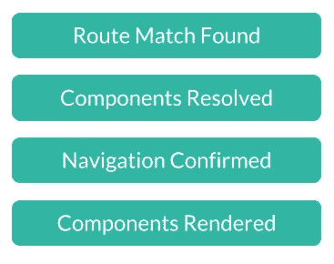
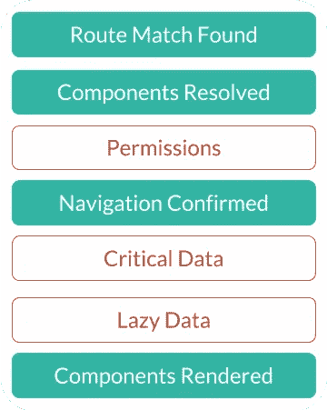
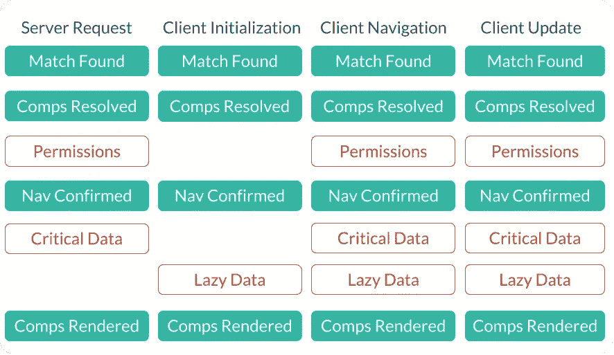
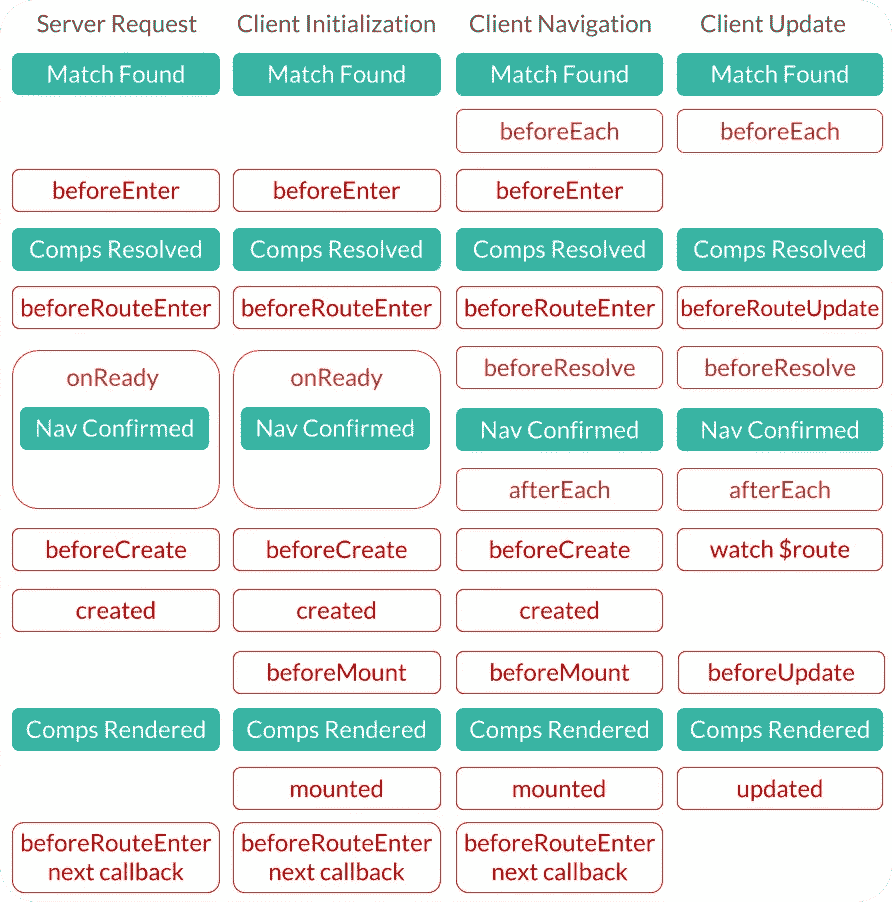
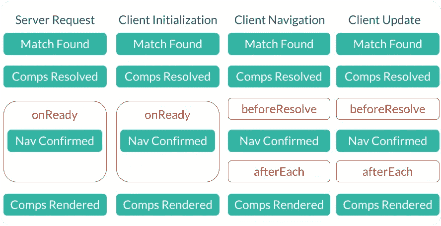

# Vue 路由组件挂钩

> 原文：<https://itnext.io/vue-custom-route-hooks-3f50cc30bb87?source=collection_archive---------1----------------------->

## 如何在通用 web 应用程序中请求数据

使用 Vue 构建通用 web 应用程序的最具挑战性的部分之一是确定在路由的生命周期中使用哪个 Vue 和 Vue 路由器生命周期挂钩来请求数据。

要解决这个问题，您应该很好地理解路由生命周期，以及何时调用所有 Vue 和 Vue 路由器生命周期挂钩。

在本文中，我们将讨论这些主题，以及如何创建定制的**路由组件挂钩**到，以一种对您的应用程序有意义的方式请求数据。

## **阅读前要知道的事情:**

*   本文涵盖高级主题，要求熟悉 [Vue](https://vuejs.org/v2/guide/) 、 [Vue 路由器](https://router.vuejs.org/)、 [Vuex](https://vuex.vuejs.org/) 、 [Vue 服务器端渲染](https://ssr.vuejs.org/)和[代码分割](https://ssr.vuejs.org/guide/routing.html#routing-with-vue-router)。
*   为了简单起见，我将把 [Vue 生命周期挂钩](https://vuejs.org/v2/api/#Options-Lifecycle-Hooks)和 [Vue 路由器导航护板/挂钩](https://router.vuejs.org/guide/advanced/navigation-guards.html)都称为生命周期挂钩。

# 路线生命周期

路由生命周期始于对路由器的导航请求。路由器会找到匹配的路由，并解析异步路由成分。如果导航未被拒绝，则确认到匹配路线的导航，并呈现路线组件。酷毙了。那么，我们应该在路由生命周期的哪个阶段请求数据呢？

# 将您的数据分类

根据我的经验，任何给定路由的数据都可以分为三类:许可、关键和懒惰。

**权限** —确定用户是否有权访问路线所需的数据。这些数据应该在导航被确认之前被请求并可用，以便确定他们是否可以进入该航线。

**关键** —一条路线的用户体验最重要的数据。一旦确认了航行，就应该请求这些数据。这些数据是否需要在渲染前可用取决于您和您希望您的用户拥有的体验。

**懒** —对用户体验不关键的补充数据。该数据应该在关键数据之后被请求，并且不应该阻塞呈现。

这是一个基本模型，用于确定在路径的生命周期中何时应该请求数据。

# **实际上……四条路线的生命周期**

事实证明，在 Vue 通用 web 应用程序中，任何给定的路由都可以有四个不同的路由生命周期。以下是生命周期及其主要差异的简要总结:

## **服务器请求**

在应用程序的服务器入口点，处理一个请求，并通过路由生命周期返回初始路由数据和 html。在这个生命周期中，关键数据*必须在渲染之前*可用，并且不应该请求惰性数据，因为我们不希望它阻碍渲染。

## **客户端初始化**

在应用程序的客户端入口点，会发生另一个路由生命周期来初始化应用程序。权限和关键数据不必被请求，因为它们已经被服务器请求了。当应用程序初始化时，可以为初始路由请求惰性数据。

## **客户端导航**

客户端初始化后，用户导航到一个新的路由，该路由使用与当前路由不同的*组件。在这种情况下，我们在请求许可、关键数据和惰性数据的客户机上经历一个完整的路由生命周期。与服务器请求生命周期不同，在呈现路径组件之前，关键数据是否必须可用取决于您。*

## **客户端更新导航**

与客户端导航生命周期相同，除了用户导航到使用与当前路线相同的组件的*路线(例如/profile/123/->/profile/456/)。在这种情况下，调用一组不同的更新挂钩，因为已经输入了路由，并且已经创建了组件。*

让我们更新我们的模型。

# **生命周期挂钩**

现在我们已经有了一个何时应该请求数据的模型，让我们看看在这些点上哪个生命周期钩子最适合请求数据。下图显示了每个路由生命周期调用的 Vue 和 Vue 路由器生命周期挂钩。

关于此图的几点注意事项:

*   如果匹配的路线没有被拒绝，则导航确认隐含在 **onReady** 钩内。
*   **beforeEach** 、 **beforeResolve** 和 **afterEach** 通常用于在客户端导航。
*   在客户端导航生命周期中被调用的 **beforeRouteLeave** 、 **beforeDestroy** 和**destroy**生命周期挂钩被有意省略。这些钩子在路由的生命周期结束时被调用，这使得它们不是请求数据的最佳选择。

# 我应该使用哪些挂钩？

有了生命周期钩子何时被调用的完整描述，我们可以开始明白为什么有些生命周期钩子比其他的更适合请求数据。

## **组件解析后发生的挂钩**

路由的请求逻辑应该存在于路由组件中，以便可以对其进行代码拆分。在路由组件被解析之前发生的任何生命周期挂钩都不是一个好的选择，因为您最终会用路由特定的代码来膨胀您的初始脚本。

取消资格:在每个之前，在进入之前

## **在服务器请求和客户端初始化之间没有冗余的挂钩**

任何在服务器请求生命周期和客户机初始化生命周期中被调用的生命周期挂钩都可能被取消资格。每当我们在这些钩子中请求数据时，我们要么再次请求它，要么必须添加一个条件来检查代码是运行在服务器端还是客户端，以避免重复请求。

**取消资格:beforeEnter，beforeRouteEnter，beforeCreate，已创建**

## **客户端导航和客户端更新导航一致的挂钩**

接下来，我们可以取消任何在客户端导航和客户端更新导航生命周期之间不一致的生命周期挂钩。如果您将请求逻辑放在这些钩子中，您的数据要么不会在一个生命周期中被请求，要么您将不得不在多个生命周期钩子中重复您的请求逻辑。

**取消资格:beforeEnter，beforeRouteEnter，beforeRouteUpdate，beforeCreate，created，watch $route，beforeMount，mounted，beforeUpdate，updated**

我们还剩下什么？

onReady、beforeResolve 和 afterEach 钩子能让我们像模型中描述的那样请求数据吗？借助一些自定义的**路由组件钩子**，绝对可以。

# 路由组件挂钩

路线组件挂钩是自定义功能，可以选择在路线组件中定义，以便在路线生命周期中使用。

# 把这一切联系在一起

我们已经定义了在路线生命周期中我们想要获取数据的位置，并且我们知道使用什么生命周期挂钩。然而，我们不能在全局生命周期钩子中定义每一个路由的请求逻辑。相反，我们应该在它自己的定制路由组件钩子中定义每个路由的逻辑，并让生命周期钩子调用它们。

在我们的服务器请求生命周期中，我们可以使用 onReady 生命周期挂钩来调用权限和关键数据路由组件挂钩。

在我们的客户机初始化生命周期中，我们可以使用 onReady 生命周期钩子来调用 lazyData 路由组件钩子。我们还可以订阅 beforeResolve 和 afterEach 生命周期挂钩，它们将在后续导航期间调用 permissions、criticalData 和 lazyData 路由组件挂钩。

让我们看看代码示例中的所有内容。

# 代码

下面的代码示例显示了通过通用 web 应用程序的服务器和客户端入口点设置自定义路由组件挂钩是多么简单。

## 服务器入口点

## 客户端入口点

## 示例路由组件

## 路线组件挂钩的好处

**代码分割** —所有用于请求数据的路由特定代码都可以存在于路由组件中，因此很容易进行代码分割。

**可读性**——通过查看路由组件，用户可以轻松识别路由数据请求的位置。

**可维护** —在设计路线组件时，请求数据的代码被添加到一组可预测的函数中，并将在所有路线生命周期中工作。

**性能** —导航仅在需要时被阻止，并且请求尽可能在路线的匹配组件之间并行发出。

# **收尾思路**

虽然本文包含了固执己见的模型和代码示例，但总体思路是灵活的，我鼓励您根据自己的目的对它们进行调整。

我希望这篇文章对你有所帮助，我渴望听到 Vue 社区的想法。