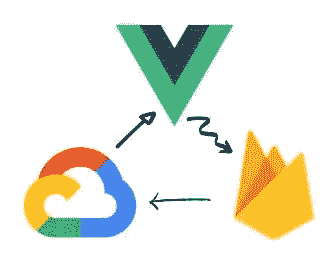
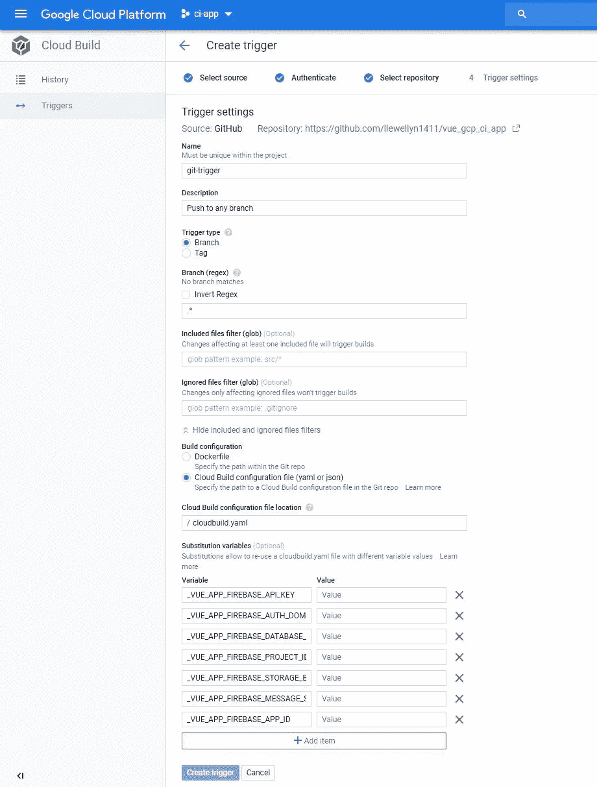

# Vue + Firebase + Google Cloud:如何建立你的 CI/CD 管道

> 原文：<https://itnext.io/vue-firebase-google-cloud-how-to-set-up-your-ci-cd-pipeline-3b309ef37015?source=collection_archive---------3----------------------->



Vue、Firebase 和谷歌云

在这篇文章中，我将向您展示如何使用 Google Cloud Build 创建一个简单的 CI/CD 管道。这将执行以下操作:

*   测试您的代码
*   使用云构建构建您的应用
*   部署 firebase 功能和 Vue 应用程序
*   安全地配置环境变量

# 先决条件

*   安装[消防基础工具](https://github.com/firebase/firebase-tools)
*   安装[谷歌云](https://cloud.google.com/sdk/gcloud/)

我将使用 [Vue](https://vuejs.org/) 来创建我的前端应用程序，你可以在这里看到结果。

# 建立一个 Firebase 项目

*   如果您没有帐户，请注册 [firebase](https://firebase.google.com/)
*   导航到 firebase 控制台并创建一个新项目
*   在测试模式下创建一个新的 [firestore](https://firebase.google.com/docs/firestore) 数据库
*   为您的项目启用计费。您每天将获得 120 分钟的免费构建时间，因此无需付费，但是必须启用计费才能使用云构建

您将能够从 firebase 控制台管理您的项目，因此请保持选项卡打开。

# 配置谷歌云平台

首先，我们[启用云构建 API](https://cloud.google.com/apis/docs/getting-started) 。确保您已启用计费

接下来，我们授予云构建对我们项目的访问权

*   导航至 IAM & admin
*   向@ cloud services . gserviceaccount . com 添加角色
*   云功能开发人员、Firebase 管理员、服务帐户用户和 API 密钥管理员

没有这些角色，构建管道将无法工作。因此，请仔细检查您是否已将它们全部添加。

# 部署 firebase docker 容器

为了部署我们的应用程序，我们需要一个可以运行 firebase 的远程环境。我们可以使用[社区构建者](https://github.com/GoogleCloudPlatform/cloud-builders-community) firebase 图像。

## 如果您使用的是 windows，在运行下面的代码之前，请将“firebase.bash”的行尾改为 LF。

```
git clone [https://github.com/GoogleCloudPlatform/cloud-builders-community](https://github.com/GoogleCloudPlatform/cloud-builders-community)cd cloud-builders-community/firebasegcloud builds submit --config cloudbuild.yaml .
```

如果需要切换项目运行

```
gcloud config set project <project-id>
```

通过导航到 Google Cloud Platform [控制台](https://console.cloud.google.com/home/)中的容器注册表，检查您的容器是否已经部署。

# 创建应用程序

我已经创建了应用程序，因此我们可以只关注 CI/CD。

分叉 [app](https://github.com/llewellyn1411/vue_gcp_ci_app) 运行

```
npm i
cd functions
npm i
```

# 创建一个. env 文件

在根文件夹中创建一个. env 文件

如下设置你的 Firebase 配置。您可以在 Firebase 控制台中获得 Firebase 应用程序配置

```
VUE_APP_FIREBASE_API_KEY=
VUE_APP_FIREBASE_AUTH_DOMAIN=
VUE_APP_FIREBASE_DATABASE_URL=
VUE_APP_FIREBASE_PROJECT_ID=
VUE_APP_FIREBASE_STORAGE_BUCKET=
VUE_APP_FIREBASE_MESSAGE_SENDER_ID=
VUE_APP_FIREBASE_APP_ID=
```

我们不想公开 Firebase API，所以添加。env 到你的。gitignore 文件。

# 创建云构建文件

在根文件夹中创建 cloudbuild.yaml


cloudbuild.yaml

# 创建 Git 触发器

现在我们已经创建了管道，我们需要在回购发生变化时执行它。

1.  导航至谷歌云平台>云构建>触发器
2.  “添加触发器”并按照提示操作
3.  设置名称
4.  将构建配置设置为云构建
5.  添加 Vue 替代变量，与本地. env 中设置的变量相同。



云构建触发器

使用[替换](https://cloud.google.com/cloud-build/docs/configuring-builds/substitute-variable-values)意味着我们不必担心加密。env 并可以通过 GCP 触发器更改密钥。

摆弄扳机设置，让它在你想要的时候准确地开火

# 把所有的放在一起

我们到目前为止所做工作的快速总结:

*   配置了一个 Firebase 项目
*   已配置的 GCP 和云构建
*   创建了 Git 触发器
*   使用客户端和服务器代码创建和应用程序
*   创建了一个云构建管道来测试和部署我们的代码

现在剩下要做的就是提交和推送您的代码。导航到云构建仪表板以监控您的构建。希望所有的步骤都能成功执行。现在应该已经部署了您的函数和客户机。

# 感谢

本文灵感来自火船[教程](https://fireship.io/lessons/ci-cd-with-google-cloud-build/)。我已经把它改成更适合 Vue 和 windows 的了。我还使用了不同的部署方法。如果你没有看过 Fireships 的作品，我强烈推荐你去看看他的 [youtube 频道](https://www.youtube.com/channel/UCsBjURrPoezykLs9EqgamOA)。

你可以在推特上关注我