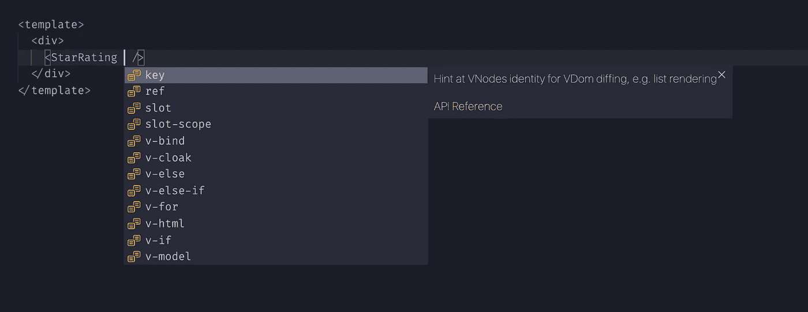
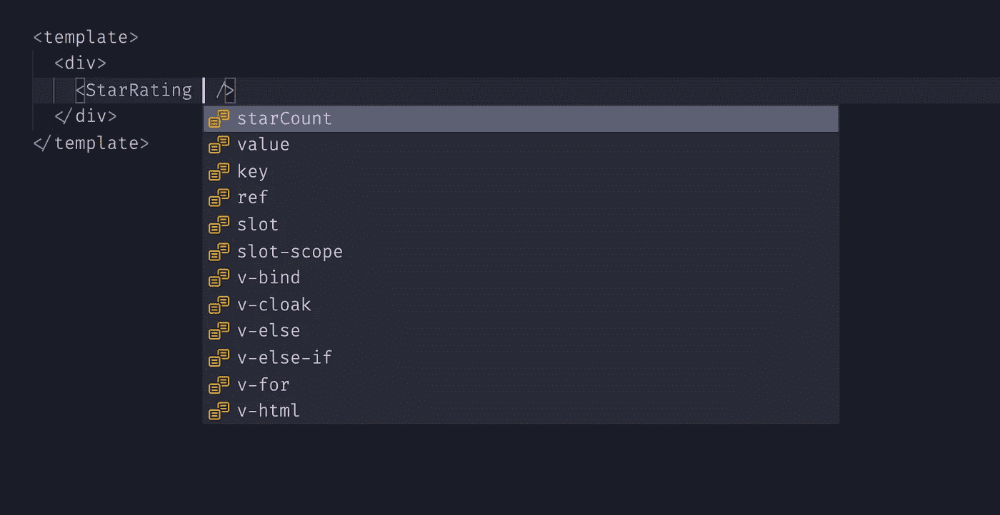
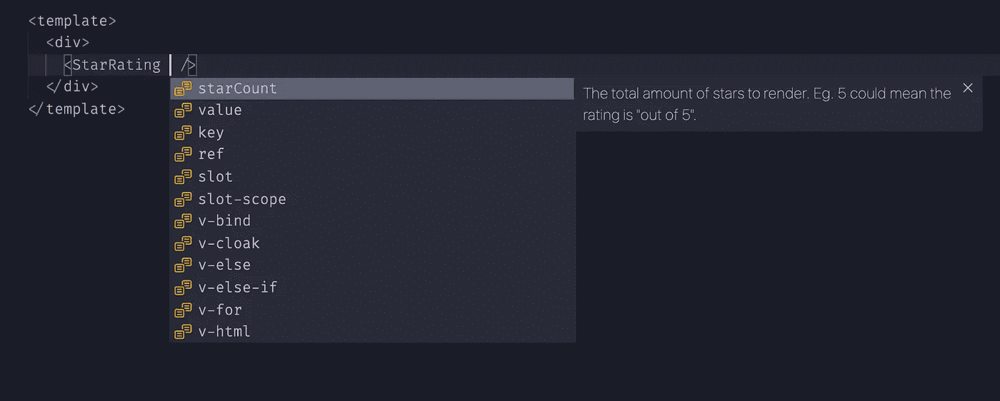
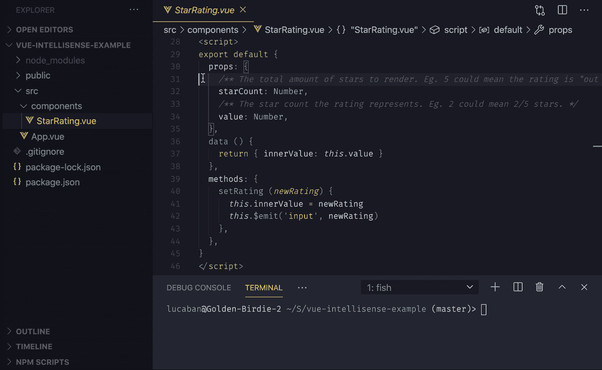

# VSCode 中的 Vue 智能感知

> 原文：<https://itnext.io/vue-intellisense-in-vscode-33cf8860e092?source=collection_archive---------0----------------------->

我发现独立的“Vue 组件”有一个**的单一目的**，你可以从 NPM 安装，并在任何项目中使用是伟大的！尤其是当它们可以灵活地添加到任何项目中时！

找到你正在寻找的正确的 Vue 组件*而不必引入一个全新的框架*是非常令人满意和富有成效的！！但是，有一个问题…

# TLDR；

*   Vue 组件**没有**自动完成道具；**或**解释道具作用的弹出文档片段。😥
*   在本文中，我将展示如何使用一个简单的 CLI 命令[自动为 props 添加自动完成和弹出文档！🎉](https://github.com/cycraft/vue-intellisense)
*   CLI 将保持最新，因此它也适用于 Vue 3。

# 问题是

有件事困扰我很久了…

我喜欢独立的 Vue 组件，他们也喜欢我——但有时我们有沟通问题……你看，大多数组件缺少*属性文档*和*属性自动完成*(也称为智能感知)。我甚至敢说 NPM 上 95%的独立 Vue 组件都没有正确的自动完成功能。这让我觉得:😰

让我们来看一个典型“星级评定”组件，它具有和不具有适当的自动完成功能。


没有正确自动完成:



正如你所看到的，有一些关于原生 Vue 道具和属性的一般信息，但没有关于这个主演组件的信息。

*   为什么会这样:我不知道用哪种道具。我不知道这些道具是做什么的。而一旦我搞清楚了，我还是不知道他们各自的类型？
*   **当前答案:**你得打破专注，找到自述，希望有人花时间在道具上写像样的文档。如果没有，那么你必须再次中断 focus，克隆他们的 repo，回到你的编辑器 du jour，并挖掘源代码。😕

# 解决方案

让我给你一个选择。如果组件显示的是:



你看到`starCount`和`value`了吗？现在我们知道在这个组件中可以使用哪些自定义道具。这是如此容易使用！

或者一个*甚至更好的*解决方案，如果道具有**一个文档片段**会怎么样？



> 你是怎么做到的，我现在就需要这个！
> ——你，读者，2020

这一切都可以通过名为 [Vetur](https://vuejs.github.io/vetur/) 的 VSCode 扩展来实现。
从上面的截图可以看出，Vetur 提供了为组件道具添加弹出文档的功能。但是我必须承认，关于这个特性的 Vetur [文档](https://vuejs.github.io/vetur/component-data.html#workspace-component-data)很难理解，也不容易找到。

让我来解释如何设置一切。这实际上很乏味，但是请一直读到最后，我会告诉你它是如何自动完成的！💜

# 手动方式

你必须做一些繁重的工作。不好玩。但是这非常简单，了解这些步骤可以为下面的自动化步骤提供洞察力。

首先，您需要创建两个 JSON 文件:`vetur/tags.json`和`vetur/attributes.json`；然后你需要编辑你的`package.json`，就这样！

## vetur/attributes.json

这是一个包含你的组件可能拥有的所有可能属性的文件。应该这样写:

```
{
  "star-rating": {
    "attributes": [ "value", "star-count" ],
    "description": "A StarRating component"
  }
}
```

## vetur/tags.json

这是一个包含每个属性的所有类型和文档片段的文件，看起来必须类似于以下内容:

```
{
  "star-rating/value": {
    "type": "number",
    "description": "The star count the rating represents. Eg. 2 could mean 2/5 stars."
  },
  "star-rating/star-count": {
    "type": "number",
    "description": "The total amount of stars to render. Eg. 5 could mean the rating is \"out of 5\"."
  },
}
```

## package.json

您必须将此添加到您的`package.json`:

```
{
  "vetur": {
    "tags": "vetur/tags.json",
    "attributes": "vetur/attributes.json"
  },
}
```

瞧啊。你的组件**现在有了智能感知**，因此对全世界来说都是超级用户友好的！！！相信我，这会让你在 Github 上获得很多明星！(懂了吗？😛)

> 这太愚蠢了…我不想为我所有的组件写这个，太乏味了！！！🤬💢❌💥

是的，我同意。挺繁琐的……

但是我的朋友，你今天很幸运，因为我会罩着你。😉

# 一个 CLI 工具可以自动完成所有工作

我创建了一个名为 [Vue IntelliSense](https://github.com/cycraft/vue-intellisense) 的 CLI，它将*自动为您的组件生成*所需的`tags.json`和`attributes.json`文件！⚙️

最好的事情是:你需要对你当前的 Vue 组件做真正的改变！

只需执行:

```
npm i -g vue-intellisense
```

然后，您可以执行:

```
vue-int --input /src/components/StarRating.vue --output vetur
```

就是这样！****会自动为你生成**`tags.json`和`attributes.json`文件，并保存在一个名为`vetur`的文件夹中。🎉**

****

**vue-intellisense 自动生成左边的 Vetur 文件夹！**

**您还可以对您拥有的所有 Vue 组件递归地执行此操作:**

```
vue-int --input /src/components --output vetur --recursive
```

**然后你可以把它添加到你的`package.json`脚本中，这样你就可以轻松地用`npm run vue-int`运行它**

```
{
  scripts: {
    "vue-int": "vue-int --output 'path/to/vetur' --input 'path/to/StarRating.vue'",
  }
}
```

> **如何将文档片段添加到我的道具中？*🤔***

**如果您还想拥有一个文档片段📄根据道具
— **，我强烈推荐**，你不应该在没有任何解释的情况下写一个道具—
你可以在道具上方添加一个 JSDoc 风格的注释，就像这样:**

```
export default {
  name: "StarRating",
  props: {
    /**
     * The star count the rating represents. Eg. 2 could mean 2/5 stars.
     */
    value: Number,
    /**
     * The total amount of stars to render. Eg. 5 could mean the rating is "out of 5".
     */
    starCount: Number,
  },
}
```

**现在`vue-intellisense`会自动将这个文档添加到 Vetur 文件中！**

**仅此而已！更多信息请查看 Vue 智能感知 Github 库。CLI 将保持最新，因此它可以与 Vue 3 以及未来的任何 Vetur 更新一起使用。任何贡献都非常感谢！**

# **奖金**

**作为最后的奖励。如果你已经使用了 Vue-Styleguidist 的方式来记录你的道具，你应该已经在你的道具上面有 JSDoc 文档片段了。Vue-Styleguidist 鼓励道具上面的 JSDoc 风格评论自动生成整个文档网站。这太好了！！**

**当使用 [Vue IntelliSense](https://github.com/cycraft/vue-intellisense) 时，如果您开始添加 JSDoc 文档，您现在有了一个在 VSCode *和*中获得 IntelliSense 的简单方法，尝试 Vue-Styleguidist 也很容易！**