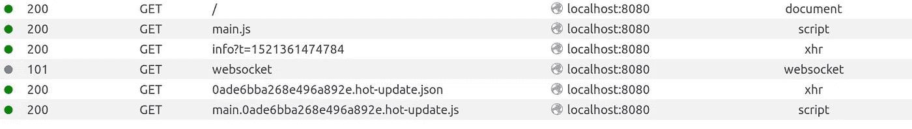
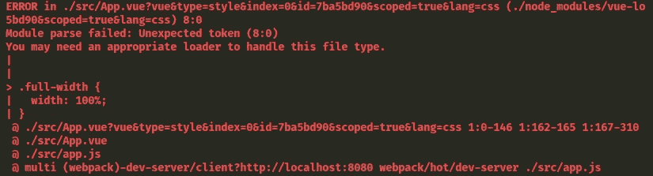
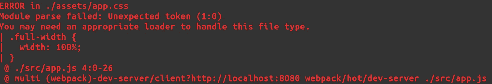

# Vue.js 和 Webpack 4，第 2 部分

> 原文：<https://itnext.io/vue-js-and-webpack-4-from-scratch-part-2-5038cc9deffb?source=collection_archive---------0----------------------->


> [点击这里在 LinkedIn 上分享这篇文章](https://www.linkedin.com/cws/share?url=https%3A%2F%2Fitnext.io%2Fvue-js-and-webpack-4-from-scratch-part-2–5038cc9deffb)

# 这次要有型！

继续[第 1 部分](/vuejs-and-webpack-4-from-scratch-part-1-94c9c28a534a)，在本文中，我将继续构建我们的 Vue.js 应用程序，添加:

*   用于添加预处理 CSS 的手写笔
*   热模块重载和 HTML 注入
*   构建我们的脚本的通天塔

[第 3 部分](https://medium.com/@petrefax66/vue-js-and-webpack-4-from-scratch-part-3-3f68d2a3c127)将通过添加以下内容来完成申请:

*   静态资产处理
*   林挺的 ESLint
*   使用 Jest 进行测试

让我们从安装 webpack-dev-server 开始，这样我们就不需要一直运行构建脚本来查看浏览器中的变化。

我们需要安装 npm 模块:

```
npm install --save-dev webpack-dev-server
```

并更改我们的构建脚本来运行它，而不是 webpack，同时我将把命令从 build 重命名为 dev:

```
"dev": "webpack-dev-server --config build/webpack.config.dev.js"
```

现在运行这个程序，浏览器在 [http://localhost:8080](http://localhost:8080) 上启动，我可以看到我的应用程序。全部采用零配置！然而，有一个小问题，如果我把我的 App.vue 改成“晚上好，圣迪马斯！”而不是“你好，世界！”则浏览器不会更新。

如果我检查我的控制台，我可以看到应用程序正在建设，那么是什么问题？当我们设置我们的 index.html 时，我们硬编码了 javascript 的路径，为了热模块重新加载工作，我们需要允许这个路径被注入，这样开发服务器就可以更新 html 以包含所做的更改。

转到 index.html，删除指向 dist/main.js 的脚本标签，然后安装 html-webpack-plugin:

```
npm install --save-dev html-webpack-plugin
```

现在我们需要将它添加到我们的 webpack 配置文件中，所以它看起来像这样:


如果您现在运行应用程序，您可以在 App.vue 中更改消息，它会立即在浏览器窗口中重新加载！

这太棒了，但是我们还没有得到真正的 HMR，如果你在浏览器 devtools 中查看，你可以看到当我们做出改变时，整个页面都刷新了。要解决这个问题，我们需要再添加一项配置:

```
'use strict'*const* webpack = require('webpack')
*const* { VueLoaderPlugin } = require('vue-loader')
*const* HtmlWebpackPlugin = require('html-webpack-plugin')module.exports = {
  mode: 'development',

  entry: [
    './src/app.js'
  ], devServer: {
    hot: true,
    watchOptions: {
      poll: true
    }
  }, module: {
    rules: [
      {
        test: /\.vue*$*/,
        use: 'vue-loader'
      }
    ]
  }, plugins: [
    new webpack.HotModuleReplacementPlugin(),
    new VueLoaderPlugin(),
    new HtmlWebpackPlugin({
      filename: 'index.html',
      template: 'index.html',
      inject: true
    })
  ]
}
```

有了这个，您应该能够看到热加载到页面中的更改，而无需刷新，如下所示:



现在我们有了应用程序自动更新，我们应该能够移动得更快，所以让我们添加一些 CSS。更改 App.vue 文件，使其如下所示:

```
<template>
  <div class="full-width center-content">
    <h1>Hello World!</h1>
  </div>
</template><style scoped>
.full-width {
  width: 100%;
}.center-content {
  display: flex;
  justify-content: center;
  align-items: center;
}
</style>
```

此更改过去会在浏览器中自动应用，但现在您会看到一条错误消息:



如果 CSS 在自己的文件中，也会有类似的问题。在根目录下创建一个名为 assets 的文件夹，添加一个名为 app.css 的文件，并将全角和中心内容类复制到其中。要将它包含在我们的应用程序中，我们可以将其导入到我们的 app.js 中。

```
import '../assets/app.css'
```

…并从 App.vue 中移除样式。

现在，当您尝试运行应用程序时，会出现一个错误:



要解决这个问题，我们需要在我们的 webpack 配置中配置 css 加载器，将其添加到规则:

```
{
  test: /\.css$/,
  use: [
    'vue-style-loader',
    'css-loader'
  ]
}
```

并安装样式加载器:

```
npm install --save-dev css-loader vue-style-loader
```

然后应该加载 css，我们在外部资产和单个文件组件中都有 css 处理。

这里的最后一个变化是，我喜欢使用手写笔进行 CSS 预处理，所以我安装了加载器:

```
npm install --save-dev stylus stylus-loader
```

添加了一条规则:

```
{
  test: /\.styl(us)?$/,
  use: [
    'vue-style-loader',
    'css-loader',
    'stylus-loader'
  ]
}
```

并将我的 app.css 转换为 app.styl:

```
.full-width
  width 100%.center-content
  display flex
  justify-content center
  align-items center
```

在这一点上，如果你使用 VSCode，有一个手写笔扩展可以正确地对你的风格进行颜色编码。

到目前为止，我们还没有在组件中添加任何脚本部分，因为这是一个如此简单的应用程序，我们不打算做任何太大的事情，让我们只创建一个 HelloComponent，它将 name 作为一个道具，并发出适当的问候。

在 components 文件夹下，添加 HelloComponent.vue，它应该如下所示:

```
<template>
  <h1>Hello {{ name }}!</h1>
</template><script>export default {
  props: {
    name: {
      type: String,
      required: true
    }
  }
}
</script><style lang="stylus" scoped>
h1
  color red
</style>
```

然后更改 App.vue 以使用新组件:

```
<template>
  <div class="full-width center-content">
    <hello-component name="World" />
  </div>
</template><script>
import HelloComponent from './components/HelloComponent.vue'export default {
  components: {
    HelloComponent
  }
}
</script>
```

这是可行的，但是旧的浏览器可能会与这种 ES6 语法斗争(这是我们开始测试时会遇到的)，所以我们将安装 Babel 来将我们的代码转换成所有浏览器都能理解的 ES5。

首先，安装 npm 模块:

```
npm install --save-dev @babel/core babel-loader @babel/preset-env
```

然后添加加载器配置:

```
{
  test: /\.js$/,
  use: 'babel-loader'
}
```

在这个阶段，重要的是这个加载器配置在 vue-loader 之后。在你的配置中，vue-loader 将把你的单个文件组件分割成单独的 html、js 和样式模块，我们希望 babel-loader 处理 js 部分。

最后在项目的根目录下创建一个名为。babelrc，这是我们放置 babel 特定配置的地方。目前，我们将尽可能保持简单:

```
{
  "presets": [
    ["@babel/env", {
      "modules": false,
      "targets": {
        "browsers": ["> 1%", "last 2 versions", "not ie <= 8"]
      }
    }]
  ]
}
```

我们现在可以运行我们的应用程序，我们看不到表面上的变化，但是在幕后，我们的 ES6 代码已经转移到 ES5，并将在更广泛的浏览器上工作。

这就是这一部分的全部内容，在最后一部分，我们将通过查看外部资产处理、林挺和测试来完成应用程序。感谢阅读！