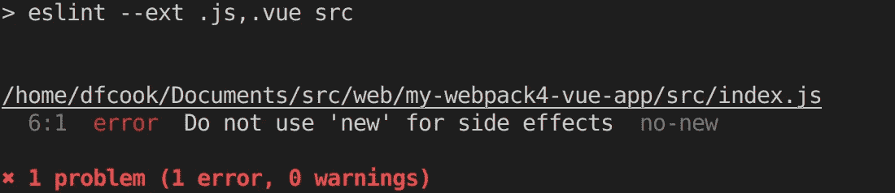
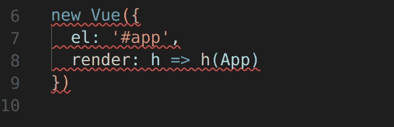
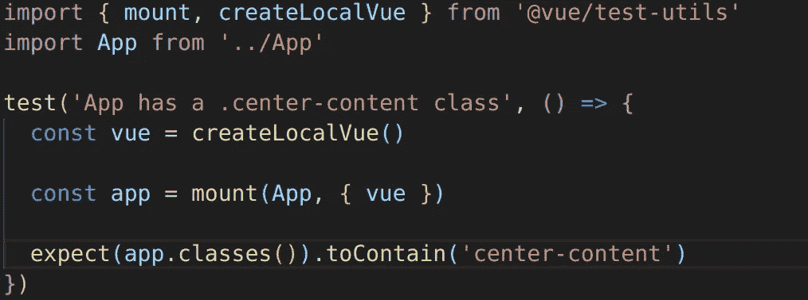
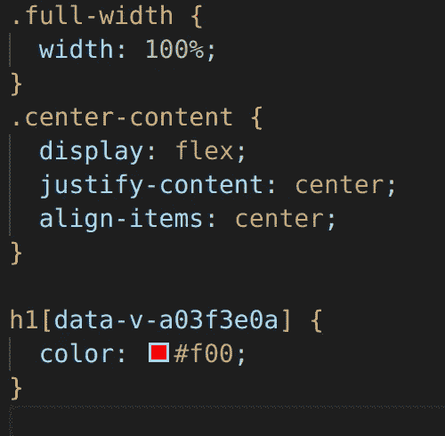

# Vue.js 和 Webpack 4 从头开始，第 3 部分

> 原文：<https://itnext.io/vue-js-and-webpack-4-from-scratch-part-3-3f68d2a3c127?source=collection_archive---------0----------------------->


# 包装

这是使用 Webpack 4 从头开始配置 Vue 项目的系列文章的最后一部分，第 1 部分在这里[提供](/vuejs-and-webpack-4-from-scratch-part-1-94c9c28a534a)，第 2 部分在这里[提供](/vue-js-and-webpack-4-from-scratch-part-2-5038cc9deffb)。下面我将介绍:

1.  林挺。
2.  测试。
3.  静态资产的处理。

并且，基于前一篇文章中的一个问题，我还将提到 css 提取。

最终代码可在 [github](https://github.com/dfcook/vue-webpack4-template) 上获得。

在对第 1 部分的评论中， [@blacksonic86](http://twitter.com/blacksonic86) 建议我们的应用程序的入口点应该被称为 index.js，而不是 app.js。这很有意义，因为它是 webpack 4 中的默认入口，这意味着我们可以将其从 webpack.config.dev.js 中删除。

在实践中，我经常有多个入口点，因为我使用这种配置来添加 polyfills 以支持旧的浏览器，如 Internet Explorer，但在这种情况下，这是我应该想到的一个变化。更改文件名意味着当前的 webpack 配置如下。

```
'use strict'const webpack = require('webpack')
*const* { VueLoaderPlugin } = require('vue-loader')
const HtmlWebpackPlugin = require('html-webpack-plugin')module.exports = {
  mode: 'development',

  devServer: {
    hot: true,
    watchOptions: {
      poll: true
    }
  },  module: {
    rules: [
      {
        test: /\.vue$/,
        use: 'vue-loader'
      }, {
        test: /\.js$/,
        use: 'babel-loader'
      }, {
        test: /\.styl(us)?$/,
        use: [ 'vue-style-loader', 'css-loader', 'stylus-loader' ]
      }
    ]
  },plugins: [
    new webpack.HotModuleReplacementPlugin(),
    new VueLoaderPlugin(),
    new HtmlWebpackPlugin({
      filename: 'index.html',
      template: 'index.html',
      inject: true
    }) 
  ]
}
```

# 林挺

林挺是将静态分析应用到您的代码库以检测问题或实施风格指南的过程。在使用动态类型的语言(如 javascript)时，这非常有用。ESLint 是标准的 linter，它允许你定义规则集来运行你的代码库，或者使用插件来使用预定义的规则集。我们将使用 Vue eslint 插件来执行 Vue 应用程序的推荐规则。

我们需要安装相当多的 npm 软件包来启用林挺:

```
npm install --save-dev eslint eslint-plugin-import eslint-plugin-node eslint-plugin-promise eslint-plugin-standard eslint-config-standard babel-eslint eslint-loader eslint-plugin-vue
```

完成后，我们需要告诉 eslint 我们想要使用哪些规则，在项目根目录下创建一个名为. eslintrc.js 的文件，并添加这些设置:

```
module.exports = {
  parserOptions: {
    parser: 'babel-eslint'
  },
  extends: [
    'plugin:vue/recommended',
    'standard'
  ],
  plugins: [
    'vue'
  ]
}
```

这里我们告诉 eslint，我们想用 babel 解析我们的 javascript，然后应用标准的林挺规则和 vue 插件推荐的规则。

运行 ESLint 最简单的方法是通过 npm 脚本。将它添加到脚本部分的 package.json 中:

```
"lint": "eslint --ext .js,.vue src"
```

我们正在对 src 文件夹中带有文件扩展名的所有内容运行 ESLint。现在运行这个，你应该已经得到一个错误了。



这指向我们 index.js 中的这些行，我已经安装了 VSCode 的 eslint 扩展，所以如果我现在打开这个文件，我可以看到另一个视觉线索，表明有问题。



有各种方法可以解决这个问题，例如，我们可以导出新的 Vue 对象，但是让我们告诉 ESLint，这一行实际上是可以的，我们希望它忽略它。在有问题的代码前添加以下注释:

```
/* eslint-disable-next-line no-new */
```

现在，当您重新运行 lint 脚本时，它应该不会报告任何错误。

ESLint 还支持自动修复某些类别的错误，我喜欢在我的 npm 配置中添加一个快捷脚本，以便在需要时运行自动修复:

```
"lint:fix": "eslint --ext .js,.vue src --fix"
```

一旦我们的林挺配置为按需运行，我们希望更改我们的 webpack 构建，使其自动运行。为此，我们需要安装 webpack 加载器:

```
npm install --save-dev eslint-loader
```

并更改我们的 webpack 配置以添加一个规则来关联我们的。js 和。使用 ESLint 加载程序加载 vue 文件:

```
{
  test: /\.(js|vue)$/,
  use: 'eslint-loader',
  enforce: 'pre'
}
```

这个规则与我们的其他规则相比有一个变化，enforce:“pre”。这意味着 ESLint 加载程序是一个预加载程序，它将在其他加载程序之前运行，并在 babel-loader 启动并开始处理 javascript 之前应用林挺规则。

# 静态资产

静态资产是像图像和视频这样的东西，它们不会被 Webpack 处理，但我们需要将它们复制到我们的 dist 文件夹中，以便它们可以用于构建的应用程序。

为此，我们使用 copy-webpack-plugin。按照现在已经熟悉的路径，我们需要安装软件包:

```
npm install --save-dev copy-webpack-plugin
```

然后在我们的 webpack 配置中，我们把插件拉进来，并把它添加到我们的插件部分。

```
const CopyWebpackPlugin = require('copy-webpack-plugin')
*const* path = require('path')function resolve (dir) {
  return path.join(__dirname, '..', dir)
}plugins: [
  new CopyWebpackPlugin([{
    from: resolve('static/img'),
    to: resolve('dist/static/img'),
    toType: 'dir'
  }])
]
```

这非常简单，我们放在 static/img 文件夹中的所有图像都将被复制到 dist build 文件夹中的相应文件夹中。

# 测试

作为 Vue 生态系统的一部分，vue-test-utils 是 Vue.js 的官方单元测试库，它支持多个测试运行器、浅层渲染、模拟用户交互、模仿 vuex 和 vue-router 以及同步更新(无需调用 nextTick 来触发 dom 更新)。

在这个例子中，我将使用 [jest](https://facebook.github.io/jest/) 来运行测试。Jest 来自 facebook，与 React 密切相关，但它可以适应任何 Javascript 库或框架，并且有一个特定于 vue 的生态系统，允许我们毫无困难地运行我们的测试。

让我们安装 jest:

```
npm install --save-dev jest babel-jest vue-jest jest-serializer-vue @vue/test-utils
```

Jest 是测试程序，vue-jest 是一个将 vue 组件转换成 jest 的正确格式的包，jest-serializer-vue 是一个支持拍摄 vue 组件快照的包。快照测试允许呈现完整的 DOM，然后执行比较以确保它没有改变。

Jest 不是一个独立的配置文件，而是从我们的 package.json 配置的。

```
"jest": {
  "moduleFileExtensions": [
    "js",
    "vue"
  ],
  "moduleNameMapper": {
    "^@/(.*)$": "<rootDir>/src/$1"
  },
  "transform": {
    "^.+\\.js$": "<rootDir>/node_modules/babel-jest",
    ".*\\.(vue)$": "<rootDir>/node_modules/vue-jest"
  },
  "snapshotSerializers": [
    "<rootDir>/node_modules/jest-serializer-vue"
  ]
}
```

当我们在 package.json 中时，让我们添加一个脚本来实际运行我们的测试:

```
"test": "jest"
```

我们需要配置 babel 来传输我们的测试。babelrc 文件:

```
"env": {
  "test": {
    "presets": [
      ["env", { "targets": { "node": "current" }}]
    ]
  }
}
```

并告诉 ESLint 我们的测试环境，将它添加到. eslintrc.js 文件中:

```
env: {
  browser: true,
  node: true,
  mocha: true
},
globals: {
  expect: true
}
```

现在 jest 已经配置好了，我们可以实际编写一个测试了。为了简单起见，我们将只挂载我们的应用程序组件，并验证它是否具有。中心内容”类。默认情况下，Jest 会在名为 __tests__ 的文件夹中查找测试，因此在 src 文件夹下创建它，并添加一个名为 App.spec.js 的文件。



我们使用 Vue test-utils 来安装应用程序，然后对返回的包装器运行一个简单的 expect。

要运行该测试，非常简单:

```
npm run test
```


# 提取 CSS

这是第二部分的评论中提到的问题。这证明了 webpack 领域的变化速度，在我发表文章后的一周里，将 CSS 提取到一个单独的文件中的方法已经完全改变了。随着 vue-loader 15 的发布，MiniCssExtractPlugin 是从你的 vue 单文件组件中提取 CSS 的标准方式。

从 npm 安装插件:

```
npm install --save-dev mini-css-extract-plugin
```

将它添加到我们的 webpack 配置文件中的插件:

```
const MiniCssExtractPlugin  = require('mini-css-extract-plugin').
.
plugins: [
  new MiniCssExtractPlugin({
    filename: 'main.css'
  })
]
```

最后，配置我们的手写笔加载器来使用这个插件提取 css，配置 vue 加载器来从我们的单个文件组件中提取 CSS:

```
module: {
  rules: [
    {
      test: /\.vue$/,
      use: 'vue-loader'
    }, {
      test: /\.styl(us)?$/,
      use: [
        MiniCssExtractPlugin.loader,
        'css-loader',
        'stylus-loader'
      ]
    }
  ]
}
```

现在，当我们的应用程序构建时，所有的手写笔都将被提取并放在 dist 文件夹下的一个 css 文件(main.css)中。我们的单个文件组件中的作用域 CSS 也将包括在内，例如:



# 这是所有的乡亲

希望这些文章有所帮助。随着 vue-cli 3 的即将到来，它们已经有过时的成分，使用 webpack 的方法将经历重大变化。然而，了解这些东西是如何配置的总是很重要的，没有比从头开始更好的方法了。