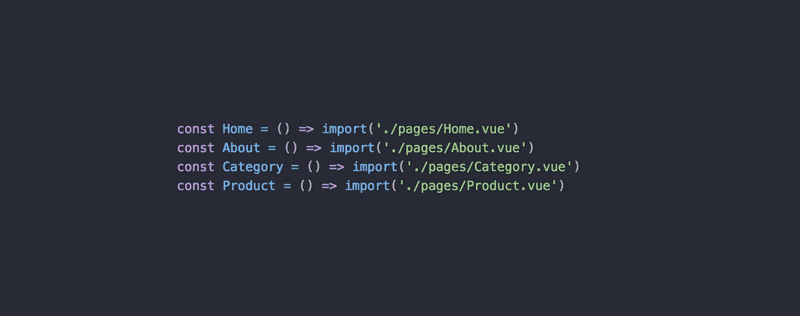

# Vue.js 应用性能优化:第 1 部分—性能优化和延迟加载介绍。

> 原文：<https://itnext.io/vue-js-app-performance-optimization-part-1-introduction-to-performance-optimization-and-lazy-29e4ff101019?source=collection_archive---------0----------------------->

**虽然移动优先的方法已经成为标准，而且不确定的网络条件也是我们应该始终考虑的因素，但让您的应用保持快速加载变得越来越困难。在这个系列中，我将深入探讨我们在** [**Vue 店面**](https://github.com/DivanteLtd/vue-storefront) **中使用的 Vue 性能优化技术，您可以在您的 Vue.js 应用程序中使用这些技术，使它们能够立即加载并平稳运行。我的目标是让这个系列成为一个关于 Vue 应用性能的完整指南。**

[第 1 部分—性能优化和延迟加载简介。](https://vueschool.io/articles/vuejs-tutorials/lazy-loading-and-code-splitting-in-vue-js/)

[第 2 部分—惰性加载路线和供应商捆绑反模式。](/vue-js-app-performance-optimization-part-2-lazy-loading-routes-and-vendor-bundle-anti-pattern-4a62236e09f9)

[第 3 部分—惰性加载 Vuex 模块](/vue-js-app-performance-optimization-part-3-lazy-loading-vuex-modules-ed67cf555976)

第 4 部分——提供良好的等待体验和延迟加载单个组件——很快

第 5 部分—延迟加载库并寻找更小的等价库—很快

第 6 部分——UI 库的性能友好使用

第 7 部分—利用服务工作者缓存—很快

第 8 部分—预取

# 文章感动刷新！

嘿！这篇文章被移到 Vue 学校博客[这里](https://vueschool.io/articles/vuejs-tutorials/lazy-loading-and-code-splitting-in-vue-js/)。我用更好的例子和更少的技巧刷新了它:)请继续关注 Vue 学校博客上的下一部分！