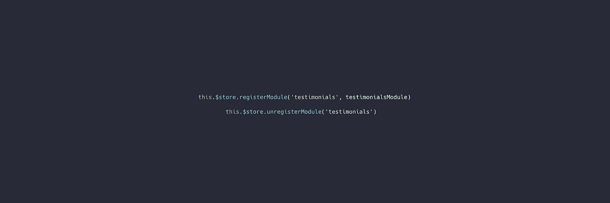
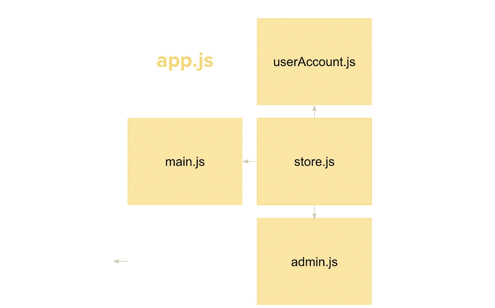
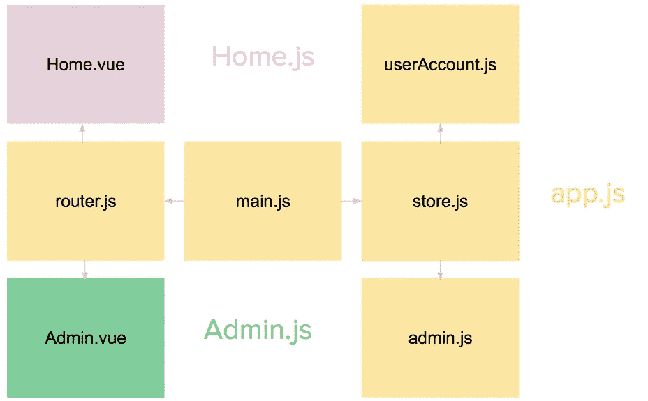
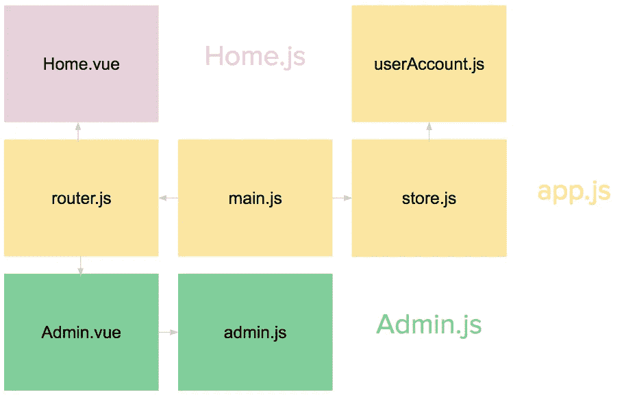
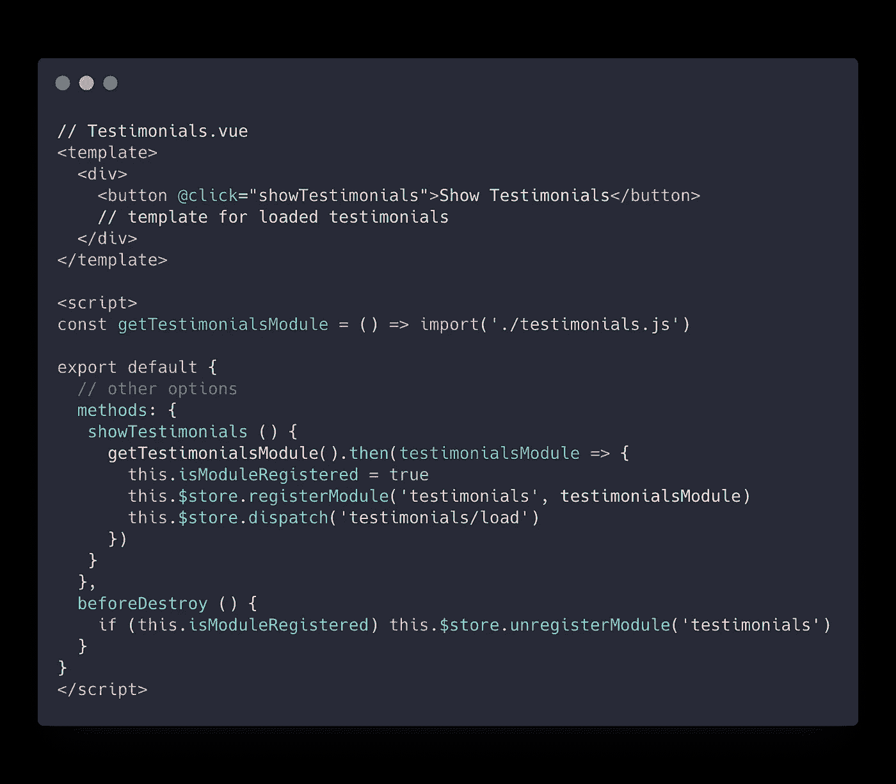
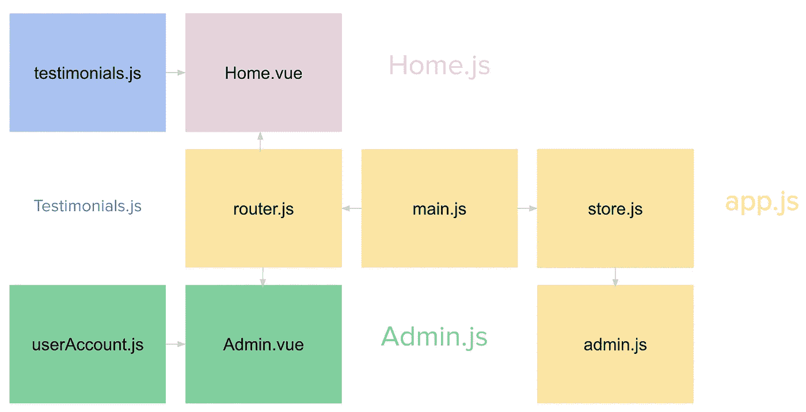

# Vue.js 应用程序性能优化:第 3 部分—延迟加载 Vuex 模块

> 原文：<https://itnext.io/vue-js-app-performance-optimization-part-3-lazy-loading-vuex-modules-ed67cf555976?source=collection_archive---------0----------------------->



**在** [**的上一部分**](/vue-js-app-performance-optimization-part-2-lazy-loading-routes-and-vendor-bundle-anti-pattern-4a62236e09f9) **中，我们学习了足以显著提高应用程序性能的模式——按路线分割代码。虽然按路线分割代码非常有帮助，但在用户访问我们的网站后，仍然有很多代码是不需要的。在本系列的这一部分中，我们将重点关注状态管理的代码分割——Vuex 模块。**

该系列基于从 [Vue 店面](https://github.com/DivanteLtd/vue-storefront)性能优化流程中获得的经验。通过使用下面的技术，我们能够将初始包的大小减少 70%,并在一眨眼的时间内完成加载。

[第 1 部分—性能优化和延迟加载简介。](https://vueschool.io/articles/vuejs-tutorials/lazy-loading-and-code-splitting-in-vue-js/)

[第 2 部分—惰性加载路线和供应商捆绑反模式。](/vue-js-app-performance-optimization-part-2-lazy-loading-routes-and-vendor-bundle-anti-pattern-4a62236e09f9)

[第 3 部分—惰性加载 Vuex 模块](/vue-js-app-performance-optimization-part-3-lazy-loading-vuex-modules-ed67cf555976)

第 4 部分——提供良好的等待体验和延迟加载单个组件——很快

第 5 部分—延迟加载库并寻找更小的等价库—很快

第 6 部分——UI 库的性能友好使用

第 7 部分—利用服务工作者缓存—很快

第 8 部分—预取

# 两种类型的 Vuex 模块

在我们进一步了解如何惰性加载 [Vuex 模块](https://vuex.vuejs.org/guide/modules.html)之前，您需要了解一件重要的事情。您需要了解注册 Vuex 模块的可能方法及其优缺点。

**静态 Vuex 模块**在商店初始化期间声明。以下是显式创建的静态模块的示例:

```
// store.js
import { userAccountModule } from './modules/userAccount'const store = new Vuex.Store({
  modules: {
    user: userAccountModule
  }
})
```

上面的代码将用静态模块`userAccountModule`创建一个新的 Vuex 商店。静态模块不能被取消注册(它们的注册也不能被延迟)和它们的结构(不是状态！)在存储初始化后无法更改。

虽然这种限制对于大多数模块来说不是问题，并且在一个地方声明所有模块对于将所有与数据相关的内容保存在一个地方非常有帮助，但是这种方法也有一些缺点。

假设我们的应用程序中有一个带有专用 Vuex 模块的管理仪表板。

```
// store.js
import { userAccountModule } from './modules/userAccount'
import { adminModule } from './modules/admin'const store = new Vuex.Store({
  modules: {
    user: userAccountModule, 
    admin: adminModule
  }
})
```

你可以想象这样的模块会非常大。即使 dashboard 将只被一小部分用户使用，并且由于静态 Vuex 模块的集中注册，它的所有代码都将在主包中结束。



我们所有的模块都捆绑在一个文件中

这肯定不是我们想要的结局。我们需要一种只在`/admin`路径中加载这个模块的方法。正如你可能已经猜到的，静态模块不能满足我们的需要。所有静态模块都需要在 Vuex 商店创建时注册，因此它们不能在以后注册。

这就是动态模块可以帮助我们的地方！

**与静态模块相对的动态模块**可以在 Vuex 商店创建后**注册。这种简洁的功能意味着我们不需要在应用程序初始化时下载动态模块，可以将它捆绑在不同的代码块中，或者在需要时延迟加载。**

首先让我们看看动态注册了`admin`模块后，前面的代码会是什么样子。

```
// store.js
import { userAccountModule } from './modules/userAccount'
import { adminModule } from './modules/admin'const store = new Vuex.Store({
  modules: {
    user: userAccountModule, 
  }
})store.registerModule('admin', adminModule)
```

我们没有将`adminModule`对象直接传递给我们商店的`modules`属性，而是在商店创建后用`[registerModule](https://vuex.vuejs.org/api/#registermodule)`方法注册了它。

动态注册不需要对模块本身进行任何修改，因此任何 Vuex 模块都可以静态或动态注册。

当然，在目前的形式下，这个动态注册的模块并没有给我们带来任何优势。

# 正确代码分割的 Vuex 模块

让我们回到我们的问题。既然我们知道了如何动态注册`admin`模块，我们当然可以尝试将它的代码放到`/admin`路由包中。

让我们暂时停下来简要了解一下我们正在使用的应用程序。



```
// router.js
import VueRouter from 'vue-router'
const Home = () => import('./Home.vue')
const Admin = () => import('./Admin.vue')const routes = [
  { path: '/', component: Home },
  { path: '/admin', component: Admin }
]export const router = new VueRouter({ routes }) 
```

在`router.js`中，我们有两条延迟加载的代码分割路由。通过上面看到的代码，我们的`admin` Vuex 模块仍然在主`app.js`包中，因为它在`store.js`中是静态导入的。

让我们解决这个问题，将这个模块只提供给进入`/admin`路线的用户，这样其他人就不会下载多余的代码。

为此，我们将在`/admin`路由组件中加载`admin`模块，而不是在`store.js`中导入并注册它。

```
// store.js
import { userAccountModule } from './modules/userAccount'export const store = new Vuex.Store({
  modules: {
    user: userAccountModule, 
  }
})// Admin.vue
import adminModule from './admin.js'export default { 
  // other component logic
  mounted () { 
    this.$store.registerModule('admin', adminModule)
  },
  beforeDestroy () {
   this.$store.unregisterModule('admin')
  }
}
```

让我们来看看发生了什么！

我们正在导入并注册`Admin.vue` ( `/admin`路线)内的`admin`店铺。在代码的后面，一旦用户退出管理面板，我们将取消注册该模块，以防止同一个模块的多次注册。

现在，因为`admin`模块是在`Admin.vue`而不是`store.js`中导入的，所以它将与代码分离的`Admnin.vue`捆绑在一起！



> **重要提示**:如果您正在使用 SSR 模式，请确保您正在`mounted`钩子中注册模块。否则会导致内存泄漏，因为`beforeDestroy`钩子没有在服务器端进行评估。

现在我们知道了如何使用动态 Vuex 模块注册将我们的路由特定模块分发到适当的包中。让我们看看稍微复杂一点的用例。

# 惰性加载 Vuex 模块

假设我们的`Home.vue`上有推荐部分，我们希望在这里展示对我们服务的积极评价。他们有很多，所以我们不想在用户进入我们的网站后立即显示他们。只有当用户需要时才显示它们会好得多。我们可以添加*“显示评价”*按钮，点击后将加载并显示其下方的评价。


为了存储客户评价数据，我们还需要一个 Vuex 模块。姑且称之为`testimonials`。该模块将负责显示以前添加的证明和添加新的。我们不需要知道实现细节。

我们希望`testimonials`模块只有在用户点击按钮时才被下载，因为以前不需要它。让我们看看如何利用动态模块注册和动态导入来实现这一功能。`Testimonials.vue`是`Home.vue.`内部的组件



让我们快速回顾一下代码。

当用户点击`Show Testimonials`按钮时`getTestimonials()`方法被调用。它负责调用正在获取`testimonials.js`的`getTestimonialsModule()` 。一旦 promise 被解析(这意味着模块被加载)，我们就动态地注册它，并分派负责获取证明的动作。

多亏了动态导入`testimonials.js`内容被捆绑到一个单独的文件中，只有当`getTestimonialsModule`方法被调用时才会被下载。



当我们需要退出管理面板时，我们只是在`beforeDestroy`生命周期挂钩中注销先前注册的模块，所以如果我们再次进入这条路径，它不会重复。

# 包裹

尽管静态 Vuex 模块注册对于大多数用例来说已经足够，但是在某些情况下，我们可能需要使用动态注册。

*   **如果模块只在特定的路由上需要，**那么我们可以在适当的路由组件中动态注册它，这样它就不会出现在主包中。
*   **如果只是在一些交互之后才需要模块，**那么我们需要把动态模块注册和动态导入结合起来，用一种合适的方法来实现模块的延迟加载。

编码分割 Vuex 模块的能力是一个强大的工具。您在应用程序中处理的与数据相关的操作越多，就捆绑包大小而言，节省的就越多。

在本系列的下一部分，我们将学习如何延迟加载单个组件，更重要的是，哪些组件应该延迟加载。