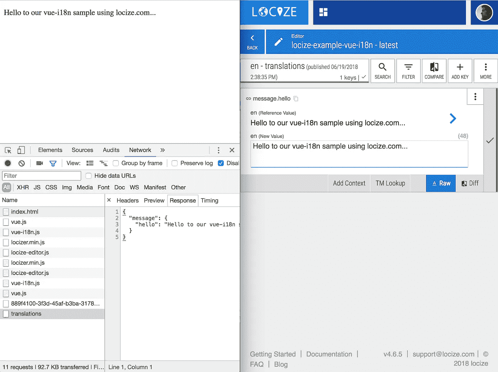
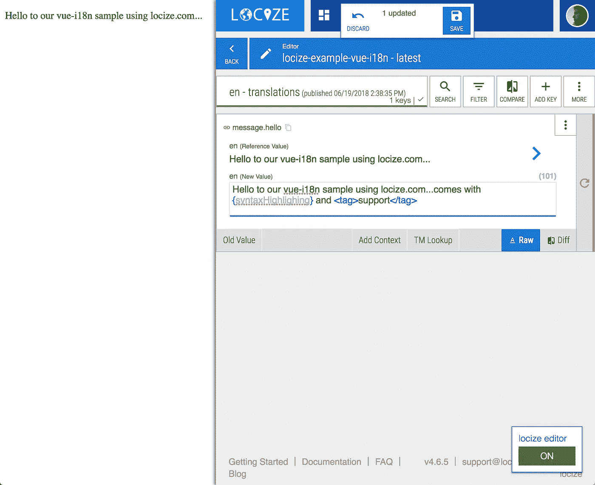

# vue.js:从国际化(i18n)到本地化(l10n)再到国际化

> 原文：<https://itnext.io/vue-js-from-internationalization-i18n-to-localization-l10n-and-back-again-c715c22adc9b?source=collection_archive---------2----------------------->


# 什么是国际化？！？

> 国际化是一种产品的设计，它将满足许多国家用户的需求，或者可以很容易地适应这种需求。国际化可能意味着设计一个网站，当它从英语翻译成西班牙语时，布局仍然有效——许多西班牙语单词有更多的字符，因此在西班牙语页面上比英语占据更多的空间。

报价人:[https://www . investopedia . com/terms/I/国际化. asp](https://www.investopedia.com/terms/i/internationalization.asp)

# 开源拯救世界

感谢永不停息的开源社区，您将不必重新发明一个 i18n 解决方案。为了给你一个思路，让我们在这里提到两个成熟的解决方案来翻译你的 vue.js 应用程序:

[**vue-i18n**](https://github.com/kazupon/vue-i18n) 作者川口和也(@ github 上的 kazun)

*   由 vue.js 核心撰稿人@kazupon 制作
*   易于上手
*   对于大多数用例来说足够强大*(缺少一些特性，比如对于有多个复数形式的语言的适当复数化，或者性别特定翻译的可能性)*
*   阅读[文档](https://kazupon.github.io/vue-i18n/)了解更多信息

[**vue-i18 下一个**](https://github.com/panter/vue-i18next/commits/master) 作者克劳迪奥·罗马诺(@panter on github)

*   基于[i18 下一个](https://www.i18next.com/):学一次——到处翻译
*   可扩展的强大 i18n 功能
*   用于语言检测、加载、缓存等的插件
*   阅读[文档](https://github.com/panter/vue-i18next)和[i18 下一篇文档](https://www.i18next.com/translation-function/essentials)了解更多翻译功能，如复数、上下文等

# 从国际化到本土化

正如你在 vue-i18n 的[入门指南](https://kazupon.github.io/vue-i18n/guide/started.html)中看到的，让你的 vue.js 应用程序适合翻译并不像看起来那么令人畏惧。老实说，这相当容易。

现在让我们向您展示下一步对本地化做同样的事情是多么容易。

> 启用开发人员后，是时候让您的本地化团队翻译您的产品了。

## 步骤 1:创建快速翻译循环—持续本地化

我们的目标是将 vue-i18n 扩展到使用它现有的缺失功能，直接向翻译管理工具发送新文本，并从那里直接加载翻译。

这使本地化团队/翻译人员能够立即开始翻译，并通过开发翻译保持快速反馈循环，而不必将这些文件从翻译管理导出和复制到代码库。

为了实现这一奇迹，我们将使用 locize.com 的[作为我们选择的武器:](https://locize.com)

> locize 是一项新的在线服务，提供真正的持续本地化。

引用人:【https://alternativeto.net/software/locize/】T4

> 该是写代码的时候了——让我看看你的代码

首先，我们需要将提供的[本地化脚本](https://github.com/locize/locizer)添加到我们的页面，以将本地化翻译管理与我们的代码连接起来:

```
<!DOCTYPE html>
<html>
  <head>
    <script src=”https://unpkg.com/vue/dist/vue.js"></script>
    <script src=”https://unpkg.com/vue-i18n/dist/vue-i18n.js"></script> 
    **<script src=”https://unpkg.com/locizer/locizer.min.js"></script>**
  </head>
// ...
```

现在让我们使用新的脚本来自动检测用户语言并从 locize 加载翻译:

```
<script>
**locizer**
  .init({
    fallbackLng: 'en', // load this if detected lng is not support
    referenceLng: 'en', // the source language
    projectId: [PROJECTID], // your locize project id
    apiKey: [APIKEY] // your locize api key
  })
  **.load('translations'**, (err, translations, **detectedLng**) => {
     // build message catalog format
     var messages = {};
     messages[detectedLng] = translations;// Create VueI18n instance with options
     const i18n = new VueI18n({
       locale: detectedLng, // set locale
       messages: messages, // set locale messages
     })// Create a Vue instance with `i18n` option
     new Vue({ i18n }).$mount('#app')
  })
</script>
```

所以现在我们已经直接从我们的项目中加载了 locize CDN 的翻译。要切换语言，只需将`?lng=[yourLanguage]`附加到您的 url(更多选项，请查看[检测选项](https://github.com/locize/locizer#init-options))。



直接从 CDN 加载翻译

我们的翻译人员可以轻松添加新语言、翻译内容或更改现有内容。

> 是时候让新路径自动定位了

只需使用 vue-i18n 现有的缺失函数，并通过管道调用 locizer 脚本:

```
// Create VueI18n instance with options
const i18n = new VueI18n({
  locale: detectedLng, // set locale
  messages: messages, // set locale messages
  **missing: function(locale, path, vue) {** // pipe to locize - that key will be created for you **locizer.add('translations', path, path);
  }**
})
```

A wesome。现在我们有了与翻译管理相关的代码。开发人员可以创建自动传递给翻译管理人员的新内容。翻译人员可以完成他们的工作，而不必乞求最新的源文件，也不需要将最新的翻译发送给开发人员，并等待这些文件被集成到最新的版本中。

> 真正持续本地化的力量

## 第二步:保证翻译的高质量

本地化很难。如果你在翻译过程中不得不猜测上下文，那就更难了。因此，让我们通过在 vue.js 应用程序中直接启用翻译来改善这一点。



已启用 InContext 编辑器

要添加 incontext 编辑器，我们需要先添加一个额外的脚本:

```
<script src="https://unpkg.com/locize-editor/locize-editor.js"></script>
```

一点配置:

```
locizeEditor.init({
  lng: detectedLng,
  defaultNS: 'translations',
  referenceLng: 'en',
  projectId: [PROJECTID]
})
```

现在用`?locize=true`打开你的网站，你会看到 incontext 编辑器。打开后，您可以点击页面上的任何文本元素，直接跳转到该元素，并进行初始翻译或所需的更改。

# 摘要

你看，国际化很容易，本地化也不难。使用正确的工具，您不仅可以缩短开发-翻译周期，还可以提高质量，节省时间和金钱。

你可以在这里找到完整的样本:【https://github.com/locize/locize-vue-i18n-example 

抓住机会，亲自体验一下 locize.com[的 14 天免费试用期。](https://locize.com)

**更喜欢用 vue-i18next？** 只需使用 i18next 插件系统，做同样的事情更容易。接下来只需添加[https://github.com/locize/i18next-locize-backend](https://github.com/locize/i18next-locize-backend)和编辑[https://github.com/locize/locize-editor](https://github.com/locize/locize-editor)到 i18。完成了。