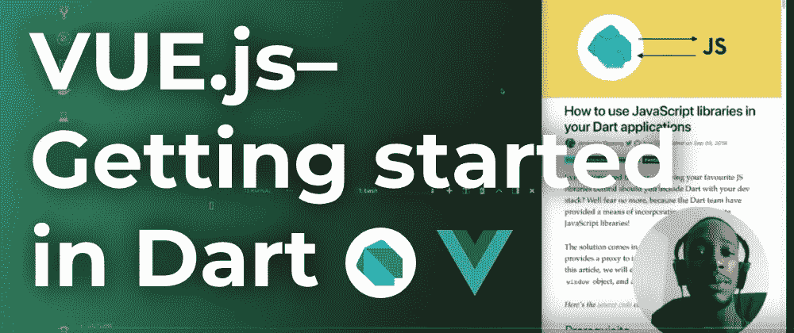

# vue . js–Dart 入门(第 1 部分)

> 原文：<https://itnext.io/vue-js-getting-started-in-dart-c26c163efafe?source=collection_archive---------0----------------------->

## 了解如何为 Vue.js 框架编写 Dart 代码



我对 Vue.js 最近做的标记印象深刻。在过去使用过[之后](https://medium.com/@graphicbeacon/how-to-use-vue-2-0-components-in-an-angular-application-4d85bacc42dc)我想再次使用它，我很好奇在 Dart 中使用 Vue 是什么样子的。

已经演示了在 Dart web apps 中使用 JavaScript 库[的可能性，我们将浏览 Vue.js " **入门**"页面，并使用`js` interop 包重写 Dart 中的示例。](https://codeburst.io/how-to-use-javascript-libraries-in-your-dart-applications-e44668b8595d)

→ [**在 Youtube 上观看**](https://youtu.be/zoN1_5tYzOM)

# 在我们开始之前:

# 1.设置您的项目

使用 Stagehand 快速设置您的 web 项目:

```
**$** mkdir vue_dart && cd vue_dart
**$** stagehand web-simple
```

# 2.安装 js 互操作包

确保将`js`依赖项添加到您的`pubspec.yaml`文件中:

```
dependencies:
  **js**: **^0.6.1+1**
```

保存并运行`pub get`来更新您的依赖项

# 3.导入 Vue.js 库

在`web/index.html`中的`<head>`之前`<script defer src="main.dart.js"></script>`导入 dev 版本的库:

```
<!-- development version, includes helpful console warnings -->
<script src="https://cdn.jsdelivr.net/npm/vue/dist/vue.js"></script>
```

现在我们可以浏览示例了！

# 入门指南

用我们的库声明和导入创建一个`web/app.dart`文件:

```
@JS()
library vue_interop;import 'package:js/js.dart';// TODO: The rest of the code to go here
```

# 声明性渲染

下面是第一个带有`message`属性占位符的模板示例:

```
<div id="app">
  {{ message }}
</div>
```

为`Vue`创建一个带注释的工厂构造函数:

```
**@JS()**
class **Vue** {
  **external factory Vue**(VueOptions options);
}
```

当声明一个新的`Vue`实例时，JavaScript API 接受一个对象文字。注意声明的是`VueOptions`类型而不是`Map`？我们不能在这里使用 Dart `Maps`,因为它们在 JavaScript 中是不透明的。

因此，我们需要创建一个工厂构造函数来存放我们的选项:

```
**@JS()
@anonymous**
class **VueOptions** {
  **external factory VueOptions**({ String **el**, VueDataOptions **data** });
  external **String** get **el**;
  external **VueDataOptions** get **data**;
}
```

数据道具是一个`VueDataOptions`对象:

```
**@JS()
@anonymous**
class **VueDataOptions** {
  **external factory VueDataOptions**({
    String **message** = '', // Set to empty string as default
  });
  **external String get message**;
}
```

回到`web/main.dart`让我们使用这些工厂:

```
// Relative imports
import './app.dart';

void main() {
  **Vue**(**VueOptions**(
    **el**: '#app',
    **data**: **VueDataOptions**(
      **message**: 'Hello Vue!',
    ),
  ));
}
```

您现在应该会看到文本“Hello Vue！”在屏幕上。

[**观看完整视频**](https://youtu.be/zoN1_5tYzOM) 查看其他示例。

# 结论

在第 2 部分中，我们将研究如何用 Vue 组件处理用户输入和组合。

一如既往，我希望这是有见地的，你今天学到了一些新的东西。

订阅 [**我的 YouTube 频道**](http://bit.ly/2P2N1jC) 了解 Dart 上的最新视频。谢谢！

**喜欢，分享，关注我**😍有关 Dart 的更多内容。

# 进一步阅读

1.  [js 包](https://pub.dartlang.org/packages/js)
2.  [如何在 Dart 应用中使用 JavaScript 库](https://dev.to/graphicbeacon/how-to-use-javascript-libraries-in-your-dart-applications--4mc6)
3.  [**采用 Dart 的全栈 web 开发**](http://bit.ly/2P2N1jC)