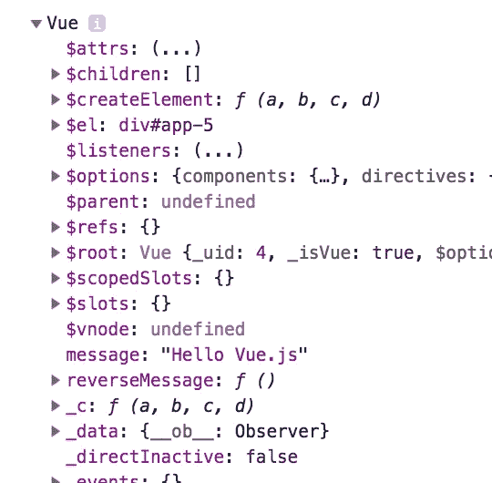
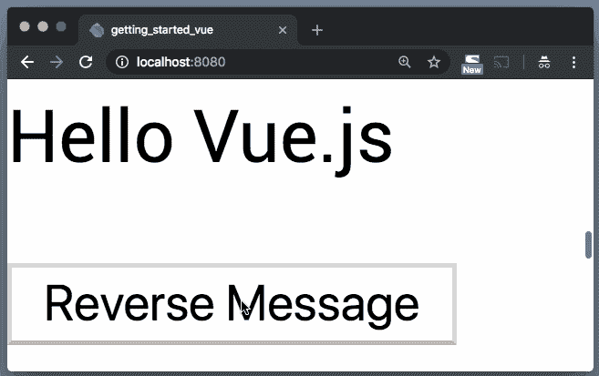

# vue . js–Dart 入门(第 2 部分)

> 原文：<https://itnext.io/vue-js-getting-started-in-dart-part-2-d6e9e14ca31a?source=collection_archive---------1----------------------->

## 了解如何为 Vue.js 框架编写 Dart 代码


在本系列的第 1 部分[中，我们浏览了 Vue.js 指南的几个例子，在*条件和循环*处结束。](/vue-js-getting-started-in-dart-c26c163efafe)

在这一部分中，我们将继续学习处理用户输入的*和用组件*组成的*。*

→ [**在 YouTube 上观看**](https://youtu.be/O1E1TAeRlX8)

# 处理用户输入

为了在我们的 Vue 实例上附加可以调用方法的事件监听器，我们得到了`v-on`指令来帮助我们处理这个问题。

假设我们的`web/index.html`中有这个模板:

```
<div id="**app-5**">
  <p>{{ **message** }}</p>
  <button **v-on:click**="**reverseMessage**">Reverse Message</button>
</div>
```

JS 的对应部分如下所示:

```
var app5 = new Vue({
  el: '#app-5',
  data: {
    message: 'Hello Vue.js!'
  },
  **methods**: {
    **reverseMessage**: function () {
      this.message = this.message.split('').reverse().join('')
    }
  }
});
```

从第 1 部分的解决方案中，我们现在能够创建一个`Vue`实例，并设置`el`和`data`信息。为了让我们能够定义我们的`methods`，我们需要通知我们的实例这个属性。

在`web/app.dart`中，修改`VueOptions`匿名类，如下所示:

```
@JS()
@anonymous
class VueOptions {
  external factory VueOptions({
    String el,
    VueDataOptions data,
    **VueMethodOptions methods, // <-- Add this line**
  });
  external String get el;
  external VueDataOptions get data;
  **external VueMethodOptions get methods; // <-- Add this line**
}
```

接下来，在同一个文件中创建我们的`VueMethodOptions`工厂类:

```
@JS()
@anonymous
class **VueMethodOptions** {
  external factory **VueMethodOptions**({
    Function **reverseMessage**,
  });
  external **Function** get **reverseMessage**;
}
```

`reverseMessage`是点击按钮后调用的方法。

让我们使用到目前为止在`web/main.dart`中的内容来调用我们的方法:

```
Vue(VueOptions(
  el: '#app-5',
  data: VueDataOptions(
    message: 'Hello Vue.js',
  ),
  methods: **VueMethodOptions(**
    **reverseMessage**: **() {**
      print('Hello, World!');
    **}
  )** ));
```

运行本地服务器(`webdev serve --live-reload`)访问`[http://localhost:8080](http://localhost:8080.)` [。](http://localhost:8080.)

单击按钮。你现在应该看到" ***你好，世界！*** "打印到控制台。

那么下面这一点呢？：

```
this.message = this.message.split('').reverse().join('')
```

您会立即发现这种尝试是行不通的，因为`Vue`上下文不在该函数中。为了在 JavaScript 中使用 Dart 函数，我们需要使用内置的`dart:js`库中的`allowInterop`或`allowInteropCaptureThis`包装函数:

```
// In main.dart
import 'dart:js'; **// <-- Import this first**..
..
..Vue(VueOptions(
  el: '#app-5',
  data: VueDataOptions(
    message: 'Hello Vue.js',
  ),
  methods: VueMethodOptions(
    reverseMessage: **allowInteropCaptureThis(**(**gotThis**) {
      window.console.dir(**gotThis**);
    }**)** )));
```

这里，`allowInteropCaptureThis`不仅用于在 JavaScript 中使用 Dart 函数，还用于捕获`this`上下文，并通过函数的第一个参数使其可用。因此，运行该逻辑并单击“反向消息”按钮会将`Vue`实例打印到控制台。



Vue 实例。我们看到了消息属性😉

你会马上发现做`gotThis.message`会给你一个错误。这是因为`gotThis`默认设置为`dynamic`类型，而`dynamic`类型没有`message`属性。

要解决这个问题，我们需要将参数转换为正确的类型:

```
allowInteropCaptureThis((**Vue** gotThis) {...});
```

并将消息属性通知我们的工厂:

```
// In web/app.dart@JS()
class Vue {
  external factory Vue(VueOptions options);
  external void set seen(bool val);
  external List<Todo> get todos;
  external **String** get **message; // <-- Added this line** external **void** set **message(**StringupdatedMessage**); // <-- Added this line**
}
```

返回`web/main.dart`并按照该方法继续操作:

```
allowInteropCaptureThis((**Vue** gotThis) {
  **gotThis.message** = **gotThis.message.split**('')**.reversed.toList**('')**.join**('');
});
```

我们开始吧:



[**观看完整视频**](https://youtu.be/O1E1TAeRlX8) 查看其他示例。

# 结论

我希望这很有见地，你今天学到了一些新东西。

订阅 [**我的 YouTube 频道**](http://bit.ly/2P2N1jC) 了解 Dart 上的最新视频。谢谢！

**喜欢，分享，关注我**😍有关 Dart 的更多内容。

# 进一步阅读

1.  [js 包](https://pub.dartlang.org/packages/js)
2.  [如何在你的 Dart 应用中使用 JavaScript 库](https://dev.to/graphicbeacon/how-to-use-javascript-libraries-in-your-dart-applications--4mc6)
3.  [**全栈 web 开发带 Dart**](http://bit.ly/2P2N1jC)