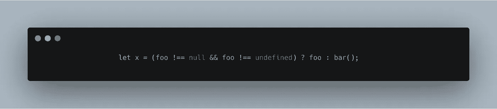
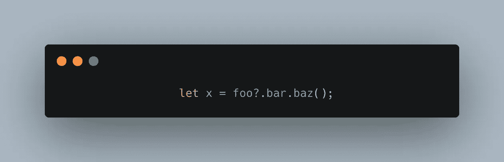
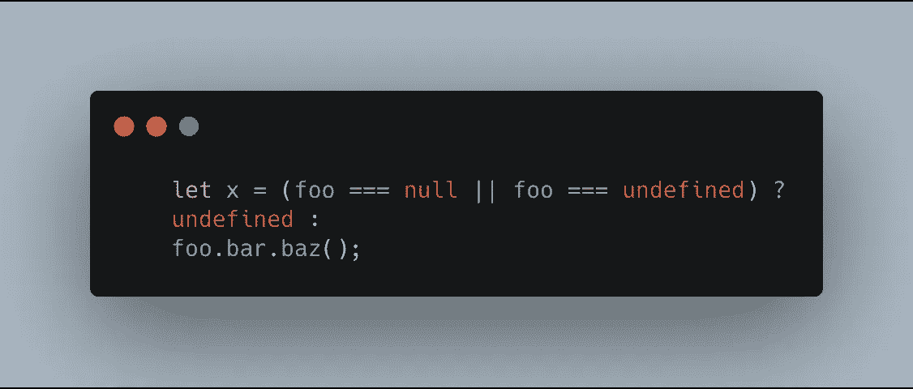
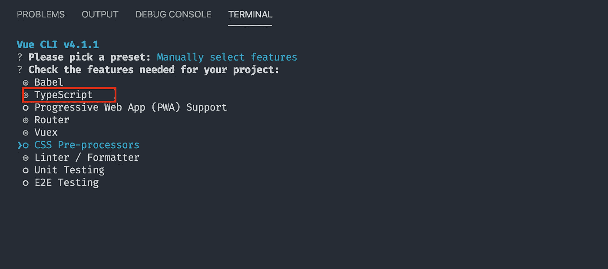
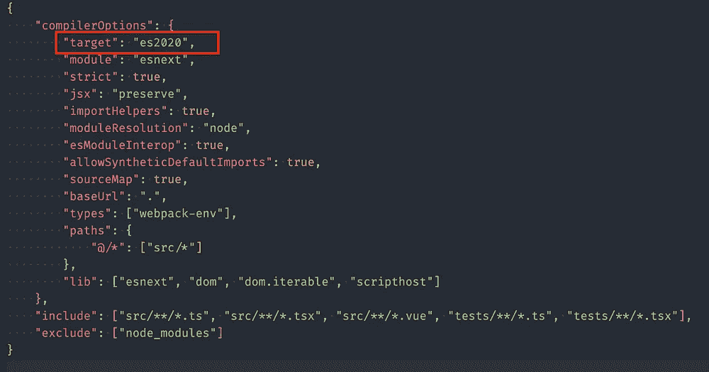
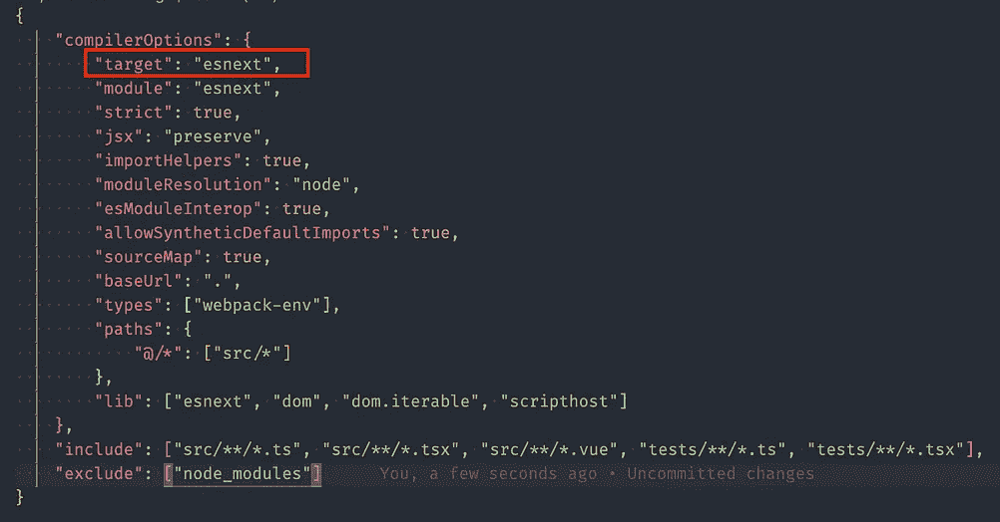
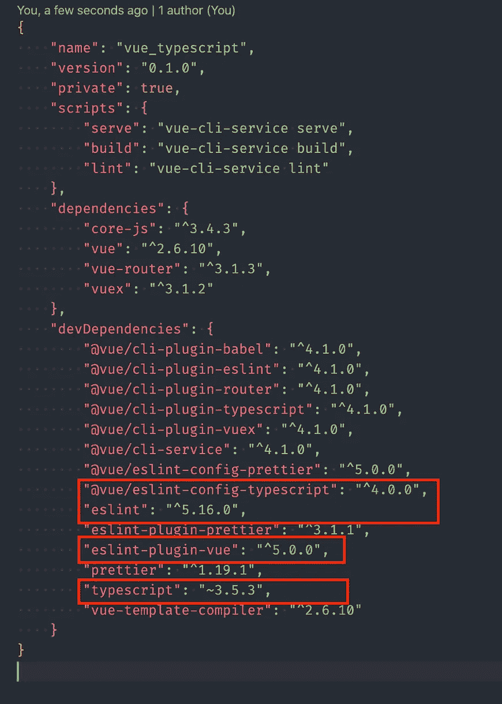
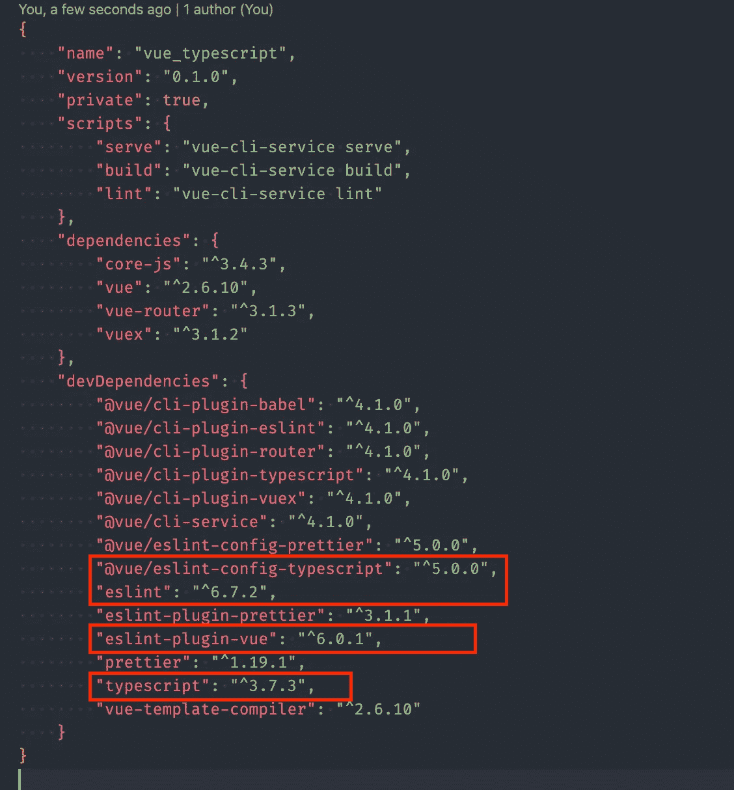
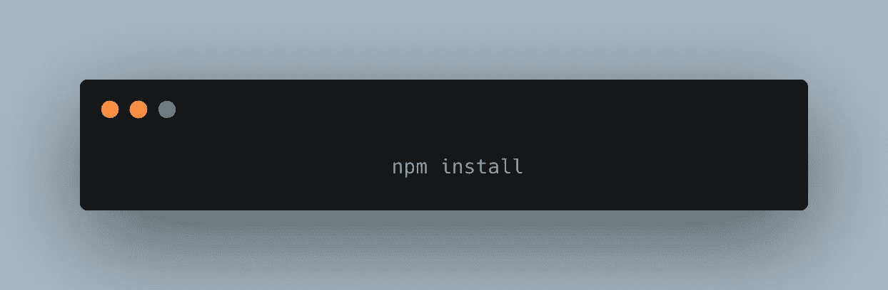
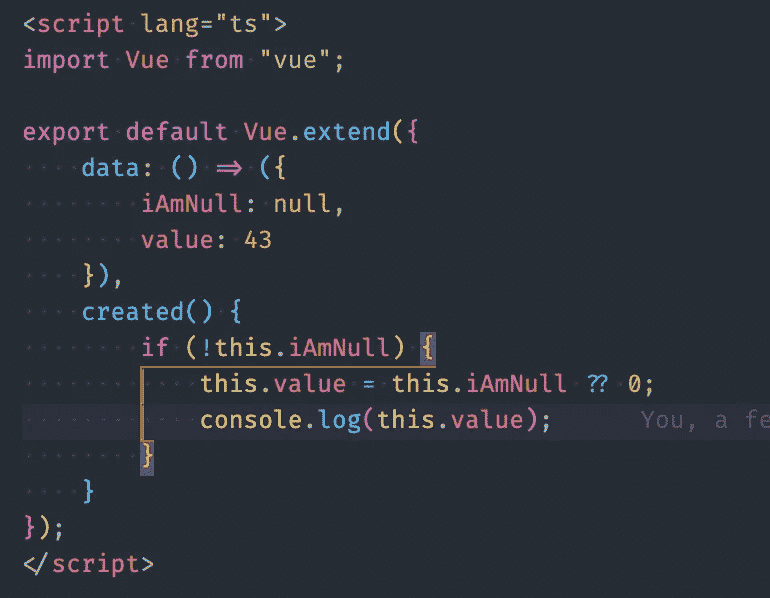

# Vue.js & TypeScript 3.7

> 原文：<https://itnext.io/vue-js-typescript-3-7-29cc5406ca80?source=collection_archive---------5----------------------->


大家好，在这篇文章中，我将向你们展示如何整合 Vuejs 和新发布的 Typescript 3.7。这个版本的 typescript 增加了对几个令人兴奋的新特性的支持，我最喜欢的是:

## **合并**


等等……什么？？；不要担心，这和



合并提高了代码的可读性，减少了代码量。

## 可选链接



这是一种说法，当定义了`foo`时，将计算`foo.bar.baz()`；但是当`foo`是`null`或`undefined`时，停止我们正在做的事情，返回`undefined`。

这与相同



# Vue Js 集成

1.创建新的 vue 项目


2.在提示符下选择 TypeScript



3.在您的 tsconfig.json 中—进行以下更改



4.在 package.json 中—进行以下更改



5.运行下面的命令；让事情运转起来很重要。

```
npx install-peerdeps --dev @vue/eslint-config-typescript
```

6.安装更新



我们完成了，你可以试试了



# 结论

将 Typescript 3.7 与 Vue.js 集成很容易，并且扩展了 typescript/JavaScript 必须提供的令人兴奋的新特性..

你可以在这里阅读新特性[——announcement-typescript-3-7](https://devblogs.microsoft.com/typescript/announcing-typescript-3-7/)

# 如果这有帮助的话:请给我一个掌声，它让我保持动力😀

⥅跟着我上[中型](https://medium.com/@codememory101)。

⥅在推特上关注我。

📢在社交媒体上分享。