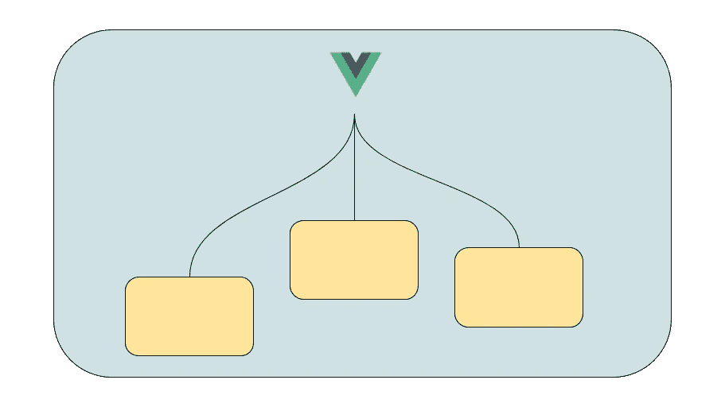

# Vue 页面包装组件

> 原文：<https://itnext.io/vue-page-wrapper-components-8707522c6b3e?source=collection_archive---------5----------------------->



这个问题我以前也遇到过，并不时困扰着我:如何正确配置当前的页面标题，使其以动态方式出现。

有许多架构决策支持这种用例，我将在本帖中详细介绍它们:

1.  路由元属性
2.  vuex 动作+状态
3.  包装组件

# 路由元属性

定义路线时，您可以添加稍后可在组件上访问的属性。

```
const routes = {
  path: '/home',
  meta: {
    title: 'Home page'
  }
}]
```

在您的页面组件上:

```
HomePage.vue<template>
  <div class="container">
   <p class="title">{{$route.meta.title}}</p>
  </div>
</template>
```

这种方法的问题是你必须事先知道标题，并且不允许真正动态的标题改变。假设您有一个用户详细信息页面。您应该能够在页面标题中显示这样的内容:“编辑用户 X”，这是用静态元方式无法做到的。

# Vuex 动作+状态

通过这种选择，组件负责更改商店上的当前标题。这可以在创建/安装时或在某种逻辑之后完成。

```
HomePage.vueexport default {
   created () {
     this.$store.dispatch('setTitle', 'A beautiful title')
   }
}
```

这工作得很好，除了现在每个页面组件都必须绑定到商店，并且“记住”在所有情况下设置页面标题。你甚至必须将你的 ui 模块的一部分专门用于标题、一个动作、一个突变和一个 getter。太多样板文件。

# 包装组件

这是我个人最喜欢的解决方案。您有一个将在每个页面上使用的包装组件，它接收标题作为道具。

```
<page-content :title="reactiveTitle">
... the actual page content
</page-content>
```

页面内容组件将包装并添加标题(您也可以添加其他命名的槽来增强功能):

```
PageContent.vue<template> 
  <h3 class="title"> {{title}} </h3> 
  <slot></slot>
</template><script>
  export default {
    props: {
      title: String
    }
  }
</script>
```

主槽将被替换为页面内容，并确保随着应用程序的增长，您不会重复在多个页面上设置页面标题。