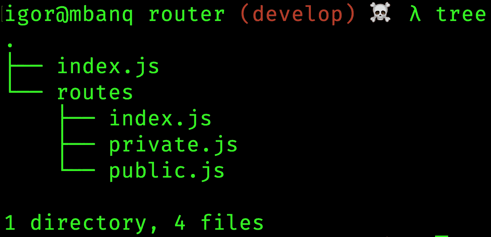

# 使用 Vue 路由器组织您的路线

> 原文：<https://itnext.io/vue-router-99e334094362?source=collection_archive---------0----------------------->

对于如何在单页应用程序中组织路线，每个人都有自己的看法——我们没有什么不同😀。

因为我们在当前的项目中使用了 [Vue.js](https://vuejs.org/) ，所以我们也使用了 [Vue 路由器](https://router.vuejs.org/)。

这里我们想描述一下我们用来组织路由器及其路由的方法。稍后我们可能会改变/改善当前的状态，但现在我将描述现状。

## 文件夹结构

我们就如何组织路线进行了几次迭代，我们肯定会再进行几次迭代，直到我们完全满意为止。



我们目前使用的文件夹结构非常简单:

*   `index.js` -定义路线的`beforeEach`逻辑
*   `/routes/public.js` —拥有所有公共路线(如`/`、`/login`、`/registration`等)。)
*   `/routes/private.js` —拥有认证用户的所有路由
*   `/routes/index.js` -连接所有的`public`和`private`路线并导出它们

让我们快速浏览一下每个文件，您会发现它很快就会变得有意义。

## src/路由器/index.js

`index.js`只持有一条`root`路线(没有也可以走)。在我们的例子中，它是`dashboard`路线，用户一旦通过身份验证就被重定向到该路线。

好的，那么`index.js`最重要的部分就是`beforeEach`检查。

在我们的应用程序中，我们有两种类型的路由:

*   严格来说是那些——你必须退出才能访问它们
*   那些——你必须通过认证才能访问它们

从上面的代码片段中可以看出，我们从本地`[Vuex](https://vuex.vuejs.org/)`存储中读取了身份验证状态。我们需要决定一条路线是否可以被访问的其他信息存储在路线的[元字段](https://router.vuejs.org/guide/advanced/meta.html)中:

*   `onlyLoggedOut` —一条路线只能由未经验证的用户访问
*   `isPublic` -这是一条公共路线，无需认证就可以访问(`/login`、`/registration`等)。)

只有两种情况(开始时我们希望保持简单):

*   `!isPublic && !authenticated` —用户不是`authenticated`，而是试图访问`private`路线——他/她将被重定向到`/login`页面，并在成功认证后被重定向到他试图访问的页面
*   `authenticated && onlyLoggedOut`-用户是`authenticated`，但试图访问`public`页面——他将被重定向回`dashboard`

## src/router/routes/public.js

我们正在考虑分解路线，并把它们放入各自的文件中，但是，嗯，也许以后吧:)。

好了，所有的公共路线都在一个文件中，它们都在同一个`meta`字段中:

```
meta: {
  public: true,
  onlyLoggedOut: true
}
```

src/router/routes/public.js

为了不污染每条路线，我们将在文件的`export`部分的所有路线中添加`meta`字段。这样，我们就不必考虑将`meta`字段添加到每个新添加的路由中。

## src/router/routes/private.js

你现在知道该怎么做了。所有的私有路径都在一个文件中，并且`meta`字段被添加到`export`部分中的每一个路径中。

src/router/routes/private.js

## src/router/routes/index.js

你可能会问`routes/index.js`里面有什么。它只是从`public.js`和`private.js`导入路线并将它们作为一个导出的实用程序文件。

这个文件不是必需的，你可以直接将`public`和`private`路线导入到`src/router/index.js`中

## 下一步是什么

在接下来的几个月里，我们可能会改变并有希望改进我们的路由器设置，我会试着分享我们是如何改变我们的设置以及为什么。现在这个简单的例子可以帮助你开始。