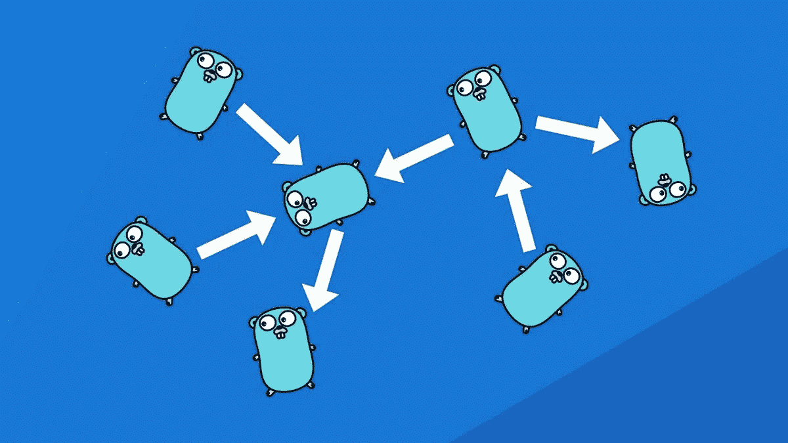

# Vue SSR 和外部依赖性

> 原文：<https://itnext.io/vue-ssr-and-external-dependencies-bce84fbcbe6d?source=collection_archive---------2----------------------->

来源:[引出](https://outcrawl.com/go-dependency-injection)

*2019 年 7 月 8 日更新:您现在可以在 VuePress 文档网站上看到这些原则* [*在起作用*](https://arckinteractive.github.io/noah-ui/extensions/ReCaptcha.html) *。*

如果你和 VuePress 或者 Nuxt 打过交道，你就知道`window`是 SSR 的头号敌人。调试构建错误是痛苦的，因为跟踪都会导致水合逻辑，并且确实很难查明故障的确切点，尤其是如果您正在处理第三方组件。在浪费了几个小时试图让这些组件工作起来并试图让它们对 SSR 友好之后，我开始为依赖于第三方脚本和依赖项的组件寻找一种通用模式。我想我可能已经找到了一个目前为止在 SSR 环境中运行良好的解决方案。让我用两个例子来说明这种方法:一个依赖于远程脚本的组件(ReCaptcha)和一个需要浏览器专用模块的组件(CodeMirror)。

这种模式可以概括如下:

1.  创建一个 Vue 插件，用一个异步加载器扩展原型并注册你的组件。
2.  在组件的`mounted()`钩子中使用异步加载器。

为了更新您的 SSR 知识，`mounted()`钩子只在浏览器中被调用(不像`created()`钩子被调用两次)，所以它是一个加载外部脚本和/或依赖项的安全地方。不利的一面是，在组件对用户可见之前可能会有一点延迟，因此，如果您的组件对用户体验至关重要，您可能希望使用微调器。然而，好的一面是，你不再需要用特定于框架的标签来包装你的组件，比如`ClientOnly`或`no-srr`，或者担心在你的组件在开发中运行良好之后，在产品中会弹出随机错误。

**具有远程依赖关系的组件**

让我们创建一个 reCaptcha 插件:

为了让 reCaptcha 工作，我们需要从 Google 的服务器上加载一个脚本。我个人不喜欢在每次页面加载时加载“令人毛骨悚然”的第三方脚本(我指的是来自谷歌、脸书和其他所有人的脚本，它们带有 cookie 包、潜在的跟踪器和一段 JS 可以在你的页面上做什么的全部功能，其中包括可以捕捉每一次鼠标移动和每一次键盘敲击，包括你输入的密码)，所以把它放到我们的。html 模板或通过配置扩展标题标签不是我的选择。*顺便提一下，我必须承认我觉得很困惑，为什么 HIPAA 和其他隐私保护政策不禁止使用“无害”的第三方工具，如验证码、分析工具等。当 Stripe 和其他人告诉我把他们的脚本放在每个页面上以防止欺诈时，我说不-谢谢，我相信你不会对我的用户做正确的事情。我个人无法审查我放入页面的每一个第三方脚本的每一次迭代，所以我把每一个这样的脚本都视为一个潜在的漏洞才是公平的。*

在上面的插件中，我们用一个返回承诺的加载器扩展了 Vue 原型，它解析为 ready recaptcha 的一个实例，这将使我们更容易在组件中链接我们的逻辑。如果 recaptcha 库已经出现在页面上，我们只需解析 promise。

现在，让我们创建一个 recaptcha 输入:

如您所见，每当我们需要访问 recaptcha 的实例时，我们都将`this.$recaptcha.load()`和`then`称为承诺。

之后，我们只需要注册我们的插件，就可以安全地在我们的组件中使用`vue-recaptcha`模块，而不必担心 SSR。

**具有 npm 依赖关系的组件**

现在，让我们用 CodeMirror 做一些类似的事情，它可以从`npm`加载。

在这个插件中，我们从`codemirror`节点模块加载了一些脚本和样式表。在节点模块的情况下，我们不需要担心重复的导入，就像我们对外部脚本所做的那样。

相应的 Vue 组件如下所示:

这里，我们使用加载器来导入 codemirror 库和我们可能需要的任何其他模式脚本(通过将它们作为参数传递给加载器)。然后，一旦在浏览器中解决了所有依赖关系，就呈现组件。

— — — — — — — — —

我相信这种模式适合于各种涉及对 SSR 不友好的外部依赖的用例。可能还有一些我没有考虑进去的注意事项，如果我发现它们，我一定会报告回来。同时，我期待您的反馈和/或批评。