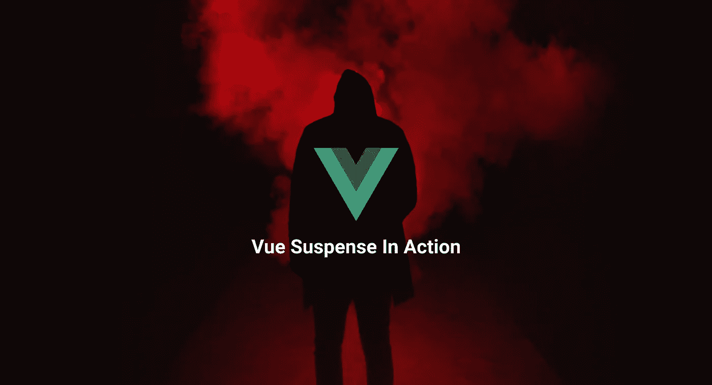

# Vue 暂挂实施在行动

> 原文：<https://itnext.io/vue-suspense-implementation-in-action-3c12cc930e95?source=collection_archive---------0----------------------->

## **在本文中，我们将介绍基于活跃 RFC 和 vue-next 存储库分析的 Vue 3 暂记功能。**



# 悬念是什么？

悬念是一个组件，它呈现一个后备内容，而不是我们的组件，直到满足所需的条件。条件通常是异步操作发生在我们的组件*设置*函数内部。在 Vue 2 中，我们使用了声明性的渲染方法、数据和计算属性。而是在 Vue 3 中使用了 Composition API，它向我们介绍了 setup 方法，该方法允许我们使用 computed()、watchers()或 onMounted()等函数来挂钩不同的组件属性。

# **为什么悬念有用？**

悬念通常用于在等待某种异步组件解决时显示回退内容。在某些情况下，我们希望组件一直等到获取数据(通常是在异步 API 调用中)，我们可以使用组合 API 创建一个异步组件。

这里有一些悬念可以派上用场的用例。

*   在内容到达之前显示加载器。
*   显示占位符内容。
*   处理延迟加载的图像。

在 Vue 2 options API 中，我们有一些指令帮助我们实现相同的功能，例如使用 *v-if、v-show 或 v-else* 来检查我们的数据是否已经加载。随着当前的变化，我们不必担心跟踪我们是否已经收到数据来呈现相应的内容。

**说够了！让我们开始编码…**

在实现 Vue 悬念的示例代码中，我们将对 github 服务器进行 API 调用，并获取我的个人 Github 配置文件的一些个人数据。在这个过程中，我们将向用户展示某种加载动画，以在获取过程中显示一些回退内容。

在我们开始之前，我更喜欢使用 Vue 和 Typescript。因此，让我们在终端中使用下面的命令来准备我们的设置。

`vue create vueSuspense-demo`

使用终端中的上述命令，我们将获得我们项目的所有项目脚手架。让我们继续添加 Vue-下一个版本的 Vue 3。

`vue add vue-next`

使用上面的命令，我们将 Vue 3 alpha 添加到我们的开发依赖项中。现在，让我们将 [axios](https://github.com/axios/axios) 添加到我们的项目中，以发出一些 API 请求。最后我们的 *package.json* 看起来如下:

```
{
  "name": "suspense-demo",
  "version": "0.1.0",
  "private": true,
  "scripts": {
    "serve": "vue-cli-service serve",
    "build": "vue-cli-service build",
    "lint": "vue-cli-service lint"
  },
  "dependencies": {
    "axios": "^0.19.2",
    "core-js": "^3.6.4",
    "vue": "^3.0.0-alpha.4"
  },
  "devDependencies": {
    "@vue/cli-plugin-babel": "^4.2.0",
    "@vue/cli-plugin-eslint": "^4.2.0",
    "@vue/cli-service": "^4.2.0",
    "@vue/compiler-sfc": "^3.0.0-alpha.4",
    "babel-eslint": "^10.0.3",
    "eslint": "^6.7.2",
    "eslint-plugin-vue": "^6.1.2",
    "vue-cli-plugin-vue-next": "^0.0.4",
    "vue-template-compiler": "^2.6.11"
  },
  "eslintConfig": {
    "root": true,
    "env": {
      "node": true
    },
    "extends": [
      "plugin:vue/essential",
      "eslint:recommended"
    ],
    "parserOptions": {
      "parser": "babel-eslint"
    },
    "rules": {}
  },
  "browserslist": [
    "> 1%",
    "last 2 versions"
  ]
}
```

所有初始项目和*包*已经全部设置完毕。在这里的代码中，我们将伪造一个 API 调用，并在一段延迟时间后向用户发送一些关于我自己的信息。我们将制作一个新组件，名称为 *Home.vue* 。在文件内部，我们将在*设置方法*中有一些异步操作，比如从外部来源获取数据，但我们将伪造它。让我们为它创建一个函数。

```
async setup() {
const userInfo = await fetchUser();
return { userInfo };
}
```

我们这里使用的是一个在 Vue composition API 中引入的设置方法。与此同时，我们不会向用户显示组件，而是在获取组件时显示一些指示器。这是我们将悬念得心应手得多的地方。

现在让我们假装一个延迟的 API 调用。我们将把下面这段代码写到我们的文件中。

```
async function fetchUser() {
await timeout(4000);
 return {
 name: "Ishan Manandhar",
 github: "https://github.com/ishan-me",
 twitter: "https://twitter.com/ishan02016",
 dribbble: "https://dribbble.com/ishan-manandhar"
 };
}
```

我们在函数中返回了一个对象，在返回对象时会有一些延迟。我们发送给 *timeout()的参数是 4 秒钟。*让我们也为它制作函数。

```
function timeout(ms) {
return new Promise(resolve => setTimeout(resolve, ms));
}
```

在上面的函数中，我们添加了一个可以解决动作的承诺，ms 作为额外的回调传递给函数。我们将移动到我们的主 *app.js* 文件，在那里我们将使用悬念。我们将把我们的 *Home.vue* 组件包装在*一个悬念*标签*中。*我们还将添加一些回退，直到组件中的异步操作从上述承诺中解决。我们将向用户展示的后备是加载程序。代码现在看起来像这样。

```
<div id="app">
    <h2>Vue 3 with Suspense Demo</h2>
    <div v-if="error">{{error}}</div>
    <div v-else>
        <Suspense>
            <template #default>
                <Home></Home>
            </template>
            <template #fallback>
                <div class="myLoader">
                    <div></div>
                    <div></div>
                    <div></div>
                    <div></div>
                    <div></div>
                    <div></div>
                    <div></div>
                    <div></div>
                </div>
            </template>
        </Suspense>
    </div>
</div>
```

现在有了这些代码，我们就可以用 *Vue 悬念*来伪造我们的 API 调用了。让我们添加一个*error captured*life cycle 钩子，以防我们在 API 调用过程中遇到错误。我们捕获错误，将其传递给 error 属性，并显示 error 而不是我们的回退内容。

```
import { onErrorCaptured, ref } from "vue";setup() {
const error = ref(null);
onErrorCaptured(e => {
 error.value = e;
 return true;
 });
return { error };
},
```

现在我们有代码工作了。悬念对于我们这样的 Vue 开发者来说真的是得心应手。我们不需要有条件地渲染组件，我们可以只使用悬念照顾我们。

而且，我这里有我的工作代码库 [**链接**](https://github.com/ishan-me/vueSuspense-demo) 。你可以找到这篇文章的代码。我希望你喜欢这篇文章，并且你足够舒适地使用 Vue3 的下一个主要版本。

— — — — — — —编码快乐！— — —- — — — —- —