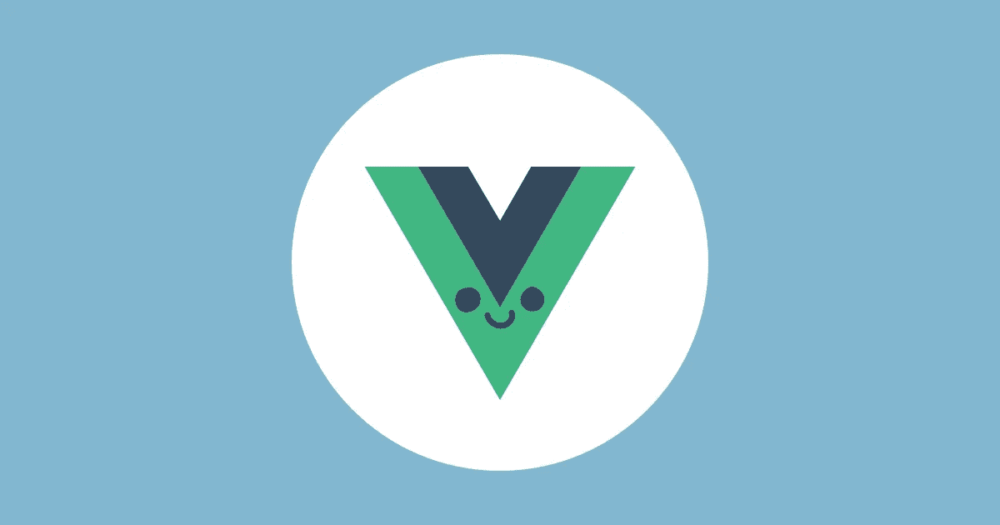
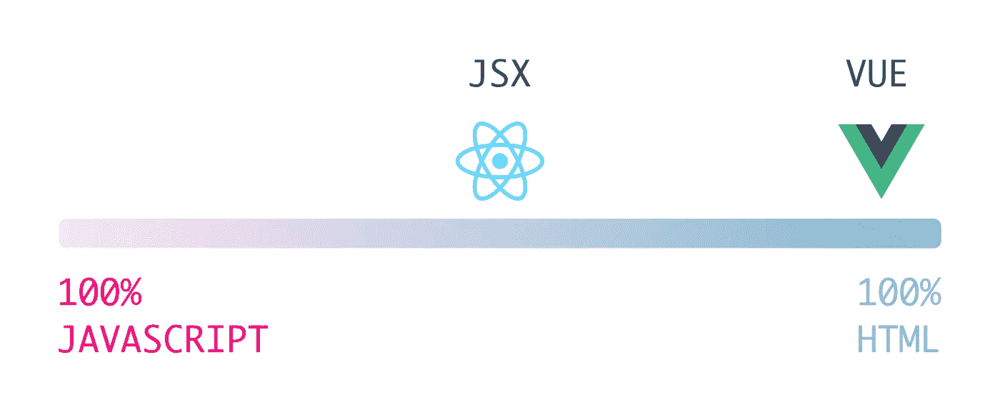

# Vue，威比框架

> 原文：<https://itnext.io/vue-the-webby-framework-ae74265f29ab?source=collection_archive---------3----------------------->

两个 [React 16](https://reactjs.org/) & [Vue 2](https://vuejs.org/) 都是解决相同问题的 Javascript 库:编写与应用程序状态保持同步的组件。

最近使用了这两个工具，以下是我对它们之间主要区别的看法。

我并不试图说服任何人哪一个更好，而是更多地描述我在学习和使用它们时是多么的舒服。
在制作材料时，只要选择你喜欢的工具(如果你有选择的话)。

Vue 感觉更好，反应更快(如果这意味着什么的话)🙃作为一名网络开发人员，我觉得使用 Vue 对我来说更自然。

# 主图书馆

## 建筑注意事项

这两个框架都可以通过将 JS 文件放入您的网页并开始使用它来使用！
那真是太好了！(我是认真的👍)

也就是说，使用一个**编译步骤可以确保你可以使用库提供的一切**(比如 Vue 的[单个文件组件](https://vuejs.org/v2/guide/single-file-components.html)和 React 的 [JSX](https://reactjs.org/docs/introducing-jsx.html)

这些库尽力为开发人员简化事情:

如果他们说有更好的方法来使用他们的框架，你可以信任他们。

两者都提供了一种简单的方法来捆绑您的代码，而不会让人感到头痛:

*   [创建-反应-应用](https://github.com/facebook/create-react-app)进行反应
*   用于 vue 的 [@vue/cli](https://www.npmjs.com/package/@vue/cli)

对他们来说，你只需要在你的电脑上安装 [Node.js](https://nodejs.org/en/) 🤖

如果你想要一个独立且简单的方法来捆绑它们，你可以尝试[包裹](https://parceljs.org/)。我用 Vue 为我的第一个副业项目测试了它，它是一个真正的快速启动工具。

所有这些建筑介绍让我们…

# JSX/Vue 模板

如果你从事网络工作，你可能听说过(或者正在使用)它们。

它们都是编写一种 HTML 的方法，这种 HTML 将被编译成 Javascript。

这是我将如何在 JS/HTML 尺度上表现它们:

编写 Vue 模板不需要成为 javascript 专家

这是用以下代码编写的相同组件:

## React 的 JSX

## Vue 模板

我发现 [JSX](https://reactjs.org/docs/introducing-jsx.html) 更难读和写:

*   [属性](https://reactjs.org/docs/dom-elements.html#classname)不同于它们的 HTML 对应物`class`、[驼峰](https://en.wikipedia.org/wiki/Camel_case)属性等`className`。)
*   在**中没有内置对设置/取消设置类**的支持(我最终使用了[类名](https://www.npmjs.com/package/classnames)模块)
*   没有内建支持**将 HTML 类**从父组件传递到子组件
*   对于有许多零件/插槽要填充的**没有内置的解决方案**(要更好地解释我在说什么，请阅读[Vue 的插槽文档](https://vuejs.org/v2/guide/components-slots.html))
*   **但最重要的是设计模式**:在学习 React 和写 JSX 的时候，我发现自己花了很多时间学习如何写一个干净的条件，什么是[渲染道具](https://reactjs.org/docs/render-props.html#use-render-props-for-cross-cutting-concerns)，你如何[使用](https://hackernoon.com/do-more-with-less-using-render-props-de5bcdfbe74c) [它们](https://levelup.gitconnected.com/understanding-react-render-props-by-example-71f2162fd0f2)，什么是 [HOC](https://reactjs.org/docs/higher-order-components.html#use-hocs-for-cross-cutting-concerns) 以及如何[使用](https://medium.com/@toastui/a-deep-dive-into-the-react-hoc-1-fb431c131866) [它们](https://medium.com/@toastui/a-deep-dive-into-the-react-hoc-2-3e8ed18b848b) …
*   总而言之，能够在模板中使用普通的 javascript 是件好事，但是:
    –写条件很奇怪`{props.bar &&…}`
    –我不喜欢地图函数结尾的样子`))}`
    –…所以，这主要是纯粹的美学考虑🌈

## 和 JSX 在一起

但是如果 JSX 是你要去的地方，Vue 支持它！

## 和哈巴狗在一起

我已经使用[哈巴狗](https://pugjs.org/api/getting-started.html) ( [前玉](https://github.com/pugjs/pug#rename-from-jade))模板引擎很长时间了。我仍然在使用它:我发现了简单的语法(我讨厌写结束标记😤).它让我更快地编写/重构我的标记。

能够使用它与 Vue 是一个非常好的补充！

## 根节点处理

这两个框架都需要一个[单根元素](https://vuejs.org/v2/guide/components.html#A-Single-Root-Element)用于每个组件。

但是 React 允许它*而不是*被渲染，这要感谢 [React。片段](https://reactjs.org/docs/react-api.html#reactfragment)。

这是我在使用 Vue 时错过的一件事…即使它并不那么重要(但我真的喜欢让我的标记尽可能简单🛁)

# 样式组件

因为都是标记，所以您仍然可以创建一个全局 CSS 文件，并将其包含在您的应用程序中。那就行了。

但是将组件样式放在组件标记附近很有意义:

*   无需在`style`文件夹中来回移动
*   您可以更好地了解您的组件样式周长

在反应中有许多解决方案。我不会在这里讨论 CSS-in-JS 的优点或缺点。
我的观点更多:你要选择一件事。

我在我的组件中导入了一个 [SCSS](https://sass-lang.com/) 文件:

Vue 提供了一种从同一个文件使用[加载选项](https://vue-loader.vuejs.org/guide/scoped-css.html#deep-selectors)的方式，并支持[普通 CSS](https://developer.mozilla.org/en-US/docs/Web/CSS) 、[后 CSS](https://postcss.org/) 、[少](http://lesscss.org/)、 [sass/scss](https://sass-lang.com/) 或[手写笔](http://stylus-lang.com/) + [样式范围](https://vue-loader.vuejs.org/en/features/scoped-css.html)。将你的 CSS 写在元素中。

我真的很喜欢这样:我的样式就在我的标记旁边😎
还有[范围内的样式](https://vuejs.org/v2/guide/comparison.html#Component-Scoped-CSS)只要你需要就能开箱即用！✨

# 组件逻辑

这是每个组件的核心。

## 编写组件

在 React 编写中，组件可以采用 [2 形式](https://reactjs.org/docs/components-and-props.html#functional-and-class-components):

*   功能成分
*   类别组件

类组件可以继承自:

*   [做出反应。组件](https://reactjs.org/docs/react-api.html#reactcomponent)
*   [做出反应。纯组件](https://reactjs.org/docs/react-api.html#reactpurecomponent)

这两者之间有细微的差别，但我不会在这里详细说明。

[Vue 组件](https://vuejs.org/v2/guide/components.html)只是带有[许多选项](https://vuejs.org/v2/api/#Options-Data)的 JS 对象

你不需要关心模板中的绑定或`this`, Vue 会为你做的😮
并且它们使得**更新状态就像给状态对象赋值一样简单**😲从那以后我们做的一件事🤤

这看起来像是要写更多的代码，但是我发现读起来更明显:
需要一个计算属性？将此写在组件的`computed`键中

如果你是功能组件[的粉丝](https://vuejs.org/v2/guide/render-function.html#Functional-Components) Vue 支持它们。

## 参考组件

这可能是我在 Vue 唯一觉得奇怪的地方。

在 React 中，引用一个组件只是使用一个普通的 Javascript `import`:

在 Vue JS 中，你必须[在你的应用程序中注册组件](https://vuejs.org/v2/guide/components-registration.html)。

这可以在全球或本地完成。

一开始感觉有点奇怪，但是不必一次又一次地导入 UI 组件可以节省一些时间。

# 构建网络应用

那些库大多是 [MV*](https://en.wikipedia.org/wiki/Model%E2%80%93view%E2%80%93controller) 模式中的**视图部分**。
它们还支持每个组件的状态管理([反应状态](https://reactjs.org/docs/state-and-lifecycle.html) & [vue 数据](https://vuejs.org/v2/guide/instance.html#Data-and-Methods))，这非常方便。
在这种情况下，React 在 [react context](https://reactjs.org/docs/context.html) 的帮助下多了一点。这允许您以优雅的方式跨组件共享数据。

**但是**

老实说，你很快就会需要(至少):

*   **路由器**:用于导航
*   **状态管理器**:在一个真实的来源(应用程序商店)中集中管理应用程序的状态

React 团队不提供这些&不会给你任何关于使用什么的建议。但是有一些流行的选择。
*注意:我并没有对它们的受欢迎程度做任何真正的研究，所以这主要是我的感觉……我猜即使我错了，你也不得不接受它*😐。

相反，Vue 团队提供了一些官方包。
你仍然可以使用其他的软件包，但是在学习的时候，知道你可以从官方的开始是一件好事。

**下面是我列出的满足这些需求的最常见的解决方案:**

*   [反应路由器](https://reacttraining.com/react-router/) / [vue 路由器](https://router.vuejs.org/guide/)
*   [redux](https://redux.js.org/) / [vuex](https://router.vuejs.org/guide/)

# 按指定路线发送

它们都以非常简单的方式工作。

主要的区别在于，如果您的 React 组件之一需要访问路由器，您必须将它们包装在带有路由器函数的[中。](https://reacttraining.com/react-router/web/api/withRouter)

在 Vue 中，路由器将在每个组件中都可用( [this。$路由器](https://router.vuejs.org/api/#router-instance-methods) & & [这个。$route](https://router.vuejs.org/api/#the-route-object) )。那就少了一件需要照顾的事情。

# 应用商店

Redux 是:

*   框架不可知的❤️
*   仅使用[不可变数据](https://www.sitepoint.com/immutability-javascript/)
*   非常专注于它正在做的事情(有点不支持开箱即用的[异步操作](https://redux.js.org/advanced/async-actions)。虽然有可能…只是需要编写比预期更多的代码)

您可以不用安装更多的包就可以使用它，但是我发现使用库来帮助我会更好:

*   react-redux 将使 redux 与 react 配合得更好
*   不可变-js 防止你意外地改变你的状态
*   redux-thunk 以更友好的方式处理异步动作

所以当你开始的时候，有很多东西要学。

相反，Vuex 只是为您处理所有这些事情:

*   已经与 Vue 集成
*   不需要不可变的数据
*   句柄[异步代码](https://vuex.vuejs.org/guide/actions.html)

## 从组件访问存储

在 React 中，可以用[高阶组件](https://reactjs.org/docs/higher-order-components.html)
传递属性，这是 react-redux 与组件共享状态的方式。

我发现自己写了很多这样的东西:

而在 Vue 中，状态总是可以从任何组件访问:

Vuex 还提供了助手函数来以更好的方式编写这些内容(举几个例子，[mapState](https://vuex.vuejs.org/api/#mapstate)&[map mutations](https://vuex.vuejs.org/api/#mapmutations)

这是做同一件事的两种不同方式，但是:

*   我很高兴不再写那些东西了。
*   拥有一种处理异步动作的内置方式，而无需搜索另一个模块(我应该使用 [redux-saga](https://redux-saga.js.org/) 而不是 redux-thunk 吗？).

# 关于文档的注释

React 和 Vue 有很好的文档。

你需要一点时间来学习 React 的文档是如何结构化的，但是一旦你掌握了，就 ok 了。

对于 Vue，我真的不知道如何解释这种感觉，但在某种程度上，我觉得它太完整了🤨。所有选项都分散在带有子类别的类别中。所以大多数时候我只是用搜索栏。
有 [vue cheatsheet](https://vuejs-tips.github.io/cheatsheet/) 可以帮助，但我错过了一个几乎所有东西都被使用的大例子。

# 结论

反应是自由。它们只是提供给你一个最小的东西，完美地实现了它被创造的目的。

您可能需要:

*   学习一些(有用的)概念，比如高阶函数，不可变的，渲染道具…
*   选择一些有助于你制作应用程序的模块
*   学习如何使用它们
*   把它们一起拉紧

Vue 更像是:“哦，你是一个网页开发者，让我们一起写一些 HTML，CSS 和 JS”

*   你觉得熟悉吗
*   编写组件逻辑就是编写一个 javascript 对象
*   该团队提供了一些必备模块
*   这些模块可以快速集成到您的应用程序中
*   …但你仍然可以自由:
    –找到其他模块
    –以你喜欢的方式编码

再说一次，这不是关于评价那些图书馆。它们都是由技艺高超的人们精心制作的，并且出色地完成了同样的使命。

但是作为一名 web 开发人员，我喜欢 webby 的东西……对我来说，Vue 感觉更像 webby，而不是编码模式和代码哲学。

*原发表于*[*hiswe . github . io*](https://hiswe.github.io/2018/10-vue-the-webby-framework/)*。*