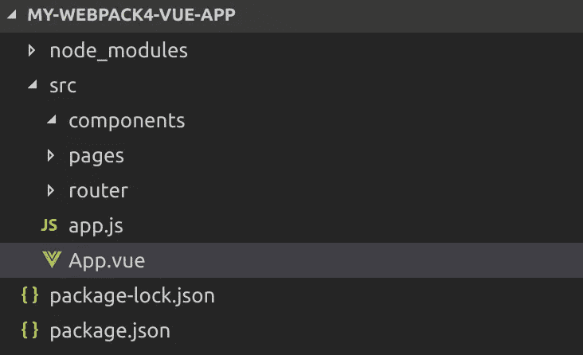
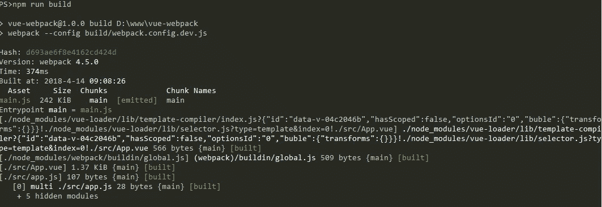

# Vue.js 和 Webpack 4 从头开始，第 1 部分

> 原文：<https://itnext.io/vuejs-and-webpack-4-from-scratch-part-1-94c9c28a534a?source=collection_archive---------0----------------------->


# 第 1 部分:启动和运行

我之前的[文章](http://medium.com/@petrefax66/getting-started-vue-js-and-visual-studio-code-6990f92e918a)描述了如何使用命令行界面创建 Vue.js 应用程序。这是最简单的入门方式，将适合大多数需求。然而，尝试走相反的路，完全从零开始构建一个应用程序，当然没有坏处。随着 [Webpack 4](https://medium.com/webpack/webpack-4-released-today-6cdb994702d4) 的发布，现在是一个很好的时机来走这条雄心勃勃的路线，并通过完全手工制作来学习更多关于构建和捆绑过程的工作原理。

在本文中，我将从一个空文件夹开始，为一个 Vue.js 应用程序创建一个 webpack 构建，包括:

*   使用 webpack-dev-server 加载热模块
*   使用 eslint 的林挺
*   用手写笔进行 CSS 预处理
*   使用@vue/test-utils 和 Jest 进行测试

唯一的先决条件是安装 node 和 npm，尽管我将使用 VSCode 作为我的编辑器。

本文的最终代码可以在 [github](https://github.com/dfcook/vue-webpack4-template) 上找到，作为参考，官方的 webpack 模板无疑将很快更新到 Webpack 4。

由于这是一个相当长的过程，我将把这篇文章分成几个部分，第一部分将把我们从一个空文件夹带到一个包含与 webpack 捆绑在一起的 Vue 组件的简单页面，并在浏览器窗口中打开。

第 2 部分将介绍使用 babel 的热模块重装、造型和传输。

[最后部分](https://medium.com/@petrefax66/vue-js-and-webpack-4-from-scratch-part-3-3f68d2a3c127)涵盖林挺、测试、静态资产和 CSS 提取。

首先要做的是创建一个新的文件夹，光盘到它和初始化 NPM:

`npm init`

您将被要求提供一些关于项目的信息，在这个阶段接受缺省值是安全的，一旦完成，您将得到一个 package.json 文件，其中除了元信息之外没有任何内容。现在我们可以开始添加我们的包了。

`npm install --save vue vue-router`

这将安装我们的应用程序依赖项。

`npm install --save-dev webpack webpack-cli`

这将安装 webpack，使我们能够开始构建我们的应用程序包。

## 应用程序结构

我喜欢把所有的应用程序代码，我们的 javascript 和 vue 组件放在一个名为 src 的子文件夹中。在这里我将补充:

1.  app.js:应用入口点。
2.  App.vue:根组件
3.  pages:包含所有顶级组件的文件夹，每个组件都有一个与之关联的路由条目。
4.  组件:包含构建块组件的文件夹。组件将根据功能组织到子文件夹中。
5.  路由器:所有 vue 路由器配置的文件夹。

如果我使用 vuex，我会创建另一个名为 store 的文件夹来保存我们所有的动作/突变等。

当我创建这些时，文件夹结构应该是这样的:



我们将从最简单的入口点开始我们的 app.js:

```
import Vue from 'vue'
import App from './App.vue'new Vue({
  el: '#app',
  render: h => h(App)
})
```

这将引入我们的 app 组件，并将其呈现到 id 为“App”的 DOM 元素中。我们的应用程序组件目前同样简单:

```
<template>
  <div>
    <h1>Hello World!</h1>
  </div>
</template>
```

现在我们有了一些 Vue 代码，我们需要使用 Webpack 捆绑它，这样它就可以被拉入我们的 html。

## 网络包

Webpack 是 Javascript 应用程序的模块捆绑器，当我们运行 webpack 命令时，我们要求它从我们的入口点开始，然后构建整个应用程序的依赖关系图，将这些依赖关系拉进一个或多个可以包含在我们的应用程序中的捆绑包。它通过**加载器**支持多种不同的文件类型，加载器将获取没有模块概念的文件(例如 css)并以允许它们参与 webpack 正在构建的整体依赖图的方式处理它们。

Webpack 4 刚刚发布，具有大量新功能，包括:

1.  优化 API 的内置分块支持。
2.  支持 5 种不同的模块类型，包括 Web 组装模块。
3.  一个“模式”配置设置，它应用了一组合理的缺省值，简单的项目可以仅仅依靠它来决定如何构建你的应用程序。
4.  零配置设置(#0CJS)。如果您提供了模式，那么 Webpack 将使用默认的输入和输出设置来构建您的应用程序，而不需要配置文件。

所有这些加上更小的包大小和更快的构建时间！

让我们尝试一个简单的 webpack 构建。

在我们项目的根目录下，创建一个名为 build 的文件夹，并添加一个名为 webpack.config.dev.js 的文件。

```
'use strict'const { VueLoaderPlugin } = require('vue-loader')module.exports = {
  mode: 'development',
  entry: [
    './src/app.js'
  ],
  module: {
    rules: [
      {
        test: /\.vue$/,
        use: 'vue-loader'
      }
    ]
  },
  plugins: [
    new VueLoaderPlugin()
  ]
}
```

模块部分将包含我们所有的加载器，每个加载器声明至少包含两个属性，test 和 loader。Test 是一个正则表达式，webpack 将使用它来标识该加载程序要处理的文件类型，loader 是加载程序本身的名称。

为此，我们需要安装更多的依赖项:

```
npm install --save-dev vue-loader vue-template-compiler vue-style-loader css-loader
```

并添加 npm 构建脚本:

```
"build": "webpack --config build/webpack.config.dev.js"
```

我们还需要添加一个 index.html 文件来拉入我们构建的包，将它放在项目的根目录下:

```
<!DOCTYPE html>
<html>
  <head>
    <meta charset="utf-8">
    <meta name="viewport" content="width=device-width,initial-scale=1.0">
    <title>My Vue app with webpack 4</title>
  </head>
  <body>
    <div id="app"></div>
    <script src="dist/main.js" type="text/javascript"></script>
  </body>
</html>
```

如果您现在运行构建脚本，您应该会看到类似这样的内容:



如果您在浏览器中打开 index.html，您应该会看到:


顺便说一下，VSCode 有一个扩展“Live Server”，它允许你右击 html 文件并在一个随需应变的 web 服务器中启动它们，而不是从你的文件系统中打开它们。最终，我们将使用带有热模块重载的 webpack-dev-server 来服务我们的应用程序，但目前这只是一个很好的权宜之计。

## 下一步

在文章的下一部分，我将创建一个带有一些脚本的组件来演示 babel 编译并为我们的 css 配置手写笔。我们将安装 webpack-dev-server 并配置热模块重载，包括对静态资产的支持。为了完成应用程序，我们将创建一个生产版本，包括拆分供应商模块，并展示如何使用@vue/test-utils 和 jest 测试我们的应用程序。