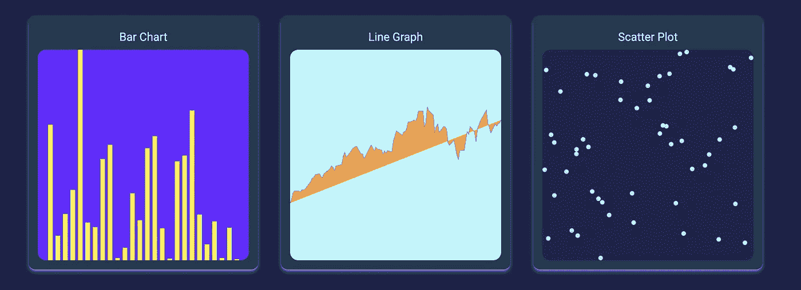
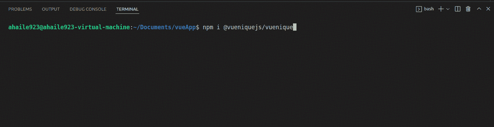

# 武尼克

> 原文：<https://itnext.io/vuenique-a9e6e2031e84?source=collection_archive---------1----------------------->

## 一个低级可视化组件库，允许开发人员创建可定制的图表

[vuenique.net](https://vuenique.net)

尽管有大量的模板库可用于在 Vue 中构建图表，但 Vue 社区缺乏用于该框架的强大、低级的可视化组件库(如用于 React 用户的 visx)。这阻碍了开发人员为他们的应用程序创建高度定制的可视化的能力。

D3 为数据可视化提供了令人难以置信的工具，但有一个重要的学习曲线，并且依赖于 DOM 操作，这与 Vue 自己的虚拟 DOM 相冲突。

为了在扩展 D3 功能的同时为定制可视化提供更多选择，我们的团队创建了 [*Vuenique*](https://vuenique.net) :一个易于使用的库，以低级组件的形式为开发人员提供强大的构建模块，能够制作高度定制的图表。

## 为什么是 Vuenique？

我们决定承担开发这个可视化库的任务是受来自 Vue 社区的开发人员自己的需求的影响，他们正在寻找一个类似 React 的 visx 的工具。受 visx 的启发，Vuenique 为数据可视化提供了最原始的可重用组件，将 D3 的功能集成到 Vue.js 框架中。除了找到要使用的正确图表类型之外，用户还能够使用低级组件(如比例尺、形状、图例等)构建定制的新图表或图形。这进一步使处理数据可视化的经验丰富的工程师拥有更大的灵活性和控制力来操纵数据的显示方式。

## 核心特性:

Vuenique 内置了围绕 D3 库工作的函数和组件，为用户提供了 D3 的强大功能，同时免去了直接与 D3 交互的过程。这避免了同时使用 Vue 和 D3 的 DOM 重复，并使用户能够编写更加模块化的代码。

利用向用户提供低级原始图表片段的概念，用户能够对如何构建他们的图表具有更少的限制但更多的选项和灵活性。

对于 Vue 开发者来说，利用 Vuenique 的工具来构建他们的可视化并不需要对 D3 的经验和熟悉。

## 我如何使用 Vuenique？

要使用我们的组件库，只需通过运行命令“npm i @vueniquejs/vuenique”来安装 Vuenique 包

然后，只需导入您想要的特定图表组件。例如:“从' @vueniquejs/vuenique '导入{ Bar，Group }”

导入图表库后，浏览您的数据，并利用我们内置的缩放功能对您各自的数据进行缩放。

最后，将您想要的任何特定样式和/或属性传递到您各自的图中以进行反映。具体请参考[文档](https://github.com/oslabs-beta/Vuenique#Documentation)。

## Vuenique 的下一步是什么？

在不久的将来要探索的特性包括添加轴和网格来提供标准的图表显示格式。此后，我们想到了其他高效用图表类型，包括饼图、树和树状图以及箱线图。除此之外，我们希望与您和其他热情的 Vue 开发人员联系，看看什么图形是最需要的，这样我们就可以为您提供构建这些图表的原始组件！

## 想投稿？

我们欢迎并鼓励任何人通过 GitHub 或 LinkedIn 做出贡献；我们期待听到您的建议和想法！

*供稿人:*

亚历克斯·科林| [领英](https://www.linkedin.com/in/alex-corlin-4b97a2235/) | [GitHub](https://github.com/acorlin6)

亚历克斯·海尔|[LinkedIn](https://www.linkedin.com/in/alexander-haile-768580b3/)|[GitHub](https://github.com/ahaile923)

James Ma |[LinkedIn](https://www.linkedin.com/in/james-ma-436668223/)|[GitHub](https://github.com/jamesma1)

曾| [领英](https://www.linkedin.com/in/miaowen-zeng/) | [GitHub](https://github.com/MiaowZ)

特雷弗·格雷|[LinkedIn](https://www.linkedin.com/in/trev-gray/)|[GitHub](https://github.com/tmg2549)