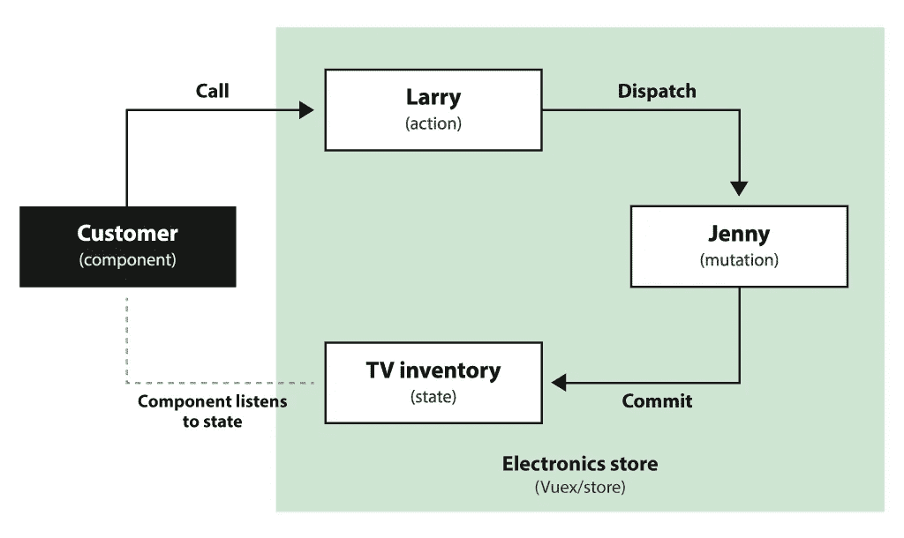
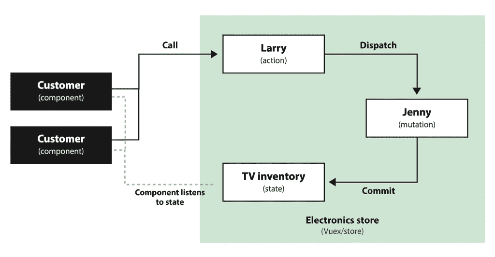

# Vuex 变得简单—开始使用！

> 原文：<https://itnext.io/vuex-made-simple-getting-started-6bf229d432cf?source=collection_archive---------0----------------------->


本教程的目标是通过创建一个相关的例子，让你对使用 Vuex 的状态管理有一个基本的了解。到本文结束时，我希望您对使用 Vuex 的状态管理有更好的理解！

# 状态管理术语

简而言之:你的*状态*存储在一个叫做*的对象中。*要修改状态，您可以使用*动作*和*突变*，它们也存储在存储器中。

## 状态

*状态*是存储在应用程序中的数据。您的组件可以“接收”这些数据，当它发生变化时，您的组件将会自我更新。这是你的应用程序中“唯一的真实来源”。

## 商店

*存储*管理状态。它应该只是从内的*变异而来，所以外部组件不能直接修改状态。为了改变状态，组件可以分派一个动作或者提交一个改变。*

## 吸气剂

*Getters* 根据存储状态计算属性。您可以在您的操作中或者直接在您的组件中使用它们。如果几个组件需要基于商店数据计算相同的事情，这是很有用的，您可以在一个地方完成，而不必为每个组件单独完成。

## 行动

*一个动作*包含*业务逻辑*，它不关心直接更新状态。原因是动作是**异步的**(即使动作还没有完成，你的代码也可以继续运行)，这在你需要等待从 API 接收数据时很有用。一个动作将分派一个突变，该突变将直接更新状态。

## 突变

要更新状态，你需要*提交一个突变*。变异不关心业务逻辑，它的唯一目的是更新状态。一个变异是**同步**(你的代码必须等到变异完成)。突变应该是用来更新状态的唯一方式，以保持状态管理的可预测性。

# 让我们从例子开始吧！

让我们来看看“李氏电子商店”。拉里(动作)在电视部工作。他监督珍妮(突变)，她的唯一工作是从库存(国家)中挑选电视。

举个例子:目前有 10 台电视库存。一位客户(组件)来到商店购买一台新电视。她与拉里(动作)交谈，拉里让珍妮(变异)从架子上拿一台电视。走进来的顾客现在可以看到只剩下 9 台电视了(国家)。



使用动作和突变简单概述我们的(电子)商店

就像真实的商店一样，我们可以有多个客户查看电视库存，也可以有多个客户打电话给 Larry。

例如，另一个客户(另一个组件)购买了 9 台电视，Larry 要求 Jenny(变异)将这些电视从库存货架上移除。其他看电视的顾客现在注意到没有电视了，所以他们等到电视库存重新进货的通知。



监听相同状态的两个组件的简单概述

## 好吧，但是为什么这很重要？

为了确保商店顺利运营，我们必须有一个结构化的购买流程。如果顾客开始进来，把电视从货架上拿走，就会变得混乱。Jenny 可以直接访问和更新电视(同步)，而 Larry 可能需要在询问 Jenny 之前找到更多关于电视的信息(异步)。

对于您的应用程序来说也是如此。您可能希望有一个清晰的结构来修改数据，这样就不会出现任何意外。拥有动作和突变是很重要的，因为有时你需要在接收数据之前等待(例如当调用一个 API 时),并且你不希望所有的事情都等待执行，直到这个动作完成。

# 让我们建立我们的商店！

现在，希望你已经理解了商店的基本原理，是时候开始使用它了。我们将坚持我们的例子，用 Vuex 构建一个简单的“李氏电子商店”的表示。我假设你已经知道如何创建一个 Vue 项目，并且有一些关于 Vue 的基本知识，所以我将从使用一个用 [Vue CLI](https://cli.vuejs.org/) 创建的空模板开始。

让我们从安装 Vuex 开始:`yarn add vuex`

在`src/store`中创建一个名为`store`的新文件夹，并在这个文件夹中创建一个名为`store.js`的新文件。在这个文件中，我们将建立我们商店的基础:

现在我们有了一个基本的 Vuex 商店，其中有一个状态，即电视的总数。为了完成这项工作，我们需要修改`main.js`，将我们的商店导入 Vue。

现在我们的存储应该可以工作了，我们可以从它那里“接收”状态了！有两种方法可以做到这一点。如果你只接收一个状态，最简单的方法是使用一个[计算属性](https://vuejs.org/v2/guide/computed.html)。如果您想要接收多个状态，最简单的方法是使用一个[对象扩展操作符](https://vuex.vuejs.org/guide/state.html#object-spread-operator)，它看起来像这样:

```
computed: {
  ...mapState(['someState', 'anotherState']),
}
```

要查看我们的商店是否工作，请创建一个名为`Customer`的新组件(不要忘记在主应用程序组件中导入该组件):

现在，顾客可以看到我们商场还剩多少台电视！然而，他真的拿他们没办法。我们需要创建动作(Larry)和突变(Jenny)来从商店中移除电视。让我们将它们添加到我们的商店:

既然 Larry 和 Jenny 已经到达商店，我们可以修改顾客，让他购买电视:

他可以查看是否还有电视可以购买，如果没有，我们将禁用该按钮，他将无法购买任何电视。

## 添加额外负载

现在，我们的客户一次只能购买一台电视，但也许他刚刚搬家，想为他的新房子购买两台电视。幸运的是，我们可以将额外的负载作为第二个参数传递。让我们调整一下我们的商场，让搬走的电视数量更加灵活。

我们现在可以设置想要购买的电视数量了！如果我们有多个组件的客户收到相同的状态，那么每当有人购买电视时，它们都会被更新！

## 创建一个 getter

拉里和珍妮并不总是心情愉快。如果他们不满意，我们的顾客就不想买电视。让我们创建一个 getter 来看看 Larry 和 Jenny 是否都开心:

现在我们可以在客户中使用 getter 作为计算属性，看看员工是否满意。我们可以在多个组件中重用这个 getter，而不必在每个组件中都进行这样的计算！

注意:如果你不在多个组件中做同样的计算，一般来说你不应该做一个 getter，而是直接计算你的组件。

## 使用对象扩展运算符

我们的客户现在可以从商店接收信息并采取行动，但是代码有点长。我们可以使用*对象扩展操作符*来改善这一点。这允许我们映射状态、突变和动作，并使用`this`更容易地访问它们。让我们从 vuex 导入它们，并使我们的代码更短一些:

好多了！我们的代码要短得多，也更容易理解。现在，在未来，我们可以很容易地映射更多的状态/动作/突变，只需更新我们用作参数的数组。

# 是时候做些酷的东西了！

我们可以用 Vuex 做更多的事情，但是我希望这篇教程能让你对 Vuex 的状态管理有一个基本的了解！现在该由你去用它建造一些酷的东西了。