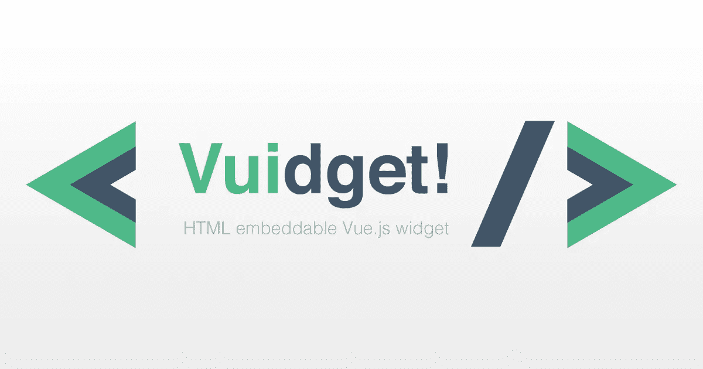

# vuidget——如何用 vue-custom-element 创建一个可嵌入的 Vue.js 小部件

> 原文：<https://itnext.io/vuidget-how-to-create-an-embeddable-vue-js-widget-with-vue-custom-element-674bdcb96b97?source=collection_archive---------0----------------------->



不久前，我的工作单位要求我为游客创建一个 Vue.js 应用程序。对应用程序的要求是，它应该可以作为一个小部件嵌入到任何地方——只使用**一个 app.js** 和**一个 app.css 文件**——这就是我如何通过 karol-f 找到 [vue-custom-element](https://github.com/karol-f/vue-custom-element) ，这允许我们将 Vue.js 应用程序呈现为像`<my-app></my-app>`一样的 HTML 定制元素。

我以前从未做过这样的事情，我有一条充满谷歌搜索的路要走——我将指导你完成这个过程，所以你不必这样做。

-注意:我们将使用 Vue CLI 3

# 1.将您的应用程序优化为 HTML 自定义元素

这就是 [vue-custom-element](https://github.com/karol-f/vue-custom-element) 的用途。它是 Vue.js 应用程序的包装器，允许您通过自定义 HTML 元素在源代码中调用它。

假设您在`main.js`中初始化您的应用程序，如下所示:

`src/main.js`

```
import Vue from 'vue'
import App from './App.vue'
import router from './router'
import store from './store/index'new Vue({
 router,
 store,
 render: h => h(App)
}).$mount(‘#app’)
```

使用 vue-custom-element 几乎是一样的

`npm install vue-custom-element --save`

`src/main.js`

```
import Vue from 'vue'
import App from './App.vue'
import router from './router'
import store from './store/index'import vueCustomElement from 'vue-custom-element'Vue.use(vueCustomElement)App.store = store
App.router = router
Vue.customElement('vue-widget', App)
```

注意，我们不再使用`new Vue()`了。调用`Vue.customElement()`为我们完成了这项工作——我们在第一个参数中提供了小部件名称(HTML 中的`<vue-widget></vue-widget>`),在第二个参数中提供了我们的应用程序组件。警告:使用不带破折号的名字对我不起作用。

你以前想包含在`new Vue()`中的任何东西，现在都应该作为一个属性包含在`App` 中，在所有设置完成后调用`Vue.customElement()`。

# 2.改变你的 index.html

`public/index.html`

我们应该移除我们的`<div id="app"></div>`并用新的`<vue-widget></vue-widget>`替换它。用您的应用程序重新加载浏览器选项卡。如果一切都像以前一样工作，您就可以构建了！

**小心:当心老(更)浏览器。您可能需要自定义聚合填充，以便 HTML 自定义元素能够工作。只需下载它并将其导入到 main.js 文件中。**

`npm install document-register-element --save`

`src/main.js`

```
import 'document-register-element/build/document-register-element'
```

# 3.运行构建

`npm run build`

建筑给你你想要的来源——压缩的、整洁的、体积小的。但是如果你正在开发一个更大的应用程序，你可能会体验到有**几十个。您的 dist (build)文件夹中的 js 块文件**。这不是我们想要的！**我们想要一个单独的 app.js 文件**，可以导入到其他站点，而不是 41 个 1-3kb 的文件。js 文件..

# 4.禁用区块

你可以用 **Vue CLI 3** 做一些魔术。您也可以使用较旧的 CLI 来实现这一点，但是它的实现方式不会在本文中展示。

在应用程序的根目录下创建一个`vue.config.js`文件(在`package.json`旁边)。这是在 Vue CLI 3 中编写 webpack 配置的地方。

我们需要安装 webpack 来使用它的 *LimitChunkCountPlugin* 。我们还需要传递配置来删除分割块。

`npm install webpack --save`

```
const webpack = require('webpack')module.exports = {
  configureWebpack: {
    plugins: [
      new webpack.optimize.LimitChunkCountPlugin({
        maxChunks: 1
      })
    ]
  },
  chainWebpack:
    config => {
      config.optimization.delete('splitChunks')
    }
}
```

编辑 2019 年 3 月 30 日—请随意将`filenameHashing: false`添加到配置中，作为评论中提到的[马克西姆·马尼洛夫](https://medium.com/u/846c233c9aa5?source=post_page-----674bdcb96b97--------------------------------)。

# 5.运行构建..又来了？

`npm run build`

如果我们做的一切都正确，现在的构建应该会好得多，只有一个 app.js 和一个 app.css 文件。耶！

但是等等。如果我们使用字体或图像，它们包含在构建文件夹(`/dist`)中，并绑定在样式和脚本文件中。我们不希望在想要嵌入小部件的页面中导入所有这些资产——我们也没有必要这样做！

# 6.主持它。htaccess it

当然，您的应用程序需要一个托管域。这个域必须包括**你的整个编译源代码**—`/dist`文件夹中的所有内容。假设我拥有一个域名`[https://vuidget-source.danajanoskova.sk/](https://vuidget-source.danajanoskova.sk/)`和一个虚拟主机。我已经创建了一个 Vue.js 嵌入式小部件，我已经构建了源代码，现在，我将把`/dist`文件夹的内容上传到我的域中。所有需要的资产都在那里，我需要做的就是将我的 app.js 和 app.css 文件包含在我想要显示小部件的站点中。

```
<link href="https://vuidget-source.danajanoskova.sk/css/app.css" rel="stylesheet"/> 

<vue-widget title="Vuidget live example"></vue-widget> 

<script src="http://vuidget-source.danajanoskova.sk/js/app.js"></script>
```

然而，app.js 和 app.css 文件正在寻找我们已经上传到我们的主机域(`[https://vuidget-source.danajanoskova.sk/](https://vuidget-source.danajanoskova.sk/))`)的图像或字体等资产。这就是为什么我们必须让外部资源可以访问它们。我通过在我的域文件夹的根目录下添加一个`.htaccess`文件来解决这个问题，紧挨着我的`index.html`文件，其内容如下:

```
Header add Access-Control-Allow-Origin "*"
```

现在，我的 *vuidget-source* 站点已经运行良好，托管了 app.js 和 app.css 文件，所有资源可供其他站点使用。

# 7.嵌入它

恭喜，你已经走到这一步了。你现在需要做的就是使用你已经创建的文件。假设我有另一个域— `[https://vuidget.danajanoskova.sk/](https://vuidget.danajanoskova.sk/)`，这个站点是我想嵌入小部件的地方。我需要做的就是在根目录下写一个内容如下的`index.html`文件

```
<!doctype html>
<html><head>
 <!-- widget source css -->
 <link href="[https://vuidget-source.danajanoskova.sk/css/app.css](http://vuidget-source.danajanoskova.sk/css/app.css)" rel="stylesheet">
</head><body>
 <vue-widget title="Vuidget live example"></vue-widget> <!-- widget source js -->
 <script src="[https://vuidget-source.danajanoskova.sk/js/app.js](http://vuidget-source.danajanoskova.sk/js/app.js)"></script>
</body></html>
```

而且很管用！

请随意查看我在 GitHub
[【https://github.com/DJanoskova/Vuidget](https://github.com/DJanoskova/Vuidget)
的小部件源代码，在那里您可以找到所有的构建 webpack 设置和我的简单演示 ToDo 小部件的源代码。如果您分叉存储库，应用程序应该已经准备好让您尝试编辑和使用它，已经使用 vue-custom-element。

如果一切正常，并且你对你的 Vue.js 小部件满意，别忘了顺便访问 [vue-custom-element](https://github.com/karol-f/vue-custom-element) 并给它一颗星。