# XML 文件处理中的漏洞:XXE 在 C#应用中的理论和实践

> 原文：<https://itnext.io/vulnerabilities-due-to-xml-files-processing-xxe-in-c-applications-in-theory-and-in-practice-f94912216093?source=collection_archive---------1----------------------->

简单的 XML 文件处理是如何变成安全弱点的？部署在您机器上的博客如何会导致数据泄漏？今天我们将找到这些问题的答案，了解 XXE 是什么以及它看起来是什么样子。


在我们开始之前，请注意有几种与 XML 处理相关的漏洞。最常见的漏洞是 XXE、XEE 和 XPath 注入。在这篇文章中，我们考察了 XXE。如果你对 XEE 攻击的本质感兴趣，你可以阅读这篇文章:“[Visual Studio 2022 如何耗尽 100 GB 内存，以及 XML 炸弹与此有什么关系](https://pvs-studio.com/en/blog/posts/csharp/0865/)”。稍后我们将讨论 XPath 注入。:)

# 什么是 XXE？

XXE (XML 外部实体)是应用程序的安全弱点。此攻击的可能来源是由不安全配置的 XML 解析器处理的受损数据。这种攻击可导致目标机器数据泄露或服务器端请求伪造(SSRF)。

XML 文件可能包含文档类型定义( [DTD](https://en.wikipedia.org/wiki/Document_type_definition) ，它描述了 XML 文件的结构。DTD 允许我们定义和使用 XML 实体。

它可能看起来像这样:

```
<?xml version="1.0" encoding="utf-8" ?>
<!DOCTYPE order [
  <!ENTITY myEntity "lol">
]>
<order>&myEntity;</order>
```

在这个 XML 中，我们声明 *myEntity* 并进一步使用它—*&my entity；*。在这种情况下，实体是内部的，并被定义为文字。如果一个 XML 解析器扩展了这个实体，它会替换掉*&my entity；*带实际值— *lol* 。此外，一些内部实体可以通过其他实体扩展。XML 炸弹可以通过这种方式创建并执行 [XEE 攻击](https://pvs-studio.com/en/blog/terms/6545/)。

然而，实体可以是外部的。他们可以引用一些本地文件或访问外部资源:

```
<!ENTITY myExternalEntity SYSTEM "https://test.com/target.txt">
```

下面是一个 XML 文件的示例，其中外部实体引用本地文件:

```
<?xml version="1.0" encoding="utf-8" ?>
<!DOCTYPE order [
  <!ENTITY myExternalEntity SYSTEM "file:///D:/HelloWorld.cs">
]>
<order>&myExternalEntity;</order>
```

在这种情况下，XML 解析器用路径为 *D:/HelloWorld.cs* 的文件内容替换 *myExternalEntity* 。当然，如果配置得当的话。

XXE 攻击利用了上述特征。

这里有一个例子。让我们假设有一个应用程序接受 XML 文件形式的查询，并用相应的 ID 处理项目。

该应用程序使用以下 XML 文件格式:

```
<?xml version="1.0" encoding="utf-8" ?>
<order>
  <itemID>62</itemID>
</order>
```

简化的 C#代码:

```
**static** **void** **ProcessItemWithID**(XmlReader reader, 
                              String pathToXmlFile)
{
  ....
  **while** (reader.Read())
  {
    **if** (reader.Name == "itemID")
    {
      var itemIdStr = reader.ReadElementContentAsString();
      **if** (**long**.TryParse(itemIdStr, out var itemIdValue))
      {
        *// Process item with the 'itemIdValue' value*
        Console.WriteLine(
          $"An item with the '{itemIdValue}' ID was processed.");
      }
      **else**
      {
        Console.WriteLine(
          $"{itemIdStr} is not valid 'itemID' value.");
      }
    }
  }
}
```

逻辑很简单:

*   如果 ID 是一个数字，应用程序将报告相应的项目已被处理；
*   如果 ID 不是一个数字，应用程序将发出一个错误。

因此，对于上面的 XML 文件，应用程序将显示以下行:

```
An item with the '62' ID was processed.
```

如果我们在 ID 中插入其他内容而不是数字(例如(" *Hello world* ")，应用程序会报告一个错误:

```
"Hello world" is **not** valid 'itemID' value.
```

如果 XML 解析器(*阅读器*)处理外部实体，这就是一个安全缺陷。下面是一个可用于危害应用程序的 XML 文件:

```
<?xml version="1.0" encoding="utf-8" ?>
<!DOCTYPE order [
  <!ENTITY xxe SYSTEM "file:///D:/MySecrets.txt">
]>
<order>
  <itemID>&xxe;</itemID>
</order>
```

在这个文件中声明了 *xxe* 外部实体。当 XML 解析器处理这个文件时，它用*&xxe；*文件的内容沿着路径*D:/my crets . txt*。比如*“这是 XXE 的攻击目标。”*。因此，应用程序将显示以下内容:

```
"This is an XXE attack target." is **not** valid 'itemID' value.
```

因此，如果出现以下情况，应用程序将容易受到 XXE 攻击:

*   开发人员配置 XML 解析器的方式使其不安全地处理外部实体；
*   攻击者可以直接/间接将受损数据传递给解析器。

如果攻击者可以获得实体的值，他们就可以从受损的设备上获取文件内容。这已经很危险了。此外，攻击者可以获得更多关于整个系统的数据，并发现其他安全弱点。

XXE 也可能导致 SSRF 袭击。黑客可能无权访问某些资源(限制外部用户访问)，但被利用的应用程序可能拥有这些资源。由于 XXE 允许通过网络发出请求，因此受损的应用程序是对资源保护的破坏。

谈到 XXE 的重要性和危险性，这一安全弱点经常在各种标准、top 和列举中被提及。

**CWE**

常见弱点枚举有一个单独的 XXE 条目: [CWE-611:对 XML 外部实体引用的不当限制](https://cwe.mitre.org/data/definitions/611.html)。

**CWE 25 强**

每年都会从 CWE 清单中选出 25 个最常见和最危险的弱点来编制 CWE 25 大弱点。

与 2020 年相比，XXE 在 2021 年失去了 4 个位置，但仍保持在第 23 位。

奥瓦斯普·ASVS

[OWASP ASVS](https://owasp.org/www-project-application-security-verification-standard/) (应用安全验证标准)包含安全开发的需求。它还有一个关于 XXE 的条目: *OWASP ASVS 4.0.3 (ID 5.5.2):验证应用程序是否正确地限制 XML 解析器只使用最严格的配置，并确保禁用不安全的特性，如解析外部实体，以防止 XML 外部实体(XXE)攻击*。

**OWASP 前 10 名**

OWASP 2017 年前 10 名为 XXE 设立了一个单独的类别: [A4:2017-XML 外部实体(XXE)](https://owasp.org/www-project-top-ten/2017/A4_2017-XML_External_Entities_(XXE)) 。在 OWASP 2021 年前 10 名中，取消了 XXE 的独立类别。XXE 现在属于[A05:2021-安全误配置](https://owasp.org/Top10/A05_2021-Security_Misconfiguration/)。

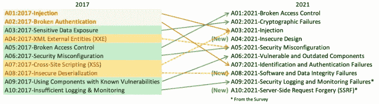

# C#中的 XXE 组件

正如我上面提到的，XXE 至少需要两个组件:一个不安全配置的解析器和这个解析器处理的来自攻击者的数据。

# 被污染的数据

这里一切都很简单。应用程序有几个地方接受外部数据。它必须被小心地处理——不是所有的人都将应用程序用于其预期目的。

这样的应用程序位置是控制台应用程序参数、各种表单字段、查询数据等。首先想到的是控制台输入。

```
var taintedVar = Console.ReadLine();
```

我们不知道*里面有什么。该变量可能包含预期格式的数据或危及系统安全的字符串。我们不能相信它。*

你可以在 PVS-Studio for C#中的“ [OWASP、漏洞和污点分析”的“污点源”一节中了解更多信息。搅拌，但不要摇动](https://pvs-studio.com/en/blog/posts/csharp/0831/)。您还应该怀疑公共访问参数。这些方法中的数据可能安全，也可能不安全。你可以在这里阅读[。](https://pvs-studio.com/en/blog/posts/csharp/0835/)

# XML 解析器

在下列情况下，XML 解析器容易受到 XXE 攻击:

*   它处理 DTD
*   它使用不安全的 *XmlResolver* 。

如果 XML 解析器没有对实体的最大大小设置限制(或者大小很大)，这可能会加剧攻击，因为攻击者将能够提取更大量的数据。

## 配置解析器

使用以下属性设置所需的行为:

*   *禁止 TD*；
*   *dtd 处理*；
*   *XML resolver*；
*   *最大字符数*。

一些 XML 解析器拥有所有这些选项，而另一些则没有。它们的语义不会随着类型的不同而改变。

**禁止 td**

*prohibit TDD*属性具有*过时*属性。现在使用 *DtdProcessing* 属性代替 *ProhibitDtd* 。尽管如此，它仍然可以在旧代码中使用。*真值*禁止 DTD 处理，*假值* —允许。

**dtd 处理**

*DtdProcessing* 属性*有*系统。Xml.DtdProcessing* 键入并可以取*禁止*，*忽略*和*解析*值:*

*   *禁止* —禁止 DTD 处理。如果解析器在处理 XML 文件时遇到 DTD，就会抛出一个 *XmlException* 类型的异常。
*   *忽略* —解析器只是跳过 DTD。
*   *解析* —解析器处理 DTD。

你现在大概有问题，我来回答。如果 *ProhibitDtd* 和 *DtdProcessing* 属性在代码中同时出现(例如在 *XmlReaderSettings* 中)，则它们相互关联。因此，如果在一个属性中禁止 DTD，而在另一个属性中允许，那么只有最后一个选项集会被应用。:)

**XmlResolver**

*XmlResolver* 属性负责用于处理外部实体的对象。最安全的选择—根本没有解析器( *null* 值)。在这种情况下，即使启用了 DTD 处理，外部实体也不会展开。

**最大字符数**

我们感兴趣的另一个选择。*maxcharactersfrontities*负责实体的最大允许尺寸。该值越大，在 XXE 攻击中提取的信息就越多。

## XML 解析器类型

处理 XML 最常见的标准类型有 *XmlReader* 、 *XmlTextReader* 、 *XmlDocument* 。注意，列表不限于它们。

同样，解析器的配置是危险的，如果:

*   这个解析器处理 DTD
*   它有一个危险的解析器(例如， *XmlUrlResolver* 处于默认状态)。

**XmlReader**

显式或隐式创建的 *XmlReaderSettings* 对象配置 *XmlReader* 的行为。 *XmlReaderSettings* 类型具有前面列出的所有设置。

具有危险配置的解析器可能如下所示:

```
var settings = **new** XmlReaderSettings()
{
  DtdProcessing = DtdProcessing.Parse,
  XmlResolver = **new** XmlUrlResolver(),
  MaxCharactersFromEntities = 0
};**using** (var xmlReader 
         = XmlReader.Create(xmlFileStringReader, settings))
  ....
```

在这里，开发人员明确允许 DTD 处理，为外部实体设置了一个解析器，并取消了对它们大小的限制。

**XmlTextReader**

在这种情况下，我们处理的是相同的属性: *ProhibitDtd* ， *DtdProcessing* ， *XmlResolver* 。

一个危险配置的解析器的例子:

```
**using** (var xmlTextReader = **new** XmlTextReader(xmlFileStringReader))
{
  xmlTextReader.XmlResolver = **new** XmlUrlResolver();
  xmlTextReader.DtdProcessing = DtdProcessing.Parse;
  ....
}
```

**XML 文档**

在 *XmlDocument* 类型中，我们感兴趣的是 *XmlResolver* 属性。在这种情况下，危险配置的解析器可能如下所示:

```
XmlDocument xmlDoc = **new** XmlDocument();
xmlDoc.XmlResolver = **new** XmlUrlResolver();
```

此配置中的 xmlDoc 会扩展外部实体，可视为危险。

## 默认解析器设置

上面我们看了显式配置 XML 解析器的例子。然而，所有列出的类型都有一些默认设置，并且有一些有趣的事情。

首先，这些设置因人而异。NET 版本。

其次，设置因类型而异。例如，默认情况下可以启用或禁用 DTD 处理。

在某些情况下，XML 解析器在默认情况下可能具有危险的配置，即使没有显式设置危险的设置。

因此，我们必须记住不同类型的解析器，不同类型的不同默认设置。NET 版本。这是一个很大的信息量，很难记住(尤其是在开始的时候)。

因此，有时我们不能仅仅通过查看代码来判断 XML 解析器是否是抗 XXE 的。例如，在这里:

```
XmlDocument doc = **new** XmlDocument();
doc.Load(xmlReader);
```

不清楚 *doc* 是否可以处理外部实体——我们需要先知道框架版本。

“危险”设置的值在之间变化。NET Framework 4.5.1 和。NET 框架 4.5.2。下表显示了。默认情况下，默认设置的. NET 版本解析器是抗 XXE 的，但在. NET 版本中却不是。

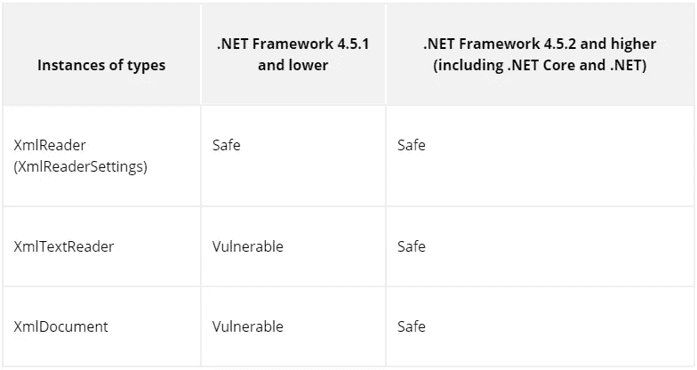

是的， *XmlReader* (通过 *XmlReaderSettings* 创建)在。NET Framework 4.5.1 和更低版本，因为其中禁用了 DTD 处理。

尽管在新的框架版本中，默认情况下解析器是安全配置的，但是最好的选择是显式地配置必要的设置。是的，会有更多的代码。与此同时，当你把它移植到不同的。NET Framework 版本。

理论完了。接下来我们来看看真正的漏洞。给自己冲杯咖啡，我们走吧！

# BlogEngine 中的漏洞示例。网

上面，我们分析了 XXE 的理论组成部分，更具体地谈到了。NET 中，从代码的角度观察了该漏洞的不安全组件。现在是练习的时间了。BlogEngine.NET 是来帮忙的。

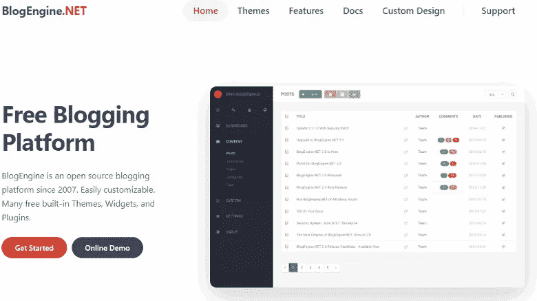

来自该项目的[网站](https://blogengine.io/):*blogen ine 是一个自 2007 年以来的开源博客平台。易于定制。许多免费的内置主题、小部件和插件。*

该项目的源代码是 GitHub 上的[。](https://github.com/BlogEngine/BlogEngine.NET)

对我们来说，这个项目很有趣，因为在那里发现了 3 个 XXE 漏洞。它们在 BlogEngine.NET[v 3 . 3 . 8 . 0](https://github.com/BlogEngine/BlogEngine.NET/tree/v3.3.8.0)被修复。这意味着我们将使用以前的版本进行实验— [v3.3.7.0](https://github.com/BlogEngine/BlogEngine.NET/tree/v3.3.7.0) 。如果你愿意，你可以很容易地再现所描述的步骤，并看到真正的 XXE 自己。

首先，我们下载想要的版本— [v3.3.7.0](https://github.com/BlogEngine/BlogEngine.NET/tree/v3.3.7.0) 。建立这个项目应该没有问题——非常简单。我用 Visual Studio 2022 构建了这个项目。

项目建好之后，我们来运营。如果一切顺利，我们会看到以下类型的站点:

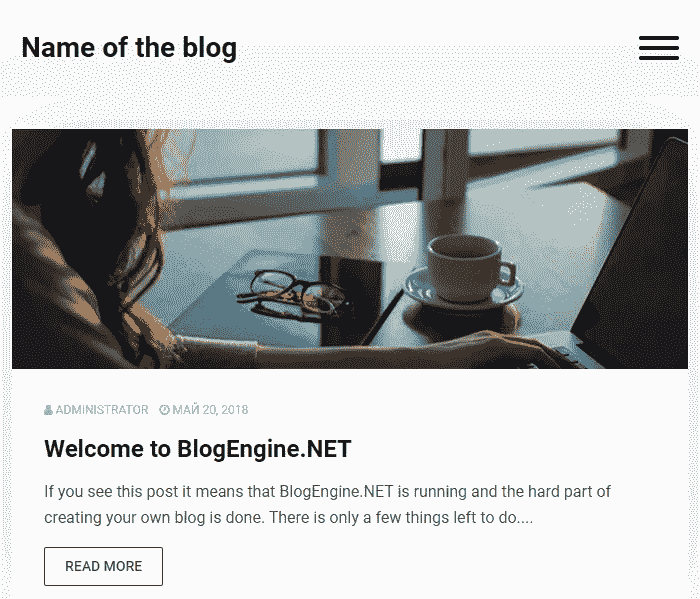

如果该网站在默认情况下对同一网络上的其他机器不可用，我强烈建议您创建它。一点点的配置让“玩”XXE 变得更加有趣。

在搜索漏洞时，您可能会有不同的输入。例如，系统可能会为您提供一个黑盒。然后你必须收集关于系统的信息，寻找对系统的影响点，等等。如果系统代表一个白盒，它会改变实现目标的方法和工具(或者至少扩展它们的列表)。

关于开源项目有一件有趣的事情。似乎每个人都可以使用代码并为其质量/安全性做出贡献。不过[也有一些弊端](https://pvs-studio.com/en/blog/posts/cpp/0900/)。另一方面，黑客将有更多的方法来调查代码——因为他们可以访问源代码，他们将很容易找到漏洞。这些漏洞会被报告吗？

这个问题没有答案。让我们回到正题。

由于该项目是开源的，我们将利用这一点。为了搜索漏洞，除了我们自己的知识，我们使用[PVS-Studio](https://pvs-studio.com/en/pvs-studio/)——一种搜索错误和安全弱点的解决方案。我们需要一组与安全相关的诊断工具— OWASP。你可以在这里阅读关于开启相应警告[的内容。](https://pvs-studio.com/en/docs/manual/6536/)

在 Visual Studio 中，您需要在“可检测的错误(C#)”选项卡上为 OWASP 组设置“显示全部”:扩展> PVS-Studio >选项>可检测的错误(C#)。

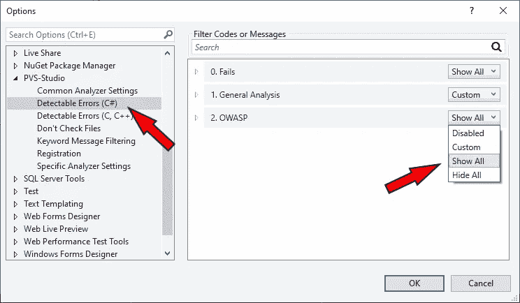

之后，确保您启用了相应警告的显示。在这种情况下，我们对“高”确定性级别的“OWASP”组感兴趣。因此，你需要点击必要的按钮——它们会被框起来。

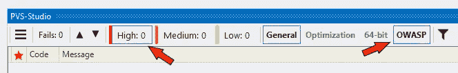

然后，运行解决方案分析(Extensions > PVS-Studio > Check > Solution)并等待结果。

使用 CWE 滤波器(记住 XXE 对应于 CWE-611)或 OWASP ASVS ID (OWASP ASVS 5.5.2)很容易找到我们感兴趣的东西——3 个警告 [V5614](https://pvs-studio.com/en/docs/warnings/v5614/) 。

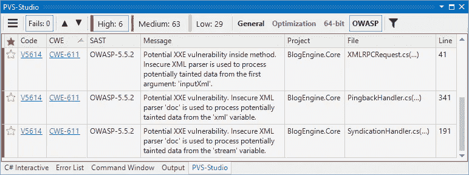

从代码的角度来看，这些错误是相似的。我们将分析最有趣的一个(位于几个方法中)，对于其余的，我将只提供基本信息。

**XMLRPCRequest.cs**

警告:V5614 [CWE-611，OWASP-5.5.2]方法内部存在潜在的 XXE 漏洞。不安全的 XML 解析器用于处理第一个参数“inputXml”中可能被污染的数据。布洛根金。核心 XMLRPCRequest.cs 41

事实上，分析器指出了 3 行以使警告更容易理解:一个“危险的”方法调用，污染的源，以及被污染的数据被危险配置的分析器使用的地方。

```
**public** **XMLRPCRequest**(HttpContext input)
{
  var inputXml = ParseRequest(input); *// LogMetaWeblogCall(inputXml);*
  **this**.LoadXmlRequest(inputXml); *// Loads Method Call* 
                                 *// and Associated Variables*
}
```

根据该消息， *inputXml* 可能包含被污染的数据(参见[污点检查](https://pvs-studio.com/en/blog/terms/6496/)),该数据被 *LoadXmlRequest* 方法中一个不安全配置的解析器使用。因此，这是一个相当复杂的过程间情况:数据来自一个方法( *ParseRequest* )，然后被传递给另一个使用它的方法( *LoadXmlRequest* )。

让我们从数据开始——我们需要 *ParseRequest* 方法的代码。

```
**private** **static** string **ParseRequest**(HttpContext context)
{
  var buffer = **new** byte[context.Request.InputStream.Length]; context.Request.InputStream.Position = 0;
  context.Request.InputStream.Read(buffer, 0, buffer.Length); **return** Encoding.UTF8.GetString(buffer);
}
```

让我们在代码中附上污点分布路径，以明确我们在谈论什么。

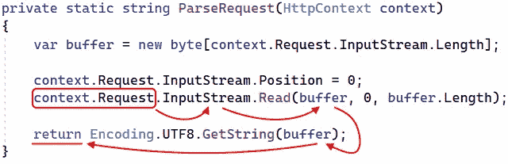

这一切都从*上下文开始。请求具有 *HttpRequest* 类型的*属性。分析器认为它是一个污染源，因为作为查询接收的数据可能会受到危害。

提取数据有几种方法，使用流( *InputStream* 属性)是其中之一。因此，被污染的数据被传递到*输入流*

接下来，我们称之为*系统。此流的 IO.Stream.Read* 方法。该方法将数据从 *InputStream* 读入字节数组( *buffer)* 。结果，现在*缓冲器*也可以包含被污染的数据。

之后是*编码。UTF8.GetString* 方法被调用。它从字节数组(*缓冲区)*中构造一个字符串。因为用于创建字符串的源数据被污染，所以字符串也被污染。构造后，字符串从方法返回。

因此，攻击者可能会损害由 *ParseRequest* 方法返回的值。至少理论上是这样。

让我们回到最初的方法:

```
**public** **XMLRPCRequest**(HttpContext input)
{
  var inputXml = ParseRequest(input); *// LogMetaWeblogCall(inputXml);*
  **this**.LoadXmlRequest(inputXml); *// Loads Method Call* 
                                 *// and Associated Variables*
}
```

用 *ParseRequest* 完成。假设 *inputXml* 变量可以包含被污染的数据。下一步—分析将 *inputXml* 作为参数的 *LoadXmlRequest* 方法。

该方法很长(100+行)，所以这里是缩短的版本。触发分析器的片段被标记。

```
**private** **void** **LoadXmlRequest**(string xml)
{
  var request = **new** XmlDocument();
  **try**
  {
    **if** (!(xml.StartsWith("<?xml") || xml.StartsWith("<method")))
    {
      xml = xml.Substring(xml.IndexOf("<?xml"));
    } request.LoadXml(xml);              *// <=*
  }
  **catch** (Exception ex)
  {
    **throw** **new** 
      MetaWeblogException("01", 
                          $"Invalid XMLRPC Request.({ex.Message})");
  }
  ....
}
```

正如我们看到的，参数是由一个 XML 解析器处理的:*请求。LoadXml(xml)* 。PVS-Studio 认为*请求*易受 XXE 攻击。我们的工作就是证明这一点。或者反驳。那么该警告将被标记为[误报](https://pvs-studio.com/en/blog/terms/6461/)。这里我们需要本文开头描述的理论。

*请求*引用指向的对象类型是 *XmlDocument* 。解析器有默认设置，这意味着我们需要找出。网络版。您可以在项目的属性中找到它。

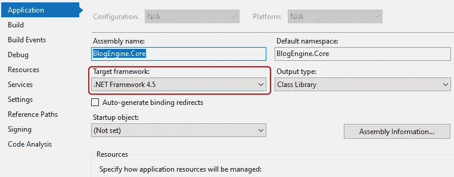

现在我们来看文章开头的表格。我们在应用程序中看到。默认情况下，NET Framework 4.5.1 和较低版本的 *XmlDocument* 类型易受 XXE 攻击。

看起来我们具备了潜在 XXE 的所有条件:

*   有可以妥协的数据:*parse request*->*input XML*->*XML*；
*   有一个带有危险配置的解析器处理这些数据: *request。LoadXml(xml)* 。

理论上，这是一个 XXE，但它仍然是一个潜在的漏洞。我们必须证明攻击是可能的。要做到这一点，我们需要更深入地研究代码。

我们从 *XMLRPCRequest* 类型的构造函数开始分析。在一个地方叫做:

```
internal **class** **MetaWeblogHandler** : IHttpHandler
{
  ....
  **public** **void** **ProcessRequest**(HttpContext context)
  {
    **try**
    {
      var rootUrl = Utils.AbsoluteWebRoot.ToString();

      *// context.Request.Url.ToString().Substring(0,* 
      *// context.Request.Url.ToString().IndexOf("metaweblog.axd"));* var input = **new** XMLRPCRequest(context); *// <=*
      ....
     }
     ....
   }
   ....
}
```

是的，我们遇到了一个 HTTP 处理器。在配置中有一个条目:

```
<add name="MetaWeblog" 
     verb="*" 
     path="metaweblog.axd" 
     type="BlogEngine.Core.API
                     .MetaWeblog.MetaWeblogHandler, BlogEngine.Core" 
     resourceType="Unspecified" 
     requireAccess="Script" 
     preCondition="integratedMode" />
```

现在我们知道了发送请求的地址，并使所需的处理程序工作。让我们试着重现这次袭击。

首先，我们需要一个 XML 文件，用它从部署博客的机器上窃取数据:

```
<?xml version="1.0"?>
<!DOCTYPE xxe [
 <!ENTITY externalEntity SYSTEM 
   "file:///C:/Windows/System32/drivers/etc/hosts">
]>
<xxe>&externalEntity;</xxe>
```

如果 XML 解析器处理外部实体，那么代替&*external entity；*它应该粘贴[主机](https://en.wikipedia.org/wiki/Hosts_(file))文件的内容。

我们发出请求，发送 XML，然后看看我们的处理程序如何工作。为了方便起见，将 XML 保存到一个文件是有意义的(在本例中是— *xxe.xml* )，因此，如果需要，您可以很容易地更改其内容，而无需更改查询命令本身。

```
curl -d "@xxe.xml" -X POST [http:*//vasiliev-pc:8081/metaweblog.axd*](http://vasiliev-pc:8081/metaweblog.axd)
```

因此，处理程序捕获了我们的请求，并调用了我们之前检查过的 *XMLRPCRequest* 构造函数。

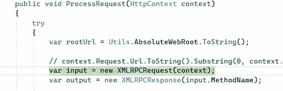

进入构造函数内部，检查 *inputXml* 变量中的数据。

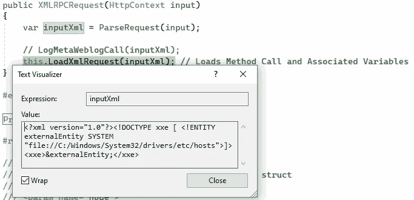

一切都按计划进行——数据被污染了，正如我们假设的那样(也是我们想要的),并作为参数传递给 *LoadXmlRequest* 方法。让我们进一步观察。

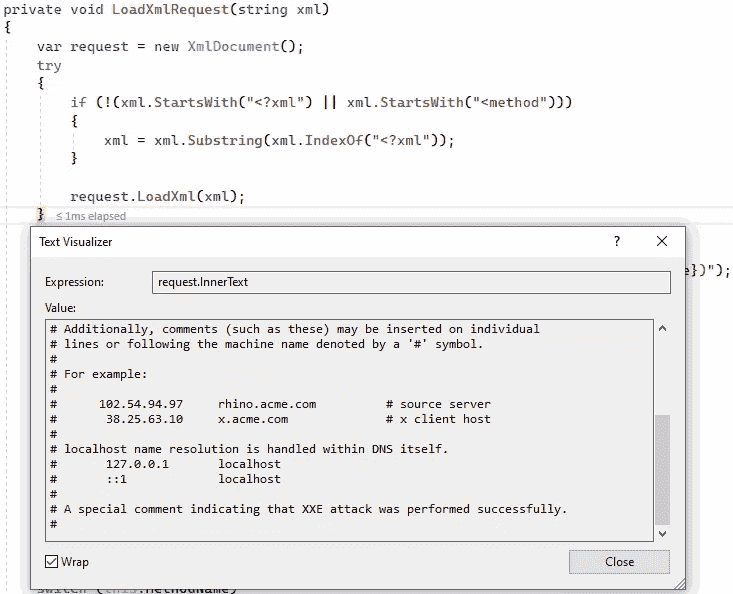

由于危险的默认设置，解析器完全按照我们的预期工作——它加载了 hosts 文件的内容。然后执行下面的代码片段:

```
*// Method name is always first*
**if** (request.DocumentElement != null)
{
  **this**.MethodName = request.DocumentElement.ChildNodes[0].InnerText;
}
```

幸运的是(对于黑客:)，hosts 文件的内容将被写入到 *MethodName* 属性中——这正是我们所需要的。我们需要的下一个代码片段是大的*开关*，其中根据方法名执行某些操作:

```
**switch** (**this**.MethodName)
{
  **case** "metaWeblog.newPost":
    ....
    **break**;
  **case** "metaWeblog.editPost":
    ....
    **break**;
  **case** "metaWeblog.getPost":
    ....
    **break**;
  ....
    **default**:
      **throw** **new** 
        MetaWeblogException("02", 
                            $"Unknown Method. ({MethodName})");
}
```

这里我们需要*默认的*分支，因为没有合适的方法，执行将会到那里。在这个分支中会抛出一个异常。异常的消息将具有映射失败的方法的名称。在我们的例子中，方法的名称是 hosts 文件的内容。

当抛出异常时，我们返回到处理程序并到达 catch 部分，在那里报告一个未知的方法:

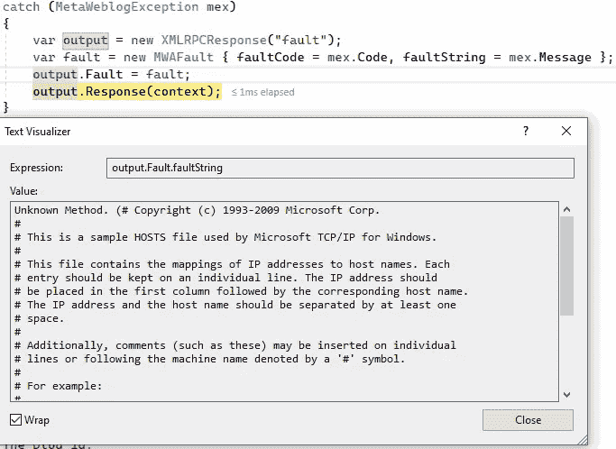

因此，对我们最初的要求:

```
curl -d "@xxe.xml" -X POST [http:*//vasiliev-pc:8081/metaweblog.axd*](http://vasiliev-pc:8081/metaweblog.axd)
```

我们得到以下答案:

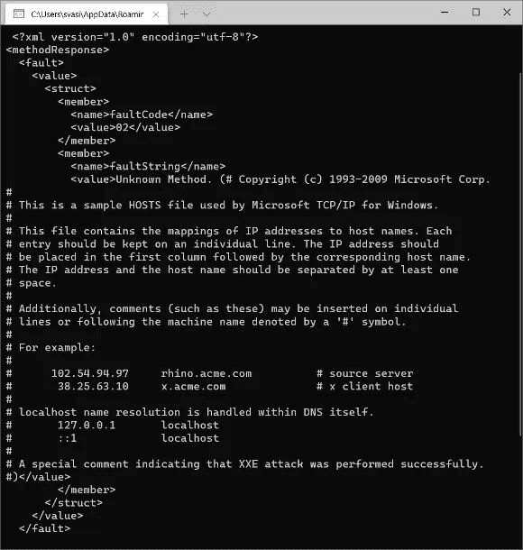

因此，我们利用 XXE 攻击，设法获取了主机文件的内容。我们在部署了博客的机器上得到它。如果我们知道其他文件的位置，我们也可以尝试获取它们的内容。不仅来自被攻击的机器，还来自我们可以访问的网络中的其他机器。这里，在网络请求的背景下，我们也可以谈论 SSRF。

因此，我们已经从应用程序(代码)和用户(攻击者)的角度看到了 XXE。这是一个真实存在的漏洞——[CVE-2018–14485](https://cve.mitre.org/cgi-bin/cvename.cgi?name=CVE-2018-14485)([这里的](https://nvd.nist.gov/vuln/detail/CVE-2018-14485)是 NVD 的入口)。

我们应该如何处理漏洞？没错，修好它。提交可以在这里找到。之后，XML 解析器的配置发生了变化，所以现在它不能处理外部实体。为此，将 *XmlResolver* 属性的值设置为 *null* 就足够了:

```
var request = **new** XmlDocument() { XmlResolver = null };
```

现在，如果我们尝试获取相同的主机文件，它将不会进入输出。

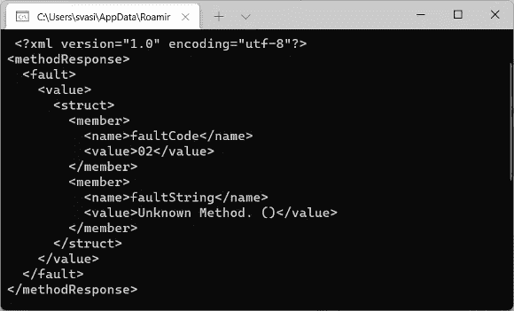

顺便说一下，PVS-Studio 知道这种配置的解析器(*XML resolver*—*null*)不会处理外部实体。因此，分析器不会对固定代码发出警告。

我们之前看到的另外两个警告也指向了漏洞。我们不打算分析它们(代码是相似的)，但下面是关于它们的基本信息。

**CVE-2019–10718**

*   警告:V5614 [CWE-611，OWASP-5.5.2]潜在的 XXE 漏洞。不安全的 xml 解析器“doc”用于处理“XML”变量中可能被污染的数据。PingbackHandler.cs 341
*   附加信息: [NVD](https://nvd.nist.gov/vuln/detail/CVE-2019-10718) ， [CVE](https://cve.mitre.org/cgi-bin/cvename.cgi?name=CVE-2019-10718) 。
*   提交并修复:[链接](https://github.com/BlogEngine/BlogEngine.NET/commit/3c61785f6c952e3f8d16eab1bb425e0368ea4a65)。

**CVE-2019–11392**

*   警告:V5614 [CWE-611，OWASP-5.5.2]潜在的 XXE 漏洞。不安全的 XML 解析器“doc”用于处理“stream”变量中可能被污染的数据。SyndicationHandler.cs 191
*   补充信息: [NVD](https://nvd.nist.gov/vuln/detail/CVE-2019-11392) ， [CVE](https://cve.mitre.org/cgi-bin/cvename.cgi?name=CVE-2019-11392) 。
*   提交并修复:[链接](https://github.com/BlogEngine/BlogEngine.NET/commit/4869ca9582c6d8f104190c3df3f14fb51058b481)。

# 如何保护代码？

*   了解一下问题。由于 XML 文件的处理而可能出现漏洞的事实可能是一个意外的发现。越多的人知道这个问题越好。
*   使用较新的框架版本。开发人员努力提高“开箱即用”产品的安全性。在...的情况下。NET，新版本的框架更加安全。
*   显式配置 XML 解析器的安全设置。如果不需要，禁止处理 dtd 和外部实体。这最小化了可能的风险(特别是当你复制代码时)，也更清楚地表明了你的意图。如果需要 DTD 处理，请设置尽可能多的限制。
*   使用专门的工具搜索安全缺陷:SAST、DAST 等。例如，定期使用 SAST 解决方案将允许您甚至在编写代码的阶段就发现这样的缺陷。对了，你可以试试文章里提到的 PVS-Studio，[这里](https://pvs-studio.com/pvs-studio/try-free/?utm_source=xxe_in_csharp&utm_medium=articles&utm_term=link_try-free)。

# 结论

现在，您对安全和 XXE 问题有了更多的了解，并且也知道即使是部署在您机器上的简单博客也可能成为漏洞的来源。

事实上，XXE 的主题更为严肃，当然，还有很多值得挖掘的地方。但是至少知道这个安全缺陷并在基本水平上理解它已经很有用了。

普拉莫尼特斯，普拉莫尼特斯。

一如既往，我邀请你[订阅我的 Twitter](https://twitter.com/_SergVasiliev_) ，以免错过任何有趣的事情。