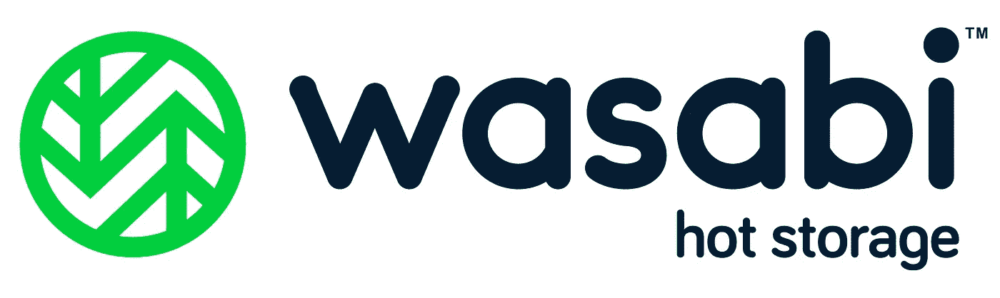

# Wasabi 热存储:利与弊以及如何与 Javascript 一起使用

> 原文：<https://itnext.io/wasabi-pros-cons-and-how-to-use-with-javascript-fa528c3779a2?source=collection_archive---------2----------------------->



本文是系列文章**“云存储提供商，选择哪一个？”**。您可以在这里查看其他文章:

1.  [亚马逊 S3:利与弊以及如何使用 Javascript](https://medium.com/@javidgon/amazon-s3-pros-cons-and-how-to-use-it-with-javascript-701fffc89154)
2.  [谷歌云存储:利与弊以及如何使用 Javascript](https://medium.com/@javidgon/google-cloud-storage-pros-cons-and-how-to-use-it-with-javascript-ea9ce60a94c0)
3.  [微软 Azure Blob 存储:利与弊以及如何与 Javascript 一起使用](https://medium.com/@javidgon/microsoft-azure-blob-storage-pros-cons-and-how-to-use-it-with-javascript-ca5aaf5d5ffd)
4.  [Backblaze B2:利与弊以及如何使用 Javascript](https://medium.com/@javidgon/backblaze-b2-pros-cons-and-how-to-use-it-with-javascript-8c2d2a9a69d9)
5.  [数字海洋空间:利与弊以及如何使用 Javascript](https://medium.com/@javidgon/digital-ocean-spaces-pros-cons-and-how-to-use-it-with-javascript-1802559ce2bd)
6.  Wasabi 热存储:利与弊以及如何与 Javascript 一起使用

Wasabi Technologies 是名单上最新的公司，可能也是不太为人所知的公司。它成立于 2015 年，遵循与 DigitalOcean Spaces 相同的策略:*你为云中预定数量的空间付费*。这种方法使他们能够提供非常低的每 GB 存储价格。根据你的需求，这个想法听起来会更好或更差，但毫无疑问它是有市场的。

免责声明:价格和功能随时都在变化。如果有错误请告诉我:)

## 赞成的意见

*   **它和亚马逊 S3 一样“对开发者友好”。**它使用 S3 兼容的对象存储 API，这意味着你可以使用任何亚马逊 S3 SDK 和 Wasabi！
*   **行业最低价格**。每 TB 每月存储 3.99 美元。根据一些计算，这意味着大约 0.004 美元/GB/月。这个价格大约是亚马逊 S3 的 1/5。此外，从 2018 年 3 月 20 日开始，出站流量完全免费！
*   **速度**。虽然我没有测试过，但他们以提供比亚马逊 S3 快六倍的速度而自豪，这要感谢他们的系统基础设施
*   **默认加密**。Wasabi 中存储的每个文件都是“静态”加密的，即使用户没有明确指定。
*   **简单。**只有一个存储类，对上传、获取、复制或其他操作不收取额外费用
*   **耐久性高。** Wasabi 在给定的一年内为物品提供 99.999999999% (11 个 9)的耐用性，与亚马逊 S3 相同
*   **易用的 UI** 。您可以拖放项目，将它们上传到您的存储桶
*   作为免费层的一部分，**新用户可以免费试用该服务一个月。无需输入信用卡**

## 骗局

*   **支持计划的定价从有限支持**(例如电子邮件&票证支持**)的“免费”，到完全覆盖**(例如电话支持)的“每月 300 美元”。这对小公司/自由职业者来说是一个过高的价格
*   **它继承了亚马逊 S3** 的权限模型(例如，角色、策略)，这可能会让非高级用户望而生畏
*   **无论上传 1TB 还是 1KB 的数据，你支付的费用都是一样的。**因此，如果你没有太多东西要储存，这可能不是最具成本效益的解决方案
*   **他们没有围绕**的服务生态系统。Wasabi 是专门做云存储的，不要指望云计算之类的其他服务。
*   **截至目前，Wasabi 在美国东部地区(弗吉尼亚州阿什本)只有一个数据中心**。虽然有计划在 2018 年开设更多

## 不错，但是我为什么要在比赛中使用它呢？

*   **如果你是一个想要在云中存储大量数据的用户**(例如，备份、媒体库)并且你不害怕配置权限，Wasabi 由于其价格是最好的选择之一
*   **如果你有使用亚马逊 S3 SDK 的脚本，**你可以通过重用它们来节省大量时间，因为它的 API 是 S3 兼容的
*   如果你想经常下载数据。Wasabi 现在有一个“无限输出数据”政策，这意味着你下载的所有数据都是免费的。就这么简单。

# 如何在 Javascript 中使用它

> 正如你将看到的，Wasabi 和亚马逊 S3 在使用 Javascript 方面的唯一区别在于验证码，我们在验证码中指定了不同的端点。

1.  如何安装库

```
npm install aws-sdk
```

2.如何认证

3.如何创建存储桶

4.如何删除存储桶

5.如何上传文件

6.如何下载文件

7.如何删除文件

8.如何列出存储桶中的所有文件

我希望这篇文章足以让你熟悉 Wasabi。如果你错过了什么，请告诉我！

祝您愉快！