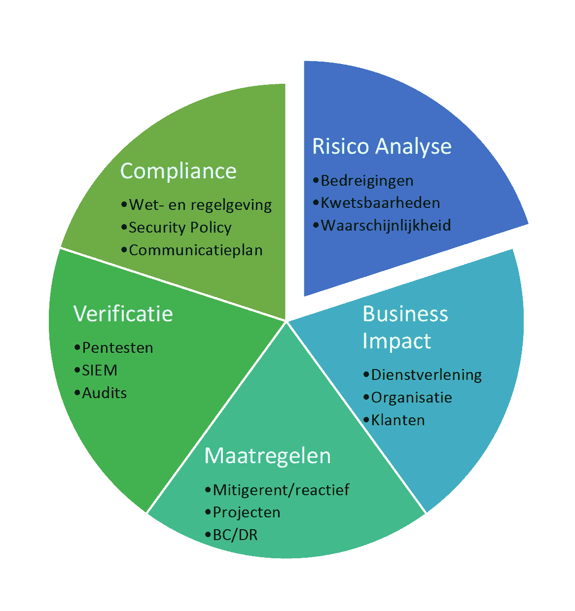
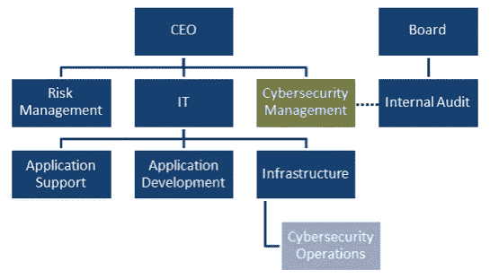

# 首席执行官在网络安全方面的作用是什么？

> 原文：<https://itnext.io/wat-is-de-rol-van-de-ceo-binnen-cybersecurity-bc3155d8b430?source=collection_archive---------5----------------------->

网络安全已不再是 IT 领域的一部分，它影响到整个组织。这就是为什么首席执行官的积极作用至关重要。我的文章介绍了首席执行官应该发送网络安全策略的主要部分，并提供了一些有用和适用的建议。

## c 级功能

大多数大型企业都具有一些所谓的 [C 级管理](http://searchcio.techtarget.com/definition/C-level)功能。在网络安全领域中，这些通常是[T3、](https://en.wikipedia.org/wiki/Chief_information_officer) [CTO](https://en.wikipedia.org/wiki/Chief_technology_officer) 和[T7【角色。近年来，网络安全的重点一直放在 CISO 上，其首要任务是保护业务(而不是保护 IT)。CISO 承担责任并向首席执行官汇报。](https://en.wikipedia.org/wiki/Chief_information_security_officer)

## -什么事

网络罪犯可能造成的损害以及政府违反隐私法的罚款都会给企业的持续性带来巨大风险。网络安全已经成为董事会的一个重要议题也是董事会议程上的一个重要议题。

## 网络安全信息模型(CSI 模型)

首席执行官想确定公司的网络安全政策。要确保这一点，请务必随时了解网络安全状态。CISO 的任务是通过以下信息模型尽可能地向首席执行官报告此事:

**网络安全信息模型(CSI 模型)**链接 **2017**

CSI 模型中的组件会绘制下列组件的当前视图:

## 风险分析

CEO 必须不断被告知当前的威胁([DDOS](/knowledge-base/170/Cybercrime_aanvallen_2_de_Denial_of_Service_DOS_attack)、[转发器 t15、](/knowledge-base/239/Dossier_Ransomware_Deel_I_Een_introductie)[社会工程 t17 等。)。此外，新的软件或系统可能会产生新的漏洞。最理想的情况是，风险分析包括风险实际发生的程度的概率计算。](/knowledge-base/195/Cybercrime_aanvallen_3_de_Social_Engineering_attack)

## 商业影响

CSI 模型其他组件的输出将与首席执行官讨论业务影响。如有必要，CISO 将提出应对措施。执行长有责任测试并批准这些措施和相关投资。

## 采取的措施

必须向 CEO 说明需要采取的任何额外安全措施。这可以是缓解或反应措施[t0(BC/dr)]t1。前提是企业或组织的连续性。信息模型的其他四个部分提供了必要的改进，并且通常以项目形式实现。那么 CISO 也有责任定期向首席执行官汇报这些项目的进展情况。

## 合规性

法规合规性要求近年来大大增加了[、隐私保护(Wbp)](https://autoriteitpersoonsgegevens.nl/nl/over-privacy/wetten/wet-bescherming-persoonsgegevens) 、信息披露和[一般命令数据保护(AVG)](/knowledge-base/245/GDPR_zijn_bedrijven_voorbereid_op_de_nieuwe_Europese_privacy_verordening) 就是其中的一个例子除了对公众形象的诽谤之外，对于不遵守上述法律的处罚是实质性的。执行长应确定组织是否符合的规定，或是否需要采取其他措施。此外，还将验证通信计划的最新情况。此计划适用于数据泄漏和/或严重的安全事件。

## 验证

此部分将验证采取的安全措施是否有效。有多种方式可执行此检查:

*   通过渗透测试，*内部和外部进行。*
*   根据[red team](https://www.sans.org/reading-room/whitepapers/auditing/red-teaming-art-ethical-hacking-1272)，e *由指定的专家在不通知员工的情况下尝试入侵系统和/或窃取数据。*
*   审核，*远程访问由一家专门的网络安全策略公司进行。*
*   通过 SIEM 报告的操作(t16)【高事件、安全漏洞、趋势等】T17。)。

CISO 将根据需要向首席执行官报告 CSI 模型的五个组件，并附上建议和投资建议。

## 你的建议

以下是一些适用于每个 CEO 的有效附加建议:

*   提供概念网络安全知识。可以通过每月进行一次简短的培训(例如，通过 CISO 提供)来实现此目的。
*   请不要将网络安全视为业务案例，而是将条件假设为[业务连续性](http://www.thebci.org/index.php/resources/what-is-business-continuity)的一部分。
*   安全意识的挑战始于组织的高层。练习你说的话！
*   验证组件应尽可能多地根据行业组织(“T2”iso、[sans](https://www.sans.org/reading-room/whitepapers/auditing/red-teaming-art-ethical-hacking-1272)、[ncsc](https://www.ncsc.nl/)等制定的标准和建议进行测试。)。
*   建立会说同一种语言的 CISO，而不是技术思维，而是将网络安全问题转化为对业务、组织和业务的影响。
*   了解最近哪些网络攻击被阻止、阻止或拒绝，这就为网络安全预算提供了理由。

## 结论是

CEO 在组织网络安全政策中的突出作用是显而易见的。处理好这个案子很重要" T8 "是否涵盖了所有风险？我们有弱点吗？在基础架构更改或新应用程序部署期间是否测试 securityimpact？

所谓的 CSI 模型可能是一个很好的封面故事。这为首席执行官制定已实施的网络安全政策和做出明智的决策提供了基础。