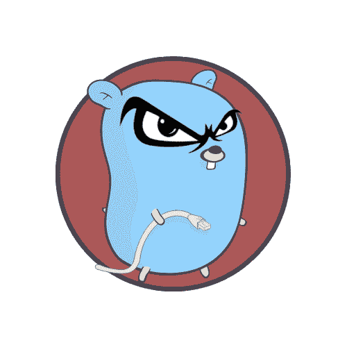

# 我们需要谈谈围棋的坏处

> 原文：<https://itnext.io/we-need-to-talk-about-the-bad-sides-of-go-568a1e5adbc6?source=collection_archive---------0----------------------->

这是[三篇系列文章](https://medium.com/@avivcarmis/what-makes-go-the-best-language-159322c2206a)的第二部分。这是一个关于 Go 编程语言的缺点的故事，关于它的那部分使我们生产率更低，我们的代码库更不安全和更不可维护。以及关于改进的建议。🌟

## 本系列的更多内容

*   [是什么让围棋成为最好的语言](https://medium.com/@avivcarmis/what-makes-go-the-best-language-159322c2206a)
*   我们需要谈谈围棋的不好的一面
*   [对美好未来的主张](https://medium.com/@avivcarmis/a-proposition-for-a-better-future-for-go-a0d0b43d086a)

在上一篇文章的[介绍中，我们提出了一个冲突——围棋有保持简单的激进倾向。虽然它有巨大的好处，但它阻止了地鼠变得更有生产力。然后，我们讨论了这种语言更强的一面以及使它独一无二的一切。在这一篇中，我们将深入讨论并展示 Go 的**问题方面。如果你错过了上一个**](https://medium.com/@avivcarmis/what-makes-go-the-best-language-159322c2206a)，我建议你回头看看，因为它为你即将到来的全面咆哮提供了一个重要的背景。准备好了吗？我们开始吧。

# 命名空间污染和错误的命名

在编写 Go 一段时间后，你开始注意到你通常会相对较快地用完合理的变量名。最初，这听起来像是一个化妆品问题，但它不是。先说为什么会这样。

## 缺少可见性修改器

名称空间污染的第一个根本原因是缺少可见性修饰符。在我看来是为了减少冗余的关键字和增强简单性，语言设计者决定省略可见性修饰关键字(`public`、`private`等)，以利于符号命名。以大写字母开头的符号自动公开，其余的是私有的。听起来是提倡简单的一个很好的选择。但是随着时间的推移，越来越明显的是，这种方法有一个更大的缺点:在大多数其他语言中，按照惯例，类型名以大写字母开头，变量名以小写字母开头。这个约定有一个非常强大的含义——它意味着变量永远不能隐藏类型。考虑下面的 Go 代码:

Go 中的类型隐藏

这在围棋中很常见，我敢打赌大多数地鼠在某个时候都会遇到这种情况。在大多数情况下，您的编码范围处理一个用户实例，因此将其命名为`user`应该是一个清晰合理的选择。然而，在 Go 中，每当你将私有类型存储到私有变量中，或者将公共类型存储到公共变量中，你都会遇到这种情况。**所以你简单地开始命名你的用户变量** `u`。

## 包范围命名空间

名称空间污染的第二个原因，也可能是最烦人的一个原因— **包作用域名称空间**。让我们从一个例子开始:

为什么？那是两个独立的文件。我不能声明任何私有的东西并且只能在本地使用吗？我不能。文件中声明的任何符号对整个包都是自动可见的。

在某些情况下，包在几个文件之间共享一个私有符号是很有意义的(即[包私有可见性](https://idratherbewriting.com/java-access-modifiers/#public-private-protected-package-private))。在其他情况下，符号没有理由脱离它们文件的范围。Go 不提供这种控制**的事实导致了严重混乱的包**和不必要的长而具体的符号名，以避免重复和歧义。在大型项目的大型包中，几乎不可能找到一个合理的名称，而且还可以免费使用。更不用说从包中声明的 100 个甚至 1000 个符号列表中找到您想要调用的实际函数了。😭

## 内置符号

最后，全局内置符号。让我们从一个例子开始:

隐藏内置符号

换句话说，从技术上来说，你可以用一个名字列表来命名你的变量，但是如果你这么做了，你就**遮蔽了重要的内置功能**。

这个问题可能的解决方案:内置符号应该是关键字而不是符号。覆盖`len`、`make`或`append`永远没有意义，对吗？更别说`true`和`false`(那些都不是围棋里的关键词)。如果我们同意这总是一种不好的做法，为什么一开始就允许它呢？

一个更好的解决方案是:内置符号应该放在上下文相关的名称空间下。即`len`、`append`和`cap`作为切片方法比全局符号更有意义。它们读起来会更自然，但更重要的是，它们不会扰乱全局名称空间，允许我们在需要时安全地将它们用作合理的变量名。

## 真的有那么重要吗？

变量名有那么重要吗？嗯，首先，是的。一个名为`u`的用户变量并不比一个好的、面向上下文的变量名更好。但是这也打破了 Go 的第一条规则— **可读性高于可写性**。试图找出一个由`u`、`r`、`z`和`t`变量组成的代码片段实际上是非常可怕的。我知道有些情况下代码足够短和简单，并且上下文足够清晰，可以让一个`u`变量保持清晰。但是为什么我们[首先正式鼓励它](https://github.com/golang/go/wiki/CodeReviewComments#variable-names)？在任何现代环境中，源代码的大小与其可维护性相比可以忽略不计，那么`flname`相对于`fileName`的附加值是什么？就我个人而言，我发现自己不断地告诉拼写检查工具“不，实际上 conns 是一个有效的词，它显然是 connections 的缩写，而且…什么？cnt？不不 lol 这只是计数的简称，淘气鬼”。🤦‍♀

官方的 Go wiki 通过代码评审评论提供了一个最佳实践部分。有一条具体的建议可以让变量名保持简短，因为[熟悉意味着简洁](https://github.com/golang/go/wiki/CodeReviewComments#receiver-names)。作为一个母语不是英语的人，我想“*嗯……听起来很聪明*”。🤔我多花了几秒钟才理解这句话的真正含义——“如果你写这句话时觉得很熟悉，那就允许自己有一点懒惰”。😮我是说，但是为什么？这正是那种将自己伪装成良好实践，并最终鼓励我们朝着错误方向前进的惯例。我发现自己在多个场合盯着非常受欢迎的开源项目，不知道怎么会有人理解我现在看到的东西。只是为了证明一点，这里的是在一个 100+行的函数中间引用`cc.c`的一行代码，在一个 2947 行的文件中间。我显然不能责怪作者(是的，我知道，我*不能*责怪他们，好了嘘)因为他们只是遵循了惯用的围棋规则。但是，在如此庞大的文件和包中，在如此庞大的函数中找出`cc`和`c`的含义绝对不是高效的编程。

变量名种类少的另一个问题是偶然的遮蔽和偶然的重写。考虑以下函数:

这段代码中隐藏了一个烦人的小 bug

哎哟，这是一个在生产中需要解决的恼人的小问题。你能找到它吗？它应该被代码审查所覆盖，但是需要非常彻底的审查才能揭示它。还能怎么预防？确保不要在不需要的时候重写变量值(Go 并不强制这样做。我们将很快介绍它)，然后努力为每个变量提供一个**很好的面向上下文的名称。在某些方面，这与惯用的 Go 相反，减少可用名称的多样性会进一步伤害它。**

## 首字母缩略词

可读性的另一个恼人的问题是大写首字母缩略词惯例。[引用某个 HTTPS 端点的 URL 来命名公共变量的惯用方式](https://github.com/golang/go/wiki/CodeReviewComments#initialisms)是`HTTPSURL`。除了它破坏了拼写检查工具这一事实之外，难道只有我一个人认为`HttpsUrl`在各方面都更好吗？当三个连接在一起的时候呢？对任何人来说,`JSONHTTPSURL`是一个好的变量名吗？感觉就像在想一个可怕的 Reddit sub 的名字。😂🤷‍♀️

## 接收者姓名

最后—方法接收者命名约定。我建议阅读[杰西·达菲尔德的](https://twitter.com/DuffieldJesse)文笔优美的《走向疯狂》[关于习俗的文章](https://jesseduffield.com/Gos-Shortcomings-5/#receiver-names)。我无法提出或反驳比这更好的了。简而言之:`self`或`this`可能比我们使用的这些[单字母接收器名称](https://github.com/golang/go/wiki/CodeReviewComments#receiver-names)更有意义，然后每当我们重命名结构或移动方法时，我们就会发现自己在追着尾巴重命名。

# 安全估价

与类型安全非常相似，值安全是一种在编译时进行运行时保证和担保的方法。类型安全指的是运行时值的类型，而值安全指的是实际值。虽然类型安全是由一个单一的、一致的类型系统来执行的，但是值安全仅仅是一组不同的工具和功能，提供了关于值的各种保证。由于这个原因，语言可以做的不仅仅是简单地选择整体的值安全。更确切地说，每种语言都选择一组确切的值安全特性来支持和实施。

一些值安全工具实际上是众所周知的编程基本概念，它们要么在基本本质上提供安全性，要么作为副作用。其他的则是随着时间的推移而进化的令人兴奋的现代生物。不管怎样，值安全特性并不是现代语言爱好者吹嘘的提高生产率的语法甜言蜜语的工具。它们提供了我们非常依赖的非常重要的保证。与语法糖特性不同，这些保证不能通过编写显式代码来实现。没有他们，剩下的就是人类的责任和我们分析每段代码的边缘情况和陷阱的能力(LOL？🤣).我们也可以选择退出，只要每个人都成功地按照预期编写代码，事情就会继续工作。直到有人没有，然后就该慌了。字面上。

随着我们对编程原则理解的发展，新工具提供了更好的价值安全性。一些现代语言提供了现代的、令人兴奋的新方法来加强值安全，允许程序员编写更加健壮和高性能的代码。其他编译语言至少提供了一些值安全特性。 **Go 不提供任何**。现在，我们有责任确保我们按照预期使用所有东西。对于任何库或代码片段的消费者和生产者来说，这都是一个可怕的情况。让我们解决这些缺失的功能。

## 空指针安全

绝对不是编程历史上最糟糕的设计决策，但可能是[最臭名昭著的一个(“十亿美元的错误”)](https://en.m.wikipedia.org/wiki/Tony_Hoare#Apologies_and_retractions) —空指针异常经常让太多的人付出太多的代价。最终，导致这种情况的原因总是最简单的人为错误— **忘记检查边缘情况**。这个反复出现的问题不断提醒我们，我们根本就不是为此而生的。在编程中，“*请记住这样做，那个*”总是不好的征兆。如果有一件事你们可以指望的话——我们不会。我们不擅长记住要做的事情。

现代语言的特点允许完全消除这个问题。**严格的空检查**(像 [Swift](https://developer.apple.com/documentation/swift/optional) 、 [Kotlin](https://kotlinlang.org/docs/null-safety.html) 和 [TypeScript](https://www.typescriptlang.org/tsconfig#strictNullChecks) 提供的特性)允许我们明确定义何时允许空值。如果允许，在取消引用之前需要进行空检查。其他语言提供了 **sum 类型(**比如 [Rust](https://www.rust-lang.org/) 和 [Scala](https://www.scala-lang.org/api/2.13.x/scala/Option.html) 中的 sum 类型)来防止空值。

对于我来说，我无法理解为什么一个程序员会提倡类型安全而忽视空安全。如果你想让你的编译器强制不调用一个未定义的方法，当你试图解引用一个空值时，不也是一样的逻辑吗？我认为，无论如何，现代语言必须配备这样的强制机制。

[这里有一个添加可空类型支持的提议](https://github.com/golang/go/issues/49202)。

# 枚举

不管你如何对你的代码建模，最终，你总是需要枚举。可以有几个可能值中的一个的变量。如果你只有两个可能的值，那么布尔型就很好。如果您有三个或更多选项，您将需要一个机制来支持枚举。

在围棋中，你会…但不是真的。您可以定义常量，但它们只是简单的常量值。**它们不保证宿主变量必须包含其中一个**。即使您定义了自定义类型。这里有一个例子:

具有无效值的枚举

主函数中声明的`status`变量的值应该是 0、1 或 2。然而，当我们将它设置为 46 时，不会出现编译或运行时错误。一个好的开发者不应该把它设置为 46，咄！🤪但是错误确实会发生。随着代码库和工程师数量的增加，这只是时间问题。一个好的编译器应该帮助我们避免它。
不要忘记，46 也可以从外部非硬编码来源接受。比如 HTTP 请求或文件。我们应该永远记住来手动验证它。直到我们忘记。😞

这种方法的另一个问题是缺乏封装。与枚举相关的行为不能在枚举本身中定义，只能通过开关大小写来定义。然而，Go 中的 switch cases 并不强制遍历所有可能的值。它看起来是这样的:

未处理的枚举案例

看起来没那么糟，是吧？但是它是——每次你添加一个新的枚举值，你必须**搜索你的代码库**来寻找那些开关情况。如果您错过了一个，就像上面的例子未能正确处理`Disconnecting`状态，它会陷入未定义的行为。而且放心，你会一直记得修复那些 enums，直到有一天你不(还记得我们刚才说的关于记忆？…你可能不知道。我也是🤦‍♀️).您能想象这样一种场景吗？在这种场景中，您不希望编译器强制执行这种陷阱。
这个问题的解决方案很简单:要么你需要 switch case 语句来穷尽所有可能的值(比如 rust 的)要么你需要 enums 来实现行为(比如 java 的)。

缺乏原生枚举支持的其他问题？那么**迭代一个枚举的所有可能值**呢？这是你不时需要的东西，也许你需要把它发送到用户界面让用户选择。不可能。那么**命名空间**呢？将所有 HTTP 状态代码放在一个只提供 HTTP 状态代码的名称空间中不是更好吗？相反，Go 将它们与 HTTP 包的其他公共符号混合在一起，比如客户机、服务器和错误实例。

[这是 Go 中的一个 enum 提议](https://github.com/golang/go/issues/28987)。

## 结构默认值

在某些情况下，结构可能不仅仅是变量的集合，而是具有状态和行为的简洁实体。在这种情况下，可能需要某些字段最初保存有意义的值，而不仅仅是零值。我们可能需要将 int 值初始化为-1 而不是 0，或者 18，或者一个从其他值导出的计算值。

Go 没有提供任何现实的方法来使**在结构**中强制初始状态。实现这一点的唯一方法是声明一个公共构造函数，然后使你的结构私有，以防止通过[结构文字](https://go.dev/tour/moretypes/5#:~:text=A%20struct%20literal%20denotes%20a,pointer%20to%20the%20struct%20value.)直接实例化。此时，您必须声明一个描述该结构的公共方法的接口，以便能够导出构造函数的返回值。示例:

尝试在结构中强制初始值

因为结构本身没有被导出，所以不可能通过结构文本直接实例化它，而只能通过调用我们的构造函数。这将确保我们强制执行所需的初始值。

当维护开放源码库时，这种方法可能不值得。但是我们呢，凡人？我们不太关心我们进程内部的一些结构的 API 的完整性，**我们只是试图快速修复产品中的一个 bug**。如果我们像这样工作，每次我们对一个方法签名做一个改变，我们也必须改变接口中的重复。仅仅为了在我们的结构中强制初始值，这是多么随机的副作用啊🤦‍♀️😂但这还不是全部。它甚至没有完全解决问题——同一个包中的代码怎么办，它仍然可以使用 struct literal 和**跳过构造函数**,破坏我们试图完成的一切。🤤

另一个有问题的用例是配置结构，但是展示它的最好方法是用一个真实的例子。Sarama 是卡夫卡最喜欢的围棋库。一个巨大的、成熟的项目，由 Shopify 维护。Sarama 公开了一个 [Config](https://github.com/Shopify/sarama/blob/1cbdb49dd3be553e96301d185603b5ab7bee1005/config.go#L21) struct，它应该在创建新客户端时被传入。它包含关于如何连接到 Kafka 代理以及如何维护连接状态和行为的各种信息。结构注释指示每个字段的意图及其默认值。例如，这里的 [Max 字段](https://github.com/Shopify/sarama/blob/1cbdb49dd3be553e96301d185603b5ab7bee1005/config.go#L27)，它设置了对 Kafka 的请求的最大重试次数，默认为 5。所以像我这样的普通开发人员可能会想“*嗯……好吧，让我们传入一个空的 struct 文字来使用默认值 5* ”。于是我照做了。

使用 sarama 配置和默认值

“*…现在我的配置肯定允许 5 次重试，*”我心想。🤗直到几天后，我又玩了一会儿，心想“*但是等等，他们怎么会知道呢？*”。Sarama 代码如何区分使用`&sarama.Config{}`传入的默认值 0(应该允许 5 次重试)和使用`&sarama.Config{Max: 0}`显式传入的 0(应该允许 0 次重试)？😨
的确，不能。显然，config struct 有一个[构造函数，我应该使用它而不是直接实例化它。英雄联盟🤦‍♀️.“但是，等一下，”我心想，“我会不会推送代码来指示 Sarama 库对所有其他配置参数使用 0 重试次数**和零值**？？!"😲😧😨😱没错。我很确定。😩🤦‍♀️ 🤦🏽‍♂️](https://github.com/Shopify/sarama/blob/1cbdb49dd3be553e96301d185603b5ab7bee1005/config.go#L454)

最初，我对图书馆的设计者没有强制预防这样的错误感到愤怒，“如果它发生在我身上”等等。后来我想了想，意识到，他们不能。Go 根本不提供。乍一看，struct 文字看起来像是 config params 用例的完美候选，允许您准确地传递您需要的内容，并省略其余内容。但结果恰恰相反。

这里有一个支持类型初始化器的提议。

## 常量赋值

在花了一些时间学习区分常量和变量值的语言之后，你开始注意到你的大部分赋值都是常量。非常数赋值主要用于需要计数、连接或其他形式聚合的计算中。**在大多数其他用例中，对变量的赋值是单次操作**。让我们以 [reactjs GitHub 库](https://github.com/facebook/react)为例，比较`let`关键字的使用量和`const`关键字的使用量，我们可以得出结论**常量赋值占所有赋值的 75%**(25440 对 6815)。因此，默认情况下将赋值视为常量是很有意义的，就像其他一些现代语言([如 rust](https://doc.rust-lang.org/std/keyword.mut.html) )所做的那样。为什么有帮助？让我们回到变量命名的例子，在这里我们讨论了意外隐藏和重写变量:

隐藏变量可能会导致隐式行为

记得这个吗？这里的错误是对变量`err`的第二次赋值可能会清除原来的错误，导致我们**从函数中返回，就像没有错误发生过一样**。这将导致调用函数**继续执行，就好像用户实际上已经被批准了一样，尽管他们并没有被批准。如果一个有经验的地鼠知道他们应该寻找一个 bug，他们可能会很快找到它。一只没有经验的地鼠可能需要更长的时间。常量赋值可以很容易地防止这种情况。错误变量的第二个赋值不会被编译，指示我们定义一个单独的变量。**

常量赋值不仅仅是关于编译器的执行。它们也是关于**作者能够传达意图**，更有表现力，使代码更清晰。如果你知道某个变量不应该被重新分配，你就有更多的信息来修改或重构围绕它的代码。ℹ️🤓

[这里有一个常量赋值支持](https://github.com/golang/go/issues/6386)建议。

## 不变

不可变的值是一个独立的东西。一个变量的赋值可以是常量，但是值本身仍然可以发生变化。考虑创建一个指向映射的常量变量，然后在映射上执行写操作。变量仍然指向同一个映射，但是映射值本身已经改变。

不可变数据结构是防止并发环境中数据竞争的一个非常有用的工具。在 Go 中，没有对不可变数据结构的本地支持。好消息是随着仿制药的到来，我们可以自己创造它们。比如`ImmutableMap[K, V]`。

这里有一个关于不变性的提议。

# 错误处理

错误处理可能是 Go 社区中最大的争论，现在泛型的争论已经解决了。随着时间的推移，我已经熟悉了许多错误处理的方法，无论是在其他语言中还是在 Go 提案中。我并不认为我可以自己想出最好的错误处理机制。我想说的是，Go 错误处理有很多优点和优势。然而，我们在这里谈论的是负面影响。首先，我想(再次)参考杰西·达菲尔德的[关于错误处理](https://jesseduffield.com/Gos-Shortcomings-1/)的疯狂文章，它很好地阐述了他自己的痛点。那我自己补充两点。

首先，我最近听到很多地鼠认为 Go 中的显式错误处理方法是一个好主意，因为它迫使我们处理每一个错误。我们不应该简单地传播错误。换句话说，**这不应该发生**:

无包装的错误处理

相反，我们应该总是用新的错误来包装错误，以便为调用者提供更多的上下文，就像这样:

包装的错误处理

我根本不同意这个论点**。我听到的支持 Go 错误处理机制的第一个理由是，它比基于 try-catch 的机制更有**的性能。我尝试了一下，结果非常正确。try-catch 环境中低性能的主要原因之一是每当抛出异常时，在调用堆栈的每一级都创建完整的堆栈跟踪和异常信息。在 Go 中，在整个调用堆栈中用另一个错误包装每个错误，然后对所有创建的对象进行垃圾收集，这几乎同样昂贵。更不用说手工编码了。如果这是你所提倡的，你最好从尝试捕捉环境开始。****

**堆叠跟踪在调查错误和缺陷时非常有用，**但是在其他时候它们是非常昂贵的冗余信息**。也许一个完美的错误处理机制应该有一个开关，在需要时打开和关闭它们。🤷‍♀️**

**第二点实际上与错误处理机制本身无关，而是与约定有关。我们已经在前一段讨论了错误处理性能。[检测错误](https://dave.cheney.net/2016/04/27/dont-just-check-errors-handle-them-gracefully#sentinel%20errors)为错误处理提供另一个性能提升。我建议阅读更多关于它们的内容，但简而言之，当某个错误的所有出现都包含相同的信息时，您可以简单地创建一个错误对象实例，而不是在每次出现时都生成新的实例。表示错误的单例对象。我们称之为**哨兵错误**。它们防止**不必要的分配**和**垃圾收集**。除了性能提升之外，错误比较也变得更加简单。因为这些错误值是单值的，所以不用比较它们的类型，您可以使用一个简单的等式操作符简单地比较它们的值。**

**哨兵误差**

**注意这种类型的比较不需要类型检查。这非常有效——它读和写都很好，性能也很好。👏🤝**

**但是，有时候哨兵错误**不能用**。有时我们希望错误消息包含与错误的任何**特定事件相关的信息。(即`"oops...network error <root cause>"`)。这意味着我们每次都必须实例化一个新的错误对象。在这一点上，由于缺乏坚实的约定，我们简单地走:****

**制造非哨兵错误时偷懒**

**哎呀真的。🤦‍♀️由于这个错误没有特定的类型或实例，我们现在已经失去了有效检查这种类型错误的能力。**

**怎样才能辨别网络错误？**

**我们唯一的选择是检查错误消息本身的`strings.Contains`:**

**我们唯一的错误处理选项很糟糕**

**这在性能上是很可怕的。但更可怕的是，这是没有保证的。显然，`"oops...network error"`可以随时改变，并且没有任何编译器强制来帮助我们。当软件包的作者决定将消息改为`"oops...there has been a network error"`，**我的错误处理逻辑中断了**，你一定是在开玩笑。🤷‍♀️🤦‍♀️:你也可以用其他语言来表达。例如，在 Java 中，你可以`throw new Exception("oops...network error")`。但是在小型创业公司中，它很可能无法通过内部代码审查。然而，在 Go 中，它通过了由大型组织维护的大型开源库中的代码审查(谷歌的 protobuf 怎么样)。我个人发现自己退回到 string contains 检查，对不止一个主要的开源库感到恶心。🤢🤒**

**或者通过一个强有力的、可靠的约定，或者通过编译器强制执行:`errors.New`和`fmt.Errorf` **应该只用于创建标记错误**。返回的任何其他错误都必须声明一个专用的导出类型，以允许合理的处理。作为库的作者，如果我们忽略了这一点，我们就拿消费者的代码安全和完整性冒险。**

**这里有一个语言提议添加一个`?`操作符用于错误处理。值得一提的是，这项提案在 2018 年因讨论过热而关闭，再也没有打开过。我想有些事情还是不要说的好。😂**

# **异步返回值**

**Go 中有很多同步机制，有些是原生的，有些是 Go SDK 提供的。其他的可以在许多开源库中找到。尽管如此，你可以说 Go 代码通常由**两个主要的同步机制**——通道(本机)和`WaitGroups`(由 SDK 提供)。这是两个强大的机制，可以支持每一个可能的并发流的实现。`WaitGroups`允许不同线程的执行时间同步，通道既允许这种同步，也允许在线程间传递值。**

**每种机制都有一套自己的用例，但是还有另一个用例没有被发现，我认为这第三个用例通常是最佳实践。为了看到它的实际效果，让我们考虑这个非常流行的例子:**我们想同时获取几个资源，然后组合结果**。先用`WaitGroups`来实现吧。**

**第一次尝试:使用同步。等待组**

**这有点露骨，就像通常的围棋一样，但它确实有效。我们必须自己处理错误的事实对 Go 团队来说似乎太明显了，所以他们发布了一个叫做`ErrGroup`的`WaitGroup`的附加变体，它简化了错误处理:**

**第二次尝试:使用 errgroup。组**

**`ErrGroups`聚合错误并简化错误处理，同时，它们支持`contexts`以允许统一的超时和取消，以及并发限制。
显然，这是一个更复杂的同步机制，然而，它仍然有两个明显的缺点:**我们仍然必须以某种方式同步返回值**，并且由于 [ErrGroup 的签名。Go](https://pkg.go.dev/golang.org/x/sync/errgroup#Group.Go) function 我们必须**用一个不接受参数的函数包装我们的并发函数**。由于 Go 不支持缩短的 lambda 表达式(这里是[主动提议](https://github.com/golang/go/issues/21498))，它变得更加显式，可读性更差。**

**上面描述的第一个缺点可以而且应该用泛型来解决，第二个缺点仍然存在。对于我们在并发函数中不接受也不返回任何东西的情况，这是一个完美的机制，但是这种情况非常罕见。**

**让我们来看看渠道:**

**第三次尝试:利用渠道**

**尽管如此，对于这样一个常见的用例来说还是很明显的。**犯错误的空间很大，导致竞争条件和死锁**。**

**现在想象一下，如果关键字`go`不仅产生了一个新的 goroutine，而且还返回了一个对象来跟踪它，允许我们**等待被调用的函数并获得它的返回值**。姑且称之为`promise[T]`。**

**假想承诺语法**

**啊，好多了。这类对象通常被称为`futures`或`promises`，大多数流行语言都支持它们。在`all[i] = go fetchResource(url)`中，我们填充了一部分承诺，每个承诺跟踪不同 goroutine 的执行和返回值。然后我们等待所有的错误，一旦出错就会失败。(这种操作通常有[本地支持](https://developer.mozilla.org/en-US/docs/Web/JavaScript/Reference/Global_Objects/Promise/all))。**

**这最后一段代码是虚构的。它**在 Go** 中不存在。但如果是这样的话，它不仅看起来更舒服，而且也更安全。由于`WaitGroups`和通道不使用返回值，类似承诺的机制有 **2 个主要优点**:**

**首先，`WaitGroups` and 通道需要一些实现来同步结果。使用`WaitGroups`,我们可以像上面的例子一样传递指针或者使用分片。有时我们需要一个额外的互斥体。对于通道，我们必须创建一个缓冲通道。错误的缓冲区大小和 we 死锁。无论哪种方式，都有一个潜在的风险可以通过使用类似承诺的机制来避免。**

**第二个优势在于**纯函数编程**。纯函数使用返回值，而不是产生副作用。这意味着我们可以依靠编译器来确保我们不会产生死锁。例如，在处理通道时，我们必须接收一个通道参数，并显式地用结果调用它。例如:**

**在处理显式同步机制时，不能编写纯函数**

**六个月后，另一个工程师(显然，永远不是我们，永远是另一个工程师🤨)很容易犯添加返回的 if 语句的错误，**忘记显式调用通道**。该**导致死锁**。显然，这里没有编译错误:**

**用于并发的非纯函数是死锁陷阱**

**对于纯函数，您必须在分支控制流时指定返回值。换句话说，**对方工程师根本无法死锁**:**

**使用纯函数不可能死锁**

**另外，纯函数形式是**完全可重用**。这只是一个执行操作并返回结果的函数。不熟悉任何特定的同步机制。它不接收频道或`WaitGroups`，也不执行任何显式同步。Go 只是负责其他的事情。**

**在我看来，缺乏可靠的社区约定和无效的异步返回值机制是糟糕编码的根本原因，这是 Go 社区的标准。【我向每一个被这一段伤害的人致以最深切真诚的歉意】。举几个例子？Go 中最流行的 HTTP 框架之一的 400 行函数[怎么样😨，Google 的 gRPC 库中的一个](https://github.com/valyala/fasthttp/blob/v1.38.0/server.go#L2055) [100 行函数](https://github.com/grpc/grpc-go/blob/v1.47.0/server.go#L737)怎么样？在官方的 MongoDB 驱动中，一个 66 行的函数有一个嵌套的 2 级 while-true 循环和一个 go-to 语句吗？！​​😵‍💫😵‍💫😵‍💫**

**这些只是谷歌快速搜索中出现的第一批例子。看到他们的共同点了吗？他们将复杂的 for 循环或 switch 用例与`defer`和`go func`语句结合起来。换句话说，由于在 Go 中同步异步返回值需要传递指针并创建互斥体，所以在一个大函数中编写所有内容并通过在嵌套 lambda 函数的[闭包中捕获它们来避免传递更容易。听起来这里的主要问题是维护那些冗长的函数，但是显然，根据优步工程](https://yourbasic.org/golang/anonymous-function-literal-lambda-closure/)做的一项[非常有趣的研究，在`go func`语句中闭包捕获的变量也是 Go 代码中数据竞争的**头号原因。**](https://eng.uber.com/data-race-patterns-in-go/)**

**当执行不返回任何值的**异步或并发操作时，`WaitGroups`和`ErrGroups`是很好的选择。当处理**消费者-生产者**用例或者使用**选择语句**等待几个并发事件时，通道是一个完美的选择。然而，由于大多数异步调用的用例都会产生返回值并需要错误处理，我猜想如果 Go 支持类似承诺的机制，那么它**将会是 Gophers 最受欢迎的选择**。但是我希望我已经展示了对于这样的用例来说，**也是最安全的一个**。****

**这里有一些有趣的提议( [1](https://github.com/golang/go/issues/22293) ， [2](https://github.com/golang/go/issues/17466) )来给语言添加这样的机制。后者提出了一些混淆期货渠道的方法。老实说，我不在乎我们怎么称呼他们。我甚至喜欢重用通道而不是引入新概念的想法。我只想让`go`关键字返回一个对象，允许我**跟踪被执行函数**的返回值。**

# **摘要**

**如果您将社区约定和命名问题与异步返回值问题结合起来，您最终会得到**非常受欢迎的库**包含复杂的 100 多行函数的代码，使用一个字母的未记录变量，在包的另一边声明。这是非常**不可读和不可维护的，而且出奇的普遍。此外，与其他现代语言不同，Go 不提供任何类型的运行时值安全。这导致了许多**与值相关的运行时问题**，这些问题很容易避免。****

**在系列的最后一篇文章中，我们将讨论我们可以做些什么来改进它，并为围棋更好的未来提出一个建议。**