# 我们渲染了 100 万个网页，以找出是什么让网络变慢

> 原文：<https://itnext.io/we-rendered-a-million-web-pages-to-find-out-what-makes-the-web-slow-72bbba9ade96?source=collection_archive---------0----------------------->

我们在 web 上呈现了[前 100 万个页面](https://tranco-list.eu)，跟踪每一个可以想到的性能指标，记录每一个错误，记录每一个被请求的 URL。据我们所知，这产生了第一个在网络上连接性能、错误和库使用的数据集。在这篇文章中，我们分析了关于创建高性能网站的数据能告诉我们什么。

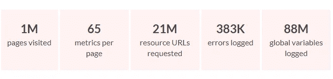

你能做得比我们的分析更好吗？我们[向 Kaggle](https://www.kaggle.com/indexhtml/web-performance-metrics) 发布了数据集，所以你可以自己处理数据。

# 为什么要渲染一百万个网页？

如今一种普遍的感觉是，网络比 15 年前慢了，也更麻烦了。由于不断增长的 JavaScript 和框架、web 字体和 polyfills，我们已经吃掉了更快的计算机、网络和协议给我们带来的所有好处。或者说论点是这样的。我们想验证这是否是真的，并试图找出导致 2020 年网站运行缓慢和崩溃的常见因素。

高级计划很简单:编写一个 web 浏览器脚本，让它呈现前 100 万个域名的根页面，并记录每一个可以想到的指标:呈现时间、请求计数、重画、JavaScript 错误、使用的库等。有了这些数据，我们就可以提出一个因素与另一个因素如何相关的问题。哪些因素对缓慢的渲染时间影响最大？哪些库与长时间交互相关？最常见的错误是什么，是什么导致了这些错误？

收集数据就是写一些代码来使用 Puppeteer 编写 Chrome，启动 200 个 EC2 实例，在周末渲染 100 万个网页，并祈祷你已经真正理解了 AWS 定价的工作原理。

# 总人数

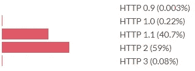

根 HTML 文档使用的协议

HTTP 2 现在比 HTTP 1.1 更常见，但 HTTP 3 仍然很少见。(注意:我们把使用 QUIC 协议的任何东西都算作 HTTP 3，即使 Chrome 有时会把这种情况报告为 HTTP 2 + QUIC。)这是针对根文档的，对于链接的资源，协议号看起来有点不同。

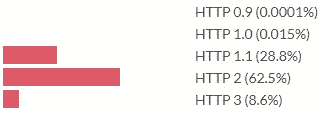

**用于链接资源的协议**

对于链接资源来说，HTTP 3 要普遍 100 倍。这怎么可能是真的？因为所有的网站都在链接相同的东西:

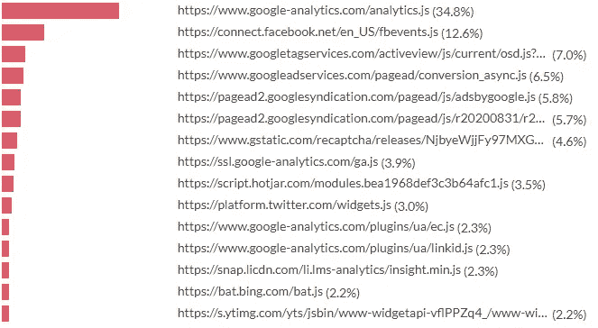

**顶级链接网址**

有一些脚本链接到大部分网站上。这意味着我们可以预期这些资源在缓存中，对吗？不再是了:从 Chrome 86 开始，从不同域请求的[资源将不会共享一个缓存](https://developers.google.com/web/updates/2020/10/http-cache-partitioning)。Firefox 正计划实现同样的功能。Safari 多年来一直这样分割缓存。

# 是什么让网络变慢:预测互动时间

给定这个 web 页面的数据集和它们的加载时间度量，了解一下是什么使 web 页面变慢会很好。我们将研究 dominteractive 指标，即文档与用户交互之前所花费的时间。我们可以做的最简单的事情就是查看每个指标与 dominteractive 的相关性。

*指标与显性指标的相关性*

基本上每个指标都与 dominteractive 正相关，除了表示 HTTP2 或更大的 0–1 变量。这些指标中有许多也是相互正相关的。我们需要一种更复杂的方法来获得导致高交互时间的单个因素。

一些指标是计时，以毫秒为单位。我们可以通过观察他们的方框图来了解浏览器在哪里花费时间。

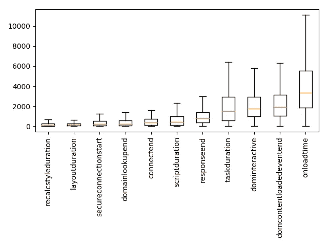

*计时指标的箱线图。橙色线是中间值，方框从第 25 个百分点到第 75 个百分点。*

获得导致高交互时间的单个因素的一种方法是进行线性回归，其中我们从其他指标预测显性交互。这意味着我们为每个指标分配一个权重，并将页面的支配性活动时间建模为其他指标的加权总和，再加上一些常数。优化算法设置权重，以便最小化整个数据集的预测误差。回归得到的权重大小告诉我们每个指标对页面速度的影响有多大。

我们将从回归中排除计时指标。如果我们花费 500 毫秒建立一个连接，这将增加 500 毫秒的支配性活动，但这不是一个特别有趣的见解。时间度量从根本上来说是*结果*。我们想知道是什么导致了它们。

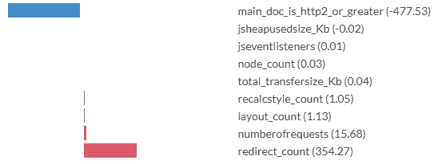

**指标的回归系数，预测显性**

括号中的数字是优化算法学习到的回归系数。你可以把它们解释为以毫秒为单位。虽然确切的数字应持保留态度(见下面的注释)，但有趣的是看到每个功能的规模分配。例如，该模型预测传递主文档所需的每一次重定向的速度会降低 354 毫秒。每当主 HTML 文档通过 HTTP2 或更高版本交付时，该模型预测交互时间减少 477 毫秒。对于由文档触发的每个请求，它预测额外的 16 ms。

> 在解释回归系数时，我们需要记住，我们是在现实的简化模型上操作。实际上，交互时间不是由这些输入指标的加权和决定的。很明显，有一些因果因素是这个模型无法发现的。混淆变量显然是一个问题。例如，如果用 HTTP2 加载主文档与通过 HTTP2 加载其他请求相关，那么模型将把这种优势转化为 main_doc_is_http2_or_greater 的权重，即使速度的提高来自于主文档以外的请求。当把模型所说的映射到关于现实的结论上时，我们需要谨慎。

# HTTP 协议版本对 dominteractive 有什么影响？

这里有一个有趣的 dominteractive split 图，它是由用于传递根 HTML 页面的 HTTP 协议版本划分的。

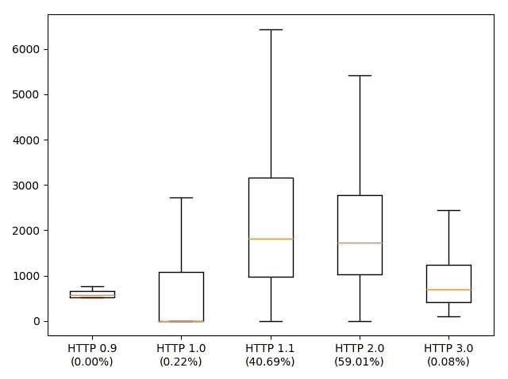

> *Box-plot of dominteractive split by HTTP 协议版本的第一个请求。橙色线是中间值，方框从第 25 个百分点到第 75 个百分点。括号中的百分比是使用此协议进行请求的比例。*

只有极少数网站仍然通过 HTTP 0.9 和 1.0 提供服务。而这些网站恰好很快。似乎我们无法解开这样一个事实，即协议已经变得更快，程序员会很高兴地通过向浏览器提供更多的东西来消耗这种加速。

这是用于传递根 HTML 页面的协议版本。如果我们看看该协议对该文档中链接的资源的影响会怎样？如果我们对协议版本的请求数量进行回归，我们会得到以下结果。

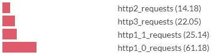

**协议版本请求数量的回归系数，预测支配性**

如果我们相信这一点，我们会得出这样的结论:将请求的资源从 HTTP 1.1 移动到 2 会带来 1.8 倍的速度提升，而从 HTTP 2 移动到 3 会导致 0.6 倍的速度降低。HTTP 3 真的是一种较慢的协议吗？不:一个更可能的解释是 HTTP 3 很少见，通过 HTTP 3 发送的少数资源(例如 Google Analytics)对 dominteractive 的影响大于平均水平。

# 内容类型对互动有什么影响？

让我们从传输的字节数来预测交互时间，按传输的数据类型划分。

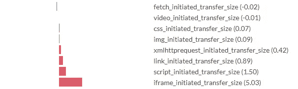

**请求发起者传输的千字节回归系数，预测支配性**

这里有一个类似的回归，这次查看每个请求发起者类型的请求数量。

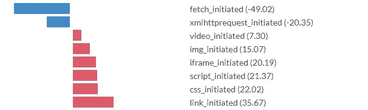

**请求发起者请求数量的回归系数，预测支配性**

在这里，请求根据发起请求的内容进行划分。显然，不是所有的要求都是平等的。由链接元素触发的请求(例如 CSS、favicons)和由 CSS(例如字体、更多 CSS)以及脚本和 iframes 触发的请求会大大降低速度。通过 XHR 和 fetch 进行请求预示着比基线更快的主交互时间(可能是因为这些请求几乎总是异步的)。CSS 和脚本通常以渲染阻塞的方式加载，所以发现它们与较慢的交互时间相关就不足为奇了。视频相对来说*便宜*。

# 外卖食品

我们在这里没有发现任何新的优化技巧，但是分析确实给出了各种优化的影响程度。以下主张似乎有很好的实证支持:

*   尽可能少提要求。请求的数量比传输的千字节数更重要。
*   对于您必须提出的请求，如果可能的话，通过 HTTP2 或更高版本来完成。
*   尽可能避免呈现阻塞请求，尽可能选择异步加载。

# 图书馆

为了弄清楚页面上使用的是什么库，我们采用了以下方法:在每个站点上，我们都记录了全局变量(即窗口对象上的属性)。之后，每一个出现超过 6000 次的全局变量都与一个 JavaScript 库相关联。这是一项艰苦的工作，但由于数据集也有每个页面请求的 URL，所以可以查看变量出现和 URL 请求之间的重叠，这通常足以确定哪个库将设置每个全局变量。不能确信与单个库相关联的全局变量被忽略。这种方法在某种程度上会计算不足:JS 库没有义务在全局名称空间中留下任何东西。每当不同的库设置相同的属性时，它也会有一些噪声，这一事实在标记时被忽略了。

目前最常用的 JavaScript 库有哪些？根据会议和博客帖子的主题，你会被原谅建议 React、Vue 和 Angular。在这个排名中，他们远未名列前茅。

# 使用最多的 10 个图书馆

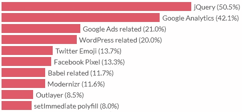

[使用](https://catchjs.com/Blog/PerformanceInTheWild#top-libs)查看完整的库列表

是的，老好人 jQuery 在最上面。JQuery 最早发布于 2006 年，以人类年计算是 14 年前，但以 JavaScript 年计算要长得多。以角度版本来衡量，大概是几百年前的版本。2006 年是一个不同的时代。最常用的浏览器叫做 Internet Explorer 6，最大的社交网络是 MySpace，网页中的圆角是一场革命，以至于人们称之为 web 2.0。JQuery 的主要用例是跨浏览器兼容性，与 2006 年相比，这在 2020 年是一个不同的概念。尽管如此，14 年后，我们样本中整整一半的网页加载了 jQuery。

有趣的是， [2.2%的网站抛出了一个错误，因为 JQuery 是*而不是*加载的。](https://catchjs.com/Docs/ReferenceError)

从这十大浏览器来看，我们的浏览器大多运行分析、广告和代码，以兼容旧浏览器。不知何故，8%的网站定义了 set immediate/clear immediate poly fill，用于任何浏览器都无法实现的功能。

# 从图书馆使用预测互动时间

我们将再次运行线性回归，从库的存在预测 dominteractive。回归的输入是向量 X，其中 X.length ==库的数量，其中如果库 I 存在，X[i] == 1.0，如果不存在，X[i] == 0.0。当然，我们知道 dominteractive 实际上并不是由某些库的存在与否决定的。然而，将每个库建模为对速度缓慢有额外贡献，并回归成千上万个例子仍然给我们留下有趣的发现。

# 交互时间最好和最差的库，通过回归系数

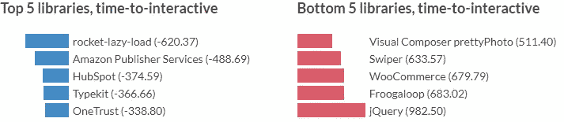

[通过回归系数预测优势互动查看完整的库列表](https://catchjs.com/Blog/PerformanceInTheWild#pred-tti2)

这里的负系数意味着当这些库存在时，模型预测的交互时间比没有库存在时要短。当然，这并不意味着添加那些库会使你的网站更快，这只是意味着有那些库的网站恰好比模型建立的一些基线更快。这里的结果可能既是技术性的，也是社会学的。例如，用于延迟加载的库预测低交互时间。这可能是因为使用这些库的页面是由花时间优化快速页面加载的程序员制作的，因为这是由延迟加载直接导致的。我们无法用这种结构来理清这些因素。

# 加载时间最好和最差的库，通过回归系数

我们可以重复上面的练习，但是这次预测 onloadtime。Onloadtime 是窗口的“load”事件触发所需的时间，也就是页面上所有资源加载所需的时间。我们用和以前一样的方法做线性回归。

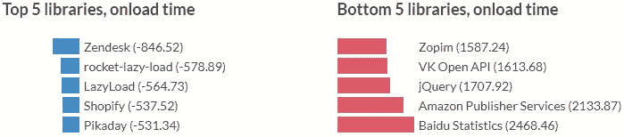

[通过预测加载时间的回归系数查看完整的库列表](https://catchjs.com/Blog/PerformanceInTheWild#pred-onl)

# jsheapusedsize 的最佳和最差库，按回归系数

这里预测的是 JavaScript 使用的堆大小，以兆字节为单位。

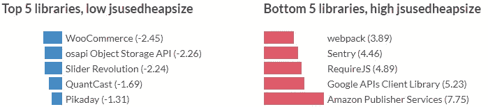

[通过回归系数预测 jsheapusedsize 查看完整的库列表](https://catchjs.com/Blog/PerformanceInTheWild#pred-jsh)

互联网评论者喜欢说相关性不等于因果关系，事实上我们无法通过这些模型直接得到因果关系。在解释这些系数时应该非常小心，特别是因为可能涉及许多混淆因素。然而，肯定有足够的东西让你“嗯”了一声。事实上，该模型将 982 毫秒的交互时间与 jQuery 的存在联系起来，并且有一半的站点加载该脚本，这应该引起我们的一些关注。如果你正在优化你自己的站点，交叉引用它的依赖列表和这里的等级和系数应该会给你一个体面的指示，哪个依赖移除可以让你得到最大的回报。

您可能也会对我们对爬行中发现的错误的深入探究感兴趣。参见我们关于[野生 JavaScript 错误](https://catchjs.com/Blog/ErrorsInTheWild)的文章，我们分析了发现的错误，并讨论了它们能告诉我们关于 web 技术如何发展以创造更少错误的未来。

*原载于*[*https://catchjs.com*](https://catchjs.com/Blog/PerformanceInTheWild)*。*