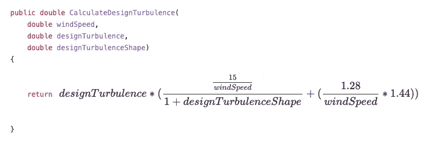
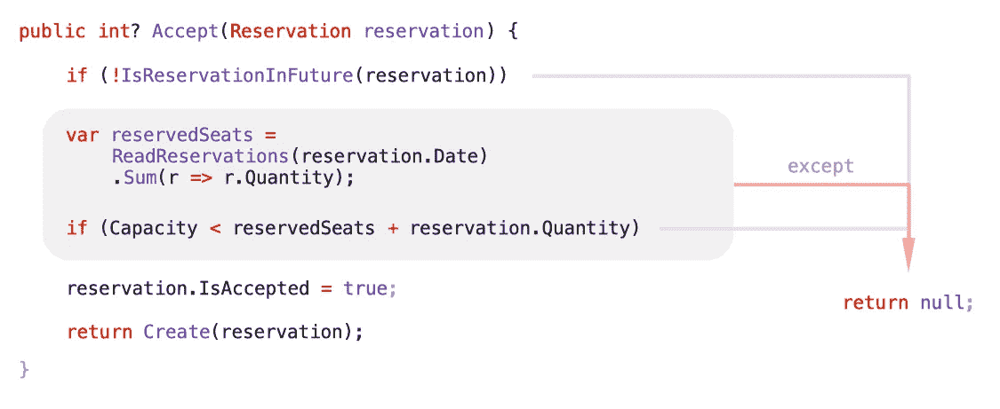
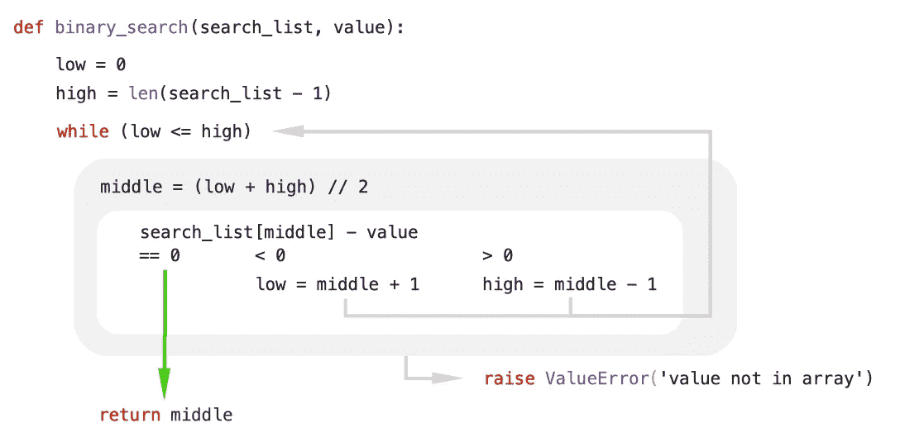
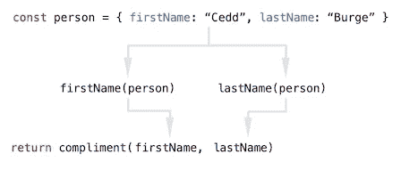

# 我们应该按需格式化代码

> 原文：<https://itnext.io/we-should-format-code-on-demand-8c15c5de449e?source=collection_archive---------1----------------------->

目前我们的源代码保存在已经格式化的磁盘上，我们的编辑器显示这种保存的格式。有许多自动格式化工具，但是结果总是被保存回磁盘。如果我们保存到一个标准化的文本表示，而不是在编辑器中按需格式化代码，会发生什么？

大多数编辑器/ide 将不得不同意将代码保存到相同的标准化表示中，这将因语言而异，但之后会有很多好处。

标准化的表示可能是文本和有效的可编译代码，因此它是人类可读的，并且所有现有的工具仍然工作。

# 没有自行车脱落

不需要任何[自行车脱落](https://en.wiktionary.org/wiki/bikeshedding)，不需要讨论是否使用制表符或空格，或分号，或括号。

你不需要同意一个[最大行长度](https://eslint.org/docs/rules/max-len)或者一个[优选行长度](https://prettier.io/docs/en/options.html)，行长度可以响应你的编辑器窗口的当前大小。

团队不需要就使用哪种代码格式化程序或其设置达成一致。样式指南是不必要的(至少对于格式和空白)。

自动格式化工具的作者不需要获得广泛的共识，这是[经常激烈辩论的事情](https://discourse.elm-lang.org/t/hi-elmers-lets-talk-about-elms-code-formatting/2012)。

相反，每个团队成员可以选择以他们喜欢的格式查看代码，只要编辑器/自动格式化工具支持它。

# Git 中没有空格或格式变化

因为我们保存到一个标准化的表示，没有空白或格式变化被保存。

这反过来意味着这些变化不会出现在 Git diffs 中，这使得审查更容易，并减少了冲突的机会。

同样，如果您在您的编辑器(或其他支持它的工具)中查看/检查差异，那么您可以在您喜欢的任何格式中看到变化。

# 标准表示可以针对 Git 进行优化

由于标准化表示主要由计算机使用，我们可以对其进行优化，以进一步改善 Git 差异并减少冲突的可能性。

标准化的表示法可以垂直排列代码，每一行都是独立的。

使用下面的代码布局，一个人可以编辑函数名，另一个人可以添加/删除/重命名参数，并且更改会发生在不同的行上。这使得很容易发现差异，并且不会导致合并冲突。

通常人们更喜欢看到这样的代码写在一行中，如果一个人编辑函数名，另一个人添加/删除/重命名参数，这确实会导致冲突。

# 您可以使用压缩格式进行概述

当你第一次阅读一个大文件时，你可以使用压缩格式，以便在每一页上看到更多的代码，甚至可以在一页上看到所有的代码。这种格式可以显示最少量的空白，并尽可能在同一行上组合代码，并可能进行更积极的格式化，例如:

*   隐藏错误/异常处理代码以突出快乐之路
*   隐藏真正高级视图的函数体/参数
*   只需在 React 中显示 jsx 代码，突出显示组件树结构
*   使用更大的字体来突出函数名
*   用等效符号(`<$>`、`<*>`、`<>`等)替换哈斯克尔运算符(`fmap`、`apply`、`mappend`等)

下面的代码最初是 90 行，但是如果我们使用压缩格式并隐藏异常处理代码，它可以显示 35 行。如果我们真的积极使用空白，甚至可以减少到 25 个。

这不是我在编辑代码、调试代码或试图寻找丢失的花括号时希望看到的格式，但它对获得概述非常有用。在上面的例子中，很容易一眼就看出代码试图做什么以及它是如何试图做的。

# 您可以使用扩展格式来获取详细信息

在开发时，尤其是在调试时，经常需要理解代码的每个细节，为此，使用扩展格式是有用的。有很多次，我错过了代码的重要细微差别，只是因为代码很难扫描，我的眼睛跳过了一些东西，或者没有看到一些东西。

如果我们使用扩展的格式，我们可以使代码易于浏览，并且很难遗漏任何细节。代码占用了更多的垂直屏幕空间，但是这通常是可以的，因为我们只看一小部分代码。

下面的代码清楚地表明`DesignTurbulence`是被计算的，但是计算的细节更难理解

如果我们使用展开的格式，就更容易看到发生了什么，以及哪些括号匹配。在重要的情况下，这种格式甚至可以添加括号和缩进，以使操作符的优先级更加清晰。下面的格式为`1.28 / windSpeed * 1.44`添加了括号和缩进，因为除法运算符的优先级高于乘法运算符，这是您在查看更紧凑的格式时很容易忽略或忘记的。

编辑器甚至可以用数学格式显示这些代码，大多数人会觉得更清晰。当原始计算以相同的格式显示时(这是常见的)，这也将使对照原始计算检查代码变得更加容易。

这对于任何事情都是有用的，不仅仅是计算。在许多情况下，操作符的优先级和结合性并不明显。这个[类型脚本操作符优先级表](https://www.tektutorialshub.com/typescript/operator-precedence-in-typescript/#operator-precedence-associativity-table)，有超过 60 个操作符，足以吓到任何程序员。大多数语言需要自由使用各种括号，在复杂的表达式中，通常很难看出哪些括号匹配。在大多数编辑器中，你可以将鼠标悬停在一个上面来查看它的匹配情况，但是这既慢又费力。它要求你记住这些匹配，并有针对性地寻找它们。一个扩展的格式可以让所有这些立刻变得显而易见，让你不需要额外的努力就可以很容易地完全理解代码。

# 视觉流程可以匹配逻辑流程

下面的代码从上到下读，但是在代码中的 3 个点有早期返回语句，逻辑流程跳到结尾。这是一个相当简单的案例，并且相对容易搞清楚发生了什么，但是事情仍然可能被忽略，并且仍然会占用一些精神开销，这些开销可以更好地应用到我们试图解决的实际问题中。

如果我们使用一种将视觉流与逻辑流相匹配的格式，我们将得到类似下面的例子。在这种格式中，我们不再需要自己设计逻辑流程，代码看起来更清晰，因为所有的东西都是水平对齐的。作为一个附带的好处，它也占用更少的屏幕空间。

在许多其他情况下，这也是有用的。

一个`if` / `else`表达式可以并排显示两个分支，可能在左边显示`true`分支(假设`true`是主要情况)。当有空间时，Case 语句可以水平散开。For 循环可以用流程图格式显示初始值、结束条件和重复条件，这将使一个接一个的错误更容易发现。对于`while`和其他循环也可以做类似的事情。

以下示例显示了 python 中二分搜索法函数的外观:

# 从右到左语言

如果一个字符串包含的每个字母不超过一个，那么它就是一个等值图，下面的 Haskell 代码就是这样计算的。

在 Haskell 中，代码流是从右到左的，这让不习惯的人感到困惑，大多数本地的从左到右读者会发现更容易理解下面的代码是如何工作的。这在 Haskell 中是不合法的，但是编辑器没有理由不能以这种方式显示它。

所有语言也可以反过来做，以减少母语是从右向左读的人的困惑。

# 函数式编程

我是函数式编程的忠实粉丝，很多学习函数式编程的人也是如此。当代码正在编译和运行时，它通常非常优雅、富于表现力且易于阅读，即使对于初学者也是如此。然而，如果它不起作用，我有时会发现很难看出问题出在哪里，这对初学者来说肯定是很难写的。

除非你熟悉函数范例和来自 [rambda](https://ramdajs.com/docs/#converge) 的`converge`函数，否则不可能理解这段代码做什么。

但是，如果编辑器知道 converge 函数，或者能够遵循函数的流程，它可以显示如下代码。

这使得代码流立即变得明显，并且会突出任何问题。在这个例子中，现在很清楚`firstName`和`lastName`应该都是接受单个对象参数的函数，而`compliment`应该接受两个参数。我们还可以很容易地验证由`firstName`和`lastName`函数返回的类型与`compliment`所期望的类型相匹配。

# 结论

目前编辑器严格地显示保存在磁盘上的文本，但是如果我们允许在代码显示上有一些灵活性，我们可以使用类似上面的格式，这将带来显著的改进。

也有可能走中间路线，使用按需格式化，但不保存为标准化表示。这使得采用变得更加容易，因为您可以在没有任何承诺的情况下尝试它，不会影响团队的其他成员，并且只有您正在使用的工具需要支持它。您仍然可以获得很多好处，只是错过了 git 优化。在这个领域，JetBrains MPS 值得一看。