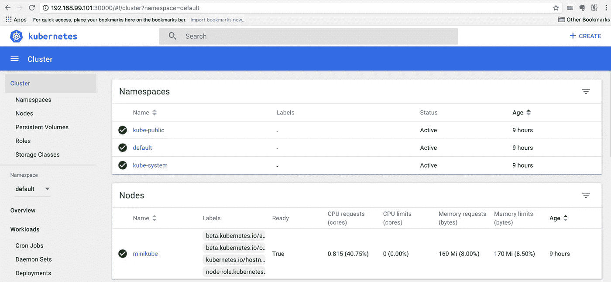
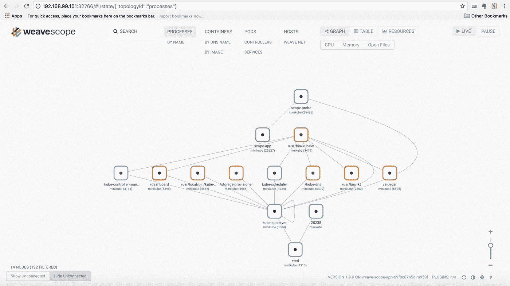

# 当地发展的编织范围+迷你库贝(麦克·OSX)

> 原文：<https://itnext.io/weave-scope-minikube-for-local-development-mac-osx-be6019a819a0?source=collection_archive---------7----------------------->

定义

*   [Minikube](https://kubernetes.io/docs/getting-started-guides/minikube/) —在笔记本电脑上的虚拟机中运行单节点 Kubernetes 集群，供希望尝试 Kubernetes 或使用它进行日常开发的用户使用。
*   [Weave Scope](https://www.weave.works/oss/scope/)—Docker 和 Kubernetes 的可视化和监控工具。它提供了对您的应用以及整个基础架构的自上而下的视图，并允许您在将分布式容器化应用部署到云提供商时，实时诊断其存在的任何问题。

步骤 1 —安装 kubectl。

```
$ brew install kubectl

Verify
$ ls -la /usr/local/Cellar/ | grep kubernetes
drwxr-xr-x   3 sai   admin  102 Jan 21 17:26 kubernetes-cli
```

步骤 2 —安装 Minikube。

```
$ brew cask install minikube

==> Downloading https://storage.googleapis.com/minikube/releases/v0.26.1/minikube-darwin-amd64
######################################################################## 100.0%
==> Verifying checksum for Cask minikube
==> Installing Cask minikube
==> Linking Binary 'minikube-darwin-amd64' to '/usr/local/bin/minikube'.
🍺  minikube was successfully installed!

$ ls -la /usr/local/Caskroom/minikube/
total 0
drwxr-xr-x  4 sai  admin  136 Apr 20 01:51 .
drwxrwxr-x  4 sai  admin  136 Apr 20 01:51 ..
drwxr-xr-x  3 sai  admin  102 Apr 20 01:51 .metadata
drwxr-xr-x  3 sai  admin  102 Apr 20 01:51 0.26.1

$ ls -la /usr/local/bin/ | grep mini
lrwxr-xr-x    1 sai   admin        57 Apr 20 01:51 minikube -> /usr/local/Caskroom/minikube/0.26.1/minikube-darwin-amd64
lrwxr-xr-x    1 sai   admin        76 Apr 19 00:52 minishift -> /usr/local/Caskroom/minishift/1.15.1/minishift-1.15.1-darwin-amd64/minishift

$ minikube version
minikube version: v0.26.1

$ ls -la .minikube
ls: .minikube: No such file or directory
```

步骤 3 —启动 Minikube(请确保已经安装并启动了虚拟箱)

```
$ minikube start
Starting local Kubernetes v1.10.0 cluster...
Starting VM...
Downloading Minikube ISO
 150.53 MB / 150.53 MB [============================================] 100.00% 0s
Getting VM IP address...
Moving files into cluster...
Downloading kubeadm v1.10.0
Downloading kubelet v1.10.0
Finished Downloading kubelet v1.10.0
Finished Downloading kubeadm v1.10.0
Setting up certs...
Connecting to cluster...
Setting up kubeconfig...
Starting cluster components...
Kubectl is now configured to use the cluster.
Loading cached images from config file.
```

步骤 4 —验证我们的集群总体健康的好方法。

```
$ kubectl get componentstatuses
NAME                 STATUS    MESSAGE              ERROR
controller-manager   Healthy   ok                  
scheduler            Healthy   ok                  
etcd-0               Healthy   {"health": "true"}  

$ kubectl get nodes
NAME       STATUS    ROLES     AGE       VERSION
minikube   Ready     master    9m        v1.10.0
```

注意:

控制器管理器确保服务的所有副本都是可用和健康的。schedular 负责将不同的 pod 放在集群中的不同节点上。etcd 服务器是存储所有 API 对象的集群的存储器。

步骤 5 —验证名称空间(默认，kube-public，kube-system)

```
$ kubectl get namespaces
NAME          STATUS    AGE
default       Active    12m
kube-public   Active    12m
kube-system   Active    12m
```

步骤 6 —验证所有名称空间中的所有资源(ds、deploy、rs、po、svc)。

```
$ kubectl get all --all-namespaces
NAMESPACE     NAME            DESIRED   CURRENT   READY     UP-TO-DATE   AVAILABLE   NODE SELECTOR   AGE
kube-system   ds/kube-proxy   1         1         1         1            1           <none>          15m

NAMESPACE     NAME                          DESIRED   CURRENT   UP-TO-DATE   AVAILABLE   AGE
kube-system   deploy/kube-dns               1         1         1            1           15m
kube-system   deploy/kubernetes-dashboard   1         1         1            1           15m

NAMESPACE     NAME                                 DESIRED   CURRENT   READY     AGE
kube-system   rs/kube-dns-86f4d74b45               1         1         1         15m
kube-system   rs/kubernetes-dashboard-5498ccf677   1         1         1         15m

NAMESPACE     NAME                                       READY     STATUS    RESTARTS   AGE
kube-system   po/etcd-minikube                           1/1       Running   0          14m
kube-system   po/kube-addon-manager-minikube             1/1       Running   0          15m
kube-system   po/kube-apiserver-minikube                 1/1       Running   0          15m
kube-system   po/kube-controller-manager-minikube        1/1       Running   0          14m
kube-system   po/kube-dns-86f4d74b45-rn77t               3/3       Running   0          15m
kube-system   po/kube-proxy-54grl                        1/1       Running   0          15m
kube-system   po/kube-scheduler-minikube                 1/1       Running   0          14m
kube-system   po/kubernetes-dashboard-5498ccf677-76m4p   1/1       Running   0          15m
kube-system   po/storage-provisioner                     1/1       Running   0          15m

NAMESPACE     NAME                       TYPE        CLUSTER-IP     EXTERNAL-IP   PORT(S)         AGE
default       svc/kubernetes             ClusterIP   10.96.0.1      <none>        443/TCP         15m
kube-system   svc/kube-dns               ClusterIP   10.96.0.10     <none>        53/UDP,53/TCP   15m
kube-system   svc/kubernetes-dashboard   NodePort    10.100.206.6   <none>        80:30000/TCP    15m
```

步骤 7 —让我们探索 kubernetes 组件的细节。

```
$ kubectl get nodes
NAME       STATUS    ROLES     AGE       VERSION
minikube   Ready     master    19m       v1.10.0

$ kubectl describe nodes minikube
Name:               minikube
Roles:              master
Labels:             beta.kubernetes.io/arch=amd64
                    beta.kubernetes.io/os=linux
                    kubernetes.io/hostname=minikube
                    node-role.kubernetes.io/master=
Annotations:        node.alpha.kubernetes.io/ttl=0
                    volumes.kubernetes.io/controller-managed-attach-detach=true
Taints:             <none>
CreationTimestamp:  Fri, 20 Apr 2018 02:05:02 +0800
Conditions:
  Type             Status  LastHeartbeatTime                 LastTransitionTime                Reason                       Message
  *----             ------  -----------------                 ------------------                ------                       -------*
  OutOfDisk        False   Fri, 20 Apr 2018 02:24:25 +0800   Fri, 20 Apr 2018 02:04:44 +0800   KubeletHasSufficientDisk     kubelet has sufficient disk space available
  MemoryPressure   False   Fri, 20 Apr 2018 02:24:25 +0800   Fri, 20 Apr 2018 02:04:44 +0800   KubeletHasSufficientMemory   kubelet has sufficient memory available
  DiskPressure     False   Fri, 20 Apr 2018 02:24:25 +0800   Fri, 20 Apr 2018 02:04:44 +0800   KubeletHasNoDiskPressure     kubelet has no disk pressure
  PIDPressure      False   Fri, 20 Apr 2018 02:24:25 +0800   Fri, 20 Apr 2018 02:04:44 +0800   KubeletHasSufficientPID      kubelet has sufficient PID available
  Ready            True    Fri, 20 Apr 2018 02:24:25 +0800   Fri, 20 Apr 2018 02:04:44 +0800   KubeletReady                 kubelet is posting ready status
Addresses:
  InternalIP:  
  Hostname:    minikube
Capacity:
 cpu:                2
 ephemeral-storage:  16888216Ki
 hugepages-2Mi:      0
 memory:             2048052Ki
 pods:               110
Allocatable:
 cpu:                2
 ephemeral-storage:  15564179840
 hugepages-2Mi:      0
 memory:             1945652Ki
 pods:               110
System Info:
 Machine ID:                 43326e10eee04511b72c5b8e937483b3
 System UUID:                1A90BACA-DC70-4DFB-9540-A38C5C37A12B
 Boot ID:                    2101ef66-2569-4f84-a2c4-9bba07e07614
 Kernel Version:             4.9.64
 OS Image:                   Buildroot 2017.11
 Operating System:           linux
 Architecture:               amd64
 Container Runtime Version:  docker://17.12.1-ce
 Kubelet Version:            v1.10.0
 Kube-Proxy Version:         v1.10.0
ExternalID:                  minikube
Non-terminated Pods:         (9 in total)
  Namespace                  Name                                     CPU Requests  CPU Limits  Memory Requests  Memory Limits
  *---------                  ----                                     ------------  ----------  ---------------  -------------*
  kube-system                etcd-minikube                            0 (0%)        0 (0%)      0 (0%)           0 (0%)
  kube-system                kube-addon-manager-minikube              5m (0%)       0 (0%)      50Mi (2%)        0 (0%)
  kube-system                kube-apiserver-minikube                  250m (12%)    0 (0%)      0 (0%)           0 (0%)
  kube-system                kube-controller-manager-minikube         200m (10%)    0 (0%)      0 (0%)           0 (0%)
  kube-system                kube-dns-86f4d74b45-rn77t                260m (13%)    0 (0%)      110Mi (5%)       170Mi (8%)
  kube-system                kube-proxy-54grl                         0 (0%)        0 (0%)      0 (0%)           0 (0%)
  kube-system                kube-scheduler-minikube                  100m (5%)     0 (0%)      0 (0%)           0 (0%)
  kube-system                kubernetes-dashboard-5498ccf677-76m4p    0 (0%)        0 (0%)      0 (0%)           0 (0%)
  kube-system                storage-provisioner                      0 (0%)        0 (0%)      0 (0%)           0 (0%)
Allocated resources:
  (Total limits may be over 100 percent, i.e., overcommitted.)
  CPU Requests  CPU Limits  Memory Requests  Memory Limits
  *------------  ----------  ---------------  -------------*
  815m (40%)    0 (0%)      160Mi (8%)       170Mi (8%)
Events:
  Type    Reason                   Age                From                  Message
  *----    ------                   ----               ----                  -------*
  Normal  NodeHasSufficientPID     19m (x5 over 19m)  kubelet, minikube     Node minikube status is now: NodeHasSufficientPID
  Normal  NodeAllocatableEnforced  19m                kubelet, minikube     Updated Node Allocatable limit across pods
  Normal  NodeHasSufficientDisk    19m (x6 over 19m)  kubelet, minikube     Node minikube status is now: NodeHasSufficientDisk
  Normal  NodeHasSufficientMemory  19m (x6 over 19m)  kubelet, minikube     Node minikube status is now: NodeHasSufficientMemory
  Normal  NodeHasNoDiskPressure    19m (x6 over 19m)  kubelet, minikube     Node minikube status is now: NodeHasNoDiskPressure
  Normal  Starting                 19m                kube-proxy, minikube  Starting kube-proxy
```

注意:

kubernetes 系统组件有两种类型:

1.  **那些运行在容器中的**(例如:kubernetes 调度程序和 kube-proxy 运行在容器中)
2.  **那些不在容器中运行的**(比如:kubelet 和容器运行时，比如 Docker，不在容器中运行。)

*   Kubernetes 的一个有趣的方面是，构成 Kubernetes 集群的许多组件实际上都是使用 Kubernetes 本身部署的。
*   所有这些组件都运行在 kube-system 名称空间中。
*   Kubernetes 中的名称空间是组织 Kubernetes 资源的实体。你可以把它想象成文件系统中的一个文件夹。
*   集群组件(kube-proxy、kube-dns、kubernetes-dashboard)

请注意步骤 7 输出中的以下内容:

*   内部 IP。
*   我们能处理多少个豆荚。
*   容器运行时。
*   Kubelet 版本:v1.10.0
*   kube-代理版本:v1.10.0

步骤 8-探索 Kubernetes Docker 容器图像和流程。

```
$ eval $(minikube docker-env)$ docker images
REPOSITORY                                 TAG                 IMAGE ID            CREATED             SIZE
k8s.gcr.io/kube-proxy-amd64                v1.10.0             bfc21aadc7d3        3 weeks ago         97MB
k8s.gcr.io/kube-controller-manager-amd64   v1.10.0             ad86dbed1555        3 weeks ago         148MB
k8s.gcr.io/kube-apiserver-amd64            v1.10.0             af20925d51a3        3 weeks ago         225MB
k8s.gcr.io/kube-scheduler-amd64            v1.10.0             704ba848e69a        3 weeks ago         50.4MB
k8s.gcr.io/etcd-amd64                      3.1.12              52920ad46f5b        5 weeks ago         193MB
k8s.gcr.io/kube-addon-manager              v8.6                9c16409588eb        8 weeks ago         78.4MB
k8s.gcr.io/k8s-dns-dnsmasq-nanny-amd64     1.14.8              c2ce1ffb51ed        3 months ago        41MB
k8s.gcr.io/k8s-dns-sidecar-amd64           1.14.8              6f7f2dc7fab5        3 months ago        42.2MB
k8s.gcr.io/k8s-dns-kube-dns-amd64          1.14.8              80cc5ea4b547        3 months ago        50.5MB
k8s.gcr.io/pause-amd64                     3.1                 da86e6ba6ca1        4 months ago        742kB
k8s.gcr.io/kubernetes-dashboard-amd64      v1.8.1              e94d2f21bc0c        4 months ago        121MB
k8s.gcr.io/kube-addon-manager              v6.5                d166ffa9201a        5 months ago        79.5MB
gcr.io/k8s-minikube/storage-provisioner    v1.8.0              4689081edb10        5 months ago        80.8MB
gcr.io/k8s-minikube/storage-provisioner    v1.8.1              4689081edb10        5 months ago        80.8MB
k8s.gcr.io/k8s-dns-sidecar-amd64           1.14.4              38bac66034a6        9 months ago        41.8MB
k8s.gcr.io/k8s-dns-kube-dns-amd64          1.14.4              a8e00546bcf3        9 months ago        49.4MB
k8s.gcr.io/k8s-dns-dnsmasq-nanny-amd64     1.14.4              f7f45b9cb733        9 months ago        41.4MB
k8s.gcr.io/etcd-amd64                      3.0.17              243830dae7dd        14 months ago       169MB
k8s.gcr.io/pause-amd64                     3.0                 99e59f495ffa        23 months ago       747kB

$ docker ps
CONTAINER ID        IMAGE                                     COMMAND                  CREATED             STATUS              PORTS               NAMES
a27093ed58ff        k8s.gcr.io/k8s-dns-sidecar-amd64          "/sidecar --v=2 --lo…"   9 hours ago         Up 9 hours                              k8s_sidecar_kube-dns-86f4d74b45-rn77t_kube-system_36757013-43fc-11e8-9bdc-0800276018ee_0
93e87edc11c1        k8s.gcr.io/k8s-dns-dnsmasq-nanny-amd64    "/dnsmasq-nanny -v=2…"   9 hours ago         Up 9 hours                              k8s_dnsmasq_kube-dns-86f4d74b45-rn77t_kube-system_36757013-43fc-11e8-9bdc-0800276018ee_0
80b0fbcebc0a        gcr.io/k8s-minikube/storage-provisioner   "/storage-provisioner"   9 hours ago         Up 9 hours                              k8s_storage-provisioner_storage-provisioner_kube-system_37b1857a-43fc-11e8-9bdc-0800276018ee_0
b86a2fc20271        k8s.gcr.io/k8s-dns-kube-dns-amd64         "/kube-dns --domain=…"   9 hours ago         Up 9 hours                              k8s_kubedns_kube-dns-86f4d74b45-rn77t_kube-system_36757013-43fc-11e8-9bdc-0800276018ee_0
c66159f7bbb1        e94d2f21bc0c                              "/dashboard --insecu…"   9 hours ago         Up 9 hours                              k8s_kubernetes-dashboard_kubernetes-dashboard-5498ccf677-76m4p_kube-system_379d25df-43fc-11e8-9bdc-0800276018ee_0
9655a81c4774        k8s.gcr.io/pause-amd64:3.1                "/pause"                 9 hours ago         Up 9 hours                              k8s_POD_storage-provisioner_kube-system_37b1857a-43fc-11e8-9bdc-0800276018ee_0
181c18376710        k8s.gcr.io/pause-amd64:3.1                "/pause"                 9 hours ago         Up 9 hours                              k8s_POD_kubernetes-dashboard-5498ccf677-76m4p_kube-system_379d25df-43fc-11e8-9bdc-0800276018ee_0
059dbffd77a8        bfc21aadc7d3                              "/usr/local/bin/kube…"   9 hours ago         Up 9 hours                              k8s_kube-proxy_kube-proxy-54grl_kube-system_36602bab-43fc-11e8-9bdc-0800276018ee_0
e01bd0019c54        k8s.gcr.io/pause-amd64:3.1                "/pause"                 9 hours ago         Up 9 hours                              k8s_POD_kube-dns-86f4d74b45-rn77t_kube-system_36757013-43fc-11e8-9bdc-0800276018ee_0
c228bc6a08f2        k8s.gcr.io/pause-amd64:3.1                "/pause"                 9 hours ago         Up 9 hours                              k8s_POD_kube-proxy-54grl_kube-system_36602bab-43fc-11e8-9bdc-0800276018ee_0
13c7ead58a8a        k8s.gcr.io/kube-addon-manager             "/opt/kube-addons.sh"    9 hours ago         Up 9 hours                              k8s_kube-addon-manager_kube-addon-manager-minikube_kube-system_3afaf06535cc3b85be93c31632b765da_0
8d107a49bb35        k8s.gcr.io/etcd-amd64                     "etcd --trusted-ca-f…"   9 hours ago         Up 9 hours                              k8s_etcd_etcd-minikube_kube-system_81863d536a89394bba50bb73a89a992c_0
8e024c415b10        ad86dbed1555                              "kube-controller-man…"   9 hours ago         Up 9 hours                              k8s_kube-controller-manager_kube-controller-manager-minikube_kube-system_c99e025a9909fa42937a981a5e853e43_0
e97902f55311        704ba848e69a                              "kube-scheduler --ad…"   9 hours ago         Up 9 hours                              k8s_kube-scheduler_kube-scheduler-minikube_kube-system_31cf0ccbee286239d451edb6fb511513_0
de13a6d9497b        af20925d51a3                              "kube-apiserver --ad…"   9 hours ago         Up 9 hours                              k8s_kube-apiserver_kube-apiserver-minikube_kube-system_c194f2aea396d3629dd959cab3a6d123_0
cfc209637a86        k8s.gcr.io/pause-amd64:3.1                "/pause"                 9 hours ago         Up 9 hours                              k8s_POD_kube-scheduler-minikube_kube-system_31cf0ccbee286239d451edb6fb511513_0
8bcebf96710a        k8s.gcr.io/pause-amd64:3.1                "/pause"                 9 hours ago         Up 9 hours                              k8s_POD_kube-controller-manager-minikube_kube-system_c99e025a9909fa42937a981a5e853e43_0
a49adb604fb4        k8s.gcr.io/pause-amd64:3.1                "/pause"                 9 hours ago         Up 9 hours                              k8s_POD_kube-addon-manager-minikube_kube-system_3afaf06535cc3b85be93c31632b765da_0
4229e0627458        k8s.gcr.io/pause-amd64:3.1                "/pause"                 9 hours ago         Up 9 hours                              k8s_POD_kube-apiserver-minikube_kube-system_c194f2aea396d3629dd959cab3a6d123_0
40ad04db4e4b        k8s.gcr.io/pause-amd64:3.1                "/pause"                 9 hours ago         Up 9 hours                              k8s_POD_etcd-minikube_kube-system_81863d536a89394bba50bb73a89a992c_
```

步骤 9-访问 minikube 仪表板。

```
$ kubectl get pods -n kube-system -o wide | grep dashboard
kubernetes-dashboard-5498ccf677-76m4p   1/1       Running   0          9h        172.17.0.3   minikube

$ kubectl get svc -o wide
NAME         TYPE        CLUSTER-IP   EXTERNAL-IP   PORT(S)   AGE       SELECTOR
kubernetes   ClusterIP   10.96.0.1    <none>        443/TCP   9h        <none>

$ kubectl get svc -n kube-system -o wide
NAME                   TYPE        CLUSTER-IP     EXTERNAL-IP   PORT(S)         AGE       SELECTOR
kube-dns               ClusterIP   10.96.0.10     <none>        53/UDP,53/TCP   9h        k8s-app=kube-dns
kubernetes-dashboard   NodePort    10.100.206.6   <none>        80:30000/TCP    9h        app=kubernetes-dashboard

$ minikube dashboard
Opening kubernetes dashboard in default browser...
```



步骤 10——让我们在 Minikube 上部署 Weave Scope。

```
$ kubectl apply -f 'https://cloud.weave.works/k8s/scope.yaml' -n weave
Warning: kubectl apply should be used on resource created by either kubectl create --save-config or kubectl apply
namespace "weave" configured
serviceaccount "weave-scope" created
clusterrole "weave-scope" created
clusterrolebinding "weave-scope" created
deployment "weave-scope-app" created
service "weave-scope-app" created
daemonset "weave-scope-agent” created

$ kubectl get all -n weave
NAME                   DESIRED   CURRENT   READY     UP-TO-DATE   AVAILABLE   NODE SELECTOR   AGE
ds/weave-scope-agent   1         1         1         1            1           <none>          2m

NAME                     DESIRED   CURRENT   UP-TO-DATE   AVAILABLE   AGE
deploy/weave-scope-app   1         1         1            1           2m

NAME                            DESIRED   CURRENT   READY     AGE
rs/weave-scope-app-69f8c6745d   1         1         1         2m

NAME                                  READY     STATUS    RESTARTS   AGE
po/weave-scope-agent-wjdbb            1/1       Running   0          2m
po/weave-scope-app-69f8c6745d-m959f   1/1       Running   0          2m

NAME                  TYPE        CLUSTER-IP      EXTERNAL-IP   PORT(S)   AGE
svc/weave-scope-app   ClusterIP   10.97.176.123\.   <none>        80/TCP    2m

Change “ClusterIP” to “NodePort”
$ kubectl edit svc weave-scope-app -n weave

$ kubectl get svc  -n weave
NAME              TYPE       CLUSTER-IP      EXTERNAL-IP   PORT(S)        AGE
weave-scope-app   NodePort   10.97.176.123\.   <none>        80:32766/TCP   40
```

步骤 11-通过浏览器访问 Weave 范围。



编织范围

恭喜你！！！享受开发容器化的微服务应用程序，并通过 Weave Scope 控制它们。

请看:

*   [编织作品](https://www.weave.works/)
*   [Kubernetes](http://kubernetes.io/)