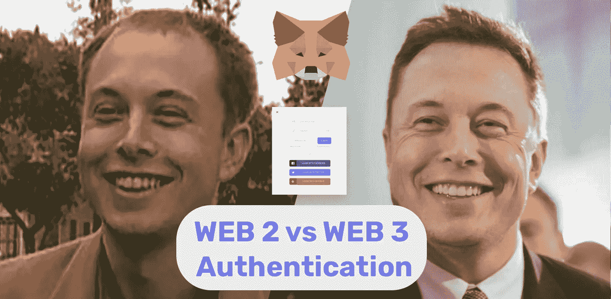
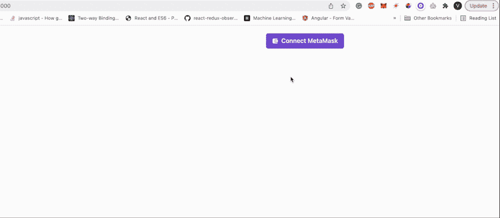

# 🔥2022 年的 Web 3.0 前端堆栈:使用 MetaMask、React、Next.js 和 Chakra UI 构建认证

> 原文：<https://itnext.io/web-3-0-frontend-stack-of-2022-building-authentication-with-metamask-reactjs-nextjs-and-5af2bf8c9de4?source=collection_archive---------0----------------------->

在本教程的几分钟后，你将与区块链世界建立联系🌐



# **内容**

*   [**简介**](#5cb3)
*   [**什么是 Web 3.0 认证？**](#be0f)
*   [**概念验证**](#d3e0)
*   [**动手实施**](#ed21)
*   [**结论**](#de3c)
*   [**了解更多**](#723b)

# 介绍

我们都知道传统的网络认证是如何工作的。通过 web 认证，我们理解了**基于令牌的认证。让我们回忆一下。为了理解基于令牌的认证，我们首先需要提醒自己什么是基于会话的。那么什么是基于会话的身份验证呢:**

*   客户端发送凭证，如**用户名**和**密码**；
*   服务器通过检查用户是否存在于数据库中来授权用户；
*   服务器创建会话 id 并将会话数据存储在数据库中；
*   服务器将会话 cookie(在 Set-Cookie 响应标头中)发送回客户端；
*   客户端存储 cookies 并发送带有 session-id 头的请求；
*   服务器验证来自客户端的会话 id 的有效性，并返回响应；

差不多就是这样，与基于令牌的身份验证的唯一区别是，在基于令牌的情况下，会话数据存储在客户端上**，通常存储在`localStorage`中，我们不需要占用数据库中的额外存储空间。**

现在让我们弄清楚 **Web 3.0 认证**是什么意思🤔？

# 什么是 Web 3.0 认证？

当我们谈论 Web 3.0 认证时，我们应该理解客户端是如何被授权连接到⛓的区块链的。每个*写* *请求*到区块链网络，或者**交易**(传输加密，部署智能合同，薄荷 NFT) **，**必须用客户端的**私钥授权。**私钥——是客户端的秘密密钥，你可以把它当成用户凭证。这样的一个浏览器扩展，像 [**元掩码**](https://metamask.io/) 一样，充当交易**签名者**和**提供者**。它将私有密钥安全地存储在浏览器中，并在客户端发出交易请求时签名，它还连接到区块链网络以获得区块链状态。

要详细阅读有关 Web 3.0 身份验证的更多信息，请在此处查看 Web 3.0 架构:

[](https://easy-web.medium.com/top-3-web-3-0-architecture-layers-explained-frontend-backend-and-data-e10200f7fc76) [## 解释了 Web3 架构的顶层:前端、后端和数据

### Web 3.0 架构可能会令人困惑，但我们会让理解变得清晰

easy-web.medium.com](https://easy-web.medium.com/top-3-web-3-0-architecture-layers-explained-frontend-backend-and-data-e10200f7fc76) 

# 概念证明

让我们仔细看看我们将要实现什么。这只是一个简单的**登录按钮**。点击后，我们将把**元掩码**和连接到其中一个测试区块链网络。我们也将能够在网络之间切换。这将是它的样子:



我们唯一的先决条件是安装 Metamask 浏览器扩展，你可以在这里找到[](https://chrome.google.com/webstore/detail/metamask/nkbihfbeogaeaoehlefnkodbefgpgknn?hl=en)**。**

**在这个项目中，我们将使用以下技术堆栈，我认为这是迄今为止 2022 年最好的 web 3.0 堆栈🤓**

*   **[**next . js**](https://nextjs.org/)**——这就像打了兴奋剂一样💪:混合静态&服务器渲染、智能捆绑、路由预取等等。****
*   ****[**【查克拉 UI】**](https://chakra-ui.com/)**——就像反应过来的自举。直观的模块化组件库。通过一整套组件，为您提供创建响应式设计布局所需的一切。******
*   ******[**meta mask**](https://metamask.io/)**—安全登录提供者和交易签名者，允许您连接到区块链网络。********
*   ******[**Thirdweb**](https://thirdweb.com/) —使 Web 3.0 开发民主化的 SDK。年轻项目🐣，但它有一个很棒的 API，支持大量 web 3.0 用例:NFT 市场、DAO、令牌创建等等。******
*   ****[😲；](https://react-icons.github.io/react-icons/)****

****让我们一起努力吧🏃‍♀****

# ******动手实施******

****让我们从创建一个文件夹`web3-auth`并初始化应用程序开始:****

```
**mkdir web3-auth
cd web3-auth
yarn create next-app ./ --ts**
```

****`./`意味着我们将在根目录下创建一个应用程序，而`--ts`——使用 typescript。您还需要将`package.json`中的名称改为****

```
**“name”: “web3-auth”,**
```

****下一步是安装所有依赖项:****

```
**yarn add @3rdweb/react @3rdweb/hooksyarn add @chakra-ui/react @emotion/react@^11 @emotion/styled@^11 framer-motion@^5yarn add react-icons**
```

****最后，让我们添加我们的钱包提供商，我们将只留下**元掩码**:****

****`web3-auth/pages/_app.tsx`****

****并在`web3-auth/pages/index.tsx`更新 UI****

****以上就是全部代码，以后你可以扩展支持更多类似 [**coinbase**](https://www.coinbase.com/wallet) 或者[**magic link**](https://magic.link/)**的钱包。**此外，你可以添加更多的链 id(区块链网络)，整个列表你可以在这里找到[](https://chainlist.org/)**，享受👍******

# ******结论******

******区块链开启了被称为 web3 的新一代应用。传统上，在更多的工具开始被开发出来之前，实现起来是有挑战性的。在发布[**third web**](https://thirdweb.com/)**之前，创建一个 web3 应用从未如此简单。它可以拓展你的创造力，激发出价值十亿美元的新想法💡********

> ****我希望你喜欢这篇文章，如果你学到了新的东西，请关注并订阅 **medium** 和 **twitter******

****让我们收集 1000 个👏在下一篇文章中，我们将在现有的应用程序中添加 NFT 造币功能。****

****[](https://easy-web.medium.com/subscribe) [## 每当维塔利·舍甫琴科发表文章时，就收到一封电子邮件。

### 每当维塔利·舍甫琴科发表文章时，就收到一封电子邮件。通过注册，您将创建一个中型帐户，如果您还没有…

easy-web.medium.com](https://easy-web.medium.com/subscribe) [](https://easy-web.medium.com/membership) [## 通过我的推荐链接加入 Medium 维塔利·舍甫琴科

### 作为一个媒体会员，你的会员费的一部分会给你阅读的作家，你可以完全接触到每一个故事…

easy-web.medium.com](https://easy-web.medium.com/membership) [](https://twitter.com/easy_web_org) [## JavaScript 不可用。

### 编辑描述

twitter.com](https://twitter.com/easy_web_org) 

咱们也接上 [**脸谱**](https://www.facebook.com/easyweb.org) 或 [**不和**](https://discord.gg/vQf4ydap) **。**

# 了解更多信息

[](/top-18-web-3-0-trends-every-frontend-developer-has-to-follow-in-2022-2861f9b63627) [## 🔥2022 年每个前端开发人员都必须遵循的 18 大 Web 3.0 趋势

### 这个列表将展示 Web 3.0 可以带来的新机会，并可能激发下一个百万美元的想法。😜

itnext.io](/top-18-web-3-0-trends-every-frontend-developer-has-to-follow-in-2022-2861f9b63627) [](/top-5-reasons-why-web-3-will-fail-57237e4c3db) [## Web 3 失败的 5 个原因

### 如果 Web 3 只是一个失败的想法，你真的需要浪费时间去学习它吗？

itnext.io](/top-5-reasons-why-web-3-will-fail-57237e4c3db) [](/what-do-you-need-to-know-about-new-era-of-internet-web-3-0-as-a-frontend-developer-55e51f2cd03f) [## 🔥作为一名前端开发人员，您需要了解互联网 Web 3.0 新时代的哪些信息

### 互联网 Web 3.0 的未来是什么样子，我们在哪里。

itnext.io](/what-do-you-need-to-know-about-new-era-of-internet-web-3-0-as-a-frontend-developer-55e51f2cd03f)****