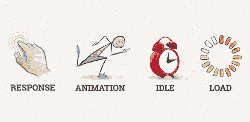
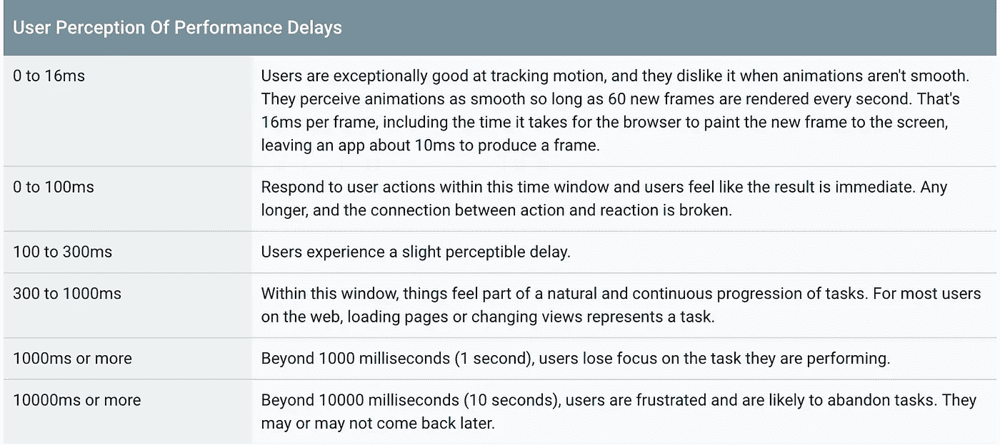
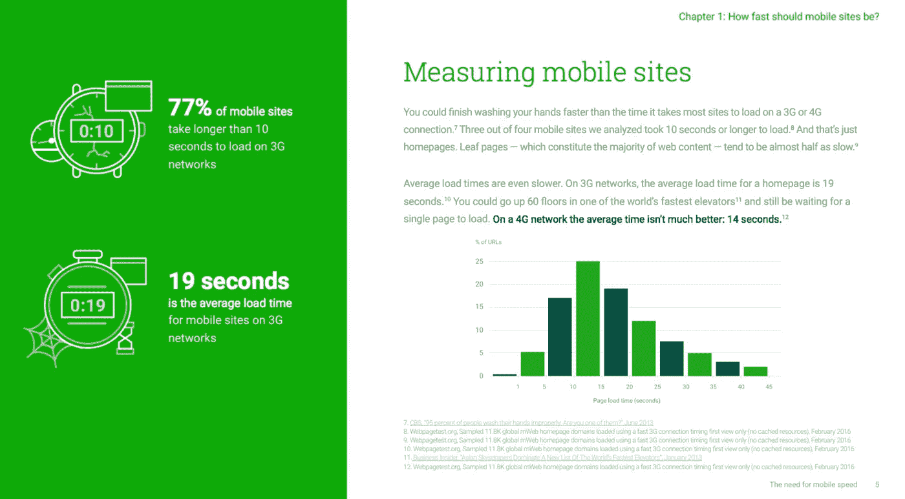
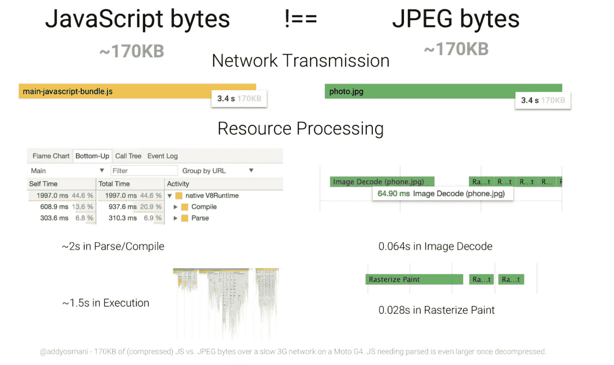
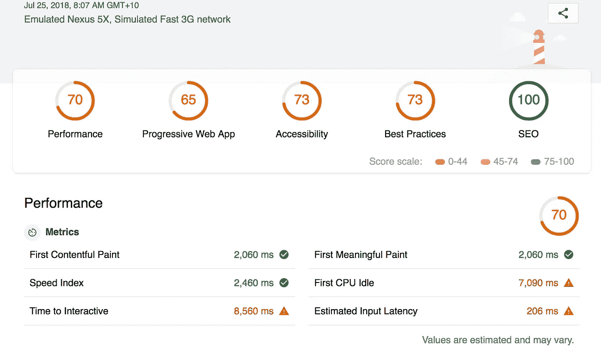
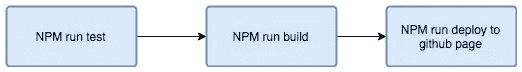
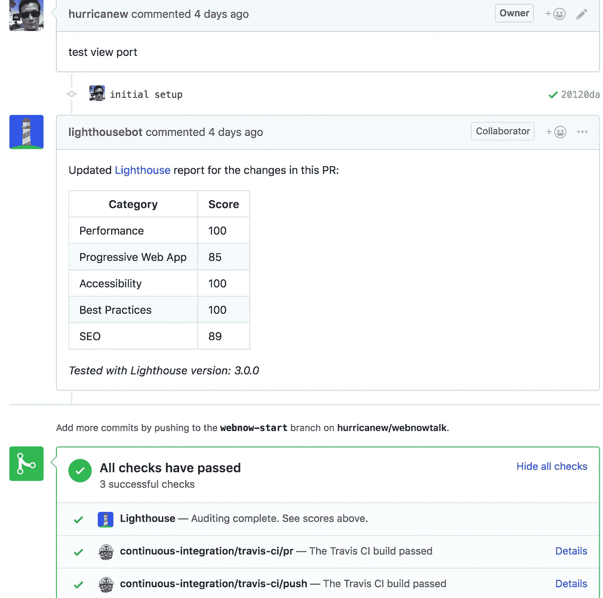
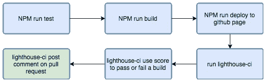

# Web 应用程序执行区域 1 — lighthouse CI 集成

> 原文：<https://itnext.io/web-app-perform-zone-1-lighthouse-ci-integration-3b06841770c2?source=collection_archive---------6----------------------->

# 话题之前的废话

Web 已经从基于知识的网页组装变成了一流的应用平台。 [Progressive Web App](https://developers.google.com/web/progressive-web-apps/) (PWA)填补了移动端 Web App 和原生 App 的空白。[单页面应用](https://en.wikipedia.org/wiki/Single-page_application) (SPA)已经被业界所接受，一个 SPA 页面通常包含 HTML、CSS、一堆图像和兆比特的 Javascript。

# 问题是

你的应用有多“威比”？在有线/ADSL/慢速 3G/片状连接/离线时表现/工作良好吗？也许你会说你的网络应用很时尚，功能丰富，但是只能在使用有线/ADSL 连接的桌面浏览器上运行良好。如果是这样，坦率地说，你的应用程序不是一个真正的 web 应用程序。它只是一个需要互联网的桌面应用程序。在移动主导的世界里，一个网络应用程序必须在移动互联网上表现良好。为了定义一个高性能的应用程序，谷歌在 2015 年发布了 [RAIL](https://developers.google.com/web/fundamentals/performance/rail?hl=en) 模型。

Rail 代表性能的主要方面—响应动画空载

一个高性能的 web 应用程序符合 [RAIL](https://developers.google.com/web/fundamentals/performance/rail?hl=en) 标准，简而言之，这意味着:

> 响应:在 50 毫秒内响应用户操作
> 
> 动画:在 10 毫秒内制作一帧动画
> 
> 空闲:最大化空闲时间
> 
> 加载:借助慢速 3G，在不到 5 秒的时间内交付内容并开始互动

让我们只关注最后一个目标。性能是每个应用程序的关键标准，但却没有得到充分的重视。为什么不到 5 秒？因为每过一秒，用户就会失去对他们正在执行的任务的关注。站点首次加载时，5 秒是一个合理的时间窗口。如果你觉得 3G 网络有点刻薄， [**GSMA 数据**](https://www.gsma.com/mobileeconomy/#techmigration) **显示在被认为是发达地区的欧洲，仍有惊人的 37%的移动用户在使用 3G 网络，而在全球范围内，这个数字是 31%。**查[买得起吗？现实世界的网络性能预算](https://infrequently.org/2017/10/can-you-afford-it-real-world-web-performance-budgets/)。

面对 3G，在 5 秒钟内变得互动对大多数澳大利亚网站来说仍然是一个巨大的目标。在 Chrome 开发工具中打开缓慢的 3G 节流和移动模拟器后，我对澳大利亚的热门网站进行了审计。

**2018 年澳大利亚网站登陆页面加载速度慢于 3G**

【www.nab.com.au 

[www.anz.com.au](http://www.anz.com.au)

[www.westpac.com.au](http://www.westpec.com.au)

[www.commonbank.com.au](http://www.commonbank.com.au)

[www.seek.com.au](http://www.seek.com.au)

全球移动加载时间

有趣但令人尴尬的是，大多数网站都远远超过了 5 秒的互动基准。相当一部分超过 10 秒，这意味着许多用户将放弃移动网络选项，开始寻求替代方案。在 3G 网络条件下，这些网站将成为你想要避开的网站。呆在你的房间和公共中心区澳大利亚人！上面列出的数据显示了两件事:

*   首先，初始页面大小至关重要。如果你的页面大小接近 1000k，那么在 3G 网络下你就完了。
*   第二——Javascript 很贵。一些站点的 DOM 加载速度很快，但是需要更长的时间才能准备好(DOMContentLoaded > Load >Finished)。有一篇文章是 Addy Osmani 写的关于 Javascript 成本的文章。强烈推荐阅读。

# 灯塔

从哪里开始提升性能？罗马不是一天建成的。性能改进是系统工程，罗马可以一天比一天好。**要构建和维护一个速度极快的 web 应用，最好的方法是从一开始就快速构建，并在每次提交时根据性能检查您的更改。我们需要一个扫描工具来评估工作质量，尤其是绩效。性能是一个很大的特性，但易受变化的影响。查看文章[为什么性能很重要](https://developers.google.com/web/fundamentals/performance/why-performance-matters/)。**

让谷歌的灯塔成为你亲密的朋友。作为网络开发人员，你可能以前用过灯塔。

> Lighthouse 是一款[开源](https://github.com/GoogleChrome/lighthouse)，用于提高网页质量的自动化工具。你可以在任何网页上运行它，无论是公开的还是需要认证的。它对性能、可访问性、渐进式网络应用等进行审计。

灯塔扫描报告给出分数和改进建议

Lighthouse 给出了提高 web 性能的可行建议。我假设大多数 web 开发人员至少尝试过 lighthouse。他们可能已经做了扫描，并得到一些惊叹“我应该这样做，那样做…”出来。在许多情况下，他们可能已经摘到了几个唾手可得的果实，报告的其余问题可能是:

*   太难改变了。比如 js 捆绑包过大，这需要相当大的努力来树抖动和分裂成更小的异步捆绑包。
*   来不及改变。在后期阶段，他们发现大量表单、框架存在性能缺陷，或者由第三方交付的 UI 资产性能不佳。
*   太难也太晚了。面对这样一个没人想碰的庞然大物，你只是想零敲碎打地按摩一下客户的痛点。

> 没有什么比暂时的入侵更长久的了。—凯尔·辛普森

如何让业绩一路高歌猛进？就像你每天都在进行的单元测试和端到端测试一样，性能也是你的应用程序的一个同样重要的特性，应该在每次提交的基础上进行测量，并密切监控以防止衰退。如果我知道我的性能在拉取请求期间受到影响，该怎么办？一时兴起，我做了 Lighthouse 集成演示项目，想在这里分享一下方法:

我选择了一个“hello world”项目，但并不那么“hello”。这是一个明星项目。是一个 52705 主演的 github 名人，叫[创作反应 app](https://github.com/facebook/create-react-app) 。它由脸书维护，是 react 项目中最受欢迎的发电机之一。我用它创建了这个名为“webnowtalk”的演示项目。

在生成的应用程序中，README.md 文件中有完整的启动手册。这不是这里的重点。我们的目标是将 Lighthouse scan 整合到每个 pull 请求中。我们将使用 [Travis CI](https://travis-ci.org/) 作为集成工具。看看 yaml 配置文件和 package.json:

Travis CI 简洁优雅。使用两行代码`npm run build` `npm run deploy`构建项目代码，并使用名为“deploy-to-gh-pages”的 npm 模块将其部署到 [github pages](https://pages.github.com/) 。部署的链接是[https://hurricanew.github.io/webnowtalk/](https://hurricanew.github.io/webnowtalk/)

CI 流程

好的，上面的过程似乎是标准的。现在是灯塔法力时间。我们使用 [lighthouse CI](https://github.com/ebidel/lighthouse-ci) 作为集成工具。lighthouse ci 将进行扫描，并使用分数来证明 build 的成功并发布评论。仅当提交是拉请求提交时，扫描才会发生。合并前守住线！

带有灯塔扫描配置项的公关成功

lighthouse-ci 集成的更新流程图

乌拉完成了。一千英里的第一步。您可以在这里看到拉动请求链接[。](https://github.com/hurricanew/webnowtalk/pull/2)

> 我无法建造的。我不明白。—理查德·费曼

就是这样。我们以 100 点的基本项目成绩开始了旅程。稍后，我们将添加功能并见证性能对分数的影响。下一篇文章我将关注图像优化——在保持性能的同时向演示站点添加图像。请继续关注。

感谢阅读。如果您认为这篇文章让您的开发生活变得更好了，请单击“鼓掌”。

感谢 [John Hardy](https://medium.com/@jhlagado) 和 [Brett Uglow](https://medium.com/@u_glow) 审阅我的草稿并给出反馈。你亲切的支持让我继续写作和分享。