# Web 应用程序执行 zone 2 —渐进式 JPEGs 和 techs，将图像负载减半

> 原文：<https://itnext.io/web-app-perform-zone-2-progressive-jpegs-and-techs-to-halve-your-image-load-7ed24670eafb?source=collection_archive---------2----------------------->

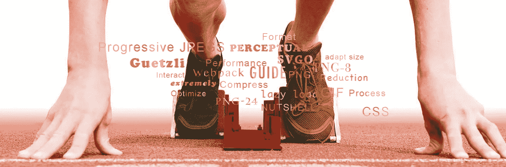

# 表演，表演，表演

在我关于 Lighthouse integration 的最后一次演讲中，我们在一个缓慢的 3G 网络下仔细检查了澳大利亚的网站，并通过将 Lighthouse 整合到代码审查中开始了性能改进之旅。在这里，我将给出一些关于表演性图像的提示。

在主要话题之前:

# 性能不是开发人员大惊小怪的。

*   [Pinterest 重新构建了他们的页面，实现了 40%的感知等待时间减少，从而将搜索引擎流量和注册人数都提高了 15%](https://medium.com/@Pinterest_Engineering/driving-user-growth-with-performance-improvements-cfc50dafadd7) 。
*   [通过将平均页面加载时间减少 850 毫秒，库克发现他们能够将转化率提高 7%，将跳出率降低 7%，并将每次会话的页面数提高 10%](https://www.nccgroup.trust/uk/about-us/resources/cook-real-user-monitoring-case-study/?style=Website+Performance&resources=Case+Studies) 。

如果您感兴趣，这里有一篇关于为什么性能很重要的深入文章。这里的瞬移是[这里的](https://developers.google.com/web/fundamentals/performance/why-performance-matters/)。Web 开发人员关心图像。如果你的项目或你的头脑中有一个性能预算，那么第一优先应该是图像。作为—

> 根据 [**HTTP Archive**](http://httparchive.org/) 显示，抓取一个网页所传输的数据中，有 60%是由 JPEGs、png、gif 组成的图片。截至 2017 年 7 月，图片占 3.0MB 平均网站加载内容的 [**1.7MB**](http://httparchive.org/interesting.php#bytesperpage) 。

是的，图片是网页负载的一半。与我们日以继夜试图将其分割成有意义的块并延迟加载的 JavaScript bundle 相比，图像处理是透明和静态的。今天，我与大家分享一些低挂水果的图片:

# 水果 1 —渐进式 JPEGS

当加载基准 JPEG 时，正如我们大多数时候看到的，图像显示为从上到下的扫描。相比之下，渐进式 JPEG 是一系列质量不断提高的扫描。查看下面的 B-JPEG 与 P-JPEG:

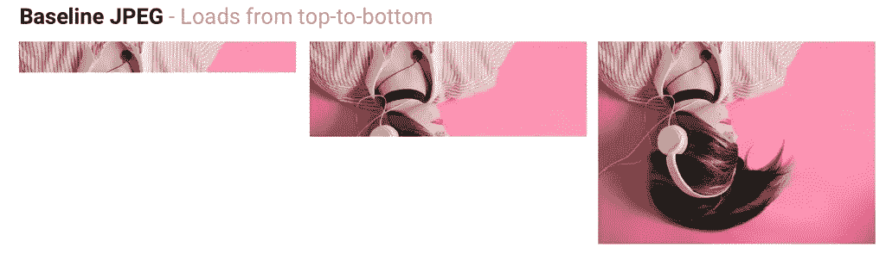

自上而下的扫描逐渐显示图像。用户需要等待完整的图像下载。

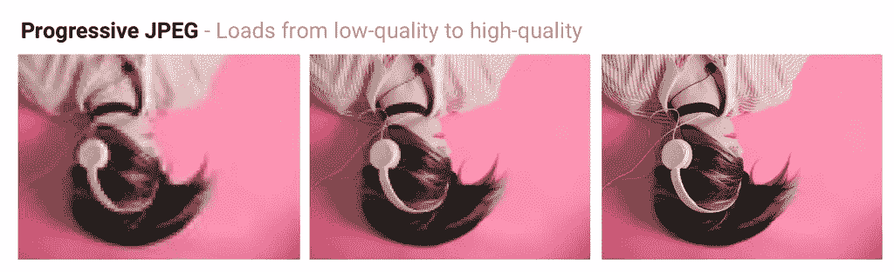

渐进 JPEG 在一系列扫描中展现了自己。如果用户对图像细节不感兴趣，用户不需要等待

正如你所看到的，渐进图像给用户一种感觉，即图像加载是“视觉上完成的”。这将给用户一种页面加载速度很快的感觉。这个结论不是主观的。有许多知名的公司将进步的 JPEGs 放在他们的腰带之下:

*   [**Twitter.com 出货渐进 JPEG**](https://www.webpagetest.org/performance_optimization.php?test=170717_NQ_1K9P&run=2#compress_images)质量基线 85%。他们测量了用户感知的延迟(第一次扫描的时间和总的加载时间),发现总的来说，PJPEGs 在满足他们对低文件大小、可接受的代码转换和解码时间的要求方面具有竞争力。
*   [**脸书为他们的 iOS 应用**](https://code.facebook.com/posts/857662304298232/faster-photos-in-facebook-for-ios/) 发布渐进式 JPEGs。他们发现数据使用量减少了 10%,显示高质量图像的速度提高了 15%。
*   [**Yelp 转而使用渐进式 JPEG**](https://engineeringblog.yelp.com/2017/06/making-photos-smaller.html)并发现这是他们图像尺寸减少约 4.5%的部分原因。使用 MozJPEG，他们还额外节省了 13.8%。

从数字上看，你可以看到它更快，但并不令人印象深刻。所以我做了一个演示项目来做实验:

我从 [create-react-app](https://github.com/facebook/create-react-app) 模板构建了一个演示站点，并添加了 [material-UI Carousel](https://demos.creative-tim.com/material-kit-react) 。我使用了 [image-min webpack 插件](https://github.com/Klathmon/imagemin-webpack-plugin#readme)来使图像渐进。在 Chrome 中打开缓慢的 3G 网络节流，我得到了以下扫描结果:

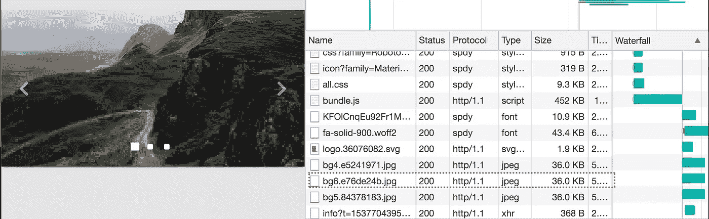

图像(bg6)显示加载 36 kb 时的初始粗略扫描

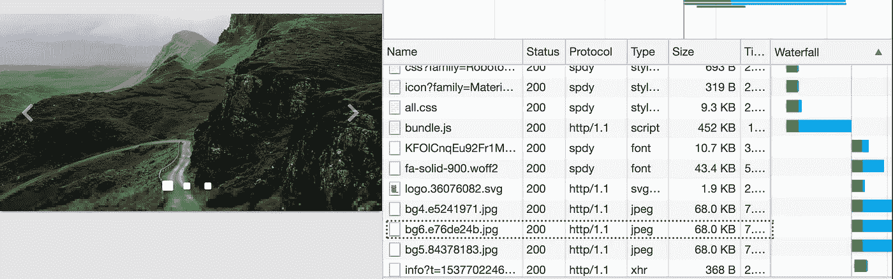

加载第二次扫描(68kb)后，图像看起来与 15 英寸屏幕上的完整图像几乎相同

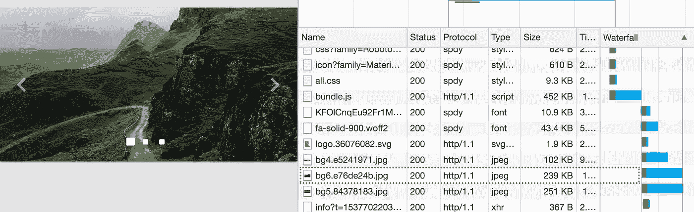

图像不断用更好的扫描来替换自己，直到最后一次扫描的全尺寸为 239kb

上面的图片很能说明问题。第二次扫描 68kb，你几乎可以得到 239kb 图像的全部细节。这实际上减少了 71%的初始页面负载。对于不关心图像细节的主动用户，用户可以使用 36kb 的初始扫描作为完整图像并作出反应。减少了 84%。

那么为什么不转向进步呢？渐进式 JPEGs 在慢速网络下很有用，在正常网络下很有趣，而且制作起来简单得愚蠢。仅仅几行代码就能产生这种差异。有关所有详细信息，请检查我的提交以应用此更改。你只需要安装一个插件，并将其添加到你的构建过程中。

 [## feat(app):添加 imagemin 创建渐进式图像 hurricanew/webnowtalk@0bc7da9

### 在 GitHub 上创建一个帐户，为 hurricanew/webnowtalk 的开发做出贡献。

github.com](https://github.com/hurricanew/webnowtalk/commit/0bc7da903ff85b1d9b69a64272ba4bec532925da) 

# 水果 2 — [格兹利](https://github.com/google/guetzli)压缩

好，让我们看看我们是否能在 JPEG 上更进一步。对于图像格式，开发者很挑剔，保留 JPEG 作为大图的首选。

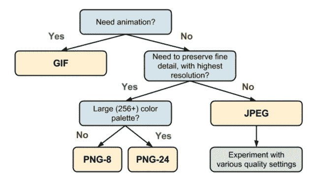

Jpeg 格式是一种不需要动画和精细细节的格式。

然而，JPEG 图像的每个像素都坚如磐石吗？我遇到了一个叫做 Guetzli 的“神奇”工具。它在两个方面让我感到惊讶:

1.我发不出这个音。我在任何地方都找不到“Guetzli”这个词。

2.它可以将你的 JPEG 图像减半，而不会造成视觉损失。

空谈是廉价的，让我们行动吧。与 OSX: `brew install guetzli`然后导航到图像文件夹，运行`guetzli --quality 84 [origin file name].jpg [new file name].jpg`和这是之前/之后的 JPEGs 与全缩放:

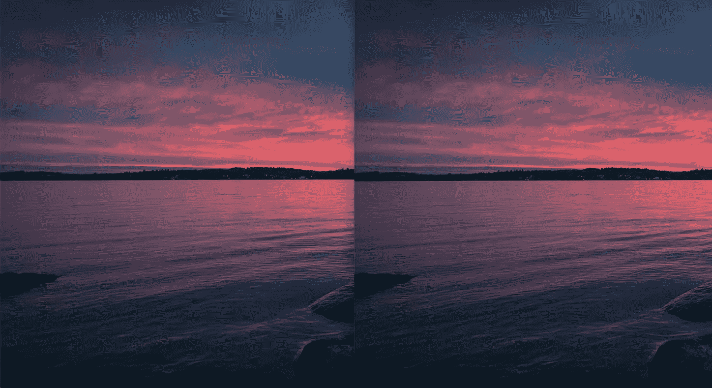

Guetzli 压缩图像(左)与原始图像没有视觉差异

**大小？原始大小为 257 kb，压缩后为 135kb，减少了 47%!**

你可能注意到我把质量设置为 84，这是质量范围的最低值。它剃掉了我一半的 JPEG。刚刚成功了。这种神奇是如何发生的？根据 [Guetzli](https://github.com/google/guetzli) 官方定义:

> [**Guetzli**](https://github.com/google/guetzli) 是谷歌的一款有前途的感知 JPEG 编码器，虽然速度较慢，但它试图找到人眼在感知上无法与原始图像区分的最小 JPEG。它执行一系列的实验，产生最终 JPEG 的提案，并考虑每个提案的心理视觉误差。从这些建议中，它选择得分最高的建议作为最终输出。

实际上[**Guetzli**](https://github.com/google/guetzli)**执行一系列压缩解决方案，并有一个评分系统来挑选最佳方案。这是民主的。处理需要时间，因为这是一次性的过程，它是完全无害的。**

**当然自动化是必须的，而且有 webpack guetzli 插件可以实现。**

# **水果 3——SVG 甜味剂 SVGO**

**不管你喜不喜欢，SVG 现在是小图像的王者。小尺寸，向量，xml 代码，提供可访问性和搜索引擎优化的推动。SVG 是进化的终结吗？作为一个表演狂，你应该挑战一切。**

> **SVG 文件，尤其是从各种编辑器中导出的文件，通常包含大量冗余无用的信息。这可以包括编辑器元数据、注释、隐藏元素、默认值或非最佳值以及其他可以安全删除或转换而不会影响 SVG 渲染结果的内容。**

**所以 SVG 作为基于文本的源文件，就像 HTML 一样。它有很大的改进空间。**

**SVGO -> **SVG O** ptimizer 是一款基于 Nodejs 的工具，用于优化 SVG 矢量图形文件。它的目标很简单，在保持外观不变的同时尽可能地减轻 svg 的重量。让我们看看 SVGO 能做什么。我们有这个可爱的老虎 SVG 标志在这里从 illustrator，大小是 5.198 kb。**

**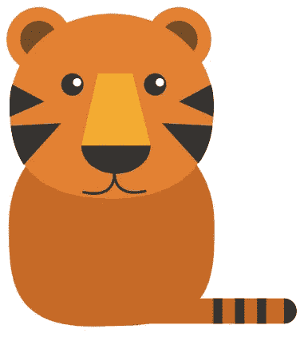**

**然后，我们安装 SVGO 作为 npm 模块:**

**`npm i -g svgo`**

**`svgo [your file].svg -o [your optimized file].svg`**

**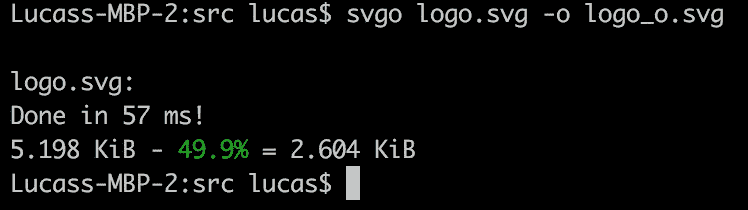**

**svgo 将您的 svg 削减了 49%,没有任何损失**

**答对了。我得到 50%的折扣。我的老虎标志和以前一样可爱。**

**看看区别，SVGO 不仅仅是压缩空白，它还删除了未使用的元数据和标准化属性。因此增加了可读性。**

**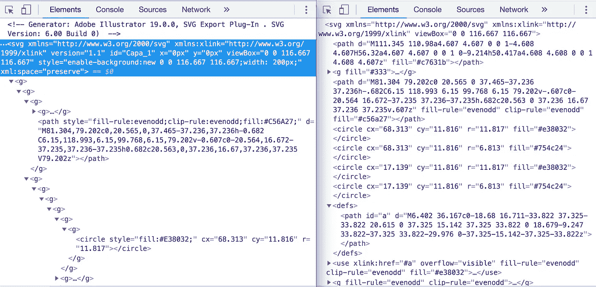**

**不仅压缩空白，它还删除了未使用的元数据，标准化的属性。**

**我知道没有自动化的解决方案你会窒息的。查看 [SVGO 主页面](https://github.com/svg/svgo)。那里有很多可用的插件。**

**就是这样。如果你觉得这篇文章非常无聊，忘记了你到目前为止读过的内容。别担心，你只要记住:**

*   **使用 web pack/任何你喜欢的工具，让你的 JPEG 图片进步**
*   **使用 Guetzli 将您的大 JPEG 图像减半**
*   **使用 SVGO 整理你的 SVG 图标**

**我已经在来自高流量网站(如银行)的生产图像上测试了这些工具。即使在他们高度优化的图像资产上，你仍然可以得到 5%到 40 %的折扣。**

**感谢阅读。所以你的水果早餐结束了，几个小时后你就可以把你的项目图像负荷减半了。每个 web 应用都应该有一个性能预算。今天就将这些技术应用到您的项目中，享受您的绩效荣耀吧！我正在写一系列关于性能的帖子，如果你认为有帮助，请关注我。**

**感谢[约翰·哈迪](https://medium.com/@jhlagado)、[马特·姚](https://medium.com/@mattyao1984)的点评和建议。**

> **回想起来，所有的革命似乎都不可避免。在此之前，所有的革命似乎都不可能。— *迈克尔·麦克福尔***

**到目前为止，这篇文章的其他兄弟姐妹:**

** [## Web 应用程序执行区域 1 — lighthouse CI 集成

### 话题之前的废话

itnext.io](/web-app-perform-zone-1-lighthouse-ci-integration-3b06841770c2)**