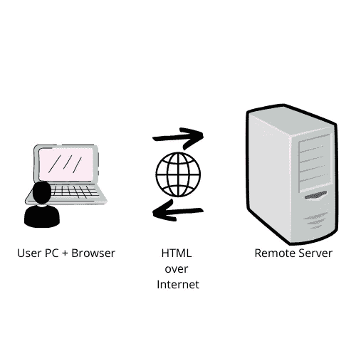
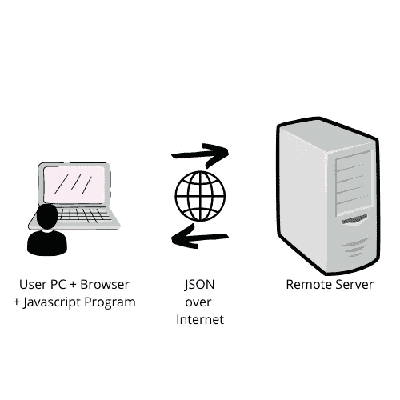

# 带有剃刀页面的网络应用

> 原文：<https://itnext.io/web-apps-with-razor-pages-e76b533bdfd6?source=collection_archive---------2----------------------->

[*目录*](https://medium.com/@kumar_vvr/web-apps-with-razor-pages-f0d3f92a0573)

# **不是另一个网络应用教程！**

这是一系列展示在#dotnet 6 上使用#aspnetcore 进行 web 应用程序编程的文章。

# **目标受众**

这个系列的目标是绝对的初学者程序员和新培养的 web 应用程序开发人员。

# **简介**

[Dotnet core](https://dotnet.microsoft.com/en-us/) 是微软推出的令人兴奋的新框架和运行时。它是一个跨平台的运行时，运行在 Windows，MacOS & Linux 上。它可以用许多优秀的语言来编程，

*   C#(我最喜欢的，也是本系列中使用的语言)
*   Visual Basic。NET(不是老的，噩梦诱导 VB)
*   F#(面向精英函数式程序员)

是高性能的，并且有一个庞大的生态系统，包括满足你开发需求的库和框架。

我是不是忘了提它是 [**开源的？**](https://github.com/dotnet)

# **网络应用**

*“在最开始的时候* ***环球网& HTTP*** *被创造出来。这让许多人非常愤怒，并被广泛认为是一个糟糕的举动。”~亚伯拉罕·林肯*

web 应用程序开发的主题有着漫长而肮脏的历史。从 Javascript 的发明(它与 Java 没有任何方式或形式的关系，只是被命名为一个*营销*的事情)，到 [Flash](https://en.wikipedia.org/wiki/Adobe_Flash) 应用程序的黑暗时代，Java 小程序的令人厌恶的时代，再到当前鼓励互操作性和标准的天堂范例和开放系统的乌托邦。抱歉，最后一点有点过了。

目前，web 应用程序开发环境已经满到了边缘，有人说满得像一个已经变质的溢出的发酵罐，但是仍然是满的。但首先让我们了解一下*什么是*一个 web app。

古希腊一个温暖的夏夜……~谢尔顿·库珀

web 应用程序是一种基于 Web 浏览器的程序，它可以通过互联网从远程服务器即时下载，在用户机器上运行，并与一个或多个远程服务器交互，以向用户提供某些功能。

然而，大多数早期的 web 应用程序并不将程序下载到用户机器上(实际执行相关工作的“后端”程序)，而只是下载“用户屏幕”或用户与之交互的“用户界面”(UI)。这是通过一个名为“[HTML](https://en.wikipedia.org/wiki/HTML)”(XML 的一种变体)的基于文本的系统完成的。这类应用的现代名称是“**服务器渲染应用**

老式的网络应用程序。

随着浏览器的成熟、高速 Javascript 解释器的出现以及 web 应用程序复杂性的增加，SPAs 的形式发生了变化。SPA =单页应用程序。在这个范例中，HTML UI 是在用户浏览器中借助一个 Javascript 程序动态生成的，该程序从服务器下载**一次**。随后，只有数据以 JSON over AJAX 的形式与服务器通信，因此，据称*提高了性能，减少了服务器上的负载(它不再需要为每个请求处理和呈现 HTML)，并使 web 更类似于桌面应用程序。*

现代水疗网络应用

然而，Javascript 本身就让事情变得复杂了。创建这些 SPA 应用程序的一系列框架和方法激增，一些轮子转了一整圈，又回到了“[服务器呈现的应用程序](https://medium.com/@baphemot/whats-server-side-rendering-and-do-i-need-it-cb42dc059b38)”，这是老式 web 应用程序的一个不尴尬的名称(HTML UI 在服务器中生成，并提供给用户浏览器)，唯一的区别是现在 HTML 是由位于服务器上的 SPA 框架生成的。是的。这种情况翻白眼的时候想想自己多大了。

然而，并非所有情况都如此严峻。水疗应用有自己的位置。

**水疗应用**

*   非常适合拥有数百万用户的应用程序。(Javascript 程序可以从 CDN 提供，数据可以从实际的服务器提供，这比提供 HTML 所需的计算能力少几个数量级)
*   非常适合拥有实时更新数据的应用程序(股票屏幕、运动跟踪器等)
*   需要大量动态页面和内容的应用程序。

**传统服务器呈现的网络应用**

*   非常适合初学者，也是一个非常好的建造温泉的基础
*   当您有复杂的模型时，在服务器上编程要容易得多，因为您不需要额外的 JSON 转换步骤(它对数据交换的能力有限)。例如，一个电子商务网站可能没有很多交互性，但有复杂的数据必须显示给用户。
*   非常适合并发用户少的应用程序(很难给出一个数字，但是每天少于 100 万用户是可以的，如果你有足够的基础设施，更高的数字也是可以的)
*   易于推理和发展。

#dotnet 提供了什么？

Dotnet 有框架和库，可以让你以任何你想要的范式进行开发。你可以用 MVC 和 Razor Pages 开发服务器渲染的应用，用 Angular / React / Vue / Blazor 和 WebAPI(也是基于 MVC)开发 SPA 应用。当然，Dotnet 远不止这些(它还包括用于桌面应用程序开发、游戏开发、嵌入式系统开发等的库),但是我们现在只关注 web 应用程序。

# **剃刀页**

Razor pages 是一个基于 MVC 的框架，是 ASP.NET 核心的一部分

aspnet 核心是在 dotnet 上构建网络应用的框架。如上所述，它支持多种范例，Razor Pages 就是其中之一。

Razor pages 是围绕“页面”这个概念设计的，你猜对了。随着我们继续这个系列，我将解释与 Razor pages 相关的所有术语和技术。

关于 Razor 页面的详细介绍将在后续文章中给出。