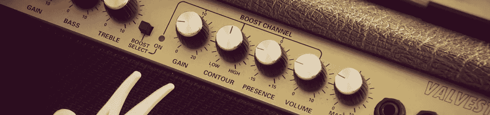
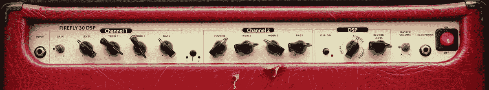
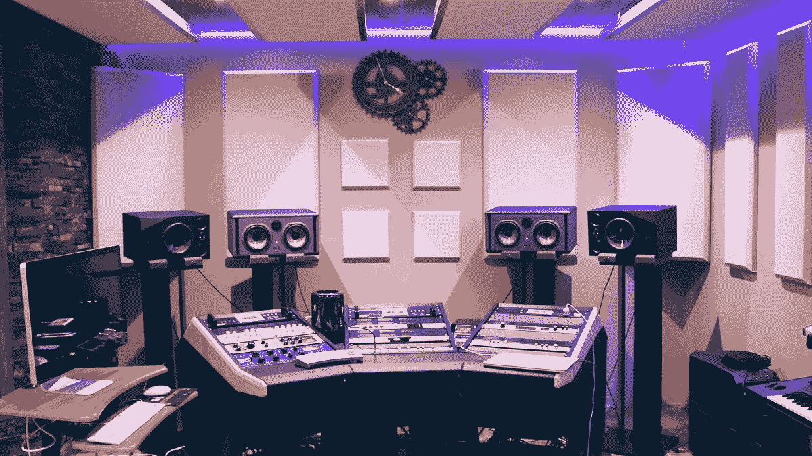
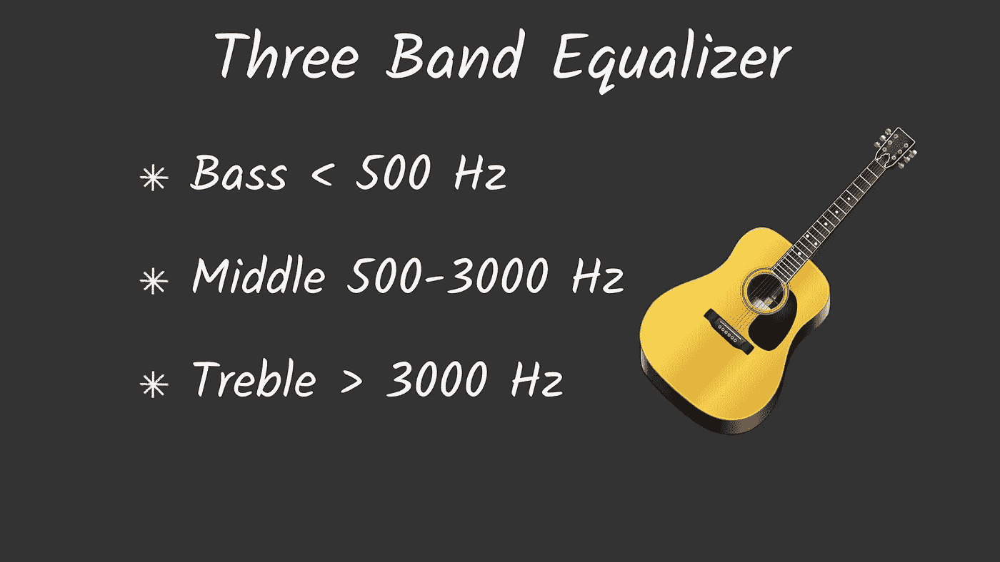

# 电吉他网络音频:音箱仿真

> 原文：<https://itnext.io/web-audio-for-electric-guitar-cabinet-emulation-b2a553b55f2b?source=collection_archive---------9----------------------->

很难想象一个吉他手没有任何放大器或吉他音箱。更不用说没有任何扬声器，电吉他即使在家里也很难听到。今天我想展示如何使用网络音频 API 来模拟吉他音箱。使用卷积，无需数千美元的投资，就可以重现顶级品牌 amp 制造的声音。

在[之前的帖子](/web-audio-for-electric-guitar-how-to-connect-instrument-24352df108ae)中，我描述了使用网络音频在浏览器中获取电吉他声音的过程。今天，我将继续吉他音箱仿真系列。

*这个帖子是“电吉他网络音频”系列的一部分，也可以看看其他帖子！*

# 电吉他系列的网络音频:

1.  [如何连接仪器](/web-audio-for-electric-guitar-how-to-connect-instrument-24352df108ae)
2.  机柜仿真—当前

在家里玩电吉他时，它通常连接到一个单独的设备——放大器或带音箱的头。有很多著名的放大器生产商，他们每个人都有自己的“坚定”的声音。然而，使用数字声音处理，有可能使用一种称为*卷积*的过程以编程方式模拟它们。为简单起见，你可以把卷积想象成两个函数的乘法。当我们谈论声音卷积时，意味着将一些样本应用于现场输入。为了模拟吉他音箱，我们需要将这样一个从真实设备中录制的短样本应用到吉他声音中。那个样本称为*脉冲响应* (IR)。

# 脉冲响应

脉冲响应是放大器脉冲特性的记录，如振幅或频率。例如，照片是相机在某个时候在胶片或数字矩阵上获得的光线的快照。你可以用同样的方式考虑脉冲响应。这是一个现场演讲者的快照。

不幸的是，该快照仅限于记录一个特定的设置。我的意思是，在真正的放大器上，你有一堆控制，如音量或均衡器，根据放大器的配置，你会得到不同的脉冲响应。因此，您只能模拟具有特定配置的设备。然而，我们也可以使用网络音频实现均衡器。均衡给了我们一些灵活性来获得我们想要的声音形状。

# 卷积节点

现在我们已经知道我们想要执行什么，是时候学习如何使用 Web Audio API 来实现它了。API 在它提供的节点后面隐藏了大量的数学运算。卷积也不例外，我们有一个卷积器节点将脉冲响应应用于音频流:

卷积器节点有一个`buffer`选项，用于传递脉冲响应音频缓冲。您必须以浏览器能够理解的格式加载带有 IR 的音频文件。现代浏览器支持不同的格式，因为这些格式的许可。现代浏览器对 WAV(除了不支持网络音频的 IE 之外)、AAC (Firefox 只在 MP4 容器中支持它)、MP3、FLAC 和 OGG(除了 IE 和 Safari 之外)都有很好的支持。我考虑继续使用 WAV，因为它得到了很好的支持，并且是一种无损的音频格式。质量在这里是至关重要的，因为我们使用的是非常短的记录，只有几个字节，压缩可能会在输出中产生伪像。

如果您想根据当前浏览器提供各种文件格式，您可以查看支持:

包括 IE 9+在内的所有浏览器都支持' canPlayType '方法。它返回一个具有 3 个可能值的字符串:`'maybe'`、`'probably'`和`''`。是的，它不能给你一个确切的答案🤣，只是概率上的一个。空字符串表示不支持该格式。`'maybe'` -不开始回放无法回答，还有`'probably'` -貌似可以。

你可能会有一个合理的问题，你可以在哪里得到这些机柜的脉冲响应？你可以“做你的 self"™️——但这种变体需要你有一个机柜本身和一堆附加设备，如电容麦克风、专业声卡等等。幸运的是，有许多专业工作室和爱好者制作的免费高质量脉冲响应。只需谷歌搜索“[免费机柜脉冲响应](https://www.google.com/search?q=free+cabinet+impulse+response&rlz=1C5CHFA_enUA690UA690&oq=free+cabinet+impulse+response)”即可找到并下载一个。如果你太懒了，你可以检查一下我用在一个应用程序上的[脉冲](https://github.com/vitaliy-bobrov/js-rocks/tree/master/src/assets/impulses/cabinet)。

有了要处理的 IR 后，我们可以使用音频上下文和 Fetch API 将它加载并应用到卷积器节点:

*注意:如果您想多次重复使用同一个节点，在新的缓冲区设置后断开/连接卷积器节点是非常重要的。如果您在连接的节点上设置新的缓冲区，将使用旧的缓冲区，并且可能会出现音频故障。*

我们获取脉冲响应文件，然后将响应转换到数组缓冲区。我们不能在卷积器上直接应用缓冲区，在此之前，我们需要使用上下文对其进行解码。配置卷积器后，您可以将其链接到音频处理图中:

有些 IR 可能振幅较低，因此在您应用它后，它们可能会降低整体音量。在这种情况下，您可以使用增益节点来增强它:

对于特定的脉冲响应，需要手动调整增益值。在用户界面中使用一些控件(如范围输入)来公开配置也是很好。

# 三波段均衡器

我想添加到机柜仿真的最后一个功能是三波段均衡器。它让我们可以控制输出的音调。我们想为低音、中频和高音频率创建一个可配置的滤波器。所有低于 500 Hz 的将与低音有关，500 Hz 和 3 KHz 之间的为中音，3000 Hz 以上的为高音。

我们如何使用网络音频增加特定频率的输出？我们有一个很好的节点——双二阶滤波器节点。它是一组过滤器的实现，可以由提供的类型值指定。对于低音控制，我们选择一个`'lowshelf'`滤波器。它将提高低于已通过频率的所有频率的水平。对于高音，我们用相反的类型——`'highshelf'`。它提升所有高于传递值的值。而且，对于中间，我们选择`'peaking'`型。它提升通过值附近的频率-由`Q`(滤波器质量)参数控制的频段范围。增益参数改变的每个波段的衰减或增强。它是应用于频率的电平变化量(以 dB 为单位),使用负值时，我们使用正增强来衰减它。

为了防止点击增益值更新，可以使用`setTargetAtTime`更新方法:

现在，我们可以连接所有节点，实现灵活的吉他音箱仿真:

我录制了一个示例视频，展示卷积如何影响输出声音。它可能不会对干净的信号产生显著影响，但如果应用了某种失真效果，它会明显得多。

# 概述

如果您已经阅读了这篇文章，那么您已经学会了如何使用卷积来模拟吉他放大器，并创建一个三波段均衡器来配置音调。如果你是弹吉他的，可以看看我搭建的[“JS Rocks”](http://js-rocks.web.app)Angular app。它有现成的橱柜 9‼️和 7 个用网络音频创建的电吉他效果。而且，听起来还不错😎。请继续关注下一篇文章，我将深入探讨失真效果。用网络音频摇滚吧🤘！

*原载于*[*https://bobrov . dev*](https://bobrov.dev/blog/web-audio-for-electric-guitar-cabinet-emulation/)*。*