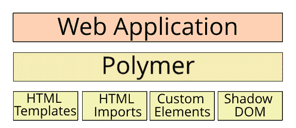
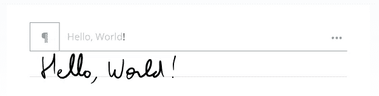

# 使用聚合物的网组件

> 原文：<https://itnext.io/web-components-using-polymer-cd7e2ea8d06e?source=collection_archive---------4----------------------->

Web 组件是一组 API，允许您创建本地的、隔离的组件，以便在任何地方使用，而不管框架、库或其他什么。自定义组件的使用与真正的本地组件相同，如输入和按钮。在阅读这篇文章之前，请确保你完全理解了 [web 组件](/reusable-ui-web-components-72cbe56b0056)。

web 组件的问题在于浏览器支持——并非所有主流浏览器都支持该规范。为了解决这个问题，我们使用 polyfills，但是，并不是所有的功能都可以被填充，例如，阴影 DOM 隔离是在浏览器内部实现的，不能从外部修补，我们需要在构建组件时考虑这一限制。


为了实现 web 组件，我们可以使用几个库，其中之一是 Polymer。Polymer 是一个开源库，用于创建和使用 web 组件以及一组适用于所有现代浏览器的 polyfills。Polymer 用一个高级 API 减少了本地 web 组件样板文件，有助于关注逻辑而不是样板文件。



Webcomponentsjs 是一个聚合依赖项，它提供了一套支持 HTML web 组件的聚合填充，可以加载到 web 应用程序中。有两种加载 webcomponentsjs 的方法——加载包含所有内容的完整包，或者使用 webcomponents-loader，它使用特性检测来加载所需的最小量。第一种又快又脏，第二种是常见的选择。

要加载聚合填充，首先需要安装包含它们的模块:

```
> npm install — save @webcomponents/webcomponentsj
```

然后在主 html 文件的头中加载脚本标记:

```
<script src=”./node_modules/@webcomponents/webcomponentsjs/webcomponents-loader.js”></script>
```

加载 polyfills 足以在任何 web 应用程序中开始使用 web 组件。例如，https://www.webcomponents.org/的[几乎不费吹灰之力就提供了种类繁多的自包含定制组件。为了能够使用具有适当属性的组件，您需要安装脚本，然后添加一个到 html 文件的链接，或者只是通过 CDN 使用它。这些脚本已经包含在已安装的 HTML 文件中，因此不需要加载其他脚本。例如，要使用文本手写识别组件，请遵循](https://www.webcomponents.org/)[定制元素页面](https://www.webcomponents.org/element/MyScript/myscript-text-web)中的说明。



聚合物组件由两部分组成——结构和行为。第一个是用一个`dom-module`标签描述的，其中的一个`template`标签包含了实际的阴影 DOM 以及定制样式和其他标签。第二个是提供组件行为的脚本。这些脚本可以包含在`dom-module`标签中，正如我们之前看到的，它提供了组件的自主性。另一种方法是除了 HTML 之外还提供脚本供消费者使用。

我们将介绍这个库的基础知识，并展示构建一个简单的小型单词计数器组件的过程。Polymer 是一个非常强大的库，建议浏览[库页面](https://github.com/Polymer/polymer)和[文档](https://www.polymer-project.org/3.0/docs/devguide/feature-overview)。

我将展示如何使用聚合物从我之前的[帖子](/reusable-ui-web-components-72cbe56b0056)中构建相同的单词计数器。首先，我们将创建一个组件类。该类扩展了提供额外聚合物行为的`PolymerElement`类。要声明支持的属性，我们需要添加一个名为`properties`的静态属性，并在类中设置 Polymer 属性值。在声明中，我们还可以使用现有的属性和转换函数来创建计算属性。例如，我们将创建一个保存字数的`textCount`属性。

在上面的例子中，我们还可以看到生命周期功能。所有本地 web 组件功能都可以像在本地组件中一样在聚合物中使用。生命周期功能如`connectedCallback`等。聚合物增加了定制的生命周期事件，如`ready.`

为了使用组件类，我们将添加组件结构，即包含带有 HTML 标签和样式的模板标签的 HTML 文件:

聚合物组件可以使用 web 组件中的所有功能，例如，我们可以看到我们正在使用槽标签。使用该组件时，使用者可以用与本机 web 组件相同的方式覆盖默认插槽值。

作为高级 API 的一部分，Polymer 通过用方括号写值来提供数据绑定。我们可以看到动态值——text 和 textCount 被绑定到 component 类中的属性和 computer 属性。Polymer 还支持双向数据绑定，属性数据绑定和属性数据绑定。


使用新创建的组件对消费者来说是透明的。这意味着当使用该部件时，消费者不知道他正在进口聚合物元件。从消费者的角度来看，它只是一个本地组件。我们仍然可以使用 Angular 和 React 等其他库和框架中的组件。

当使用单词计数器时，我们需要传入文本属性并可选地覆盖槽。下面是一个使用 React 和 MobX 的例子:

Polymer 是一个强大的库，还有很多我们在文章中没有提到的特性。我们可以用静态模板属性在类内部声明模板，可以用扩展属性观察器等等。如果 web 组件是未来或 UI 构建模块，那么 Polymer 将引领一条通向未来的安全之路。

