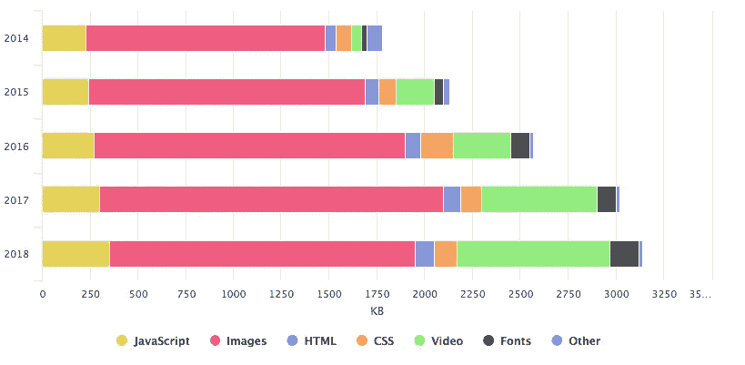
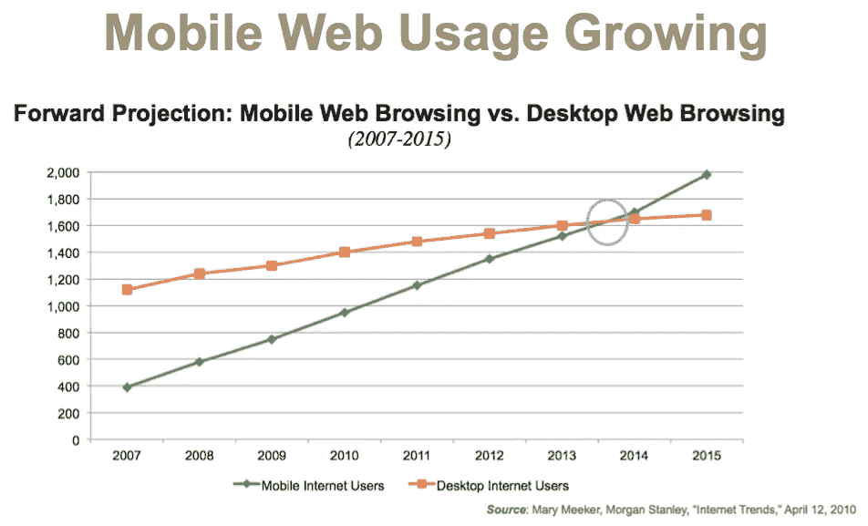
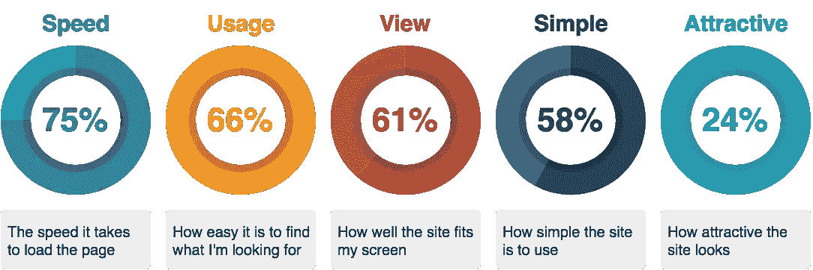
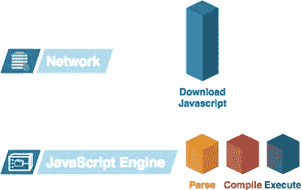
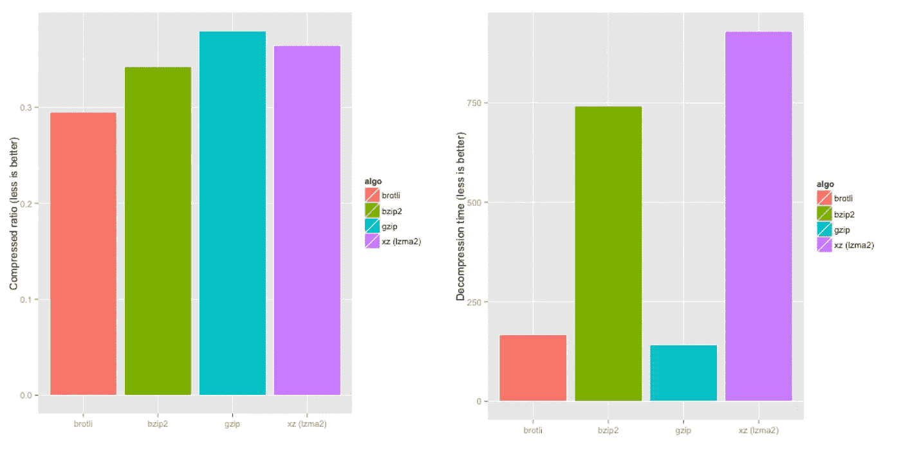
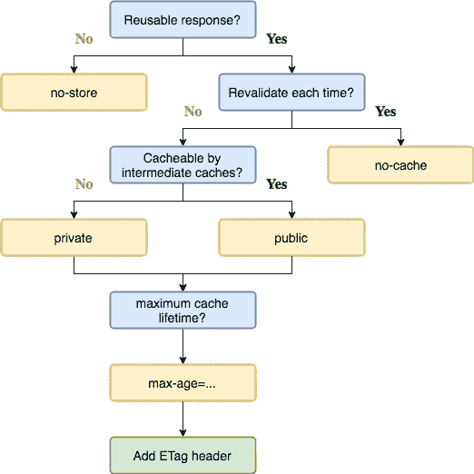
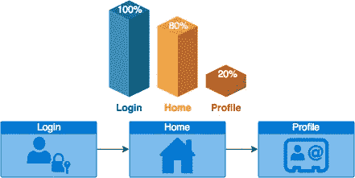

# Web 性能清单

> 原文：<https://itnext.io/web-performance-checklist-6b616f3c6f0d?source=collection_archive---------1----------------------->


提高你的网站或网络应用程序性能的简单步骤。看看吧，也许你漏掉了什么？

你的网站或网络应用程序有一个最大性能吗？我认为很多开发人员和团队都有这个问题，在我们的时代，在设计或重构阶段很容易遵循简单的步骤。有很多强大的工具可以帮助你使用最佳实践，让你的网站或应用程序发挥巨大的性能。

我建议你遵循一些简单的提示和技巧，它们可以帮助你最大化你的网络应用或网站的性能。

看看这个列表，按照简单的步骤进行验证。在这篇文章中，我包括了所有的关键步骤，涵盖了 web 应用程序和站点巨大性能的最佳实践。当然，这不是我们能做的全部，只是最常见的一种。

# 为什么？

## *注意:您可以跳过这一部分，进入技术部分*

大多数网页大小约为 1.5 MB，它们有大量的时间来加载和提供交互，在大多数情况下，大多数页面大约需要 10 秒钟。下面我们来分析一下他们 2014 年以来的资源。



玛丽·米克尔，摩根士丹利，“互联网趋势”

我们可以看到，自 2014 年以来，随着设备使用量的增长，网络增长如此之快，用于网站的手机数量与台式机相当。从我们的图表中可以看出，内容数量也在快速增长。

我认为，开发者需要始终首先关心用户，我们需要优化我们的网站和网络应用程序，尽可能获得良好的浏览率。当然，在大多数情况下，如果你住在大城市，你不会有网络问题。但是你如何与全世界分享你的内容和知识呢？我知道哪些地方的边缘互联网是最大可能的互联网，人们总是乐于在那些地方阅读一些东西。感谢一些新闻门户网站使用 [AMP](https://www.ampproject.org/) 使得在糟糕的网络连接下阅读一些信息成为可能。

## 速度对 UX 层级用户的重要性



速度至关重要第三卷

我们可以看到，对于 75%的用户来说，速度是关键因素之一。

真正的下载速度还是蛮快的。10 个站点中有 7 个在不到 4 秒的时间内加载，大约 33%的站点在不到 1 秒的时间内加载。就用户的感觉而言，一般来说，他们认为下载速度相当快，数字与实际测量的速度非常相似。我们可以做到这一点，让我们进入技术部分。

让我们将我们的 web 性能优化分为两个重要的部分，**客户端**和**服务器端**。这两部分都是必不可少的。

# 开始前

***请不要忘记，当你经历每一步时，总是验证潜在的回归！***

# 客户端


## 缩小和压缩

利用 **JavaScript** 的**缩小**和 **CSS** 的**压缩**，分析并移除不必要的资源，优化您的应用。这对于向客户端发送更少的数据非常重要，这非常有帮助。对于 JavaScript，我建议使用简单的 **UglifyJS** 。对于 CSS，我建议使用**压缩 CSS** **插件**或者**选项**如果你使用的是预处理语言(SASS，LESS，Stylus 等。).您将看到您的包的大小将发生显著变化。

***提示:***

你需要在你的项目中安装所需的插件或依赖项，并将其集成到你的构建系统中( **Webpack** 、 **Gulp** 等)。

## 加拿大

如果你正在使用一些到处都在使用的流行库， **CDN** 可能是从你的包中移除一些库的一个好的解决方案。

***提示:***

使用 CDN 资源，如 **Cloudflare** 、**等**。

## 避免未使用的代码

***未使用的 JS:*** 这是一个常见的问题，尤其是当你在处理一些大型企业项目时，其中有大量的代码。总是改变某些功能的需求变得过时和无用。您对此进行了标记，如

```
@depreaceted 
@note This feature was removed but will be used later.
```

这是未使用代码的开始。

**提示:**

你只需要加载需要的代码和 **lazyLoad** 其他程序块。
这一步的潜在节省将非常巨大。*大部分用户都是以第一次初始负载来分析网站或 web app 的性能。*

***未使用的 CSS:*** 在大多数情况下，如果您有一些将要使用的重要样式的初始加载，将这些部分划分为 CSS 块并只加载第一页所需的样式，并使用 **lazyLoad** 选项加载其他样式是很有意义的。

## 分析您的捆绑包和资产，了解您的依赖项的价值

分析您的捆绑包，以验证您的供应商可能有很大的依赖性。在分析的过程中，你可以发现你的依赖项的真实用法。

始终分析和提供您的捆绑包、资产、库的审计。列出所有资产的清单。验证每个依赖项的影响，因为有时对于相同的问题，使用您自己的或更小的方法会更好。

***提示:***

有许多工具可以用来分析您的包:

[**Webpack 捆绑包分析器**](https://github.com/webpack-contrib/webpack-bundle-analyzer) 使用 **Webpack** 分析您的捆绑包大小。


[**导入成本**](https://marketplace.visualstudio.com/items?itemName=wix.vscode-import-cost) 是一个简单的可视化代码插件，为您提供导入依赖的成本。


[**捆绑恐惧症**](https://bundlephobia.com/) 给你关于导入依赖的详细信息的最好工具之一，包括**缩小**、 **gzip** **压缩**和**下载** **时间**。


## 优化 JavaScript 启动时间



如果你的网站或网络应用是以移动设备为中心的，这是非常重要的，因为在移动设备上这个过程会花费更多的时间。所以我们需要尽可能快地提供交互性。

***提示:***

为了优化这个过程，你可以使用一种叫做**代码分割**的流行技术。这很容易理解。就像巧克力块，有些是坚果，有些是浆果。JavaScript 中也是如此，例如，每个块都将通过每条路径加载自己的数据。

您可以通过**组件**或**路径**分割您的代码，这非常有用，因此我们不会提供完整的应用捆绑包，而是只提供用户在特定的机器、组件和捆绑包中使用的重要代码片段。

***从静态导入切换到动态导入*** *。*这将为您的应用程序提供非常出色的启动性能。LazyLoading 提高性能。

## 摇树

使用摇树工具消除死代码。

## 未使用的库代码

从您的网站或 web 应用程序中删除未使用的库代码。

你可以研究一下这个好的 lib 为 **Webpack** 设计的优化工具:

[](https://github.com/GoogleChromeLabs/webpack-libs-optimizations) [## Google chrome labs/web pack-libs-优化

### 在你的 webpack 项目中使用一个库？下面是优化的方法

github.com](https://github.com/GoogleChromeLabs/webpack-libs-optimizations) 

## 图像优化

从一开始，我们就提到了图片在我们的页面中占据了很大一部分，我们需要对它们进行优化。

***提示:***

使用合适尺寸的图片；为手机浏览器发送 4k 图像没有任何意义，可能需要很多时间来加载。

使用构建映像优化工具，如 **imagemin** 或 **libvips** 。用于 [**Webpack**](https://www.npmjs.com/package/imagemin-webpack) 或 [**gulp**](https://www.npmjs.com/package/gulp-imagemin/v/2.0.0) 的插件。

你也可以用 CDN 的方式。滚动自己的 CDN **拇指或**或 **Imageflow** 或使用现有的解决方案，如 **Cloudinary** 、 **Imgix** 、 **Fastly** 、 **Akamai** 。

为您的图像使用更新的图像格式(JPEG 2000、JPEG XR、WebP，它们通常比 PNG 或 JPEG 提供更好的性能),以提供更好的压缩、更快的下载和更少的数据消耗。

## 用代替 GIF

大的 GIF 对于动画内容是低效的；视频可以用更少的流量成本提供更多。

***提示:***

你可以通过将动画内容从 GIF 格式转换成带有 FFMPEG 格式的 MPEG4 视频，从而为动画内容提供巨大的优化，你可以在这里查看使用这种技术的简单指南:

[](https://medium.com/@vyakymenko/use-video-instead-of-animated-gifs-8dcc65406641) [## 使用视频而不是动画 gif

### 简单的步骤，将你的 gif 文件缩小 80%,并加快渲染速度！

medium.com](https://medium.com/@vyakymenko/use-video-instead-of-animated-gifs-8dcc65406641) 

## 动态分析网络连接以更新资产

我们可以用`navigator.connection.effectiveType`来分析用户网络连接。这可以帮助我们根据网络连接使用更多的生产资产。

例如，在桌面设备浏览器上，您可以看到视频的预览。但是在移动设备上，最好只显示一个图像，因为它的大小大约是 **50 KB** ，而不是非常高效的 **1+ MB** 。


简单预览糟糕的互联网连接


良好互联网连接的视频预览

## lazy 加载图像

尽量避免在浏览器中加载屏幕外的图片。

**提示:**

您可以通过使用 [**lazysizes**](https://github.com/aFarkas/lazysizes) 来使用 **lazyLoading** images 解决方案。

有了这个强大的工具，您可以为您的应用程序提供良好的性能，并且您的图像将被跟踪加载。这很有用。

你可以在这里看演示:

[](http://afarkas.github.io/lazysizes/#examples) [## 响应图像、iframes 和小部件的终极 lazyloader

### lazySizes 是一个终极的轻量级 lazyLoader，它惰性地加载图像(包括响应图像…

afarkas.github.io](http://afarkas.github.io/lazysizes/#examples) 

更多详情请看官方 [**GitHub 回购**](https://github.com/aFarkas/lazysizes) 。

## 通知浏览器先加载什么

默认情况下，浏览器不知道先加载什么，CSS，图像，脚本，有时会出现这样的情况，当你的 CSS 已经加载时，你的一些图像是不可用的。

使用`<link rel=preconnect>`、`<link rel=preload>`、`<link rel=prefetch>`通知浏览器适时加载资源的重要性。但是它们也可以用于其他有效点，例如:

*   避免多个连接到同一个原点。
    从远程服务器导入字体或资源时，通常会出现这种情况。在这种情况下，`<link rel=preconnect>`将帮助您减少打开的连接数量。
*   使用`<link rel=preload>`预加载关键请求，可以帮助您优化资源的加载时间。它会告诉浏览器，我们需要尽可能快地加载这个资源。因此，与其浪费时间，等到所有的资源都被加载，我们加载所有的资源与字体，节省了大量的时间。*对你的页面加载影响巨大。*
*   将`<link rel=prefetch>`用于将用于未来导航的资产。 **Webpack 4.6** (预取，预加载)。

## 字体显示

我们需要尽量避免需要加载某种网络字体的文本。你可以使用`font-display: swap`,这将有助于你在字体加载后进行切换。

这是一个非常新的功能，除了 Edge 之外，所有新的浏览器**都支持它。**

你可以在这里 看一看更详细的 [**信息。**](https://developer.mozilla.org/en-US/docs/Web/CSS/@font-face/font-display)

## 避免呈现阻塞样式表(关键路径优化)

这一部分对于第一次画图非常重要。你可以把内嵌的关键样式放在第一页上，然后延迟加载所有其他的样式。

***提示:*** 用这个牛逼的工具增加 FMP(第一次保养全漆):

1.  [**耳房**](https://github.com/pocketjoso/penthouse) ，关键路径 CSS 生成器。
2.  [**关键**](https://github.com/addyosmani/critical) ，提取 HTML 页面中&内联关键路径 CSS。

# 服务器端


## 压缩(gzip，brotli)

用 **Gzip** **压缩**或 **Brotli** **压缩**压缩所有文本文件。这非常简单，你所需要的只是配置你的服务器配置，然后重启它。如果你正在使用像谷歌云平台或 AWS，Azure 这样的云服务，在大多数情况下，它们为一些存储服务提供开箱即用的压缩。或者你可以使用 **Firebase** 来托管文件，这也给了你 **Gzip** 开箱即用。

[**Brotli**](https://github.com/google/brotli) 对于客户端来说是最好的方法之一，解压性能堪比 gzip，同时显著提高压缩率。这些都是为静态内容(如字体和 HTML 页面)提供服务的强大属性。



压缩基准:brotli，gzip，xz，bz2。耶鲁安 Ooms

## 高效缓存策略

我们都知道静态资源的短缓存时间会影响重复访问，因此，您需要为用户提供一个好的缓存策略。尤其是图像和字体。

***提示:***

我们需要缓存尽可能多的资源，越多的资源对可重复访问越好。

```
**.@(jpg|jpeg|png|gif|woff2)Cache-Control
max-age=31536000
```

这将告诉用户从缓存中使用文件，而不是下载它们。



来自 Google IO 18 的重制版图，“让网络性能变得简单”

## HTTP/2 而不是 HTTP/1.1

为什么是 HTTP/2？因为 HTTP1.1 被限制为每个 TCP 连接只能处理一个未完成的请求，迫使浏览器使用多个 TCP 连接来同时处理多个请求。

**复用流**

通过 HTTP/2 协议在服务器和客户端之间交换的文本格式帧的双向序列被称为“流”。HTTP 协议的早期版本一次只能传输一个流，并且每个流传输之间会有一些时间延迟。

通过一个接一个发送的单个流接收大量的媒体内容既低效又消耗资源。HTTP/2 的变化有助于建立新的二进制帧层来解决这些问题。

这一层允许客户机和服务器将 HTTP 有效负载分解成小的、独立的和可管理的交错帧序列。这些信息然后在另一端重新组合。

**HTTP/2 服务器推送**

此功能允许服务器向客户机发送额外的可缓存信息，这些信息并未被请求，但在将来的请求中会被请求。例如，如果客户机请求资源 X，并且知道所请求的文件引用了资源 Y，则服务器可以选择将 Y 与 X 一起推送，而不是等待适当的客户机请求。

使用 HTTP/2 将为您提供显著的资源加载性能，尤其是并行加载。

# 工具


## 分析和审计

为了对你的网站进行有力的分析，我建议你使用谷歌灯塔审计。它将帮助你分析你的 JavaScript 启动时间，这对于理解启动你的网站或网络应用程序的问题是非常重要的。

# 额外的


本节包含一些实验性的和 alpha 版本的特性，您可以研究并准备使用它们。

## 优先级提示

不久前在 W3C 中有一个有趣的特性叫做`importance`。这是一个简单的功能，可用于确定加载内容的优先级。

如果能够实现的话，优先获取请求是一项非常有趣的技术。

 [## 优先级提示

### 该规范描述了一个浏览器 API，使开发人员能够发出他们需要的每个资源的优先级信号…

wicg.github.io](https://wicg.github.io/priority-hints/) 

更多细节你可以看看 [**这里**](https://github.com/WICG/priority-hints) 。

## 数据驱动的加载和捆绑

使用谷歌分析页面导航模型或您的自定义导航模型和机器学习，您可以集成数据驱动的加载或捆绑机制。



让我们来看看最上面的例子。让我们想象一下上面的应用程序。在这个应用程序中，你有三条简单的路线。**第一条**路线是主路线，类似登录页面；**第二个**是您登录后将被导航到的主屏幕和**第三个**个人资料页面。在大多数情况下，大约 80%的用户不需要在 profile route 下呈现和提供 profile 组件功能的捆绑包，因此在最初的捆绑包中，您将看到第二次登录将是 home，最后一次登录将被分析。

看看小文章的用法:

[](/increase-performance-of-your-angular-react-and-gatsby-apps-with-guess-js-2214d4be0871) [## 使用 Guess.js 提高 Angular、React 和 Gatsby 应用程序的性能

### 提高 Angular、React 和 Gatsby 应用程序的性能始终是一个重要的问题，尤其是如果您…

itnext.io](/increase-performance-of-your-angular-react-and-gatsby-apps-with-guess-js-2214d4be0871) 

# 结论


总是考虑性能，这对你和你的团队来说是一个很好的挑战。

一旦你开始优化你的网站或网络应用程序，你会看到结果，你会对它闪电般的速度感到满意。

永远关注所有细节，而不仅仅是基本问题。因为它和房屋建筑一样，是一个包含太多小细节的庞大机构。

感谢阅读！