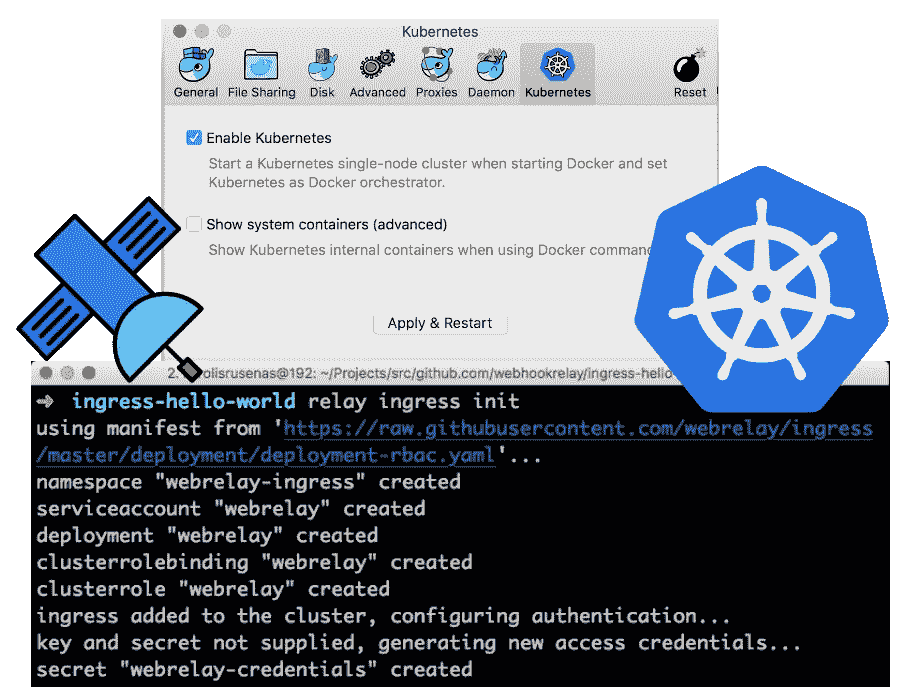
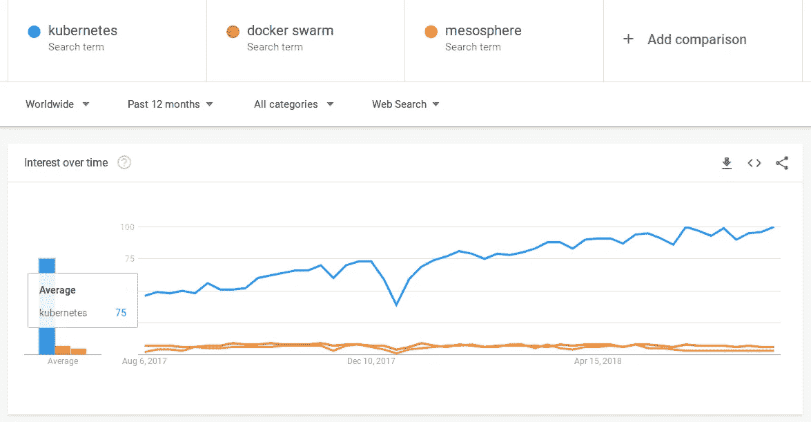
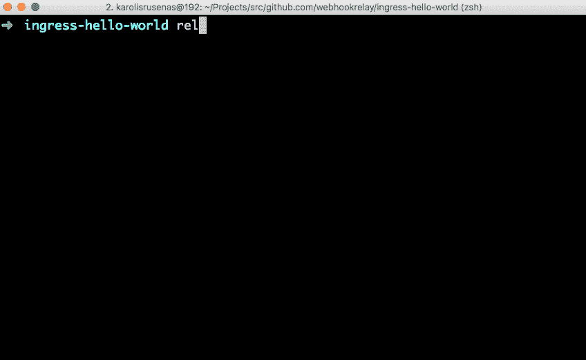
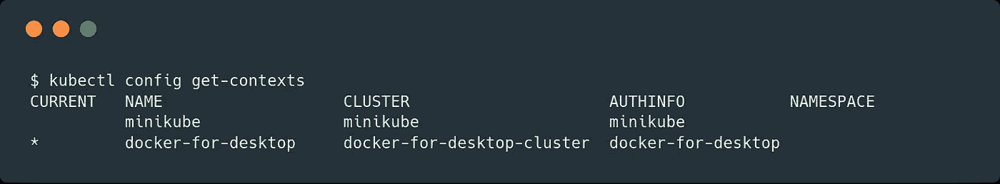
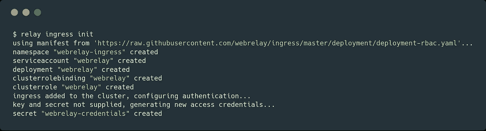
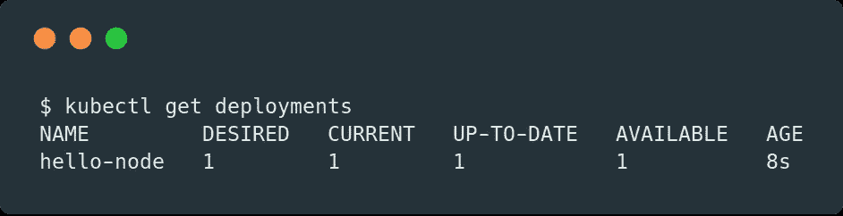
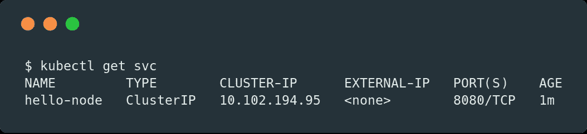
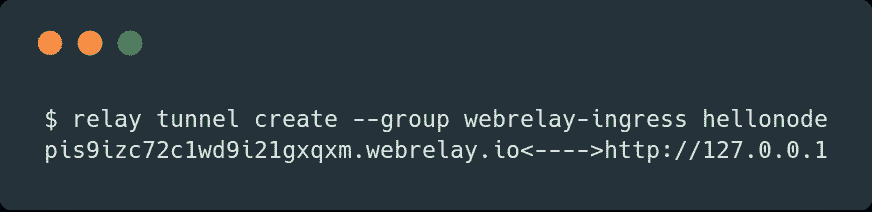
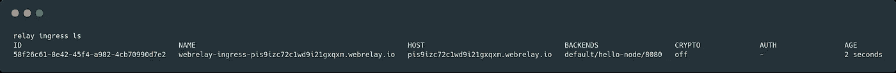
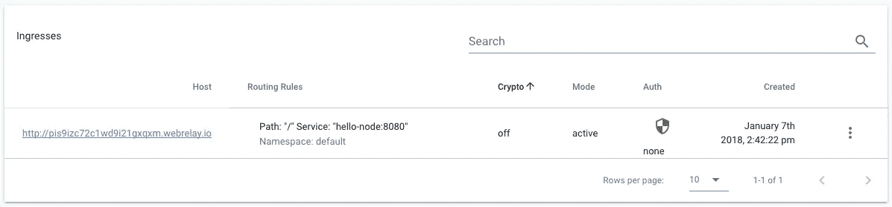

# 使用 Docker for Mac 或 Minikube 的 Web 中继入口

> 原文：<https://itnext.io/web-relay-ingress-with-docker-for-mac-or-minikube-753d71b28275?source=collection_archive---------1----------------------->



Kubernetes 在 Mac 17.12 CE Edge 的 **Docker 中可用。[去年，Kubernetes](https://kubernetes.io/) 展示了它是运行容器工作负载的最灵活和最**可靠的**选择，几乎击败了竞争对手:**



在参观了奥斯汀和哥本哈根的上两次 KubeCon 会议后，我看到专门从事 Kubernetes 咨询的公司数量大幅增加，几乎所有的云提供商都在开发托管 Kubernetes 解决方案，我想很快它将像托管静态网站一样简单，可供所有人使用:)

**在本文中，我们将:**

*   在您的 **Docker for Mac** 中启用 Kubernetes 支持。
*   创建并部署一个示例 Node.js 应用程序。
*   使用 Web Relay ingress 控制器向全世界共享我们计算机中运行的应用程序:)



**先决条件:**

*   [支持 Kubernetes](https://docs.docker.com/docker-for-mac/release-notes/)或 [Minikube](https://github.com/kubernetes/minikube) 或任何其他 Kubernetes 集群的 Mac Docker 在 GKE 上运行良好！
*   Webhook 中继[账号](https://my.webhookrelay.com/register)和[中继](https://webhookrelay.com/v1/guide/installation.html#MacOS)客户端命令。
*   `kubectl`，Kubernetes 客户端命令。它应该由 Mac 的 Docker 来包含和配置，或者你可以单独安装:【https://kubernetes.io/docs/tasks/tools/install-kubectl/

> *如果您没有使用 Mac 或****Docker for Mac****，请跳过“在您的 Docker for Mac 中启用 Kubernetes”部分。本教程适用于任何具有互联网连接的****Kubernetes 集群。***

# 入门指南

是时候把手弄脏了！如果你已经做了，可以跳过一些事情，比如启用 Kubernetes。

# 在 Mac Docker 中启用 Kubernetes(仅适用于 MacOS 用户)

要在 Mac Docker 中启用 Kubernetes 支持，选择**启用 Kubernetes** 并点击**应用并重启**按钮:


根据可用的互联网带宽，这需要一点时间，一旦完成，它应该报告安装完成。如果你对这一步有任何问题，访问 [Docker 文档](https://docs.docker.com/docker-for-mac/#kubernetes)可能是有意义的。

与 Minikube 不同，Docker for Mac 不劫持 kubectl 上下文，所以您必须设置它:

```
kubectl config use-context docker-for-desktop
```

检查您的`kubectl`是否正在使用 **docker-for-desktop** 上下文。



# 在 Minikube 上启动 Kubernetes(针对 Linux 用户)

嗯，这很简单。你可能已经知道了，但是:

```
minikube start
```

# 将入口控制器添加到 Mac Kubernetes 的 Docker

添加入口控制器:

```
relay ingress init
```

输出应该如下所示:



是的，你们中的一些人现在可能会想:


但是等等，这个命令在`webrelay-ingress`名称空间中创建了支持 RBAC 的入口控制器，并且已经为您的帐户**配置了凭证。你可以阅读更多关于网络中继入口控制器[这里](https://webhookrelay.com/v1/guide/ingress-controller)。**

# 创建 Node.js 应用程序

下一步是编写应用程序。创建一个名为`hello`的新目录，文件名为`server.js`:

要运行应用程序:

```
node server.js
```

你应该能看到你的“Hello World！”在[的消息 http://localhost:8080/](http://localhost:8080/) 。

通过按下 **Ctrl-C** 停止正在运行的 Node.js 服务器。

下一步是将应用程序打包到 Docker 容器中。

# 将您的应用程序放入 Docker 容器中

创建一个文件，也在`hello`目录下，命名为 **Dockerfile** 。Dockerfile 文件描述了您想要构建的映像。您可以通过扩展现有映像来构建 Docker 容器映像。本教程中的图像扩展了现有的 Node.js 图像。

```
FROM node:9.2.0    # base image, needs Node.js
EXPOSE 8080        # on which port your application is listening
COPY server.js .   # copies our file into the Dockerfile
CMD node server.js # tells the runtime how to start your app
```

这个 Docker 文件从 Docker 注册表中的官方 Node.js 映像开始，公开端口 8080，将 server.js 文件复制到映像并启动 Node.js 服务器。
建立你的码头工人形象:

```
docker build -t hello-node:v1 .
```

使用 Kubernetes 的 Docker for Mac 的真正好处是，您可以在 Kubernetes 集群中轻松运行本地构建的 Docker 映像。不需要仅仅为了测试而改变 Docker 守护进程或将映像推送到公共存储库。现在，Docker for Mac Kubernetes 可以运行您构建的映像。

# 创建部署和服务

Kubernetes [Deployments](https://kubernetes.io/docs/concepts/workloads/controllers/deployment/) 检查[Pod](https://kubernetes.io/docs/concepts/workloads/pods/pod/)的健康状况，如果 Pod 终止，则重启 Pod 的容器。Pod 可以由多个容器组成，但在本例中，我们只有一个容器:

```
kubectl run hello-node — image=hello-node:v1 — port=8080
```

要查看部署:

```
kubectl get deployments
```

输出:



因为在默认情况下，Pod 只能通过其在 Kubernetes 集群中的内部 IP 地址进行访问，所以我们需要公开它。创建一个[服务](https://kubernetes.io/docs/concepts/services-networking/service/):

```
kubectl expose deployment hello-node — type=ClusterIP
```

要查看创建的服务:

输出:



# 定义入口并将您的应用程序暴露于互联网


Kubernetes 中的入口提供了一种简单的方法来定义主机名和服务之间的路由规则。让我们通过创建一个隧道来使用`relay`命令客户端获得我们的公共端点:

```
relay tunnel create — group webrelay-ingress hellonode
```

输出:



需要参数*–group web relay-ingress*来让我们的 ingress 控制器知道它可以管理哪些隧道。

> *注意，拥有付费计划的用户可以指定任何自定义子域(只要不被占用)，而无需先创建隧道。这允许简单地定义* `*ingress.yaml*` *，入口控制器将为其创建一个隧道。*

我们只对这个`pis9izc72c1wd9i21gxqxm.webrelay.io`(主持人)部分感兴趣。每个用户都有一个唯一的隧道链接。使用您的隧道主机名编辑此代码，并将其保存在名为`hello`的文件夹中，文件名为`ingress.yml`:

创建它:

```
kubectl create -f ingress.yml
```

您的应用程序现在公开在公共互联网上。请参阅下一节如何访问或只需在浏览器中输入主机名。

# 通过互联网访问您的应用程序

要查看现有入口:

```
relay ingress ls
```

输出:



**后端**列应该显示公开服务的`<namespace>/<service>/<port>`。你可以在这里用浏览器访问 [http:// <你的子域> .webrelay.io](http://pis9izc72c1wd9i21gxqxm.webrelay.io/) (把链接改成你自己的隧道地址就可以了)。

您也可以在 https://my.webhookrelay.com/tunnels[使用网络用户界面](https://my.webhookrelay.com/tunnels)查看您的简介:



# 包扎

在本文中，我们创建、部署了一个应用程序，并将其暴露在互联网上，该应用程序在我们的笔记本电脑上本地运行。有人说这是一个**“真实的 hello world”**应用程序，而不仅仅是通常的**“hello localhost”**。

有了 Docker for Mac Kubernetes 和 Minikube 支持，现在开发和测试我们的应用程序就容易多了。本地构建、本地运行和本地演示。我希望 Web Relay ingress controller 在开发、测试和运行您的应用程序时能为您提供很好的服务。

一如既往，如果您有任何问题，请随时联系我。

*原载于 2018 年 1 月 8 日*[*【webhookrelay.com】*](https://webhookrelay.com/blog/2018/01/08/ingress-with-docker-for-mac/)*。2018 年 7 月 31 日更新。*