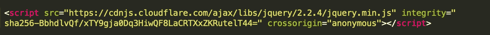
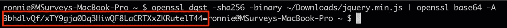
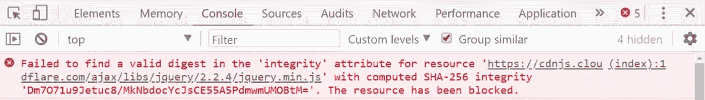
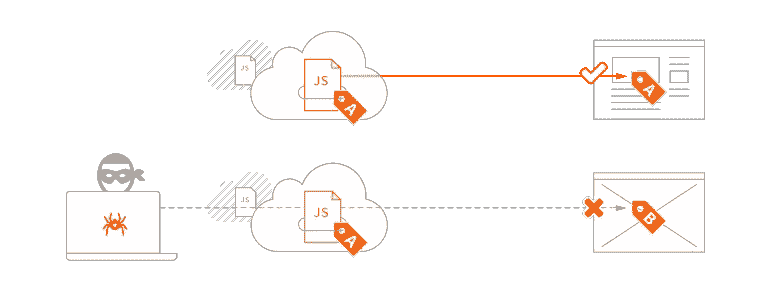

# 网络安全—第 1 部分，子资源完整性(SRI)

> 原文：<https://itnext.io/web-security-part-1-subresource-integrity-sri-61e3878c3a9e?source=collection_archive---------4----------------------->

在与其他工程师交流的过程中，我一有机会就会想办法提出 web 安全的话题。起初，在最开始，这是出于好奇，以了解最新的和流行的流行语有关的主题。但随着时间的推移，我越来越有兴趣了解这些工程师在保护他们的应用程序免受什么攻击，以及如何保护。

可悲的是，经常听到人们直截了当地说他们的平台是安全的；就像安全是一个开关，你只需要打开或关闭它。安全性是一个非常广泛的领域，并且在不断发展。您的安全性取决于您意识到的安全威胁类型。有很多提供安全报告服务的在线工具:Netsparker 的 [SSL Labs](https://www.ssllabs.com/) 、T2 的【安全标题】T3、Mozilla 的 [Observatory](https://observatory.mozilla.org/) 等等。

# 子资源完整性(SRI)

如果攻击者能够篡改和改变已经加载到您的站点上的第三方脚本，他们会做哪些事情？简单的回答——几乎任何事情。加载外部内容、访问本地存储、重定向用户、修改 DOM、抛出要求用户安装程序的侵入性弹出窗口等等。作为一名开发人员，这是一个非常可怕的处境。

SRI 是一种安全特性，它让开发人员确信，他们的应用程序正在获取的任何资源都是在没有被篡改的情况下实际交付的。无论何时从第三方来源加载库，这都是一个最佳实践。这在内容交付网络(cdn)中很常见，但并不仅限于此。

下面是一个加载到站点中的 jQuery 脚本示例:

jQuery 集成脚本

*完整性*属性允许浏览器确定托管在第三方服务器上的资源没有被操纵。它是如何工作的？库的第三方来源提供了资源的加密哈希，每次获取资源时，浏览器都会对其进行哈希处理，并确认它是否与最初提供的哈希匹配。浏览器每次遇到带有完整性属性的 *<脚本>* 或 *<链接>* 元素时都会这样做。这使得中路的[人](https://en.wikipedia.org/wiki/Man-in-the-middle_attack) (MITM)进攻非常困难。

*integrity* 属性的值*SHA 256-BbhdlvQf/xty 9 gja 0 D3 hi wqf 8 lacrtxzkrutelt 44 =*告诉浏览器在[https://cdnjs . cloud flare . com/Ajax/libs/jquery/2 . 2 . 4/jquery . min . js](https://cdnjs.cloudflare.com/ajax/libs/jquery/2.2.4/jquery.min.js)找到的文件的 SHA-256(有不同版本的 SHA) hash 是*BbhdlvQf/xty 99 通过下载文件并在终端上运行以下命令，我们可以很容易地确认这是生成的摘要:*

*OpenSSL dgst-sha 256-binary****filename . js****| OpenSSL base 64-A*

生成 SRI 哈希

那么，如果 MITM 攻击发生并且文件被修改，会发生什么呢？那么，浏览器将生成接收到的资源的加密散列，并且在比较时，浏览器将发现由第三方源提供的初始散列与生成的散列不同。因此，浏览器会抛出网络错误。

被阻止的资源截图

# 子资源完整性的优势

*   增加开发人员对第三方库的信任，以及用户对应用程序的信心
*   报告违规提醒开发人员注意事件

# 包扎

子资源完整性说明。贷项:堆栈路径

好吧。所以一次袭击被减轻了。资源已被阻止，其内容尚未在浏览器上执行。浏览器抛出了一个网络错误。灾难避免了。干得好。

但是我们能更进一步吗？如果发生这种情况，我们现在知道应用程序会自动崩溃，因为没有加载所需的脚本，应用程序将处于不可用状态。更糟糕的是，开发者或网站所有者不太可能知道这样的事件已经发生，因为这是在用户的浏览器上运行的。在下一篇文章中，我将讨论如何使用**内容安全策略** (CSP)及其报告违规的能力来解决后面这些问题。

为了模拟 MITM 攻击并修改传输中的资源，我们可以使用网络嗅探工具来编辑 web 会话。一个例子是[提琴手](https://www.telerik.com/fiddler)。Fiddler 提供了一个 *OnBeforeResponse()* 钩子，允许您设置一个断点来暂停会话的处理，并允许更改请求/响应。虽然这一点超出了本文的范围，但我可以考虑将来写一篇文章来演示这一点。