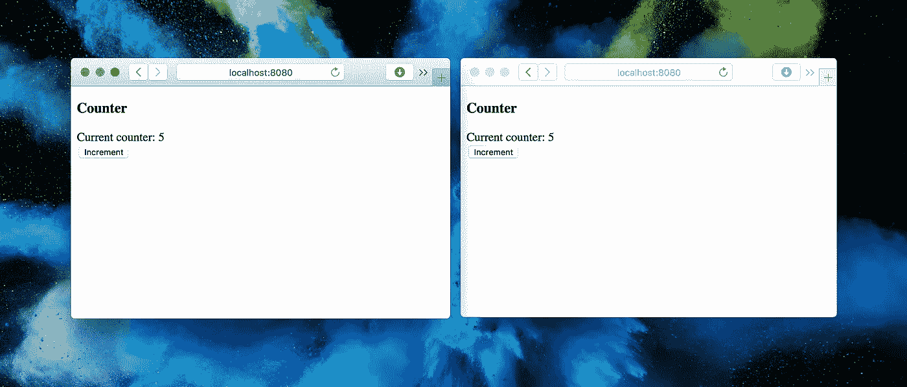

# 带 Vert.x 和 SockJS 的网络插座

> 原文：<https://itnext.io/web-sockets-with-vert-x-and-sockjs-1f0710264eea?source=collection_archive---------5----------------------->



[*点击这里在 LinkedIn* 上分享这篇文章](https://www.linkedin.com/cws/share?url=https%3A%2F%2Fitnext.io%2Fweb-sockets-with-vert-x-and-sockjs-1f0710264eea)

Vert.x 是 Netty 之上的可插拔模块的工具包和生态系统，用于在 JVM 之上构建反应式应用程序。

当我们使用标准的基于线程的方法来处理服务器上的请求时，每个请求都由一个单独的线程来处理。这就限制了一台服务器可以处理多少个并发请求。如果线程池中没有可用的线程，服务器将无法处理更多的请求。
我们可能会将线程数量增加到一个非常大的数字。但是这样做的问题是太多的线程会导致各种类型的资源问题。

尽管如此，线程是利用多核 CPU 的好方法，但如果使用不当，它会导致许多问题。

基于线程的方法的替代方法是事件循环。事件循环使得使用单线程处理多个请求成为可能。事件循环使得 vert.x 非常实用。有一件非常重要的事情要记住，没有什么可以阻止事件循环。例如，我们不能使用同步的标准 JDBC。为了通过 JDBC 与数据库对话，我们需要使用 [vert.x-jdbc-library](http://vertx.io/docs/vertx-jdbc-client/java/) 。

SockJS 提供了 web socket 的抽象。如果浏览器支持 web 套接字，SockJS 将使用 web 套接字。但是如果浏览器不支持 web 套接字，SockJS 会使用特定于浏览器的传输协议在客户机和服务器之间建立连接。

## 示例应用程序

我们将实现一个可以在多个浏览器中使用的计数器。每点击一次*增量*按钮将增加值，且该变化将被传播到其他浏览器。

当用户点击 *Increment* 按钮时，客户端与服务器对话，服务器递增该值，并使用 web 套接字将更改推送到所有连接的浏览器。然后客户端显示更新后的号码。

## 客户端

让我们首先创建客户端 HTML 和 JavaScript。HTML 文件需要包含对 SockJS 的引用，这是 [vertx-eventbus](https://github.com/ondrej-kvasnovsky/vertx-sockjs-counter/blob/master/webroot/js/vertx-eventbus.js) 所需要的。事件总线用于简化 SockJS 和 Vert.x 服务器之间的交互。

> 我们可以把 HTML 和 JavaScript 文件放到项目目录下的 webroot 中。Vertx 服务器会将这些提供给浏览器。

我们的客户端应用程序应该运行在 web 浏览器中。所以我们需要用 JavaScript 实现应用程序逻辑。加载 HTML 页面时，调用 *init()* 函数。

init 函数创建新的事件总线。在后台，事件总线将使用 SockJS 创建一个与使用 web 套接字的服务器的连接。如果 web 套接字不可用，SockJS 将使用浏览器协议来创建连接。

当用户点击 *Increment* 按钮时， *increment()* 方法被执行，一条新消息被推送到服务器。我们已经在服务器上的地址中定义了*，它将用于接收来自客户端的消息。 *out* 地址将用于相反的用途，即从服务器向客户端发送消息。*

> 地址可以包含动态值，如 ID。然后我们在服务器上使用正则表达式匹配这个地址。

## 服务器端

我们将创建一个 HTTP 服务器，它将能够通过 web 浏览器打开 web 套接字连接。

我们将创建一个可在 vert.x 上部署的 vertice。vertice 类似于 servlets，但它们的工作方式[不同](http://tutorials.jenkov.com/vert.x/verticles.html)。

当创建一个 verticle 时，我们将启动 HTTP 服务器和创建路由器映射的代码放到 *start()* 方法中。

首先，我们得到与顶点服务器相关联的路由器。我们定义了 URL 映射以及什么处理程序应该与该路由相关联。然后我们添加 staticHandler，它将提供在 *webroot* 目录中定义的任何内容。

然后我们需要一个地方来存储服务器上的数据。我们将使用 *SharedData* 在已部署的垂直市场上可用。

让这个应用程序工作所需的最后一个类是一个将监听和产生消息的处理程序。每当客户端向服务器发送消息时，调用 *handle* 方法，事件类型设置为 *SEND* 。然后，我们从 vertx 提供的共享数据中获取当前值。我们递增该值，然后将其保存回共享数据实例。值更新后，我们*为客户端发布*一条新消息。

我们将使用 Gradle 进行依赖和构建管理。

我们可以运行一个 Gradle 任务来从控制台启动服务器。

```
$ gradle run
```

然后，我们可以在几个 web 浏览器中打开 [http://localhost:8080](http://localhost:8080/) ，尝试单击按钮，看看计数器值是如何递增的，然后被推送到所有客户端。

## 发展

我们可以用 *main* 方法创建一个类，用我们的 verticle 启动 Vert.x 服务器。从 IDE 中运行这个类可能比运行 Gradle 任务更方便一些。

这篇文章中使用的源代码可以在 [github](https://github.com/ondrej-kvasnovsky/vertx-sockjs-counter) 上获得。