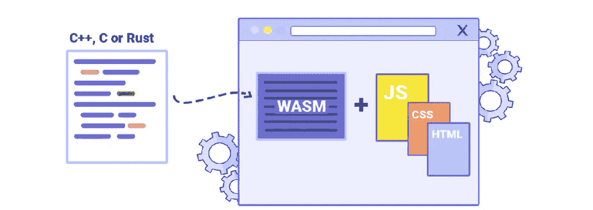
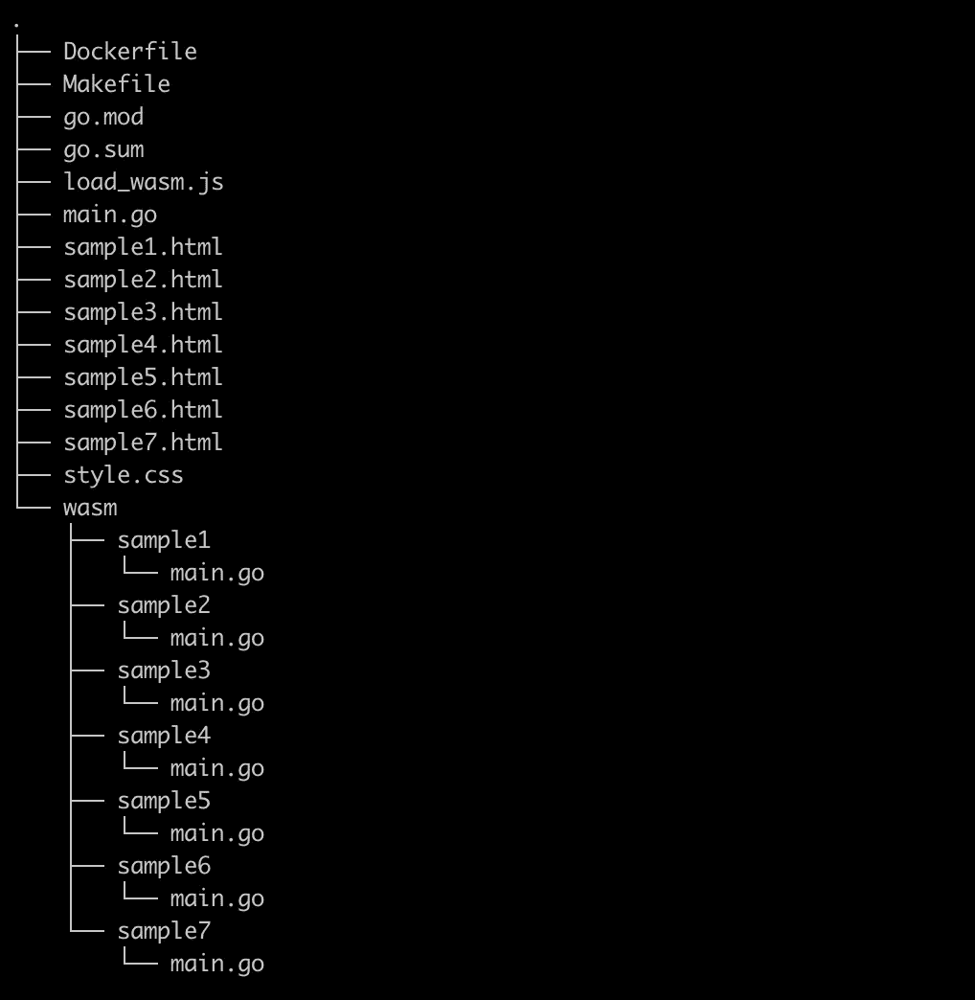
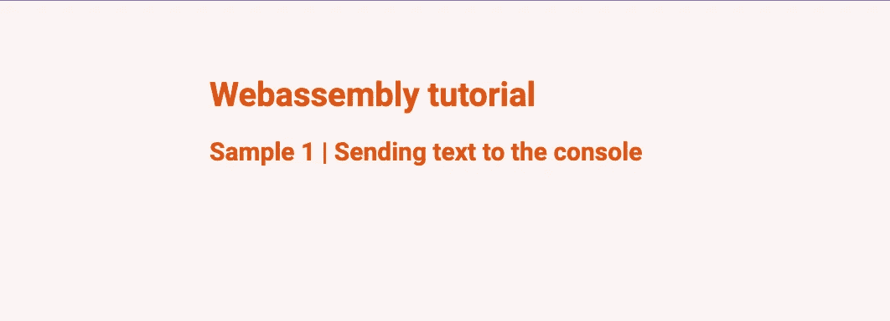
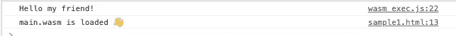
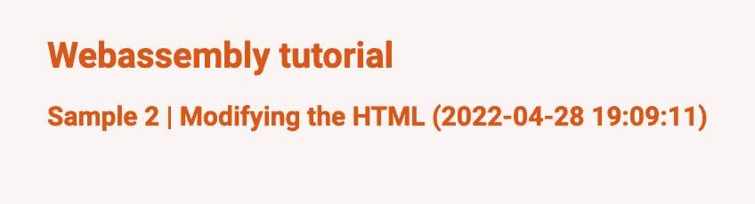
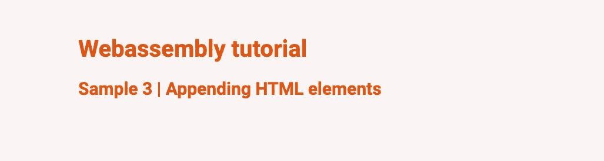
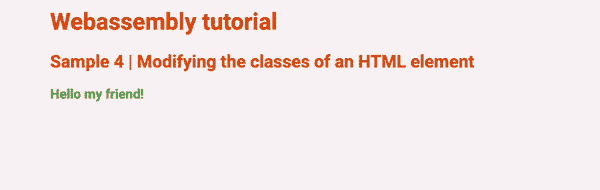
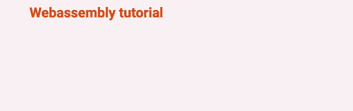
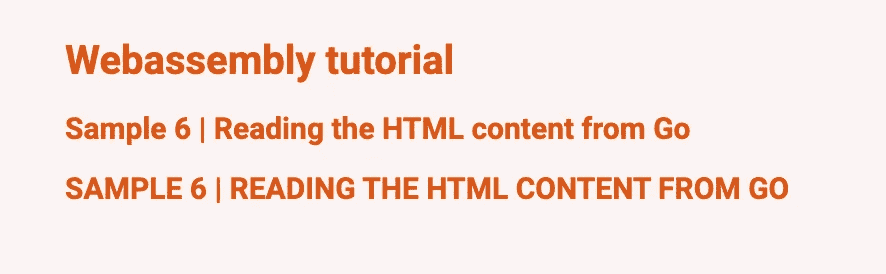
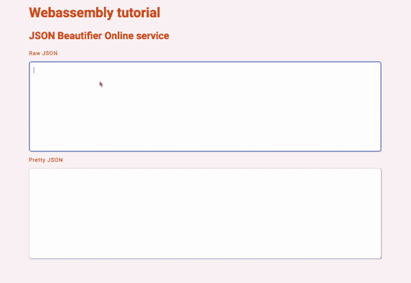

# Webassembly:在浏览器中运行 Go 代码。

> 原文：<https://itnext.io/webassembly-running-go-code-in-the-browser-916d87456e5f?source=collection_archive---------1----------------------->

Webassembly (WASM)是目前最具颠覆性的技术之一。WASM 使我们能够在浏览器中运行用自己的浏览器不支持的编程语言编写的程序。我们可以做到这一点，因为一些编程语言可以编译成 WASM 和 WASM 是所有浏览器支持的。

> 例如，我们可以编写 Rust 或 Go 代码，并像处理 Javascript 一样执行它。



图片来源[https://tecnologiandroid.com/que-es-webassembly-wasm/](https://tecnologiandroid.com/que-es-webassembly-wasm/)

WASM 最常见的用途是:

*   图像优化压缩。
*   收获过去编写的旧代码，并将其带入现代网络世界。
*   加密。
*   游戏开发。

# WASM vs Javascript

## 表演

与 Javascript (JS)的主要区别在于 **JS 是一种动态语言**。这意味着在浏览器上执行一段 JS 的过程如下所示:

1.  浏览器从服务器下载 JS
2.  它开始解析所有的 JS
3.  它将下载的 JS 代码转换成抽象的语法树。
4.  它会编译成字节码。

另一方面， **WASM 是一种静态语言**，执行的代码已经预先编译好了，所以我们只需要把 WASM 拉下来

## 互用性

WAS 的使用变得非常具有互操作性。我们可以用 JS 和 WAS 编写代码，然后我们可以在用不同语言编写的代码段之间进行调用。

> WAS 代码可以调用 JS 函数，反之亦然，JS 代码可以调用 WAS 函数。

# 做中学

在本教程中，我们将学习编译 Go 代码到 WASM，并在浏览器中执行它。

我们将学习实现一个 JSON 美化器在线服务。该服务将在 Go 中实现，并将在浏览器中执行。(听起来很棒吧？)

试图从头开始实现整个问题可能很难做到。因此，在得出最终解决方案之前，我们将一步一步地研究不同的示例。

# 先决条件

*   让我们克隆代码

```
> git clone [git@github.com](mailto:git@github.com):ivancorrales/wasm-tutorial-go.git
> cd wasm-tutorial-go
```

你需要在电脑上安装的唯一软件是 Docker，如果你的系统中没有 Go 编译器，不要担心，我们会利用 Docker。

## 代码



本教程的代码组织

本教程由 7 个步骤组成。这就是为什么你会在库的根目录(`sample[N].html`，N=1…7)和`wasm.`下的 7 个子文件夹中找到 7 个 HTML 文件的原因。`wasm`下的文件夹包含将被编译到 WASM 的 Go 代码。

在存储库的根目录下，您会发现一个`styles.css`(不同示例中使用的通用 CSS 样式)、`load_wasm.js`(该文件用于导入编译成`wasm`格式的文件)和`main.go`，后者是一个用于提供静态内容(HTML 页面)的程序。

我们将使用存储库根目录下的`multistage`docker 文件来构建和运行示例。虽然我们不会解释这个 Docker 是如何工作的，但是如果你有任何问题或者建议，请随时联系我。

## 步骤 0 —启动服务器

执行以下命令来创建 docker 映像并使其运行。这将在端口 3000 上启动一个静态服务器。如果该端口繁忙，您只需在`Makefile`中更新映射的端口

```
> make build
> make run
```

## 步骤 1 —向输出控制台发送消息

这是最基本的场景。我们将在 Go 中编写一条消息，该消息将被发送到浏览器中的输出控制台。

[https://github . com/ivancorrales/wasm-tutorial-go/blob/main/wasm/sample 1/main . go](https://github.com/ivancorrales/wasm-tutorial-go/blob/main/wasm/sample1/main.go)

这段代码被[编译](https://github.com/ivancorrales/wasm-tutorial-go/blob/main/Dockerfile#L5)成一个 WASM 文件，并从 [HTML 页面](https://github.com/ivancorrales/wasm-tutorial-go/blob/main/sample1.html#L11-L18)加载，如下所示。我们导入 WASM 文件的方式对所有样本都是完全一样的。

访问网址[http://127 . 0 . 0 . 1:3000/sample 1 . html](http://127.0.0.1:3000/sample1.html)查看样品 1



Webassembly 教程-示例 1

如果我们在浏览器中打开开发工具，我们将看到 main.go 文件中打印的消息“你好，我的朋友”。



Webassembly 教程-示例 1，开发工具

## 步骤 2—修改 HTML

在这一步，我们将学习从 Go 修改页面的内容。我们要做的是向页面动态添加文本。

[https://github . com/ivancorrales/wasm-tutorial-go/blob/main/sample 2 . html](https://github.com/ivancorrales/wasm-tutorial-go/blob/main/sample2.html)

在本例中，我们有一个空的 H2 元素，其内容将由 Go 代码填充。

[https://github . com/ivancorrales/wasm-tutorial-go/blob/main/wasm/sample 2/main . go](https://github.com/ivancorrales/wasm-tutorial-go/blob/main/wasm/sample2/main.go)

访问网址[http://127 . 0 . 0 . 1:3000/sample 2 . html](http://127.0.0.1:3000/sample2.html)查看样品 2



Webassembly 教程-示例 2

## 步骤 3—追加 HTML 元素

在上一步中，我们学习了修改 HTML 元素的值。在这一课中，我们将学习创建一个新元素。

我们将从 Go 代码创建元素，而不是填充元素 H”的值。

[https://github . com/ivancorrales/wasm-tutorial-go/blob/main/sample 3 . html](https://github.com/ivancorrales/wasm-tutorial-go/blob/main/sample3.html)

[https://github . com/ivancorrales/wasm-tutorial-go/blob/main/wasm/sample 3/main . go](https://github.com/ivancorrales/wasm-tutorial-go/blob/main/wasm/sample3/main.go)

访问网址[http://127 . 0 . 0 . 1:3000/sample 3 . html](http://127.0.0.1:3000/sample3.html)查看样品 3



Webassembly 教程-示例 3

## 步骤 4—修改 HTML 元素的类

我们将学习改变一个 HTML 元素的类。我们在 HTML 元素中删除和添加新的类。此步骤将每 2 秒钟更新一次 H3 元素的类别。

我们将用 id `simpleText`替换元素的类

[https://github . com/ivancorrales/wasm-tutorial-go/blob/main/sample 4 . html](https://github.com/ivancorrales/wasm-tutorial-go/blob/main/sample4.html)

H2 的等级将每 2 秒钟从`.green`变为`.pink`，反之亦然。

[https://github . com/ivancorrales/wasm-tutorial-go/blob/main/wasm/sample 4/main . go](https://github.com/ivancorrales/wasm-tutorial-go/blob/main/wasm/sample2/main.go)

访问网址[http://127 . 0 . 0 . 1:3000/sample 4 . html](http://127.0.0.1:3000/sample4.html)查看样品 4



## 步骤 5—修改 HTML 元素的属性

这一步可能看起来与前一步相似，但它们彼此完全不同。在这一步中将与 HTML 元素的属性进行交互。具体来说，我们将修改 H2 的`style`属性。我们将把`display`值从`block`更新到`none`，反之亦然。这将使文本，在 H2 元素，闪烁。

[https://github . com/ivancorrales/wasm-tutorial-go/blob/main/sample 5 . html](https://github.com/ivancorrales/wasm-tutorial-go/blob/main/sample5.html)

[https://github . com/ivancorrales/wasm-tutorial-go/blob/main/wasm/sample 5/main . go](https://github.com/ivancorrales/wasm-tutorial-go/blob/main/wasm/sample5/main.go)

访问网址[http://127 . 0 . 0 . 1:3000/sample 5 . html](http://127.0.0.1:3000/sample5.html)查看样品 5



## 步骤 6-从 Go 读取 HTML 内容

我们将学习阅读 H2 元素的文本内容，然后我们将文本转换为大写，最后我们将在页面中显示转换后的文本。

id 为`description`的 HTML 元素中的文本将以大写形式显示在 id 为`descriptionUppercase.`的元素中

[https://github . com/ivancorrales/wasm-tutorial-go/blob/main/sample 6 . html](https://github.com/ivancorrales/wasm-tutorial-go/blob/main/sample6.html)

正如你在下面看到的，围棋中的代码并不是火箭科学

[https://github . com/ivancorrales/wasm-tutorial-go/blob/main/wasm/sample 6/main . go](https://github.com/ivancorrales/wasm-tutorial-go/blob/main/wasm/sample6/main.go)

访问网址[http://127 . 0 . 0 . 1:3000/sample 6 . html](http://127.0.0.1:3000/sample6.html)查看样品 6



## 第 7 步—最后一步

我们已经掌握了所有必要的知识，可以在 Go 中编写我们自己的 JSON Beautifier 在线服务，并让它在浏览器中运行。

我们的页面将包含两个 textarea 字段，一个包含输入文本，另一个将以漂亮的模式显示文本。我们将使用 HTML 事件`onblur`和`onfocus`将一些样式应用到输入文本区域。

[https://github . com/ivancorrales/wasm-tutorial-go/blob/main/sample 7 . html](https://github.com/ivancorrales/wasm-tutorial-go/blob/main/sample7.html)

*   第 11 行:这是从 Go 开始打开一个`alert`的方法。
*   第 45 行:我们将在浏览器的开发工具中显示错误。
*   第 57–58 行:函数`Set`中的第一个值是 name，用于注册我们的全局函数。

访问网址[http://127 . 0 . 0 . 1:3000/sample 7 . html](http://127.0.0.1:3000/sample7.html)来玩我们的 JSON Beautifier 在线服务。



> 我希望你和我写这篇教程时一样喜欢它！