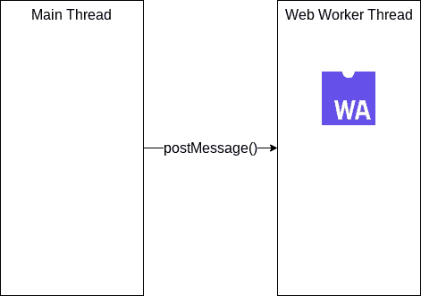

# WebAssembly & Transferable，完美匹配

> 原文：<https://itnext.io/webassembly-transferable-a-perfect-match-d78866b78d86?source=collection_archive---------5----------------------->


大多数时候，我们在 Web Worker(或 Node.js 中的 worker_thread)内部运行 WebAssembly 代码，以防止阻塞主线程，并维护一个有响应的 UI。

为了与 web worker 通信，我们使用 [Window.postMessage()](https://developer.mozilla.org/en-US/docs/Web/API/Window/postMessage) 将数据从主线程发送到 Web Worker 线程。有时您可能需要发送数兆字节的数据(尤其是对于多媒体应用程序)，这将导致较长的数据传输时间，甚至出现内存不足异常，这是由于 postMessage()的本质是将数据从主线程克隆到 web worker 线程。



向网络工作者发送数据的基本方式

要解决这个问题，您可以在 postMessage()中使用 [Transferable](https://developer.mozilla.org/en-US/docs/Web/API/Transferable) ，只需在 postMessage()中传递第二个参数，您就可以在不太麻烦的情况下获得速度提升和内存节省。

```
// Without Transerable, takes up to 2000 ms for worker to get data
const data = new UInt8Array(1024*1024*1024);
worker.postMessage(data);// With Transerable, takes up to 100 ms for worker to get data
const data = new UInt8Array(1024*1024*1024);
worker.postMessage(data, [data.buffer]);
```

在这个资源库中查看一个演示:【https://github.com/jeromewu/web-worker-transferable-demo 

因为使用 Transferable 几乎是免费的，而且可以在应用程序中提高速度和节省内存，所以您应该现在就开始在应用程序中使用它。

下一个故事再见。:)