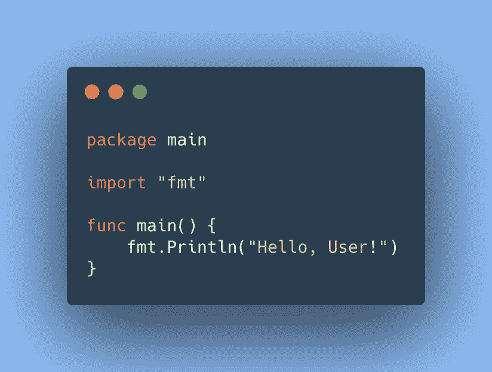
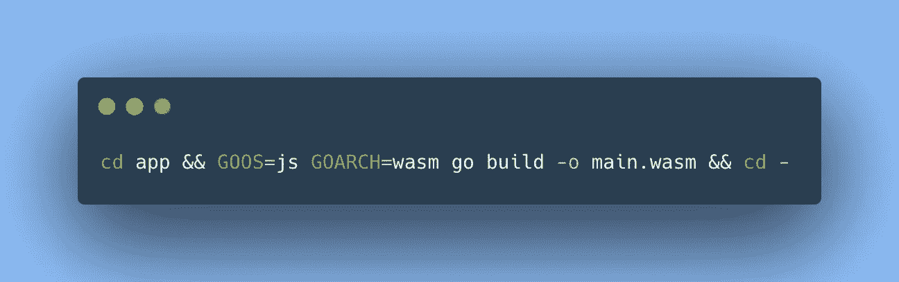
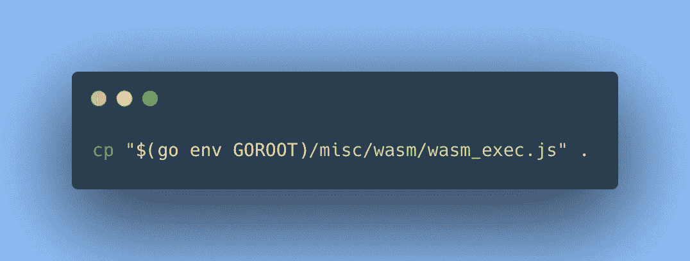
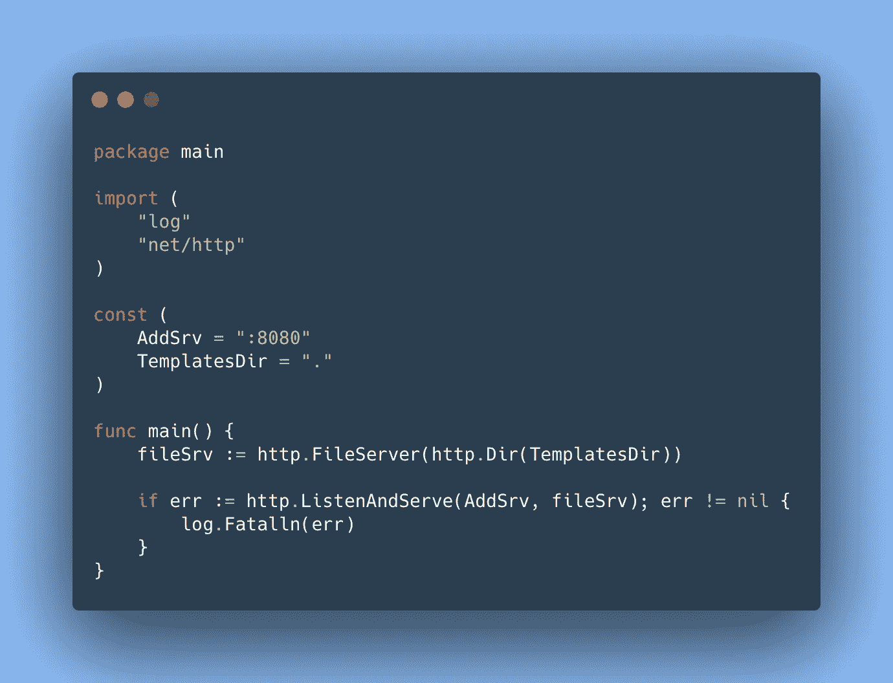
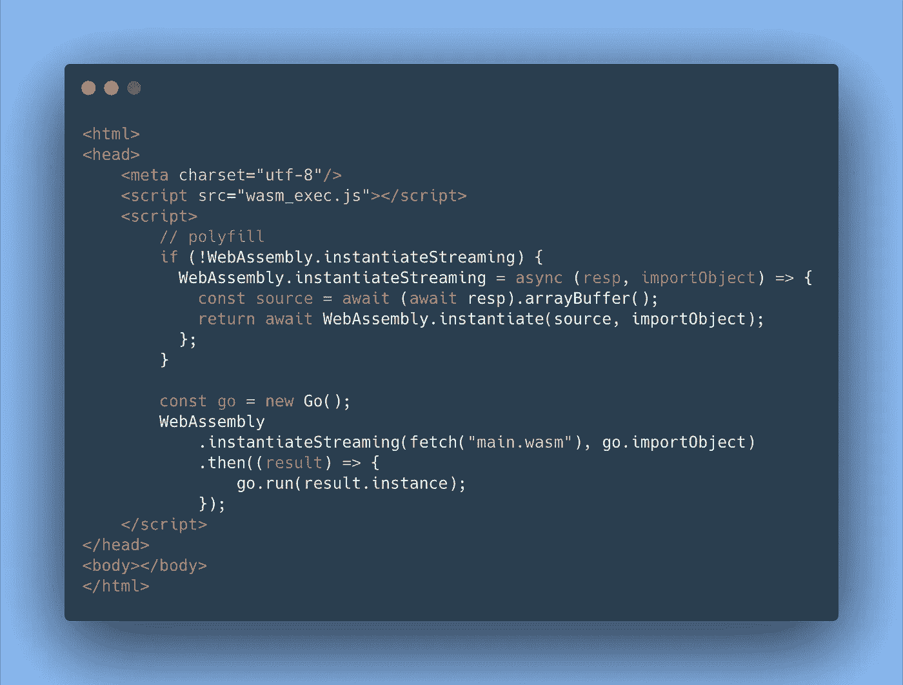
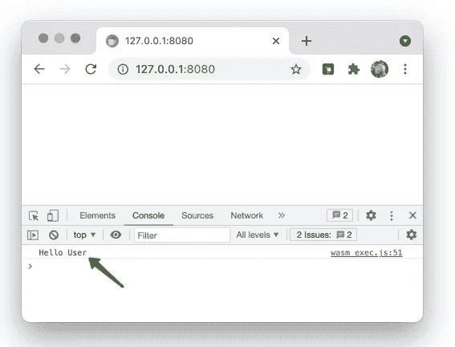

# 通过 scratch 使用 Golang 进行 web 组装

> 原文：<https://itnext.io/webassemply-with-golang-by-scratch-e05ec5230558?source=collection_archive---------1----------------------->


在本文中，我想向您介绍 WebAssembly。我们还将为 WebAssembly 和 Go 开发一个小应用程序。不仅仅是告诉“跑什么和怎么跑”以及它是如何工作的。而且允许用一个命令启动它，以减少开始学习 WebAssembly 的激动人心的旅程的时间。

在本文的最后，您可以打开终端，用一个命令构建项目，并在浏览器中运行它。在那之后，你已经可以试验这个项目了。

## 什么是 WebAssembly (WASM)

web assembly(WASM)-是一种开放标准(技术)，可以用可移植的二进制代码编译您的应用程序，并在 web 浏览器中执行。与 JavaScript 相比，它被设计用来在网页上实现高性能的应用程序。

WASM 不是汇编程序，它是二进制字节码的文本表示。你还需要记住，WASM 不仅仅是浏览器。浏览器内置虚拟机，用于执行 Web 组装。

从 2017 年开始，我们就经常听说。WebAssembly 的首次亮相是在 2017 年 3 月。

每个人都知道 WebAssembly 很快，并且首先(但不仅仅是)被设计成在浏览器中工作。有人甚至称 WebAssembly 为 JavaScript 杀手，或者至少是它的强劲竞争对手。

其实你可以试着自己去检验一下 WASM vs JS 的表现——[https://takahirox.github.io/WebAssembly-benchmark/](https://takahirox.github.io/WebAssembly-benchmark/](https://takahirox.github.io/WebAssembly-benchmark/))

## WebAssembly 的应用(WASM)

WebAssembly 最初应该用在哪里？首先，在任务中直接在浏览器中处理重型任务。

*   游戏开发
*   视频编辑/流媒体
*   加密
*   图像识别

有很多应用程序、附带项目和用例都是用 WebAssembly 制作的——https://madewithwebassembly.com/。

其中之一是 TinyGo，如果你的目标是最小尺寸的话——https://madewithwebassembly.com/showcase/tinygo/、[https://tinygo.org/docs/guides/webassembly/](https://tinygo.org/docs/guides/webassembly/)。您可以将 TinyGo + WebAssembly 用于微控制器和现代 web 浏览器。

此外，您可以在浏览器中运行 TensorFlow，性能提升 10 倍(与普通 JS 相比)——[https://madewithwebassembly.com/showcase/tensorflow](https://madewithwebassembly.com/showcase/tensorflow)

当然还有用 Unity + WebAssembly 做一个浏览器的游戏——[https://madewithwebassembly.com/showcase/unity](https://madewithwebassembly.com/showcase/unity)

在这里你可以确保支持你的编程语言和 web assembly—[https://github.com/appcypher/awesome-wasm-langs](https://github.com/appcypher/awesome-wasm-langs](https://github.com/appcypher/awesome-wasm-langs))

例如，甚至有一个选项支持 PHP(实际上是 PIB)——【https://github.com/appcypher/awesome-wasm-langs#php】T2

## 创建我们的第一个 Web 组装项目(WASM) + Go

让我们试着自己创建一个简单的项目来尝试 WebAssembly。这可以在网上完成——https://webassembly.studio/。但事实上，这并不那么方便，也不允许你感觉这个代码是“你自己的”。

首先，你需要安装 Go。这可以根据本指令[https://golang.org/doc/install](https://golang.org/doc/install)来完成。

在第一部分中，我们将创建一个简单的 golang 包，并编译它以在浏览器中工作——我们将获得 wasm 文件“main.wasm”。第二部分将添加所有必要的东西，以便我们的 main.wasm 可以在浏览器中工作。

# 1.我们构建“main.wasm”。

## 1.1 使用新项目创建目录:

```
mkdir example.com
```

去吧

```
cd example.com
```

应用程序的主要代码，我们的域的代码将直接位于(业务逻辑)将在' main。走吧。让我们创建它:

mkdir app &&触摸 app/main.go

## 1.2 让我们用内容填充我们的应用程序



## 1.3 现在是时候构建我们的应用程序了



这个命令将把我们的 go 应用程序编译到主文件中。wasm(带有 wasm 字节码)是一个 web 程序集的可执行模块。请注意，您的 golang 包必须是“主包”。

# 2.在浏览器中工作抛出 JavaScript 库(只有一个文件)。

## 2.1 在我们项目的根目录中，我们将复制 wasm_exec.js



复制 Web 程序集的支持 js

其实你的电脑上已经有 wasm_exec.js 了。这个命令只是将它从 Go 源代码复制到我们的项目中。

## 2.2 你还需要一台网络服务器。

让我们在移动中创建一个简单的 web 服务器。



移动中的简单 web 服务器

## 2.3 不要忘记创建一个包含对 Web 程序集的应用程序调用的 HTML 页面。



HTML 页上的 Web 程序集

我希望这不是乏味的，你设法一步一步地做每件事。因此，您应该能够:

```
.
└── example.com
    ├── app
    │   └── main.go
    ├── index.html
    ├── main.wasm
    ├── server.go
    └── wasm_exec.js
```

这里'[example.com](http://example.com)'—项目的名称。你可以称之为‘我的 _ 牛逼 _ 项目’。

## 2.4 之后，我们启动服务器

```
go run server.go
```

并在浏览器中打开该地址

> [*http://127 . 0 . 0 . 1:8080*](http://127.0.0.1:8080)

在“DevTools >控制台”中，您可以看到输出:

> *您好，用户*



Web 组件在 web 浏览器中的应用

# 多合一

此外，您可以在一个命令中运行所有这些

```
wget -qO - https://gist.githubusercontent.com/romanitalian/cd28becfb130506d5f65ea48d8780ba9/raw/wasm_init.sh | bash /dev/stdin example.com
```

或者

```
wget -qO - https://bit.ly/3lVlO1i | bash /dev/stdin example.com
```

这个命令下载 bash 脚本，并以一种简单的方式从头开始创建您的项目。

对于 2021 年，我们可以说 WebAssembly 还没有在 JavaScript 之上“起飞”。但是很受欢迎。而且以后，你肯定会需要的。