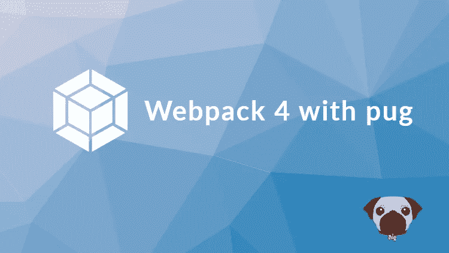
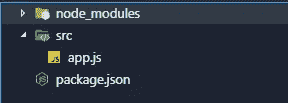
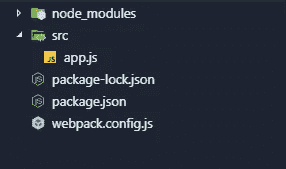
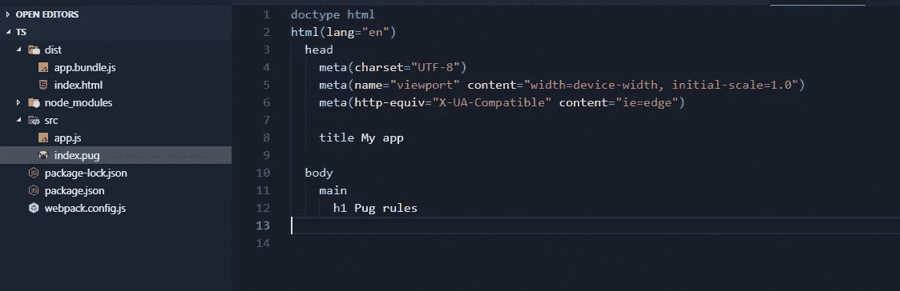
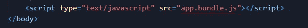
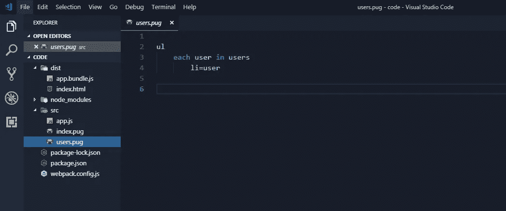

# Webpack 4 写入。pug 模板

> 原文：<https://itnext.io/webpack-4-write-pug-templates-c24e5ea07317?source=collection_archive---------2----------------------->



即使 webpack 是 JS 的捆绑工具，它也可以扩展到做几乎所有的事情。

让我们看看如何配置 webpack 来解析和插入数据。帕格文件。

## 项目设置

1.  创建 **package.json** 文件
2.  安装**web pack**&**web pack-CLI**&**web pack-dev-server**
3.  创建一个 **src** 文件夹和一个文件 **app.js**
4.  在 **package.json** 中创建 3 个脚本
5.  创建一个 **webpack.config.js** 文件
6.  为 **webpack** 创建一个简单的配置

— — — — — — — — — — — — — — — — — — — — — —

1.  创建一个新文件夹，并在其中运行该命令以生成 **package.json** 文件:

```
npm init -y
```

> **-y** 将创建文件而不询问任何问题

2.我们只在开发中需要这个模块，所以我们将把它们作为开发依赖项安装

```
npm i -D webpack webpack-cli webpack-dev-server
```

> 这和这个是一样的:

```
npm install --save-dev webpack webpack-cli webpack-dev-server
```

3.



4.我们需要 **3 个脚本**:一个在**生产**模式**模式**下运行 webpack，一个在**开发模式**下运行，一个启动**开发服务器**

```
"scripts": {"build": "webpack --mode=production","build:dev": "webpack --mode=development","start:dev": "webpack-dev-server --mode=development"},
```

5.



6.如果我们希望使用我们的脚本在开发模式和生产模式下运行 webpack 命令，那么我们必须使用公共配置创建一个单独的配置对象，然后根据 webpack 命令的参数，我们将添加不同的规则。为了区分生产和开发，我们必须按照以下方式编写

```
const path = require('path');const config = {
  entry: {
    app: './src/app.js'
  },
  output: {
    path: path.resolve(__dirname, 'dist'),
    filename: "[name].bundle.js",
  },
  devServer: {
    port: 3000,
  }
};module.exports = (env, argv) => {if (argv.mode === 'development') {}
 if (argv.mode === 'production') {}return config;
}
```

> 这样，我们为应用程序定义了一个入口和输出点，即开发服务器的端口，并且我们创建了一个简单的样板文件来确定我们是在生产模式还是开发模式下运行 webpack 命令。即使这个简短的教程我们不需要它，但知道你如何做到这一点也是很好的。

## 补充。泥料支架

接下来让 webpack 读取 **pug** 文件，并将它们加载到**发行版**文件夹中。

1.  安装 **pug，pug-loader，html-webpack-plugin**
2.  用一些哑数据创建一个文件: **index.pug** 。
3.  在 webpack.config.js 文件中编写新规则

— — — — — — — — — — — — — — — — — — — — — — —

1.  **pug** 模块:*读取 pug 文件*； **pug-loader** : *将文件内容作为模板函数返回，这样我们可以在模板中插入数据；***html-web pack-plugin:***将从****src****文件夹中获取****index . pug****文件，并使用另外两个加载器将发出一个新的***文件中的****dist****

```
**npm i -D pug pug-loader html-webpack-plugin**
```

**2.在 src 文件夹中创建一个新的 index.pug 文件，然后在其中创建一个简单的布局。**

****

**3.在 **webpack.config.js 的顶部**文件需要 **html-webpack-plugin****

```
**const HtmlWebpackPlugin = require(‘html-webpack-plugin’);**
```

**然后，在 **devServer** 属性之后，添加一个**逗号**，然后编写以下规则。**

```
**plugins: [
  new HtmlWebpackPlugin({
    template: ‘./src/index.pug’
  }),
],
module: {
  rules: [
    { 
      test: /\.pug$/,
      use: [“pug-loader”]
    },
  ]
}**
```

> **如果我们跑，加上这一点**

```
**npm run build**
```

> **或者**

```
**npm run build:dev**
```

> **您应该会在文件夹 **dist** 中看到一个**index.html**文件，该文件正是我们的 **index.pug** 文件中的内容。与此同时，我们应该看到另一个名为 **app.bundle.js 的文件**这个 js 文件与我们的 html 文件通过脚本标签自动链接。所以在新文件发布的最后:**index.html**你应该看到以下内容**

****

## ****创建一个局部****

**接下来，让我们创建一个分部，插入一些虚拟数据，并将这个分部的内容放在主标记中。**

1.  **使用以下代码在 src 文件夹中创建一个新的 pug 文件(users.pug)**
2.  **在 app.js 内部:需要模板并插入数据**

**— — — — — — — — — — — — — — — — — — — — — — — — — — — — — — -**

****

**2.在 **app.js** 中，我们需要模板，创建一个包含所有插值数据的对象，然后渲染模板。**

```
**let template = require("./users.pug");let locals = {
  users: [
    "user1",
    "user2",
    "user3",
    "user4",
    "user5"
  ]
};document.querySelector("main").innerHTML = template(locals);**
```

**现在构建应用程序并打开 index.html，数据将由 JS 在客户端呈现。**

## **关于 Webpack 4 的更多信息**

**如果你想了解更多关于 webpack 的知识，我在 Udemy 上有一个关于 Webpack 4 的完整课程。**

**这里是打折的链接。**

**[Webpack 4 让初学者变得简单](https://www.udemy.com/webpack-4-made-simple-for-beginners/?couponCode=MEDIUM)**